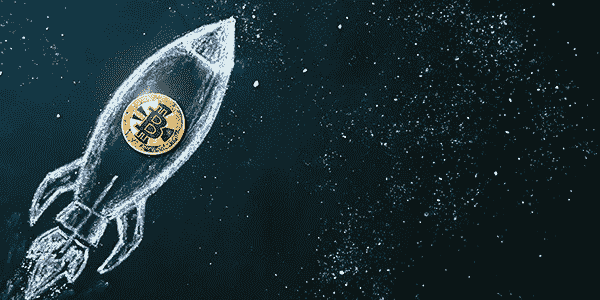
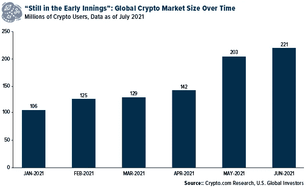
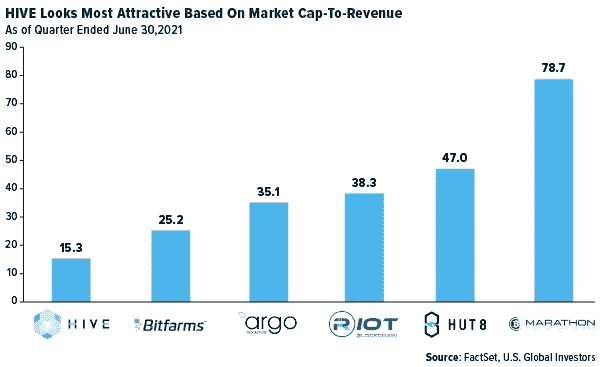
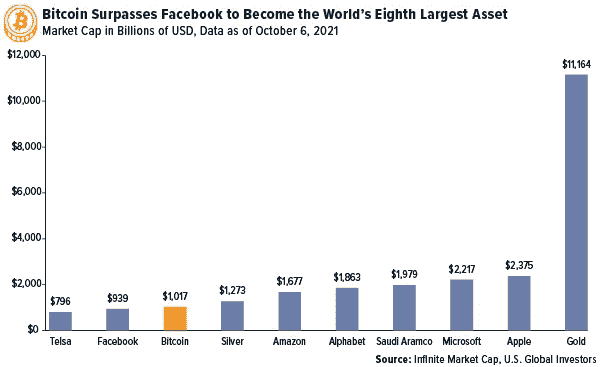
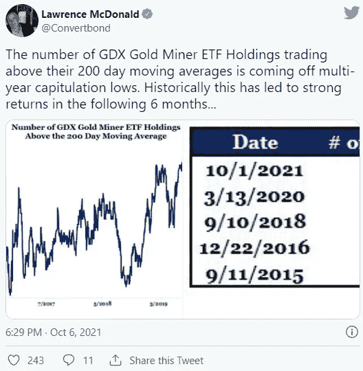
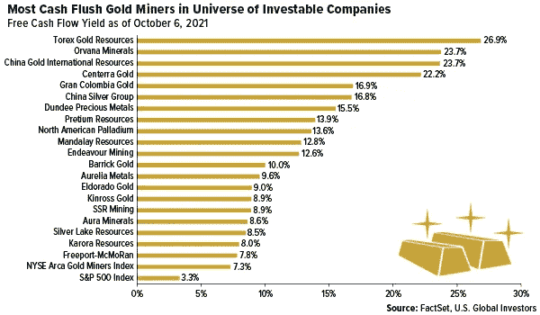

# 比特币突破 57000 美元，试图创下历史新高

> 原文：<https://medium.com/coinmonks/bitcoin-powers-past-57-000-on-its-quest-to-hit-a-new-all-time-high-94cddac50cea?source=collection_archive---------12----------------------->

**2021 年 10 月 11 日**

周一，比特币价格自 5 月份以来首次突破 57，000 美元，因为在“Uptober”月份，一些积极的加密发展刺激了投资者。

例如，传奇投资者乔治索罗斯(George Soros)的家族办公室基金上周证实，其近 60 亿美元的投资组合中持有比特币。索罗斯基金管理公司(Soros Fund Management)首席执行官兼首席投资官道恩·菲茨帕特里克(Dawn Fitzpatrick)在彭博的一次活动中表示，比特币不仅仅是一种通胀对冲工具，已经“跨越鸿沟成为主流”

事实上，根据 Crypto.com 的数据，6 月份大约有 2 . 21 亿人活跃在加密生态系统中。这是 2021 年初交易和持有密码的人数的两倍多，表明增长率异常强劲，远远超过了股票持有量。

支持加密货币的还有美国证券交易委员会(SEC)主席加里·詹斯勒(Gary Gensler)的保证，他的机构没有权力或意图像中国最近几周那样禁止加密货币。

Gensler 因表示对监管该行业感兴趣而受到某些美国立法者的抨击，他上周二表示，加密禁令将“取决于国会”。然而，我认为这同样不太可能，因为国会中有许多坚定的比特币支持者，包括参议员辛西娅·卢米斯(共和党)和众议员沃伦·戴维森(共和党)。

# 美国银行引入数字资产保险

在我看来，加密新闻中最具建设性的一点是美国银行决定引入数字资产的覆盖范围。在上周的首份报告中，这家美国第二大银行表示，2 万亿美元的加密空间“太大了，不容忽视”

加密策略师阿尔凯什·沙阿特别“看好数字资产生态系统的长期前景，因为它将成为主流。”(又有那个词了！)“我们预计，随着数字资产使用案例从比特币的价值储存理论转向一个以产品创新、监管清晰、机构参与增加和主流采用为特征的行业，数字资产使用案例将大幅增长。”

美国银行也花时间讨论非比特币硬币(altcoins)，写道，能够“建立平台的数字资产，就像苹果 iPhone 为应用程序所做的那样，正在获得最大的价值。”

最大的替代股票是以太，目前市值为 4，277 亿美元，今年以来上涨了 392%。我很高兴与大家分享 HIVE Blockchain Technologies 同时开采比特币和以太，这帮助它在截至 6 月 30 日的季度中创造了创纪录的 3724 万美元收入。这是所有公开交易的加密矿商中收入最高的，此外，从市值收入比来看，HIVE 似乎是最有吸引力的。

**如果你错过了 HIVE 2022 年第一财季的财报网络直播，我邀请你到** [**观看重播这里**](https://www.youtube.com/watch?v=VuYE3p6IhyE) **。**

# **比特币现第八大资产**

在最近的价格飙升后，比特币的市值再次超过 1 万亿美元。这使其超过了脸书的市值，成为世界第八大资产。

在上面显示的资产中，截至上周五，比特币也是今年表现最好的资产。数字货币的涨幅超过 84%，其次是 Alphabet (+62%)、微软(+36%)和脸书(+23%)。

对于黄金和白银这两种贵金属来说，2021 年是充满挑战的一年，截至周五，前者下跌了 9.5%，后者下跌了 16.5%左右。

如果摩根大通的分析有所暗示的话，这种价格波动在很大程度上是由于机构投资者对比特币不断发展的偏好。在上周的一份报告中，该银行表示，它认为大投资者“似乎正在回归比特币，或许将它视为比黄金更好的通胀对冲工具。”摩根大通补充称，闪电网络(允许几乎即时的加密交易)的成功，以及萨尔瓦多将比特币作为法定货币，有助于让投资者相信，这种数字货币可以扩大规模，以满足机构需求。

# 现金充裕的金矿工人

说到黄金矿商……“Bear Traps Report”创始人劳伦斯·麦克唐纳(Lawrence McDonald)最近的一张图表显示，纽约证券交易所 Arca 黄金矿商 ETF 中交易价格高于 200 天移动平均线的公司数量正在脱离近期低点。正如麦克唐纳指出的，“从历史上看，这导致了接下来六个月的强劲回报。”

换句话说，这可能是曝光的好时机。

看到这一点，我很好奇，想看看哪些黄金矿业公司目前的现金状况最好。具体来说，我研究了自由现金流(FCF)收益率，它告诉你一家公司能够在多大程度上履行其财务义务、偿还债务并有可能提高股息。你可以用一家公司的每股 FCF 除以其市值来计算收益率。我喜欢看到 7%或 8%以上的数字。

结果如下。为了便于比较，我还包括了黄金开采指数的 FCF 产量以及标准普尔 500。

正如你所看到的，在投资者对黄金矿商的信心非常低的时候，有相当多的公司拥有非常强劲的现金头寸。再说一次，当市场人气如此低迷时，6 个月后的回报历来都很有吸引力。我认为，上述公司将是投资者在预期下一轮牛市中开始寻找机会的好地方。我们投资了美国全球投资公司的几个名字。

名列榜首的是总部位于多伦多的 Torex Gold，该公司上周报告称，在截至 9 月 30 日的季度中，该公司生产了 111，220 盎司黄金，并有望达到 2021 年 43 万至 47 万盎司指导范围的上限。Torex 在本季度销售了近 119，000 盎司，平均价格为每盎司 1，785 美元。

如果你熟悉加密矿工，你就会知道他们生产的大部分硬币都是 HODL 的。我希望更多的淘金者这样做。在上面提到的矿工中，我所知道的唯一一个拥有黄金的是格兰哥伦比亚。持有他们的金属将有助于他们吸引更多的千禧一代投资者。

***点击此处查看我今天与《股票对话》Eli 的访谈，点击*** [***。我们边聊边看最近的收益报告。不要错过！***](https://www.youtube.com/watch?v=qSdAvZiZNgc)

**披露** : *纽约证券交易所 Arca 黄金矿工指数是一个经过修改的市值加权指数，由主要从事黄金和白银开采的上市公司组成。标准普尔 500 指数是一个被广泛认可的美国公司 500 种普通股价格的资本化加权指数。自由现金流(FCF)代表公司在扣除支持运营和维持资本资产的现金流出后产生的现金。弗兰克·霍姆斯(Frank Holmes)被任命为 HIVE Blockchain Technologies 董事会非执行主席。霍姆斯和美国全球投资者都持有 HIVE 的股份。自 2018 年 8 月 31 日起，Frank Holmes 担任 HIVE 的临时执行主席。*

*持仓可能每日变动。截至最近一个季度末，报告了持股情况。截至 2021 年 9 月 30 日，文章中提到的以下证券由美国全球投资者管理的一个或多个账户持有:特斯拉公司、Amazon.com 公司、苹果公司、Torex Gold Resources 公司、Centerra Gold 公司、Gran Colombia Gold 公司、Dundee precium Resources 公司、Endeavour Mining PLC 公司、Barrick Gold 公司、Eldorado Gold 公司、SSR Mining 公司、Silver Lake Resources 有限公司、Karora Resources 公司*

所有表达的观点和提供的数据如有变更，恕不另行通知。其中一些观点可能并不适合每一位投资者。单击上面的链接，您将被定向到第三方网站。美国环球投资公司不认可本网站/这些网站提供的所有信息，也不对其内容负责。

> 加入 Coinmonks [电报频道](https://t.me/coincodecap)和 [Youtube 频道](https://www.youtube.com/c/coinmonks/videos)了解加密交易和投资

## 另外，阅读

*   [在印度利用加密套利赚取被动收入](https://blog.coincodecap.com/crypto-arbitrage-in-india)
*   [霍比审核](https://blog.coincodecap.com/huobi-review) | [OKEx 保证金交易](https://blog.coincodecap.com/okex-margin-trading) | [期货交易](https://blog.coincodecap.com/futures-trading)
*   [麻雀交换评论](https://blog.coincodecap.com/sparrow-exchange-review) | [纳什交换评论](https://blog.coincodecap.com/nash-exchange-review)
*   最好的[加密税务软件](/coinmonks/best-crypto-tax-tool-for-my-money-72d4b430816b) | [硬币追踪评论](/coinmonks/cointracking-review-a-reliable-cryptocurrency-tax-software-5114e3eb5737)
*   [Stackedinvest 评论](https://blog.coincodecap.com/stackedinvest-review) | [北海巨妖评论](/coinmonks/kraken-review-6165fc1056ac) | [期货交易机器人](/coinmonks/futures-trading-bots-5a282ccee3f5)
*   最佳[加密借贷平台](/coinmonks/top-5-crypto-lending-platforms-in-2020-that-you-need-to-know-a1b675cec3fa) | [杠杆令牌](/coinmonks/leveraged-token-3f5257808b22)
*   最佳[加密制图工具](/coinmonks/what-are-the-best-charting-platforms-for-cryptocurrency-trading-85aade584d80) | [最佳加密交易所](/coinmonks/crypto-exchange-dd2f9d6f3769)
*   [比特币基地僵尸程序](/coinmonks/coinbase-bots-ac6359e897f3) | [AscendEX 审查](/coinmonks/ascendex-review-53e829cf75fa) | [OKEx 交易僵尸程序](/coinmonks/okex-trading-bots-234920f61e60)
*   [如何在印度购买比特币？](/coinmonks/buy-bitcoin-in-india-feb50ddfef94) | [WazirX 评论](/coinmonks/wazirx-review-5c811b074f5b)
*   [CryptoHopper 替代品](/coinmonks/cryptohopper-alternatives-d67287b16d27) | [HitBTC 审查](/coinmonks/hitbtc-review-c5143c5d53c2)
*   [折叠 App 审核](https://blog.coincodecap.com/fold-app-review) | [Kucoin 交易机器人](/coinmonks/kucoin-trading-bot-automate-your-trades-8cf0ca2138e0) | [Probit 审核](https://blog.coincodecap.com/probit-review)
*   [如何匿名购买比特币](https://blog.coincodecap.com/buy-bitcoin-anonymously) | [比特币现金钱包](https://blog.coincodecap.com/bitcoin-cash-wallets)
*   [币安 vs FTX](https://blog.coincodecap.com/binance-vs-ftx) | [最佳(SOL)索拉纳钱包](https://blog.coincodecap.com/solana-wallets) | [喜美元点评](https://blog.coincodecap.com/hi-dollar-review)