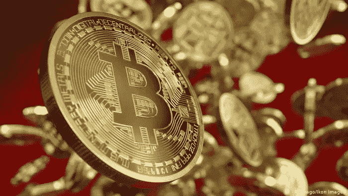

# 4 月底 8 万美元的比特币价格似乎是大多数期权交易者的目标

> 原文：<https://medium.com/coinmonks/bitcoin-price-of-80-000-at-the-end-of-april-seems-to-be-the-target-for-most-options-traders-c5eddf89a20c?source=collection_archive---------0----------------------->

期权交易员表示看涨，并押注比特币价格最早将在 4 月底升至 8 万美元以上。然而，分析数据表明，这种情况不太可能发生。

随着即将发生的事件，比如备受期待的比特币基地下个月的首次公开募股，期权交易者似乎…