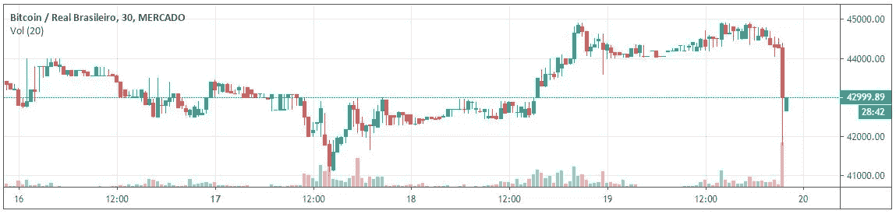
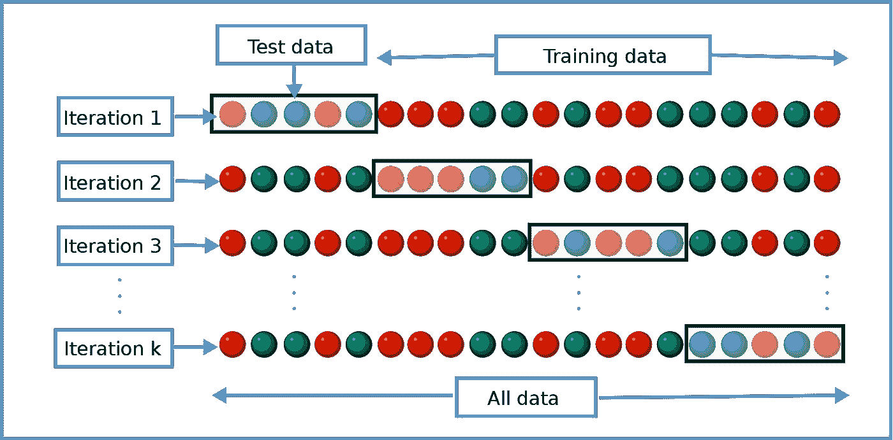
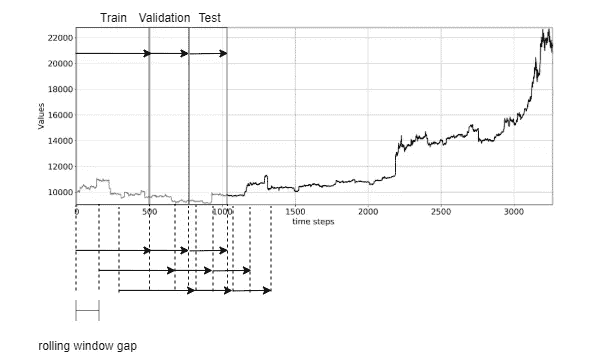
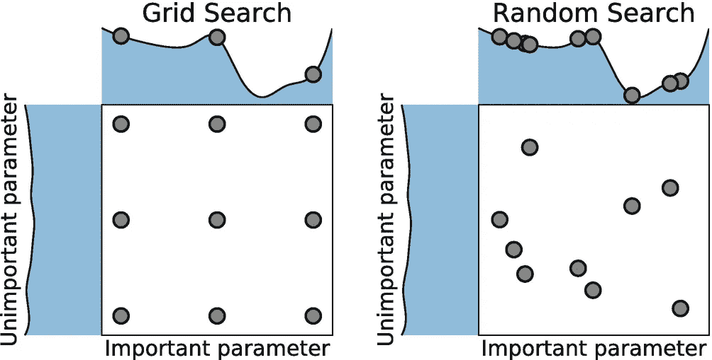
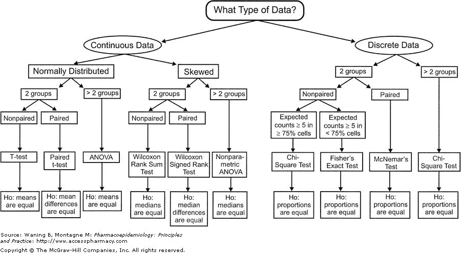
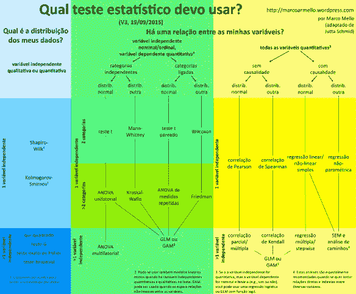
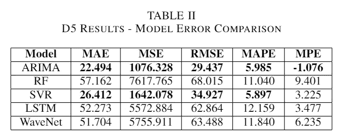

# 比特币价格预测——如何比较模型

> 原文：<https://medium.com/coinmonks/bitcoin-price-prediction-how-to-compare-models-e81aa31bd7a0?source=collection_archive---------3----------------------->

我们如何选择比特币价格预测的最佳方法？在这篇文章中，我们用不同的机器学习方法来解释我们在 2019 年发表的[篇文章](https://ieeexplore.ieee.org/abstract/document/8963009)对比特币价格的预测。探讨的技术有 LSTM、韦弗内特、ARIMA、SVM 和随机森林。

我们如何确定选择的模型是不是最好的？模型比较问题可能是数据科学家/机器学习工程的主要关注点之一。在价格预测领域，有一堆科学家通常遵循的方法。我们将列出一些方法来更好地比较模型，并提供其操作的直观性。

# 滚动窗

在机器学习实验中，将数据集分为训练、验证和测试部分是一个标准过程。通过这种划分，可以对模型进行训练，并在训练阶段进行评估，以找到更好地概括问题的模型，从而避免过度拟合。最后，对模型进行测试，并生成误差度量，以便与其他模型进行比较。

同样常见的是使用 k 倍交叉验证技术来提供误差分布，从而可以推断模型之间是否不同。

例如，如果我们训练一个模型来预测时间序列的未来价格，我们将生成一系列预测值，这些预测值将与原始值集进行比较。然后，错误源自许多可用错误度量(例如，MAPE、MPE、RMSE、MSE)中的一个。

然而，唯一的问题是偏向测试集的选择。有可能所使用的测试集明显更适合该模型，从而导致它具有异常的性能。

如果我们提供的不是一个测试集的误差度量，而是相同误差度量在不同测试集上的分布，那么避免测试偏差是可能的。k 倍方法可以产生这种分布。

k-fold representation — [Wikipedia](https://en.wikipedia.org/wiki/Cross-validation_(statistics)) Figure

k-fold 主要做的是将数据集分成许多训练集和测试集，以便我们可以获得所选误差度量的分布。有了误差分布，就有可能计算出均值和标准差，所以我们有了一个更好的概念模型在不同的时间序列制度下的行为。

k-fold 提出的形式不一定适合于时间序列预测问题。有一个假设是，训练集必须具有连续性，必须在测试集之前，以最大限度地提高性能。因此，滚动窗口方法作为一种不同的 k 倍激增。

通过将训练集、验证集和测试集移动预定的大小，可以获得保持连续性的不同集，并且训练集在测试集之前。这种技术也被称为[向前走测试](https://en.wikipedia.org/wiki/Walk_forward_optimization)。

Rolling Window visualization

# 超参数搜索

一个重要的方面是超参数对模型比较的影响，这个方面通常不被视为对不同出版物的偏见。

首先，我们如何定义什么是超参数？一个直接的定义是，超参数是一个参数，其值在学习过程开始之前设置。在训练阶段，只有模型参数将被修改以适合函数，而不是超参数。

在我们的[出版的著作](https://ieeexplore.ieee.org/abstract/document/8963009) k 中，我们探索了所有比较算法的超参数的随机搜索优化(在此检查使用[随机搜索](/@cjl2fv/an-intro-to-hyper-parameter-optimization-using-grid-search-and-random-search-d73b9834ca0a)的论证)。这种方法避免了超参数偏差。对于小样本的超参数，新算法测试可能比其他算法具有更好的性能。然而，对于所有可能的结果，新算法并不是更好。

可以应用许多不同的超参数优化方法，但是它们应该足够简单，以便用于所有比较的模型。

Image Source: Bergstra, J., Bengio, Y.: Random search for hyper-parameter optimization. Journal of Machine Learning Research 13, 281–305 (2012)

# 差异的统计显著性

既然建立了最佳超参数组合的误差分布，就有可能发现对于所有的机器学习算法，我们如何能确定分布的均值是不同的？

有许多统计测试可以用来比较两种不同的分布。下图给出了一个令人惊叹的总结:

Source: Waning B, Montagne M: Pharmacoepidemiology: Principles and Practice: [http://acesspharmacy.com](http://acesspharmacy.com)

从上图可以得出结论，我们有一些基本问题，例如:

我的数据是连续的还是离散的？通常，对于比特币时间序列，我们分析的是价格历史，这是连续的数据，预测也可以是连续的，如未来价格或未来回报。通过对价格是上涨还是下跌进行分类，可以将连续数据转化为离散预测。输入也可以是离散数据，例如新闻的 NLP 分析的情感或与资产相关联的任何一般分类数据。

对于只有一个变量的连续数据，一个重要的检验是正态性检验。科尔莫戈罗夫-斯米尔诺夫检验或 T2 夏皮罗-维尔克检验可以验证正态性。如果有一个以上的自变量，你应该使用卡方检验、G 检验、费雪精确检验或二项式检验。下图显示了要遵循的另一个决策流程(抱歉使用了这种语言)。

Source: Marco Mello (http://marcoarmello.wordpress.com)

# 最后评论和结论

为了公平地比较模型，有许多可能的方法，这里只探讨了其中的几个，没有进入细节。统一它并处理所有潜在的偏见和问题有时会在计算上很昂贵。出于学术目的，所用的方法很大程度上取决于你要在哪里发表论文和问题的类型。

在应用了所有的方法之后，我们可以生成结果，如我们的[文章](https://ieeexplore.ieee.org/abstract/document/8963009)所示。

Table from our published article

这些结果超过了比特币的时间序列预测。ARIMA 和 SVR 甚至在应用了前面描述的所有方法之后仍具有最佳性能。这项研究的一个主要问题是使用绝对价格值，而不是回报率，这可能会影响模型拟合。

为了将来的参考和更多的细节，你可以访问原始出版物:[https://ieeexplore.ieee.org/abstract/document/8963009](https://ieeexplore.ieee.org/abstract/document/8963009)

此外，对于测试和复制，所有代码都可以在 [GitHub](https://github.com/leokan92/model_comparison) 中获得

> [直接在您的收件箱中获得最佳软件交易](https://coincodecap.com/?utm_source=coinmonks)

