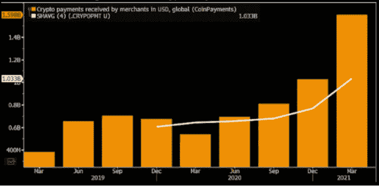
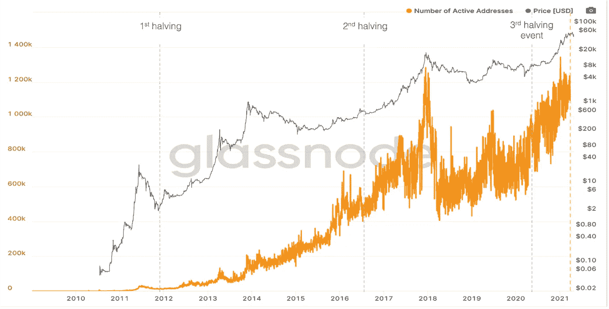
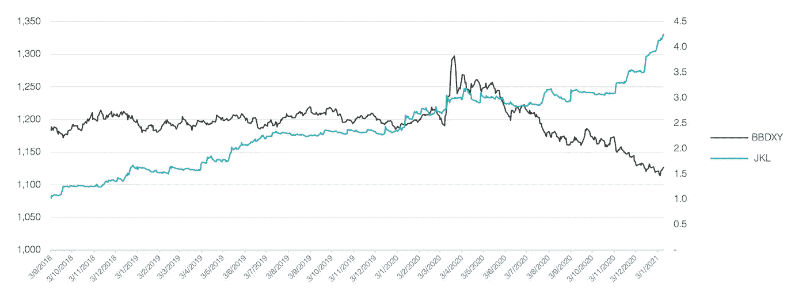

# 比特币价格预测——第二部分

> 原文：<https://medium.com/coinmonks/bitcoin-price-predictions-part-two-761b48aa95b0?source=collection_archive---------6----------------------->

## 比特币世界的驱动力:外部因素和宏观环境

> 文章作者 [Lesia M.](https://twitter.com/LesiaMrch)

…上接“比特币世界的驱动力:内部因素”

# **外部因素**

## 1.机构收养

比特币**有着 12 年被证实的表现记录，在此期间市值达到 1 万亿美元**，超过了谷歌、脸书、亚马逊、苹果等科技巨头的表现。当前牛市与 2017 年牛市的主要区别在于，如今我们看到更多全球机构投资者进入市场。对加密资产的兴趣激增标志着在可预见的未来主流采用的高概率。随着投资者、企业、金融机构和政府越来越多地采用加密货币，全球数字化转型的可能性越来越大。

彭博智能公司为接受加密货币作为支付方式提供了颜色:2021 年 Q1 全球加密支付跃升至 16 亿美元，标志着加密支付在日常生活中迅速被商家采用。为了最大限度地减少大约一年前开始的新冠肺炎锁定的扭曲，彭博情报显示，2020 年四个季度的平均增长约 60%，从 Q1 的 6.4 亿美元增加到 1B 的 6.4 亿美元。他们认为，随着疫情的爆发，加密支付反映了向数字化的转变。

下图显示了 2020 年支付给商户的加密货币的总价值约为$3B，仅占全球卡和支付市场的 0.40%，仅占 2020 年全球支付收入的 0.15%。鉴于 2021 年 Q1 奥运会上商户收到的美元加密支付大幅增加，我们认为未来几年加密支付的机会将会越来越大。

**图一。**商户收到的美元加密支付

*Source: Bloomberg Intelligence*

对加密市场的普遍看法是，比特币的快速采用将在未来继续，扩大其作为全球数字储备资产的接受度。Visa、高盛和摩根士丹利都在承认货币数字化方面迈出了值得注意的步伐。

今年 3 月，Visa Inc .发表声明称，将允许在 USDC 进行交易。许多其他大型金融公司，如 BNY 梅隆、贝莱德和万事达卡，已经采取措施进一步采用加密货币作为支付方法和投资。

2021 年 4 月似乎是所有美国大型银行决定进入加密市场的月份。因此，高盛正在向其财富管理客户提供广泛的比特币投资和其他数字资产。投资选择将包括实物比特币、衍生品和其他传统投资工具。摩根士丹利(Morgan Stanley)允许合格投资者投资三只外部加密基金，其中两只由银河数码(Galaxy Digital)运营，第三只由 IS Investments 和 NYDIG 共同运营。最后，4 月 27 日有消息称，JP 摩根将允许其客户投资 NYDIG 提供的比特币基金，成为最新一家改变其对加密立场的美国大型银行。据消息人士透露，该基金计划在夏季启动。摩根大通接受比特币投资是一个明显的语气变化，因为其首席执行官杰米·戴蒙(Jamie Dimon)过去一直严厉批评比特币。

除了被公司和金融机构广泛采用之外，BTC 有很强的理由通过可能推出的美国比特币 ETF 被公众接受。美国证券交易委员会(sec)目前正在审查 Galaxy Digital、NYDIG、Fidelity Investments、SkyBridge Capital、VanEck、WisdomTree 和其他公司提交的比特币 ETF 申请。

加密和区块链解决方案也引发了政治领域的兴趣。特别是，纽约市审计长候选人呼吁在纽约市更多的区块链创新。在她的计划细节中，纽约退休系统将有高达 3%的资金用于加密曝光，而纽约市本身将在区块链投资，以支持该领域的初创企业。另一位竞选纽约市长的候选人也加入了炒作，声称他将“投资让纽约成为 BTC 和其他加密货币的中心”。

4 月 19 日，当中国央行称加密资产为“投资选择”时，另一个令人兴奋的公告出现了。这个标签标志着中国对加密货币交易的软化立场，同时强调加密货币不与该国的数字货币——数字人民币竞争。行业参与者对这一声明持相当积极的态度，希望加密货币交易在中国逐步转变，并警惕潜在的监管变化。在政治舞台上讨论加密和区块链的机会是该技术的一个重要切入点，因为公众和政治家都在思考潜在的未来应用。

## 2.网络效应

随着你对比特币估值这一主题的深入研究，你很可能会注意到，有多项研究从比特币的应用角度(即所谓的网络效应)考察了比特币。如前所述，比特币的应用似乎每天都在增长。将这种增长与今天的一些科技巨头相比，很明显，苹果、亚马逊和谷歌曾经获得了如此之多的用户，以至于没有其他公司能够复制他们的成功。

网络经济学着眼于沟通渠道的采用率。用于评估 FAANG 技术实体以及互联网使用的最成功的网络模型之一是**梅特卡夫定律**。该模型基于用户之间的连通性，可以描述为**n(n-1)/2**，其中 **n** 是网络上的用户数量。简单来说，在 5 个用户的网络中，可以建立 10 个不同的连接；在 12 个用户的网络中，这个数字增加到 66。这个模型从技术上解释了“网络效应”的商业概念。

这种评估可以应用于任何创建用户网络的公司。传真、电子邮件和社交网络都遵循着同样的趋势——如果用户之间没有一个转换到这些通信渠道的共同协议，它们今天的价值将会为零。

在下图中，我们可以看到活跃比特币地址的数量和 BTC 价格在过去几年中是如何高度相关的。当前的牛市已经超过了 2017 年底-2018 年初活跃地址的历史最高水平。

**图二。**活跃的 BTC 地址数量与 BTC 价格

*Source: Glassnode, JKL Research*

在第一次减半事件后，BTC 牛市在 2013 年 11 月底达到顶峰，超过 1000 美元。当时，市场上大约有 20 万个活跃的比特币地址。在 2017 年 12 月中旬的下一个时代高峰，BTC 价格接近 2 万美元，活跃用户约 100 万。**在两个峰值之间，活跃用户数量上升了 5 倍，而对比特币价格的影响是 20 倍**。大胆地预计，在这个减半的时代，活跃比特币用户数量将升至 500 万，BTC 价格将升至 40 万美元。然而，如果前两个事件之间的关系是线性的，就会出现这种情况。

我们可以得出的另一个有趣的观察结果是，直到某个时间点，比特币的价格与活跃用户的数量并不真正相关。事实上，在 2012 年至 2018 年间，活跃账户数有着每年 250%左右的相对稳定的增长趋势。自 2016 年初以来，我们看到这两个指标之间的相关性越来越强。这可能意味着，从现在起，BTC 的价格将根据新用户的数量成比例地波动。

最终，比特币的网络效应继续增强，而其供应量仍然有限，这为加密货币的价格发展创造了一个有利条件。

## 3.市场的兴趣

基于对加密货币交易日益增长的兴趣和对更多管理比特币风险的工具日益增长的需求，CME 集团于 2017 年 12 月 18 日提供了**比特币期货**，随后于 2020 年 1 月 13 日增加了比特币期货的**期权。JKL 资本自营交易系统使用期货来对冲市场的下行风险。最近的进展是 CME 准备在 2021 年 5 月 3 日推出**微型比特币期货**。这些期货合约的大小是一个比特币的十分之一。它们的出现既反映了比特币价格的上涨，也反映了广大市场参与者不断增长的需求。**

页（page 的缩写）T. Jones 将当前的比特币市场与 1970 年的黄金市场进行了比较。这是黄金首次作为期货工具被产品化，并进入牛市，价格自年以来翻了两番。就黄金而言，这是一个很好的购买点，我们只能猜测比特币是否有潜力在当前的市场环境下复制黄金的表现。

# **宏上下文**

## 1.通货膨胀

最近人们对比特币产生巨大兴趣的一个重要原因，可能不是加密货币本身，而是整体经济背景。随着政府印刷钞票来支持后新冠肺炎时代的经济，关于即将到来的通货膨胀危机的猜测正在市场上蔓延。**仅美国政府在 2020 年就印刷了 9T 美元，占所有已发行美元的 22%**。此外，2020 年 8 月，美联储宣布，他们现在只会在目标通胀水平达到触发点时改变政策，而不是根据预期的通胀调整政策工具，从而让美国通胀率高于标准的 2%目标。这一政策变化可能会导致严重的通胀飙升，因为货币政策措施实施后需要一段时间才能发挥作用。

除了积极印钞和美联储货币政策的变化，我们还看到美国的净收入因刺激措施而增加，加上长期封锁和低支出后被压抑的需求。事实上，在美国，个人储蓄率在 2020 年飙升至 33%，而历史平均水平约为 10%。这些因素加大了现有的价格上涨压力。

我们已经可以看到早期结果，美国消费者价格指数自 2020 年 3 月以来上涨了 2.6%。与此同时，3 月份经通胀调整的时薪较上年同期增长 1.5%，比通胀率低 1.1%。这意味着那些挣钱的人购买力更低。

许多经济分析师和投资者认为，这种大规模的货币扩张将导致未来几年的年通胀率上升至 5-10%，一些人预测年通胀率将高达 20%。在他的论文《货币大膨胀》中，保罗·都铎·琼斯将当前的状况描述为“各种货币的空前膨胀，这是发达国家从未见过的”。

尽管我们最近在美国和世界各地目睹了一些严重的印钞活动，但通货膨胀政策对这个世界来说并不陌生。几乎每一种由央行支持的法定货币都会随着时间的推移而贬值。许多比特币信徒明白这一点，并对加密货币最近的崛起感到不安，尽管新冠肺炎危机起到了推波助澜的作用，但这并不仅仅是加密货币造成的。即使在一个假设的没有 Covid 的世界里，公众迟早会明白当前的货币体系充满了缺陷。比特币的创造者本人对央行印钞非常怀疑。中本聪在他的白皮书中写道:“传统货币的根本问题是它运转所需的所有信任。必须相信央行不会让货币贬值，但法定货币的历史充满了对这种信任的违背。"

迈克尔·塞勒(Michael Saylor)的公司持有价值 43.8 亿美元的比特币，他建议将比特币视为财产，以寻求克服通货膨胀。如果法定货币以每年 15%的速度扩张，不仅美元的购买力会每年损失 15%,以美元计价的股票也会损失 15%。因此，即使是拥有美元计价资产的多元化投资组合也有可能减少。Saylor 的答案是购买一处房产或资产，而不是根据现金流来估价。

## 2.零利率

**美国国债收益率在过去 40 年里一直在逐步下降。由于利率处于历史低位，投资者越来越担心投资债券会造成实际损失。彭博甚至声称传统的 **60/40 投资组合** (60%股票/ 40%固定收益)**不再有效** [1]。**

依赖短期政府债券的传统国债策略都有负的实际收益率。因此，两难的选择是在负无风险利率下失去资本，还是购买相对不稳定但回报巨大的资产。押注比特币的机构看到了市场上的套利机会，人们可以以接近 0%的利率借款，然后再投资于平均年化回报率为 230%的资产。

## 3.债务

伴随着巨大的货币通胀而来的是全球范围的信贷增长。事实上，今年早些时候，美国政府债务达到了该国 GDP 的 100%,世界债务在 2020 年底达到了创纪录的 281 万亿美元，企业债务继续增长，因为企业占用了信贷额度来填补现金短缺。在不断增长的疫情刺激下，发展中国家的债务超过了 GDP 的 250%。

根据现代货币理论，债务是一张无限的资产负债表，利益相关者将永远无法偿还未偿还的全球债务。从言外之意来看，这也意味着利率不可能升至零以上:如果一个政府无力偿还债务，它肯定也无力支付债务利息。

## 4.危机后经济

全球疫情为比特币创造了独特的宏观环境。根据 JP 摩根 2021 年 2 月的报告，**新冠肺炎危机加速了数字金融的崛起**。随着疫情推动对快速便捷的数字支付的需求，金融业的数字化和技术变革显而易见。

另一方面，国家封锁和控制助长了全球人口的过度储蓄率，导致加密货币投资，特别是比特币的创纪录流入。事实上，自全球疫情开始以来，我们目睹了比特币和股票市场之间的相关性不断上升，这表明比特币不再被视为股票市场下行风险的完美对冲。

此外，债务增加和高通胀预期推动了机构对加密货币更大程度接受的宣布。新冠肺炎加速了比特币环境中已经发生的范式转变，放大了外部和宏观因素对比特币有机增长的影响。

## 5.规章制度

对比特币监管的担忧是比特币怀疑论者的主要论点。他们认为，一旦比特币获得大规模采用，它将成为政府和当地货币的威胁，因此将被淘汰。此外，关于比特币与非法活动有关的讨论也在进行中。迄今为止，美国证券交易委员会(sec)尚未批准任何比特币 ETF 申请。

比特币监管的结果是二元的——要么是加密货币的全球硬块(由于互联网连接和技术进步，这在现实中很难实施)，要么是缓慢演变的监管环境，这将提高对数字资产的信任。

# **结论**

当前比特币牛市的价格上涨与其说是加密货币本身的优秀，不如说是外部因素和比特币世界宏观环境的结合。所有这些方面都是相互关联的，为比特币的有机增长创造了协同效应。比特币的稀缺性——其内在特性——在通胀驱动的宏观环境中为比特币创造了价值。机构对比特币的采用——一个外部因素——对比特币的内部特征有很大影响，如流动性和可信度。

有趣的是，如今许多经济专家转向比特币，相当看好它在宏观经济环境中的作用。我们发现自己处于这样一种境地，市场迫切需要储存财富的资产，但选择有限。当我们检查比特币的内部特征时，我们看到了这种资产类别如何拥有黄金的许多特征，从而使其成为一种潜在的可行解决方案，以保护人们的价值免受不断上升的通货膨胀的影响。比特币还提供了一个去中心化的解决方案，任何中央银行或政府都不能控制它的发展。

在过去的一年里，BTC 确实表现出与美元疲软的强烈负相关关系。然而，在 JKL，我们认为宣称比特币是通胀对冲工具还为时过早。如果近期年通胀预期在 7%左右，一个好的价值储存资产的年回报率将为 15—20%。不是 230%。任何高于通胀对冲的东西都是投机的目标。

**图 3。** JKL 交易策略表现 vs 彭博元现货指数

Source: JKL Research

我们的基金将 BTC 的潜在终端价值视为一个广泛的范围，使其**结果相当于二元的**。如果比特币被机构广泛采用，这一预测的最佳情况将会发生。就比特币目前的状况而言，仅仅依赖最佳情况预测是不理智的。JKL Capital 将对比特币的长期投资视为对未来的押注，这种资产获得了“数字黄金”的所有特征，并被广泛接受。在那之前，比特币是一种**假设的**财富仓库，而不是真实的。

在 JKL，我们看到比特币价格在当前的牛市中超过 10 万美元，在进入熊市之前达到约 14-16 万美元的峰值，后来稳定在约 11 万美元**，**左右，根据股票-流量模型，这将是其“公平价格”。我们预计比特币价格将在 2021 年 9 月底至 11 月中旬见顶。

最后，JKL 自营交易系统开发其模型来预测短期价格变动，通常持有时间从一小时到几天不等。因此，本文所述的长期观点都不反映我们量化策略的立场。自 2018 年 9 月上线以来，JKL strategy 已经创造了一个从数字资产的波动中获取利润的良好记录，无论基础市场是看涨还是看跌。

[1]彭博财富(2021)。60/40 投资组合的死亡使得基金的回报更加困难。

**免责声明**

机密

仅限收件人

*本材料严格保密，仅供专业投资者(根据开曼群岛金融管理局不时的定义)使用。未经 JKL Digital Capital Limited(“JKL”)的书面同意，不得出于任何目的复制、重新分发、传递给任何其他人或出版其全部或部分内容，并且必须在 JKL 要求时返还。虽然本材料中包含的信息是从据信可靠的来源汇编的，但 JKL 不代表或保证本材料中包含的信息的准确性、完整性或可靠性。*

本材料的内容未经任何监管机构审查。建议您对本材料的内容保持谨慎。如果您对本材料的任何内容有任何疑问，您应该获得独立的专业意见。JKL 或其任何关联公司，或其任何或其各自的董事、高级职员、员工和代表都不会对因使用或依赖本材料中包含的任何信息而导致的任何直接、间接或后果性损失承担任何责任或义务。本材料不构成认购或购买任何金融产品的要约或邀请。其目的不是提供任何信贷或其他评估的基础，也不应被视为购买任何金融产品的建议。

*JKL、其关联公司和/或任何或其各自的高级职员、董事、员工和代表可能不时在本材料中描述的产品或与产品相关的任何投资中，为他们的专有账户和/或他们管理的账户，和/或为客户拥有重大利益，这可能对产品的价值产生积极或消极的影响。*