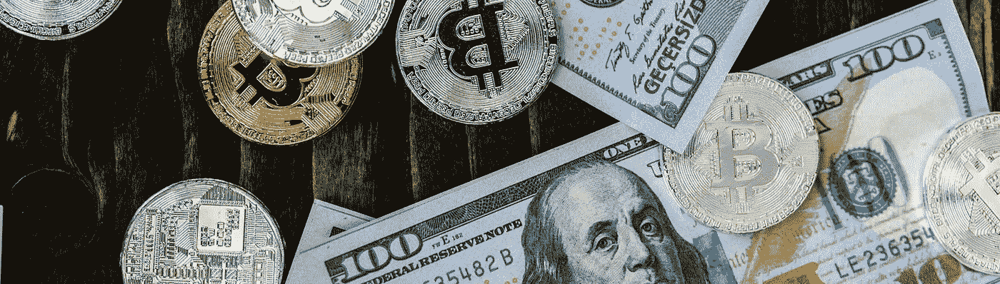
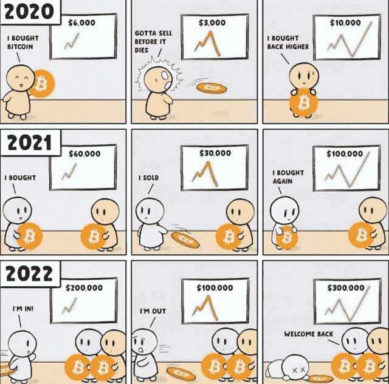
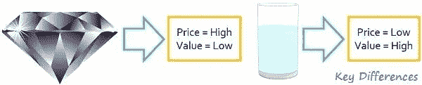
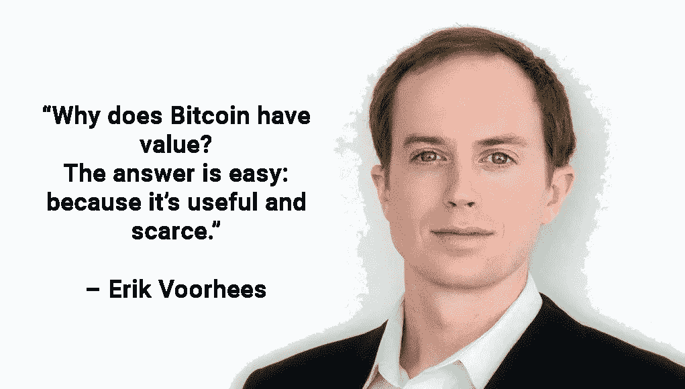
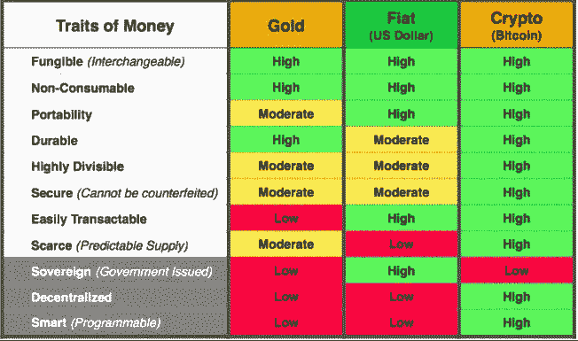
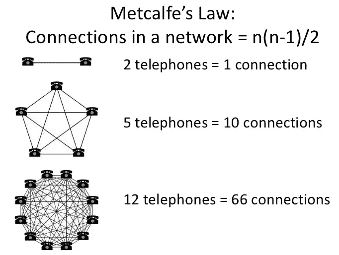
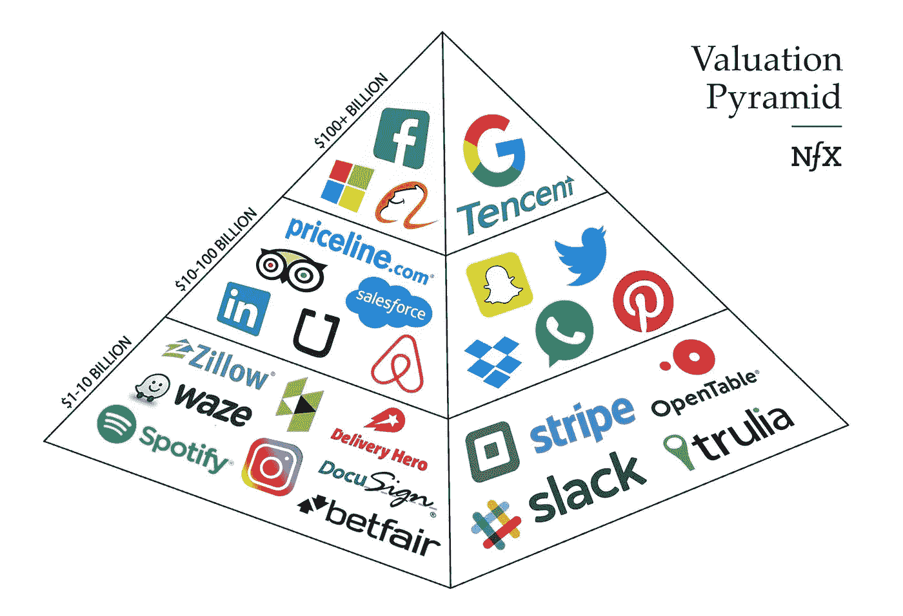
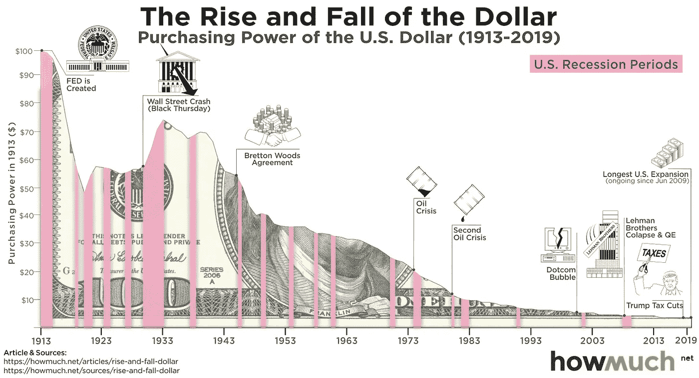
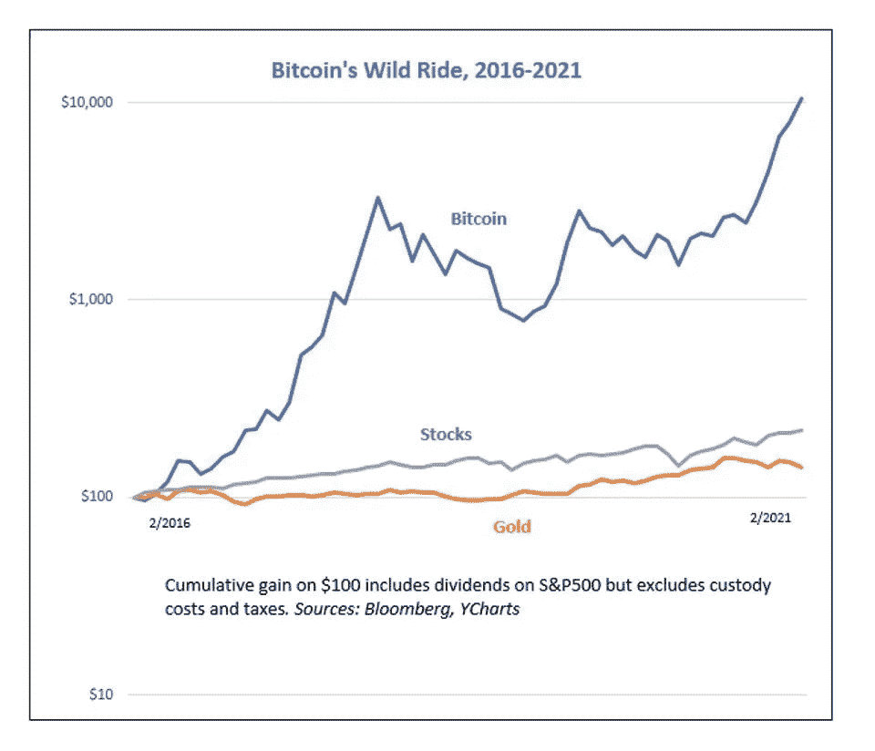

# 比特币价格——骗局还是真实？

> 原文：<https://medium.com/coinmonks/bitcoin-price-scam-or-real-eb4b68c3076d?source=collection_archive---------9----------------------->

比特币只是 21 世纪的又一次郁金香狂热，还是第一种数字化稀缺的去中心化货币，是真正值得其价格升值的技术奇迹？

**🚨大免责声明** : *让我从标准免责声明开始这篇文章。* ***这不是投资建议。我不是投资顾问。此信息旨在用于教育目的。在你决定投资你的血汗钱之前，请做好你自己的研究。如果你不确定，寻求专业理财顾问的帮助，他能理解你的全部财务需求，并就你应该做什么给你建议。***

# 旅途中的🧗start——许多文章的第一部分

我写这篇文章的灵感来自于我和朋友们关于这个话题的热烈讨论。让我预先警告你。一篇帖子或一篇文章不足以涵盖这个话题的所有优点、缺点和细微差别。请将此视为旅程的开始，在接下来的几周时间里，我们将深入了解该资产的不同方面。所以，拿着你的一杯咖啡或一杯葡萄酒坐下来，让我们深入到 ***“比特币的价格应该是多少？还是比特币有真正的价值？”这不是一个容易回答的问题。我尽量不藏在大量的技术术语后面，而是把它作为我可以向我儿子解释的东西。***

# 💰列奥纳多·达·芬奇的画卖 4.5 亿美元，值得吗？

我敢肯定，2017 年 11 月，当德米特里·雷博诺夫列夫在佳士得的一场拍卖会上以 4.5 亿美元买下莱昂纳多·达·芬奇的画作《萨尔瓦托尔·芒迪》(Salvator Mundi)时，人们心中就有这个疑问。你有没有停下来想一想是什么因素导致这幅画如此昂贵——它很罕见(只有一幅),出自一位非常著名的艺术家之手，受到一群珍视这些画的个人的需求。德米特里是那些重视这幅画的人之一，他预计这幅画的价格会上涨，并且有财力购买这幅画。我根本没有那么多钱，所以即使我想要，我也会因为价格太高而离开市场。我甚至可能很高兴在我的电脑上看到这样的图像，并从中获得价值。但是我的拷贝的价格是 0 美元。它是免费的，因为网上有无限量的这幅画的图片。

# 💸但是价格和价值没有必然的联系吗？

**价格(你支付的价格)**:价格是买方为换取任何产品和服务而向卖方支付的金额。**价值(你得到什么)**:暗示服务的商品价值对个人的效用。

基础经济学指出，价格是由需求(人们想要的商品)和供给(有多少可供选择)的交叉点决定的。 [2](https://cryptoage.substack.com/p/bitcoin-price-scam-or-real#footnote-2)

并非所有高价值的物品都贵，反之亦然；并非所有低价值的物品都便宜。这可以用亚当·斯密教授关于水和钻石的通俗例子来解释。水对我们的生存非常重要，但它的价格很低，而钻石只是用来装饰，没有人会死，如果他们没有得到它，它的价格仍然很高。这背后的原因是，虽然水的价值对我们来说很高，但它是丰富的(越来越多的海洋水可以饮用)。虽然钻石的价值很低，但它被视为地位的象征，供应量有限，因此推高了其价格。

# 🏆那么比特币是新数字时代的钻石还是黄金——价值低但价格高？

虽然它不是有形的，但比特币的代码赋予了它传统法定货币的特征，包括**稀缺性**、**可分性**、**便携性**、**可替代性**和**可识别性**。此外，比特币是分散的，可以在没有中间人的情况下使用，提供了**某种程度的透明度**，**可以被任何有互联网连接的人访问和使用**，是**不可能伪造的**和**无法没收的**，并具有其他特性，如**可编程性**。最重要的是，它可以像黄金或其他商品一样用作价值储存手段，但与实物不同的是，它可以在几分钟内通过通信渠道从世界的一端运送到另一端。

**关于比特币要知道的几件事**

*   **比特币网络是一个完整的金融系统**，方便比特币这种新型数字货币资产的转移和托管。
*   **比特币是自由开源软件(FOSS)，**生活在互联网上的代码。个人可以运行代码或复制代码并创建自己的变体。
*   **稀缺**。限量供应 2100 万枚比特币，硬连线到技术代码中
*   **整除性**。单个比特币可以分成 100000000 个 Satoshis。一个聪等于 0.00000001 BTC。这可以达到小数点后 16 位。
*   **通货紧缩**。迄今为止，已有约 1800 万比特币被挖掘出来。维护网络并记录交易的矿工，每成功写入一个新区块，奖励 6.25 比特币~每 10 分钟。这项奖励每 4 年减半(比特币减半)。因此，该系统的软件代码中包含了一个明确的通缩政策。

*   **便携性。**比特币可以通过互联网、卫星甚至无线电波等通信渠道进行转移，这使其成为有史以来最易转移的货币。
*   **可替代性。**每一枚比特币都和它的对应物具有相同的价值，无论谁拥有它，它有什么样的历史。就像一盎司的纯金总是等于另一盎司的纯金。无论发生什么，一个比特币仍然是价值的象征，可以与另一个比特币互换。
*   **耐久性。**任何比特币或 Satoshi 都可以重复使用无数次而不会降级。
*   **可识别性。**越来越多的商家和用户认可并接受比特币。虽然还远未达到法定货币的接受水平，但很多人将比特币与非货币或其他假币区分开来，并愿意接受它作为支付手段。
*   **放权。没有单一实体监管比特币。与传统货币不同，没有人可以审查、控制或改变网络或其交易，因此没有人可以没收你的钱。**
*   **可达性。**你不需要有一个经过验证的银行账户来拥有或接受比特币。你所需要的只是一些基本的计算机知识和互联网连接。比特币的易获取性使得它对于世界上银行不发达的地区来说极其方便
*   **不可伪造。**每一笔比特币交易都被记录在一个分布式账本上，并通过节点的计算工作得到保护。该系统旨在防止阻碍之前数字货币发展的重复消费问题。因此，比特币网络上的所有交易都是不可伪造和不可撤销的。
*   **可编程性。与普通货币不同，比特币还引入了一个可编程的维度。这意味着在未来，比特币可以接收更新，并拥有更方便的功能，如智能合约、多签名交易等。**

# 🔥那么，对比特币的需求源自哪里

预测比特币的短期价格极其困难，并且受到市场情绪、FUD、新闻、哈希拉特等各种因素的影响。我更关注需求方驱动因素的长期价格和价值。

# 📱1.网络效应(梅特卡夫定律)

网络上的人越多，网络就变得越有价值。这一点在电信行业得到了证实，但也是理解互联网平台公司指数增长的基础。

梅特卡夫定律“认为网络的价值与网络中节点(设备或用户)数量的平方成正比。因此，如果只有两部电话，他们只能互相呼叫，但 12 部电话可以建立 66 个连接，这将呈指数级增长。我们已经在我们每天接触的平台上看到了这一点 Whatsapp、Linkedin、脸书。这些都是通过网络效应增长的例子，为新进入者建立了进入壁垒。对于一个人来说，创建一个新的 LinkedIn 非常困难——当用户登录新平台时，他们的联系人都不在那里，那么他们会关注谁并向谁发送消息呢？

作为第一种加密货币，比特币网络正在继续发展——零售投资者、小型和大型机构、政府(萨尔瓦多)等。

# 💰2.价值储存手段

价值储存是保持其价值的资产、商品或货币，因此可以在未来交换而不会贬值。现金在当前交易中是有用的，对于短期流动性来说是有价值的。然而，作为一种长期价值储存手段，它的历史记录很糟糕

根据美联储的消费者价格指数，1913 年(美联储成立的那一年)的 1 美元大约相当于 2020 年的 26.15 美元。在这段时间里，世界上最可靠的法定货币的购买力累计下降了 96%多一点。具有讽刺意味的是，在今天的易贝，一叠 1935 年的原始大富翁游戏币作为收藏品的价值约为 40-60 美元，这意味着“大富翁游戏币”在过去的 85 年里比真币更保值。 [3](https://cryptoage.substack.com/p/bitcoin-price-scam-or-real#footnote-3)

因此，从 10 万英尺的角度来看，比特币是一种出色的价值储存手段，因为它可以随着时间的推移储存价值。数量的减少、货币随时间贬值的倾向以及大量资金被注入系统，是比特币价格上涨的坚实基础。如果你看看当前的货币体系，随着时间的推移，没有多少好的地方来储存价值。当权者目前的意识形态是确保资金在经济中流动，并确保资金的流动速度足够快，以免停滞不前。

# 💵3.支付网络

比特币碰巧也非常擅长跨越物理边界转移价值。虽然我们已经习惯了在商店里即时支付小额款项，但跨境转账仍需要几天时间。10 分钟内完成的最终结算跨越了半个世界，有可能为世界上很大一部分没有银行账户和银行服务不足的人提供银行服务，这令人惊叹。

然而，这种日常交易的前景并不遥远——由于每个区块的大小和时间，比特币用于小额支付存在一些限制。这些问题正在通过一个已经进行了几年的升级项目——闪电网络来解决。这是一个“第二层”支付协议，位于比特币的主账本之上。它旨在实现参与者之间的快速事务，解决基础层中的可伸缩性问题。就像两个室友保持谁付了多少钱的流水账，只在月底结算一样，这一升级将允许人们与不同的人有一个流水账，而不是每笔交易都被写入分类账(这是一个高层次的解释，更详细的回应可以在这里找到

随后的时事通讯将涉及的一个主题是在一个有 CBDCs 的世界里货币和比特币的分层。

# 🏢4.全球结算网络

比特币有潜力成为银行和企业的结算系统。与传统的结算系统不同，比特币网络是全球性的，它不能审查交易，其资金也不能被央行等机构膨胀。比特币不会在销售点促进大量低价值交易，而是可以发展为处理金融中介之间的大额交易。如今，大多数以美元为基础的国际支付必须通过美联储的实时支付结算系统(RTGS)进行结算。

# ⏳5.投资组合多样化

机构是统计数据的忠实粉丝——理所当然，他们试图在每一个风险水平上挤出更高的回报。从本质上来说，现代投资组合理论只是用数学术语包装的古老的鸡蛋放在一个篮子里的格言。分散投资的原因是，你可以获得与分散程度较低的投资组合相同的回报，但波动性较小，或者，换句话说，保持波动性不变，同时通过一些杠杆获得放大的回报。

如果你还没有读过，我的文章《从投资中学习》对分散投资有一些有趣的想法——[我学到的 10 条投资经验(第二部分)](https://cryptoage.substack.com/p/10-investing-lessons-i-learned-part-00b)

比特币的波动性非常大，但它的升值远远弥补了这一点。Coin Metrics Bletchley Index 记录了过去五年比特币的夏普比率为 1.6。相比之下，先锋平衡指数基金(Vanguard Balanced Index Fund)的市盈率为 1.1 倍，这是你使用股票和债券所能获得的最多元化投资。

如果你可以事后投资，你会回到过去，把你 100%的钱投入到 crypto 中，紧紧抓住过山车。五年后，你的现金会增加 105 倍

# 🥷6.防止资产被扣押的保护

比特币使个人主权成为可能，在产权不被承认或执行的司法管辖区，这是一个有用的——如果不是至关重要的——特征。有了好的公钥和私钥管理，我们相信比特币是无法被查封的。

以及更多的用例。

# 所以总而言之…

随着**有限的供应**、**不断增长的需求**(网络效应&不断增加的使用案例)比特币似乎有望成为全球公认的分散储备和易于运输&交易的保值资产。

它具有 24/7 的价格发现、相对稀缺性，并且不是任何人的责任或项目。

# 下一期每周简讯的一些有趣问题…

*   比特币需要被所有人接受才有价值吗？
*   各国政府已经推出了 CBDC(央行数字货币)
*   如果所有政府都禁止比特币会怎样
*   有没有什么金融模型对比特币 ie 进行估值？流动库存
*   比特币估值的难点在哪里
*   什么会导致比特币的价值崩溃或下跌
*   对价值储存的批评—易变，没有任何支持，不被所有地方接受，监管限制

# 关于我

我是一家银行的总经理🏛，联合创始人兼成长型投资者📈，
有学习的心态🔥。对加密充满热情，Defi💵&区块链。
新一代银行——Mox 银行的创始领导层📱

如果你喜欢这篇文章，请**订阅**我的免费每周简讯，**与你的朋友分享**，并**给我反馈** &评论。你可以在社交媒体 [Twitter 上找到我— @sauravbhats](https://twitter.com/sauravbhats) 或[中链接的](https://www.linkedin.com/in/sauravbhatia0/)。

https://cryptoage.substack.com/——注册一份免费的时事通讯

> 加入 [Coinmonks 电报频道](https://t.me/coincodecap)，了解加密交易和投资