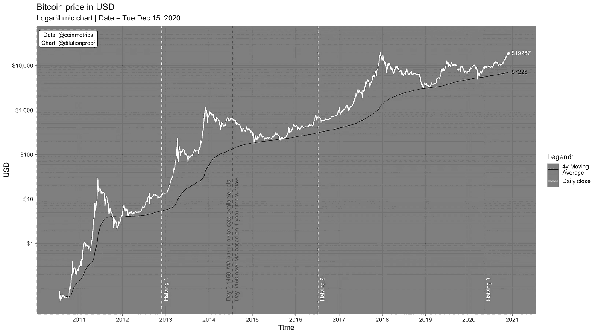
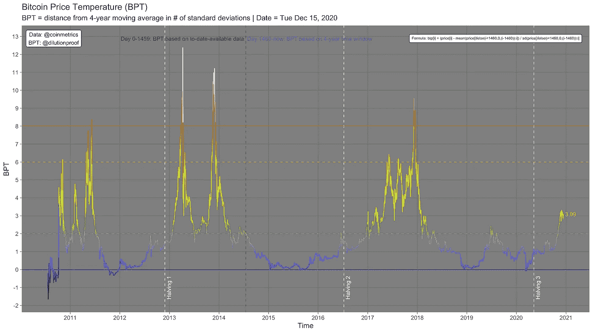
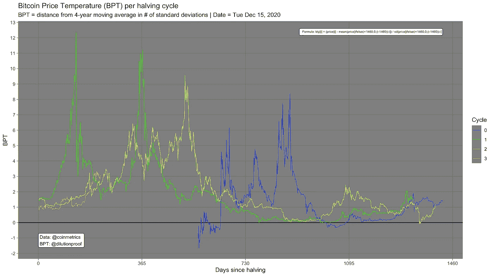
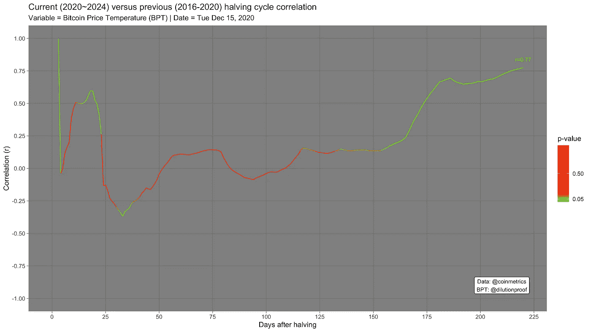
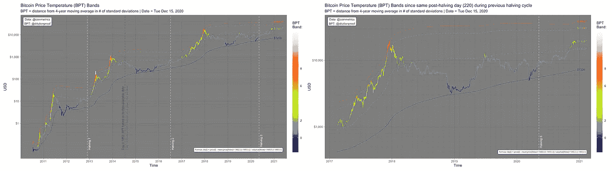
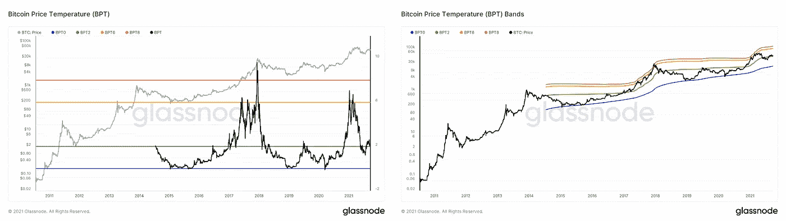

# 比特币价格温度(波段)

> 原文：<https://medium.com/coinmonks/bitcoin-price-temperature-bands-d17695e164ea?source=collection_archive---------0----------------------->

## 比特币 4 年周期的价格带宽指标

> 本文是对前一篇文章的后续，前一篇文章中介绍了一个被重新命名并扩展为比特币价格温度(BPT)的指标。首先将更详细地描述 BPT 指标，包括其 4 年市场周期的拟议因果机制背后的基本原理，BPT 指标的解释及其局限性。此后，BPT 波段的概念被引入，并得到几个图表的支持，在这些图表中，指标及其潜在的应用是可视化的。

Photo by [**Maksim Goncharenok**](https://www.pexels.com/nl-nl/@maksgelatin?utm_content=attributionCopyText&utm_medium=referral&utm_source=pexels) via [**Pexels**](https://www.pexels.com/nl-nl/foto/kunst-schrijven-potlood-school-5995206/?utm_content=attributionCopyText&utm_medium=referral&utm_source=pexels)

# 比特币的 4 年周期

比特币推出时，早期网络参与者每创造一个新的区块就能获得 50 BTC 的奖励。每 210.000 块，这种‘块奖励’减半，逐渐减缓供应发放。由于这种内在的[反通胀](https://www.investopedia.com/terms/d/disinflation.asp)货币政策，[比特币](https://blog.coincodecap.com/a-candid-explanation-of-bitcoin)有严格控制和有限的供应。33 等分(~2140)后，区块奖励将低于系统中的最小单位(1 satoshi 或' sat '，即 0.00000001 BTC)，以总计 [20，999，999.97690000 BTC](https://en.bitcoin.it/wiki/Controlled_supply) 补足比特币的供应量。

为了确保大约每 10 分钟创建一个区块，以便比特币的交易能力和供应发行相对稳定，内置了一个[难度](https://en.bitcoin.it/wiki/Difficulty)调整机制。每 2016 个区块(约 2 周)，比特币软件每 10 分钟检查一次新区块的创建程度。如果平均区块时间更低，则会增加矿工试图猜测的随机数的复杂性，以便赢得创建下一个区块的权利。同样，如果平均区块时间超过 10 分钟，难度会向下调整，使矿工更容易创建新区块。如果每隔 10 分钟开采一个区块，则一个减半周期的持续时间为 4 年(210.000 个区块*每个区块 10 分钟= 2.100.000 分钟，2.100.000/60/24/7/52 = 4.00641 年)。实际上，由于网络容量不断增长(“哈希速率”)，到目前为止，平均减半周期持续时间为 3.8 年(1381 天)。

这种减少的副作用是，每 4 年，市场就会出现一次供应冲击，突然降低通过采矿获得的新供应量。如果对比特币的净需求保持不变(例如，人们定期购买比特币作为储蓄工具或投资)，新铸造的比特币的突然减少意味着获得比特币的唯一其他方式是从当前持有者手中购买。由于持有比特币作为长期价值储存手段(也称为“hodling”)是市场参与者的一个热门话题，这些比特币可能只会以更高的价格出售。价格上涨反过来又会导致人们的意识增强，而这通常伴随着需求的增加，这就像火上浇油，创造了导致价格过热的疯狂市场环境(一种被称为'[反身性](https://www.investopedia.com/terms/r/reflexivity.asp)'的反馈循环)，随后往往是快速下跌和冷却期。@克罗伊斯 _BTC [在这条 Twitter 帖子](https://twitter.com/Croesus_BTC/status/1319734166557081600)中生动形象地描述了这些机制。

过去大约 10 年的比特币价格图表(图 1)显示了迄今为止比特币价格的下降确实总是伴随着价格的指数增长和随后的冷却期。白线表示每日价格，而黑线表示其移动平均价格(使用前四年的最新数据)，即四年内的平均价格。4 年移动平均价格持续上涨，表明在 4 年的时间框架内，比特币的[美元平均成本在任何时候都是有益的。](https://dcabtc.com/)

Figure 1: A logarithmic chart with the Bitcoin price in USD and its 4-year Moving Average

仅仅基于两次观察的样本，不可能正式得出结论说降价*导致了*这些过热的市场状况。然而，潜在因果机制的明确理由和匹配价格行为的结合令人信服地证明，这一假设可能比目前可以证明的更真实。

最著名的尝试是更正式地测试比特币的市场价值可以基于其减半诱导的稀缺性来建模的假设，即股票到流量(S2F)模型。[在之前的文章](/swlh/modeling-value-based-on-scarcity-7fa7d754a58)中，我总结了 S2F 的所有发展，随后介绍了 S2F 跨资产(S2FX)模型，以及它们最突出的批评。如果比特币的指数增长确实是其逐渐增加的稀缺性的函数这一假设成立，这些模型为比特币的未来价格提供了一个有趣的前景。然而，S2F 模型分析中使用的统计测试所做假设的问题以及 S2FX 模型的小样本量阻止了对结果的广泛共识的出现。

在缺乏这种无可辩驳的证据的情况下，这些模型的预测伴随着相对广泛的不确定性(裕度)。因此，仍然需要更灵活地反映当前比特币市场价格在其自身价格历史和波动性背景下(ab)正常程度的指标，特别是与 4 年市场周期相关的指标。比特币价格温度(BPT)指标正是这么做的。

# 比特币价格温度(BPT)

比特币价格温度(BPT)是衡量当前比特币价格与其 4 年移动平均线之间距离的指标。BPT 的计算方法是，首先计算每日价格与其 4 年移动平均值之间的差值，然后将该数字除以 4 年窗口的标准差(使用前 4 年的最新数据)。因此，在 [R](https://www.r-project.org/) 中，可以使用以下公式计算 BPT:

> BTP[I]=(price[I]—mean(price[if else(I<1460, 0, (i-1460)):i]) / sd(price[ifelse(i<1460, 0, (i-1460)):i]

The BPT metric therefore reflects the number of standard deviations that a point deviates from the mean, which can technically be called a ‘Z-Score’ and is a common standardization method in multiple scientific disciplines.

Since the 4-year moving average represents the ‘normal’ price during a four year window, the BPT metric therefore reflects how (ab)normal the current price is in the context of its own 4-year price history. **)因此，BPT 指标可以被视为一种温度检查，其中较高的值代表潜在的(过热的)价格水平，而较低甚至负值则表明这些价格在 4 年的时间窗内相对较低。**图 2 显示了 BPT 随时间的变化。

Figure 2: The Bitcoin Price Temperature (BPT)

在图 2 中，蓝色(BPT=0)线代表 4 年移动平均线。比较图 1 和图 2 后可以明显看出，BPT 比常规价格图更容易比较不同市场周期的相似程度。一个更有趣的发现是，四个最重要的市场周期顶部(2011 年、2 个 2013 年和 2017 年)在比特币价格达到 8(红线)的温度后不久达到顶峰，暂时超过 12 的温度，然后开始急剧下降，一路“冷却”回到 0-1。橙色(BPT=6)和绿色(BPT=2)线也代表价格趋势多次改变的关键价格温度。值得注意的是，上图中突出显示这些水平没有统计原因，但这些是基于技术分析确定的，[有其局限性](https://www.investopedia.com/terms/t/technicalanalysis.asp#limitations-of-technical-analysis)。

在图 3 中，周期的相对价格行为之间的相似性变得更加明显。比特币存在的第一个时期(蓝线)很特殊，因为在最初的 561 天里，现有的供应量每天都被相对严重地稀释，比特币在使用的数据中没有正式的市场价格([由 Coinmetrics](https://coinmetrics.io/community-network-data/#comm-files) )。尽管如此，在比特币获得市场价格后，这一时期有其自己的疯狂市场周期和井喷期，这种模式迄今为止在每个减半周期中都在重复。

Figure 3: A comparison of the Bitcoin Price Temperature (BPT) of each halving cycle

**需要注意的是，BPT 仅仅是一个回顾性指标，并不具备预测能力。4 年市场周期(的相似性)的视觉表现可能会令人信服地证明我们正在目睹周期性重复的市场周期。然而，不能保证这些周期会重复，也不能保证它们会与之前的周期完全相似，如果周期性本身继续，未来的市场顶部达到相似的相对价格水平。尤其是在市场心理周期的狂热阶段，欣快感的程度很难(如果不是不可能的话)预测，因为除了这里描述的时间和减半之外，还有许多变量在起作用。**

反对这些周期将在未来不断重复的假设的一个基本论点可以基于这样一个概念，即虽然每次减半的*相对*影响是相同的(块报酬/ 2)，但每次减半对块报酬的*绝对*影响是递减的(4-年通货膨胀率[下降-50%、-33.3%、-9.6%、-3.8%、-1.7%、-0.8%，等等)。](https://en.bitcoin.it/wiki/Controlled_supply))。因此，未来减半对所描述的供给侧流动性冲击的影响可能会逐渐减小。其他因素(例如，与选举或传统金融市场周期相关的政策变化)仍有可能周期性地影响比特币的市场周期，但这些周期不一定遵循我们之前看到的相同的 4 年周期。

然而，当前 220 天减半周期(2020~2024 年)的相对价格行为再次显示出与上一个周期(2016-2020 年)的显著相似性。图 4 描述了这两个周期的 BPT 随时间变化的相关性，其中彩色叠加图代表统计显著性(绿色=在 p <0.05, red = not). Using the to-date-available data of the current and previous cycle, there is a high (r=0.77) correlation between the relative price movements of these two cycles.

Figure 4: The correlation between the BPT values of the current (2020~2024) and previous (2016–2020) halving cycle

It is impossible to proof that history will indeed repeat itself. Nonetheless, many Bitcoin market participants appear to have built some conviction in the assumption that the repetitive nature of these market cycles will continue in the foreseeable future. Therefore, using the BPT to monitor these relative price movements, as well as the expected price levels if the BPT were indeed to reach the key BPT levels of prior cycles again, may be useful. This brings us to the new concept of BPT Bands.

# Bitcoin Price Temperature (BPT) Bands

Since the BPT values reflect the ‘temperature’ of the Bitcoin price, the metric can be useful as a color-overlay on the regular Bitcoin price chart. Additionally, it is possible to display the key levels that were identified above (or any other BPT level) on that same price chart, by simply multiplying the standard deviation by the BPT level (so 2*SD for BPT=2, 6*SD for BPT=6, etc.) and adding this to the 4-year moving average. The result is displayed in figure 5.

Figure 5: The Bitcoin Price Temperature (BPT) Bands for BPT=0 (blue), BPT=2 (green), BPT=6 (orange) and BPT=8 (red)

This BPT Bands visualization allows for several interesting observations:

*   While the regular BPT chart was convenient for identifying potential price support and/or resistance levels (the key levels identified as the colored horizontal lines in figure 2), **处具有统计显著性)。在价格图表上显示它们(图 5)强调了如果在稍后的周期中再次达到这些 BPT 水平，由于长期向上的趋势**，这是在更高的价格上完成的。
*   由于上一点，图表显示**当某一价格水平在稍后再次达到时，该价格的“温度”往往已经显著下降**。例如，当比特币价格在 2017 年末首次达到近 2 万美元时，其 BPT 约为 8。当它最近在 2020 年末再次这样做时，BPT“刚好”~3，这表明在撰写本文时，约 20，000 美元的历史最高价格水平比 2017 年周期顶部时更不正常。
*   BPT 波段与[布林线](https://www.investopedia.com/terms/b/bollingerbands.asp)相似，不同之处在于，BPT 波段使用的时间窗口(4 年)比布林线通常使用的时间窗口(20 天)大得多，并且使用的标准差范围也大得多(最多 12 对 1-2)。此外，由于大的时间范围和这段时间内的高波动性，比特币价格很少在负 BPT 范围内，这使得负 BPT 波段的使用可以忽略不计，不像布林线。尽管如此，和布林线一样，**BPT 带在高波动期(如牛市)变宽，在低波动期收缩**。

这种对波动性的响应也是 BPT 波段与 [Mayer 多重波段](https://digitalik.net/btc/mayer_bands)、 [2 年 MA 乘数](https://www.lookintobitcoin.com/charts/bitcoin-investor-tool/)、[黄金比例乘数](https://www.lookintobitcoin.com/charts/golden-ratio-multiplier/)以及类似的基于移动平均线的波段(通过乘以某个移动平均线计算)之间的关键区别之一。与这些波段相关的价格以与移动平均线斜率相等的速度逐渐上升。如果 4 年的波动性增加，BPT 波段的斜率会更陡地上升，这表明在波动的市场条件下价格会更高，这在这种情况下可能更合适。

**2021 年 9 月 20 日**更新:由于 Glassnode 的工作台功能，现在可以免费访问 [BPT](https://studio.glassnode.com/workbench/80fd31b8-c2d7-4395-643c-dd9b25d921ce) 和 [BPT 乐队](https://studio.glassnode.com/workbench/a7a7a49c-b077-416d-7b79-2b61414b03d9)图表的实时版本(图 6)。

**2021 年 10 月 21 日**更新:BPT & BPT 乐队现在也[出现在 Glassnode Workbench](https://studio.glassnode.com/workbench/illiquid-supply-shock) 上。

Figure 6: A Glassnode Workbench version of the BPT (left; [source](https://studio.glassnode.com/workbench/80fd31b8-c2d7-4395-643c-dd9b25d921ce)) and BPT Bands (right; [source](https://studio.glassnode.com/workbench/a7a7a49c-b077-416d-7b79-2b61414b03d9)) charts

*特别感谢 Twitter 用户*[*@ anoi 30604540*](https://twitter.com/Anoi30604540)*对开发的图表提供反馈，以及对本文草稿的审阅。*

*在培养基上跟随***或* [*推特*](https://twitter.com/dilutionproof) *以获得未来更新的通知。**

**本文中介绍的指标可由他人自由复制、使用和扩展，只要提及本文的作者和/或本文的链接。未来的工作可能是为 BPT 波段开发一个 TradingView 指示器* *(例如，在从-2 到 12 的更宽范围内，以便波段在更小的时间范围内更明显)和/或 Github* *上可用的 R 代码* [*的 Python 实现，它可用于在在线图表平台上更灵活地可视化 BPT 波段。*](https://github.com/dilutionproof/medium)*

**免责声明:本文仅供娱乐，不应作为投资建议。**

## *另外，阅读*

*   *最好的[密码交易机器人](/coinmonks/crypto-trading-bot-c2ffce8acb2a)*
*   *[AAX 交易所评论](/coinmonks/aax-exchange-review-2021-67c5ea09330c) |推荐代码、交易费用、利弊*
*   *[Deribit 审查](/coinmonks/deribit-review-options-fees-apis-and-testnet-2ca16c4bbdb2) |选项、费用、API 和 Testnet*
*   *[FTX 密码交易所评论](/coinmonks/ftx-crypto-exchange-review-53664ac1198f)*
*   *[3 商业评论](/coinmonks/3commas-review-an-excellent-crypto-trading-bot-2020-1313a58bec92)*
*   *[Bybit 交换审查](/coinmonks/bybit-exchange-review-dbd570019b71)*
*   *最好的比特币[硬件钱包](/coinmonks/the-best-cryptocurrency-hardware-wallets-of-2020-e28b1c124069?source=friends_link&sk=324dd9ff8556ab578d71e7ad7658ad7c)*
*   *[密码本交易平台](/coinmonks/top-10-crypto-copy-trading-platforms-for-beginners-d0c37c7d698c)*
*   *[Bitsgap vs 3 commas vs quad ency](https://blog.coincodecap.com/bitsgap-3commas-quadency)*
*   *最好的[加密税务软件](/coinmonks/best-crypto-tax-tool-for-my-money-72d4b430816b)*
*   *[最佳加密交易平台](/coinmonks/the-best-crypto-trading-platforms-in-2020-the-definitive-guide-updated-c72f8b874555)*
*   *最佳[加密借贷平台](/coinmonks/top-5-crypto-lending-platforms-in-2020-that-you-need-to-know-a1b675cec3fa)*
*   *[莱杰纳米 S vs 特雷佐 one vs 特雷佐 T vs 莱杰纳米 X](https://blog.coincodecap.com/ledger-nano-s-vs-trezor-one-ledger-nano-x-trezor-t)*
*   *[block fi vs Celsius](/coinmonks/blockfi-vs-celsius-vs-hodlnaut-8a1cc8c26630)vs Hodlnaut*
*   *[3Commas vs Cryptohopper](/coinmonks/cryptohopper-vs-3commas-vs-shrimpy-a2c16095b8fe)*
*   *[bits gap review](/coinmonks/bitsgap-review-a-crypto-trading-bot-that-makes-easy-money-a5d88a336df2)——一个轻松赚钱的加密交易机器人*
*   *为专业人士设计的加密交易机器人*
*   *[PrimeXBT 审查](/coinmonks/primexbt-review-88e0815be858) |杠杆交易、费用和交易*
*   *[alt ready 审查](https://blog.coincodecap.com/altrady-reivew)*
*   *[埃利帕尔泰坦评论](/coinmonks/ellipal-titan-review-85e9071dd029)*
*   *[赛克斯石评论](https://blog.coincodecap.com/secux-stone-hardware-wallet-review)*
*   *[BlockFi 评论](/coinmonks/blockfi-review-53096053c097) |赚取高达 8.6%的加密利息*
*   *[面向开发人员的最佳加密 API](/coinmonks/best-crypto-apis-for-developers-5efe3a597a9f)*
*   *[最佳区块链分析工具](https://bitquery.io/blog/best-blockchain-analysis-tools-and-software)*
*   *[加密套利](/coinmonks/crypto-arbitrage-guide-how-to-make-money-as-a-beginner-62bfe5c868f6)指南:新手如何赚钱*
*   *顶级[比特币节点](https://blog.coincodecap.com/bitcoin-node-solutions)提供商*
*   *最佳[加密制图工具](/coinmonks/what-are-the-best-charting-platforms-for-cryptocurrency-trading-85aade584d80)*
*   *了解比特币的[最佳书籍有哪些？](/coinmonks/what-are-the-best-books-to-learn-bitcoin-409aeb9aff4b)*

> *[直接在您的收件箱中获得最佳软件交易](/coinmonks/newsletters/coinmonks)*

**