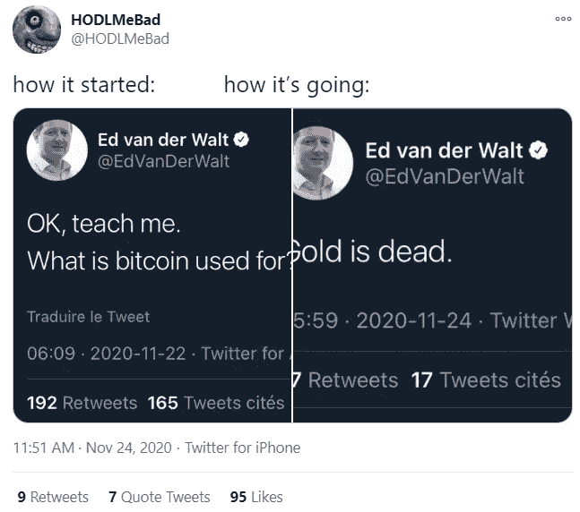
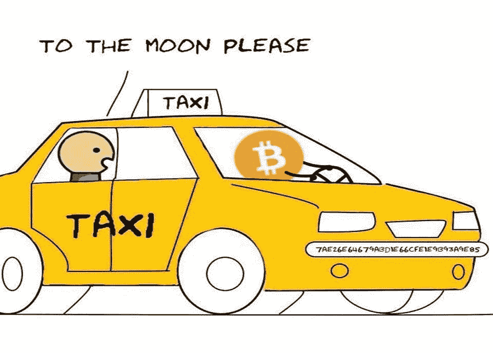
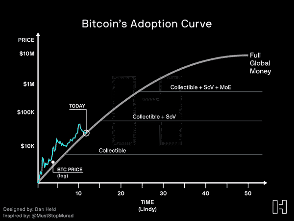

# 比特币到达 ATH |脸书的 Libra 准备在 2021 年发射

> 原文：<https://medium.com/coinmonks/bitcoin-reaches-ath-facebooks-libra-is-ready-to-launch-in-2021-51be6d984764?source=collection_archive---------8----------------------->

The proposed symbol for [Satish](https://www.reddit.com/r/Bitcoin/comments/k0e98n/my_proposal_for_the_satish_symbol_still_looks/), This is the way

## 中国查获 42 亿美元密码|富达推出面向零售客户的比特币和密码交易服务

*   据英国《金融时报》援引知情人士的报道称，脸书和其他人正在创建的新加密货币 Libra 最早可能于明年 1 月推出，但格式有限。
*   据报道，波兰的 Olsztyn 是世界上第一个利用以太坊的区块链来帮助提供紧急服务的城市，为分布式账本技术提供了又一个切实的使用案例。
*   就在数十亿机构资金逃离黄金之际，比特币已飙升至 T2 纪录。
*   比特币基地首席执行官[周三晚上在 Twitter](https://twitter.com/brian_armstrong/status/1331744884856741888?s=20) 上抨击了美国财政部的传闻计划，该计划试图通过一系列繁重的数据收集要求来追踪自助加密货币钱包的所有者。

## [四种情况](https://quadency.com/?r=ea20aa360c45d1f5ad47a19a)

试试 [Quadency](https://quadency.com/?r=ea20aa360c45d1f5ad47a19a) ，这是一个为交易者构建的交易终端，用于自动化他们的加密交易。阅读我们的[季度回顾](/coinmonks/quadency-review-a-crypto-trading-automation-platform-3068eaa374e1)。

> *查看我们的* [*最佳加密交易机器人*](/coinmonks/whats-the-best-crypto-trading-bot-in-2020-top-8-bitcoin-trading-bot-c16adeb13317) *列表。*

## 最新消息📰

*   华尔街最热门的辩论是购买比特币而非黄金
*   投资巨头 AllianceBernstein now [**表示**](https://www.coindesk.com/investment-giant-alliancebernstein-now-says-bitcoin-has-role-in-investors-portfolios) 比特币在投资者的投资组合中发挥了作用
*   中国警方在普卢斯托克庞氏骗局中查获了 42 亿美元的密码
*   甲骨文[利用](https://decrypt.co/49657/oracle-exploit-sees-100-million-liquidated-on-compound)看到 8900 万美元的复合清算
*   比特币正在赢得新冠肺炎货币革命
*   据报道，脸书期待已久的[天秤座货币](https://www.cnbc.com/2020/11/27/facebook-cryptocurrency-libra-to-launch-as-early-as-january-but-scaled-back-ft-reports-.html)将于明年初限量发行
*   古根海姆博物馆[通过灰度的 GBTC 为 50 亿美元的宏观基金打开了比特币](https://www.theblockcrypto.com/post/85924/guggenheim-opens-door-to-bitcoin-exposure-for-5-billion-macro-fund-via-grayscale-gbtc-product)敞口的大门
*   以太坊 2.0 [赌注](https://blog.coinbase.com/ethereum-2-0-staking-rewards-are-coming-soon-to-coinbase-a25d8ac622d5)奖励即将登陆比特币基地
*   DeFi 协议渴望。财务宣布第五次合并，这次是与 Uniswap fork SushiSwap
*   比特币基地首席执行官:川普政府可能[【冲出】](https://www.coindesk.com/coinbase-ceo-trump-administration-may-rush-out-burdensome-crypto-wallet-rules)繁琐的加密钱包规则
*   富达高管称投资巨头将支持以太坊，为零售客户推出比特币和加密交易服务
*   波兰城市成为第一个将以太坊区块链用于紧急服务的城市

> *报税季即将到来，使用最好的* [***加密报税软件***](/coinmonks/best-crypto-tax-tool-for-my-money-72d4b430816b) *来申报你的加密报税吧。*

[Source](https://www.reddit.com/r/CryptoCurrency/comments/k2egoc/how_its_ended/)

> 想练习交易吗？试试 [**交易馆**](https://tradinggym.app/) ，免费的。

## 好的读物📑

*   加密钱包不是银行账户
*   治理[最小化](https://www.fehrsam.xyz/blog/governance-minimization)
*   比特币:[参与](https://www.vaneck.com/nl/en/bitcoin/?country=nl&audience=retail)货币革命
*   Eth2 [砍杀](/prysmatic-labs/eth2-slashing-prevention-tips-f6faa5025f50)预防技巧
*   4 [从沉积物中取出](/etherscan-blog/4-takeaways-from-deposits-into-eth2-28c64dd2863)到 Eth2 中
*   Eth2 [研究](https://f.hubspotusercontent40.net/hubfs/6069443/DARMA_Eth2_Research_Report.pdf)报告
*   渴望收购泡菜对代币持有者的影响
*   区块链如何简化复杂的业务流程
*   预测[市场](https://www.charlesrubenfeld.com/the-prediction-markets-were-right/)再次获胜
*   我的[旅程](https://consensys.net/blog/blockchain-explained/my-journey-to-becoming-a-validator-on-ethereum-2-0/)成为以太坊 2.0 的验证者
*   更新“分散式期权平台的比较”
*   [没有互联网的比特币](/coinmonks/bitcoin-without-internet-at-the-end-how-btc-can-detach-itself-from-the-internet-c4bf15005503)到底？—BTC 如何与互联网“分离”
*   [该不该买比特币](/coinmonks/should-you-buy-bitcoin-an-in-depth-analysis-the-finance-brief-d4adeeb1e976)？深入分析—财务简报

> *买一个* [***硬件钱包***](/coinmonks/the-best-cryptocurrency-hardware-wallets-of-2020-e28b1c124069)*[*保护你的加密货币*](/coinmonks/how-to-prevent-cryptocurrency-hacking-and-theft-from-your-wallet-65c8ff767766) *。**

**

*[Source](https://www.reddit.com/r/Bitcoin/comments/k134lt/to_the_moon_please/)*

*本周五，我将代表 Bitquery 参加 Bharat 虚拟研讨会的 [**Build，因此，如果您想了解如何从币安智能链获取数据。**](https://www.binance.com/en/blog/421499824684901115/Build-for-Bharat--House-of-Workshops-feat-Google-Marlin-Band-and-ANKR?utm_campaign=Bitquery%27s%20Newsletter&utm_medium=email&utm_source=Revue%20newsletter) **[**报名**](https://www.airmeet.com/e/0f97f7e0-11e6-11eb-9180-f75161baafe2?utm_campaign=Bitquery%27s%20Newsletter&utm_medium=email&utm_source=Revue%20newsletter) 参加工作坊。***

## *开发商*

*   *机构交易、贷款和赌注的阻击*
*   *使用 specter DIY 打造[您自己的硬件钱包](https://stephanlivera.com/episode/231/)*
*   *[报道](https://drdr-zz.medium.com/write-ups-and-lessons-learned-from-damn-vulnerable-defi-caa95d2678ec)和从该死的弱势#DeFi 中吸取的教训*
*   *Slasher:一个[惩罚性的利害关系证明](https://blog.ethereum.org/2014/01/15/slasher-a-punitive-proof-of-stake-algorithm/)算法*
*   *如何[使用](https://bitquery.io/blog/graphql-alias-and-aggregation) GraphQL 别名和聚合？*
*   *以太坊 2.0 上的[定位](https://someresat.medium.com/guide-to-staking-on-ethereum-2-0-ubuntu-prysm-56f681646f74)指南*
*   *量子账本数据库的简要[概述。](/coinmonks/the-heart-of-db-and-the-soul-of-a-dlt-f5fe1229649e)*
*   *Eth2 [用对接器打桩](https://github.com/eth2-educators/eth2-docker)*
*   *Eth2 验证器信标链节点的安全性最佳实践*
*   *引入与 Hermez 大规模迁移的[首个 L2 互操作性](https://blog.hermez.io/hermez-massive-migrations-mechanism/)机制*
*   *对学习区块链开发感兴趣的开发者指南*
*   *[在塔基多使用迈克尔逊地图](/coinmonks/working-with-michelson-maps-in-taquito-8d8be9930662)*

> *想成为以太网和 **Web3 开发者**？[从这里开始](http://blog.coincodecap.com/go/learn)。*

## *多方面的*

*   *以太坊主网[统计](https://ethernodes.org/history)*
*   *令牌[终端](https://terminal.tokenterminal.com/)*
*   *[Eth123.org](https://eth123.org/)*
*   *比特币[区块链大小](https://blockchair.com/bitcoin/charts/blockchain-size?compare=bitcoin-cash)现已超过 300 GB*
*   *一个量子安全的斯塔克签名方案*
*   *[Loopring 钱包](/loopring-protocol/loopring-wallet-ethereum-unleashed-ac4173f940a5)，首款内置 zkRollup 缩放功能的以太坊智能钱包*

## *播客和视频💽*

*   *一项调查*
*   *[桥梁](https://www.youtube.com/watch?v=WD_2tuX9jeg&feature=emb_title) 2 以太坊(EVM)区块链*
*   *[为什么比特币如此重要](https://www.youtube.com/watch?v=Ai5z2T4WhWg) &为什么你应该关注|经济、伦理和技术视角*

## *黑客马拉松、活动和峰会*

*   *Inout 7.0 虚拟黑客马拉松挑战*
*   *12 月 4 日:以太坊 dev onboarding feat Linda Xie，Austin Griffith 和朋友们！*

## *加密交易和折扣🔖*

*   *获得 25 美元的信用，当你加入[***Mudrex***](https://mudrex.com/signup?referral_code=COIN3566)时，你可以用这些信用来支付费用*
*   **在*[***Botsfolio***](/coinmonks/botsfolio.com/?coupon=gaure27)*使用此* [*链接*](/coinmonks/botsfolio.com/?coupon=gaure27) *。**
*   **试用*[***Altrady***](https://app.altrady.com/?a=COINMONKS)*并使用优惠券代码****coin monks***获得六折优惠(购买年度计划时)*

## *产品评论和其他加密软件📙*

*   *[block fi vs Celsius](/coinmonks/blockfi-vs-celsius-vs-hodlnaut-8a1cc8c26630)vs Hodlnaut*
*   *2020 年五大[密码借贷平台](https://blog.coincodecap.com/top-5-crypto-lending-platforms)*
*   *2020 年最佳加密交易机器人*
*   *莱杰 vs 特雷佐*
*   *[区块链审查](/coinmonks/blockfi-review-53096053c097)*
*   *[PrimeXBT 审查](/coinmonks/primexbt-review-88e0815be858) —杠杆交易、费用和交易*
*   *[FTX 密码交易所评论](/coinmonks/ftx-crypto-exchange-review-53664ac1198f)*
*   *[Deribit 审查](/coinmonks/deribit-review-options-fees-apis-and-testnet-2ca16c4bbdb2) —选项、费用、API 和 Testnet*
*   *[you hodler Review](/coinmonks/youhodler-4-easy-ways-to-make-money-98969b9689f2)——从您的密码中赚取 12%的利息*
*   *[eToro 评论](/coinmonks/etoro-review-78807ddeb33c) —在美国购买比特币*

*想让我们展示你的产品吗？请通过 [Twitter @coinmonks](https://twitter.com/coinmonks) 联系我们*

## *照片说明了一切📷*

**

*[Source](https://www.reddit.com/r/Bitcoin/comments/k25yhr/bitcoins_adoption_curve/)*

## *乔布斯👷*

*   *营销[实习生](https://cryptocurrencyjobs.co/marketing/gemini-marketing-intern/)，双子座*
*   *业务[开发者](https://cryptocurrencyjobs.co/sales/aave-business-developer/)，Aave*
*   *生态系统[开发者](https://cryptocurrencyjobs.co/marketing/3box-ecosystem-developer/)*
*   *合作伙伴整合[经理](https://cryptocurrencyjobs.co/engineering/chainlink-partner-integrations-manager/)*
*   *[阿兹特克的招人](/aztec-protocol/were-hiring-5cd7cf5b0667)！加入 ZK 的尖端与私人 L2 从 PLONK 的创造者*
*   *0x 寻找各种类型的[开发人员](https://0x.org/about/jobs)和一名[抹茶营销经理](https://boards.greenhouse.io/0x/jobs/4923909002)*
*   *Chainlink Labs 在所有部门都有 [40 多个职位](https://www.chainlinklabs.com/careers#open-roles)*
*   *Nexus Mutual: [在欧洲时区经历了稳健发展](https://angel.co/company/nexus-mutual-1/jobs/967538-smart-contract-engineer)*
*   *比特之路正在招聘[区块链安全开发部](https://jobs.lever.co/trailofbits/4f459855-3299-462f-9e73-299a840d5baf) & [密码学分析师](https://jobs.lever.co/trailofbits/56af8506-3205-4c7b-b28d-ba8292bd1a47)*

## *在 Coinmonks 上发布*

*如果你喜欢在 crypto/区块链空间上写教育文章，并且想在 Coinmonks 出版物上发表。只需在**发邮件给我或者 DM 我**[***推特***](https://twitter.com/coinmonks)***