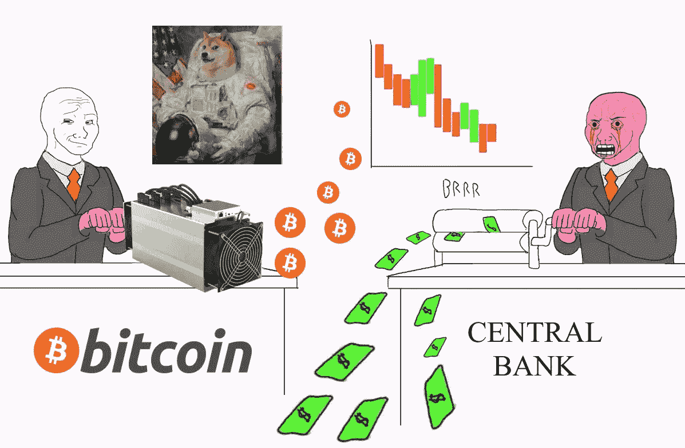
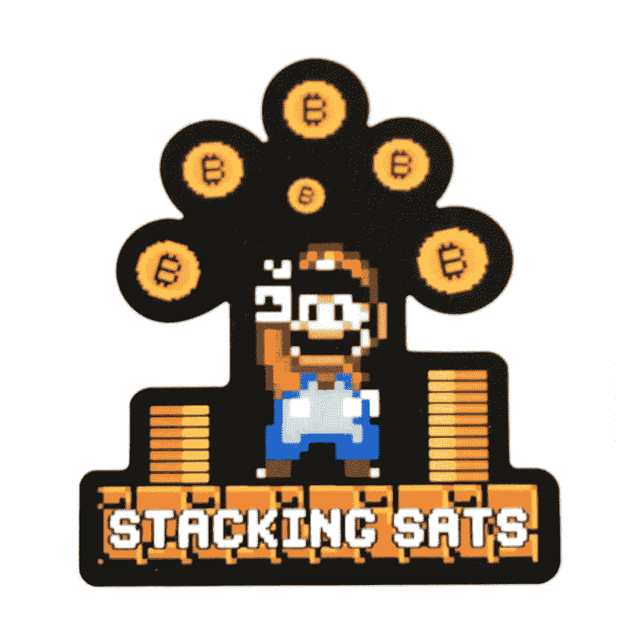
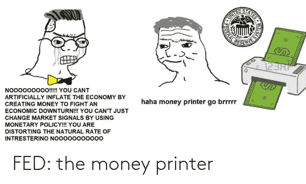
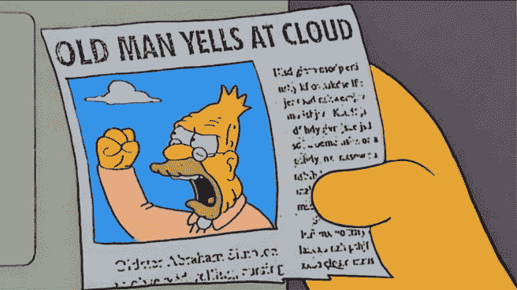
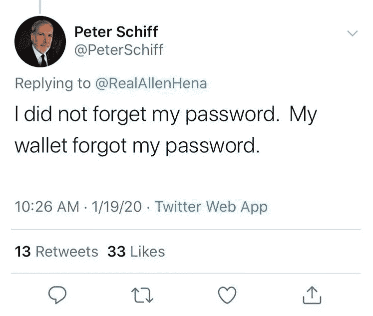
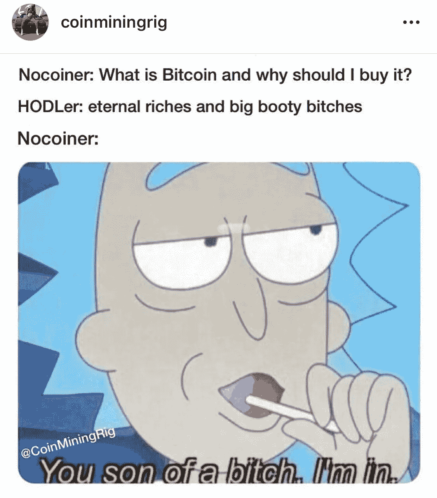
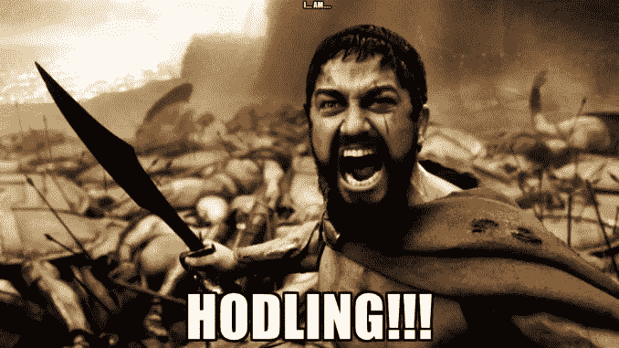
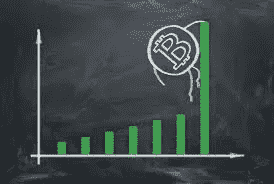

# 比特币红起球:最简单有效的方法

> 原文：<https://medium.com/coinmonks/bitcoin-red-pilling-the-easiest-and-most-effective-way-e113bb087db1?source=collection_archive---------0----------------------->

# 迷因

伟大的迷因艺术有可能吸引大众，即使他们没有意识到。允许他们在机会出现时首次轻松购买比特币。不仅如此，它还告诉他们当前的金融体系有多糟糕。各种各样的迷因可以在网上获得数亿到数十亿的浏览量，几乎每个人都在更新它们。实际上，世界上的每个人都以某种方式形成迷因，并且每个人都在互联网上，我们从未有过更好更容易的机会来红丸大众。

在整篇文章中，我将向你展示一些迷因，它们要么起源于比特币社区，要么是比特币社区帮助推动了主流规范。这些迷因帮助比特币社区生存和繁荣，给了我们很大的希望，它也可以为任何新来者做同样的事情。这些迷因是传奇的、有效的、全面的信息。

# 堆叠 sat

“什么是 sat？”一个正常人可能会问:你回答“这是比特币的最小单位！来，我们去喝杯咖啡，我会告诉你一切的”。Matt Odell 创造了堆积 sat，并成为了社区中的一个标志性的迷因。无论你去比特币推特的哪个地方，你都会看到一张某人堆积 sat 成绩的截图。从来不卖，只会越积越多。堆叠 sat 有助于澄清，是的，你不必购买完整的比特币。你最多可以购买一整亿枚比特币中的一枚。这有助于缓解新手进入比特币的过程，使其不那么可怕，因为他们不必投入太多就能拥有任何东西。比特币制造者可以完全按照自己的节奏进行，没有人会因为他们堆积的 sat 数量而感到羞愧。现在的比特币爱好者喜欢看到新人湿了脚然后离开 0。人们可以把堆积 sat 看作是一种游戏，一种储蓄游戏！把这个虚拟硬币堆得越高越好，看着你的净值随着时间的推移而上升。“真好，今天是发薪日！我要积累一些 sat。

# 印钞机走 BRRR

这个迷因起源于比特币社区，但尚不清楚是谁创造了它。然而，这是一个迷因，可以成为各种人对比特币的巨大驱动力。这个迷因是冠状病毒流行的结果。全球数百万人失业，导致政府用直升机撒钱。字面意思是印大量的钱给他们的公民，希望他们能够消费并振兴经济。美联储已经公开表示，他们可以也将会想印多少就印多少，并且对新货币的发行绝对没有限制。这造成了经济问题，如通货膨胀和迫在眉睫的恶性通货膨胀。

我最喜欢这个迷因的部分是它让人们质疑政府。我记得我告诉我母亲关于 1200 美元的经济刺激方案，她告诉我“他们怎么支付这个？这说不通，他们怎么能这样做呢？!"。然后她继续深入研究，试图找到问题的答案。这个人以前从未质疑或研究过这些东西。这个迷因真的让人们思考谁是美联储，为什么他们负责货币供应。为什么停在 1200 美元？为什么不是一万美元？为什么不是 10 万美元？为什么不是一百万美元？

# 好的，布玛儿

啊，到目前为止最著名的迷因来自这个社区。这个宝石是从人们在推特上追踪彼得·希夫开始的。希夫是一个苛刻的比特币评论家，他不断试图以任何方式抨击比特币。如果你不知道，希夫拥有自己的公司，他在那里出售黄金，这可以被视为比特币的竞争对手。这两种货币都是硬通货，随着人们寻找安全的避风港来储存他们的价值，它们将从法定货币崩溃中获益匪浅。希夫是一位非常聪明的经济学家，你可以从他身上学到很多东西，但他拒绝接受比特币，他的高龄也帮不了他。

希夫曾在推特上为自己的比特币钱包如何“忘记”密码而左右为难。故事是这样的，他在手机上使用钱包应用程序，并通过更新被注销。他不仅忘了写下自己的种子，还把自己的安全密码错当成了自己的密码。这些代价高昂的错误导致他失去了他拥有的比特币，也损害了他的信誉。在奥地利经济和稳健货币方面，他是一个非常聪明的人，但在技术方面却不是。很自然地，OK Boomer 迷因许多人在他所有的比特币帖子下跟踪他而诞生。

这个迷因不一定是针对比特币的，但它确实给我们上了宝贵的一课。人们被教导要永远尊重他们的长辈，我同意这一点，因为他们可以传递宝贵的知识。但是仅仅因为你尊敬长者，并不意味着你必须同意他们。老年人是聪明的，但他们确实缺乏甚至一个青春期前的孩子都会精通的严格的技术知识。因此，婴儿潮一代可能很难应对比特币等复杂的想法，尤其是在他们的政府几乎控制了货币和其他一切的生活之后。对不了解情况的婴儿潮一代开点小玩笑是可以的，这毕竟只是个玩笑！

# 6.15 BTC

这个时间线经典不是别人，正是堆叠传奇人物[美国人 HODL](https://twitter.com/hodl_american?s=20) 创造的。我完全不知道是什么灵感导致了这个迷因的产生，也不知道它是如何发生的，但它确实对比特币社区产生了积极的影响。这个迷因已经驱使个人去堆叠 sat(这里是双重迷因，它们是齐头并进的！)尽他们所能去收获获得它的回报。你可能会问这些奖励是什么？嗯，他们是永恒的财富和大咪咪母狗当然！拥有 6.15 英镑的 BTC 是一项巨大的成就，很可能会让你在 10 年后成为自己的财富阶层。特别是因为采矿奖励每四年减半，随着时间的推移，这一目标越来越难实现。

这是一种有趣而友好的方式来鼓励新人进入比特币。当我说它鼓励人们堆积更多的 sat 时，我不是在开玩笑。这个迷因已经出现好几个月了，我仍然看到网上到处都有人在使用它，我也用它和我的朋友开玩笑。人们显然知道这是一个玩笑，它并不能保证你这些事情(或者不是吗？)但人们已经把拥有 6.15 BTC 定为要达到的个人目标。因为这是一个非常好的拥有量，并给予他们未来购买力的巨大增长。如果一个朋友问你为什么他们应该买比特币，而你说“永恒的财富和大咪咪婊子”，我怀疑他们会拒绝！

# HODL

Hodl 代表“珍惜生命”，当谈到比特币的波动性时，我不能强调它的重要性。这个迷因是由一名在线比特币用户在输入“持有”时无意中拼成“HODL”而产生的，由此，这个迷因诞生了。可以说是整个比特币社区中最常用的迷因之一。霍德勒是比特币的支柱，让它不至于暴跌至 0 美元。霍德勒是典型的那些真正被红药丸打倒的人，导致他们从那些害怕价格下跌的弱者手里买下所有便宜的 sat。霍德勒手握重权，愿意安然度过比特币带来的所有波动。

霍德林对拒绝接受适当教育或根本不接受教育的人很不友好。没有受过教育的人(狗屎铸币者和寻找快速致富方案的人)总是被比特币的波动性打败，最终以低于买入时的价格卖出。如果你在这个市场上没有耐心，你会被激怒，你将无法生存。同样，从长远来看，除了比特币之外，你不可能持有任何其他东西而不贬值(BTC 方面)，所以持有任何替代比特币都没有意义。

霍德林比特币给参与者带来了大量的绿色蜡烛和愉悦的感觉。只要你知道，你(到目前为止基于价格历史)保证已经从你的比特币中赚钱了。但是霍德林不仅适用于价格下跌的时候，也适用于价格上涨的时候。如果你赚了很多钱，想卖掉一点来奖励自己，那很好，随你的便。但请注意，当你回购时，你可能会以更高的价格买入，导致你拥有的比特币更少。你也要记得为什么我们首先要用比特币。我不想要任何肮脏的菲亚特，我也不会卖掉我的任何比特币。积累，HODL，只花。千万不要卖菲亚特。

# 橙色硬币好数字上升

最后，当然也是最重要的，是我个人最喜欢的“橙色硬币好数字上升”。目前还不清楚是谁开创了这个迷因，但它已经在 twitter 上成为粉丝的最爱有一段时间了。模因就像听起来那么简单，橙币(比特币)好，数字(价格)上去。它的滑稽和简单真的使得这个迷因能够引起正常人的注意。为什么？因为这是所有新手第一次进入时真正需要知道的。

这种迷因让人们看涨，数字上升是驱使人们进入比特币的最有效方式。这些年来，在繁荣和萧条的循环中，当数字上升时，人们争先恐后地试图获得一些甜橙硬币。抬高价格，制造更多好奇的霍德勒。价格的上涨也让更多的钱被用于围绕比特币建设基础设施，并让霍德勒夫妇更加富裕，让他们想要更多。所以很明显，想要橙色硬币的人越多，价格就越便宜。

# 总而言之

毫无疑问，迷因是在他们甚至没有意识到的情况下将红丸规范引入比特币的途径。比特币有如此陡峭的学习曲线，不太可能让大多数人在没有任何研究的情况下理解它。许多人在忙碌的生活中没有时间研究和教育自己这方面的东西，所以迷因可以以一种有趣的方式给他们教育。

感谢您在百忙之中抽出时间来阅读本文，我真的很感激！祝你愉快，兄弟们。

> [在您的收件箱中直接获得最佳软件交易](https://coincodecap.com/?utm_source=coinmonks)

