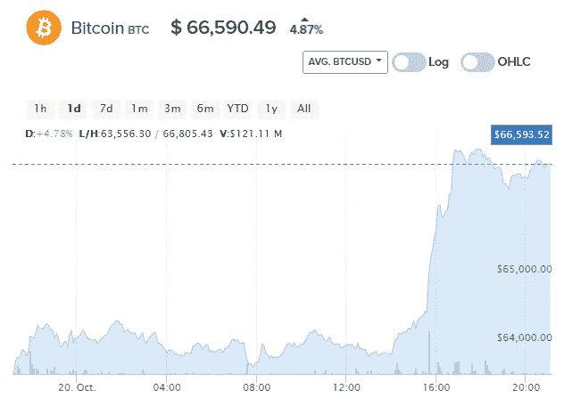
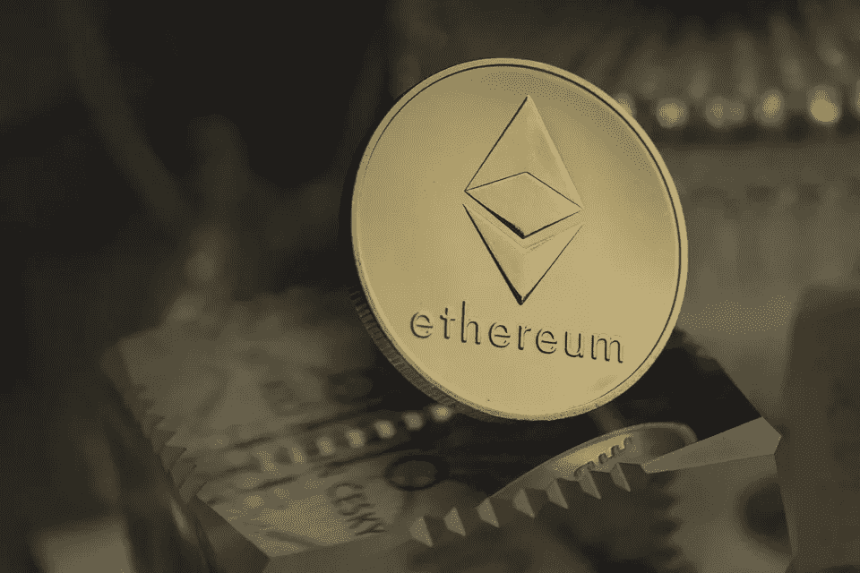

# 比特币崛起并惠及这三种加密货币:原因何在

> 原文：<https://medium.com/coinmonks/bitcoin-rises-and-benefits-these-3-cryptocurrencies-the-reasons-why-cabc57ec33cf?source=collection_archive---------7----------------------->

比特币(BTC)是整个加密生态系统中第一种也是最有价值的加密货币，目前价格为 61，000 美元，并有望达到最近的历史最高水平。

市场分析师表示，比特币的价格上涨可能会导致“替代季”，这是一种当替代币增长的比例高于比特币增长时出现的现象。

除比特币之外的所有数字资产都被称为“替代币”或替代加密货币。

为了分析可能的替代季节，专家们查看了比特币优势图表，简而言之，该图表标志着替代加密货币的行为取决于比特币价格的走势。

Bitcoin Dominance Graph

如果比特币的统治地位下降，替代币就会涨价。相反，如果比特币的统治地位增长，altcoins 的市值就会下降。

比特币统治的周期及其对加密货币市场的影响可以在下图中更详细地看到:

Bitcoin dominance.

altseason 为什么会发生？比特币巨鲸，即拥有大部分数字资产的投资者，以低价购买这种流行的加密货币。

然后，他们等待比特币升值，并将其出售给那些不想被抛在后面的中小投资者，从中获利。

接下来，鲸鱼将回报注入替代硬币，再次吸引比特币鱼购买这些替代加密货币，因为它们的价格开始上涨。

再次，鲸鱼卖出获利，低价重新进入比特币。

根据 TradingView 平台上可以找到的各种分析，用户认为“替代硬币接近爆炸”，投资者敦促想投资的人现在就投资，以免价格呈指数级上涨。

# 每个人都应该看(和买)的 3 种替代硬币

## **ETH**

以太网(ETH)是仅次于 BTC 的最重要的加密货币，因此它在最畅销的加密货币排名中位居第二也就不足为奇了。

以太坊数字资产今天的交易价格为 3751 美元，上周上涨了 5%。

## **露娜**

特拉区块链拥有自己的加密货币 LUNA，交易价格为 35.73 美元。

创建这种数字资产的目的是稳定其他稳定的加密货币的价格，这些货币与美元一对一配对，来自在区块链上运行的流动性池。

## BNB

根据 CoinMarketCap 的数据，币安交易所的官方加密货币币安币是投资者最喜欢的替代货币之一，目前在整个生态系统中排名第三。

在过去的七天里，它的收益为 14.77%，价格在 477 美元左右波动。

> 加入 Coinmonks [电报频道](https://t.me/coincodecap)和 [Youtube 频道](https://www.youtube.com/c/coinmonks/videos)了解加密交易和投资

## 另外，阅读

*   [币安 vs FTX](https://blog.coincodecap.com/binance-vs-ftx) | [最佳(SOL)索拉纳钱包](https://blog.coincodecap.com/solana-wallets)
*   [如何在 Uniswap 上交换加密？](https://blog.coincodecap.com/swap-crypto-on-uniswap) | [喜美元评论](https://blog.coincodecap.com/hi-dollar-review)
*   [3 commas vs . Pionex vs . crypto hopper](https://blog.coincodecap.com/3commas-vs-pionex-vs-cryptohopper)
*   [币安 vs 北海巨妖](https://blog.coincodecap.com/binance-vs-kraken) | [美元成本平均交易机器人](https://blog.coincodecap.com/pionex-dca-bot)
*   [新加坡十大最佳加密交易所](https://blog.coincodecap.com/crypto-exchange-in-singapore) | [购买 AXS](https://blog.coincodecap.com/buy-axs-token)
*   [投资印度的最佳密码](https://blog.coincodecap.com/best-crypto-to-invest-in-india-in-2021) | [HitBTC 评论](/coinmonks/hitbtc-review-c5143c5d53c2)
*   [加拿大最好的加密交易机器人](https://blog.coincodecap.com/5-best-crypto-trading-bots-in-canada) | [赌注加密](https://blog.coincodecap.com/staking-crypto)
*   [如何在印度购买比特币？](/coinmonks/buy-bitcoin-in-india-feb50ddfef94) | [WazirX 评论](/coinmonks/wazirx-review-5c811b074f5b)
*   [比特币主根](https://blog.coincodecap.com/bitcoin-taproot) | [Bitso 评论](https://blog.coincodecap.com/bitso-review) | [排名前 6 的比特币信用卡](/coinmonks/bitcoin-credit-card-bc8ab6f377c6)
*   [最佳免费加密信号](https://blog.coincodecap.com/free-crypto-signals) | [YoBit 评论](/coinmonks/yobit-review-175464162c62) | [Bitbns 评论](/coinmonks/bitbns-review-38256a07e161)
*   【Huobi 的加密交易信号 | [BitMEX 评论](https://blog.coincodecap.com/bitmex-review)
*   [7 个最佳零费用加密交换平台](https://blog.coincodecap.com/zero-fee-crypto-exchanges) | [硬件钱包](/coinmonks/hardware-wallets-dfa1211730c6)