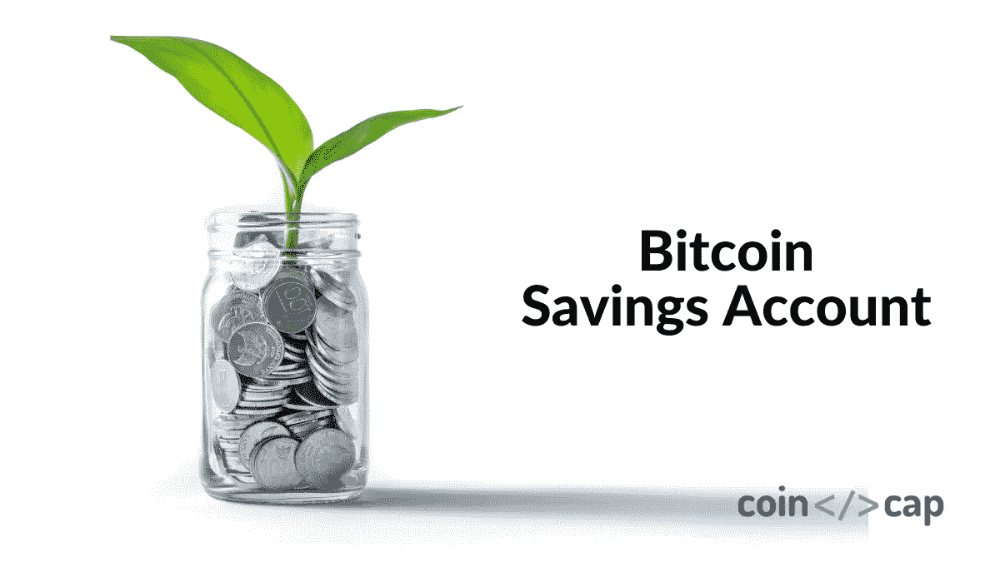
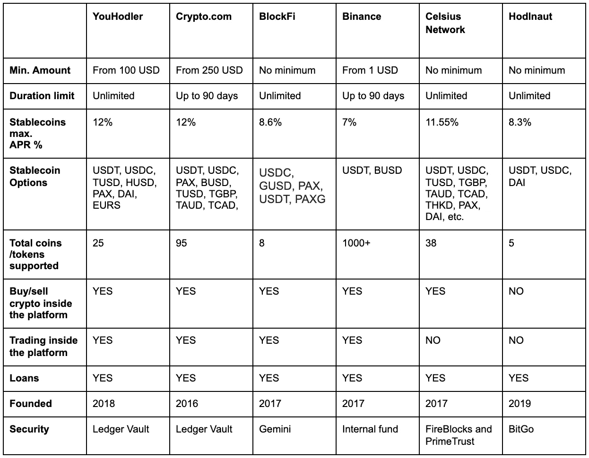
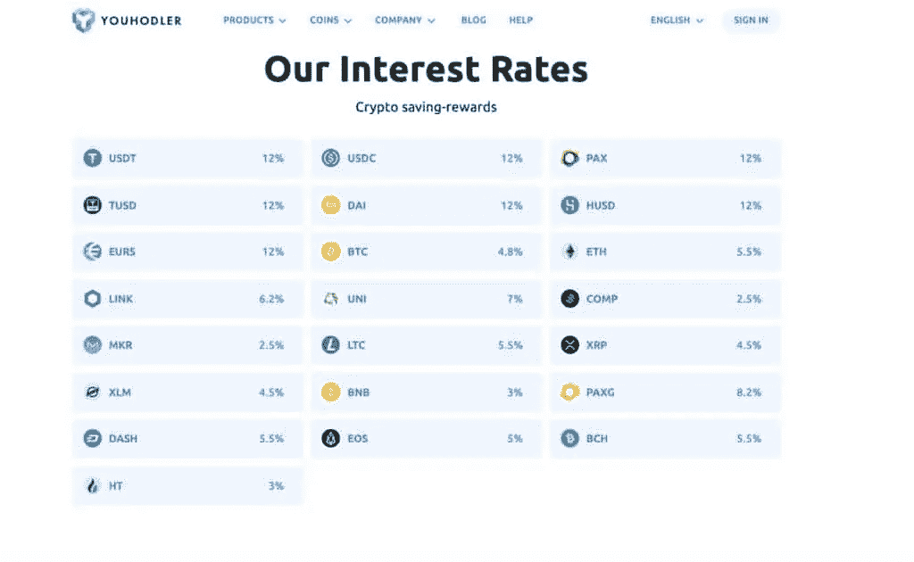
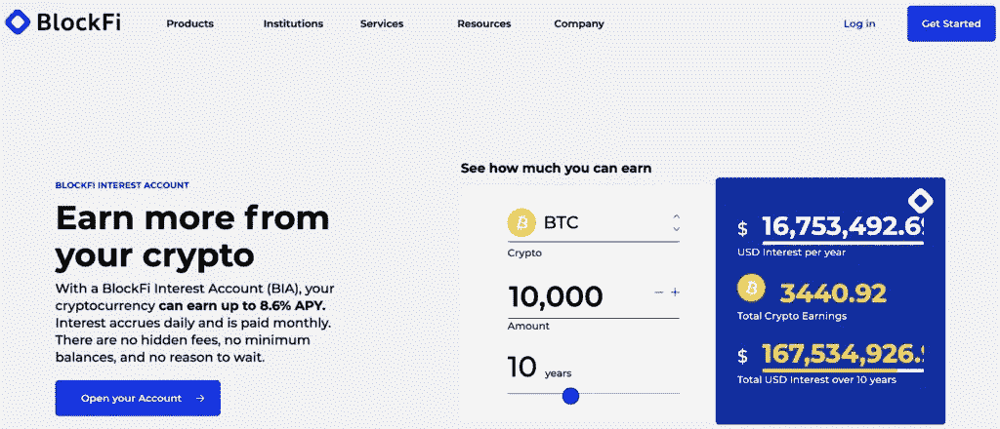
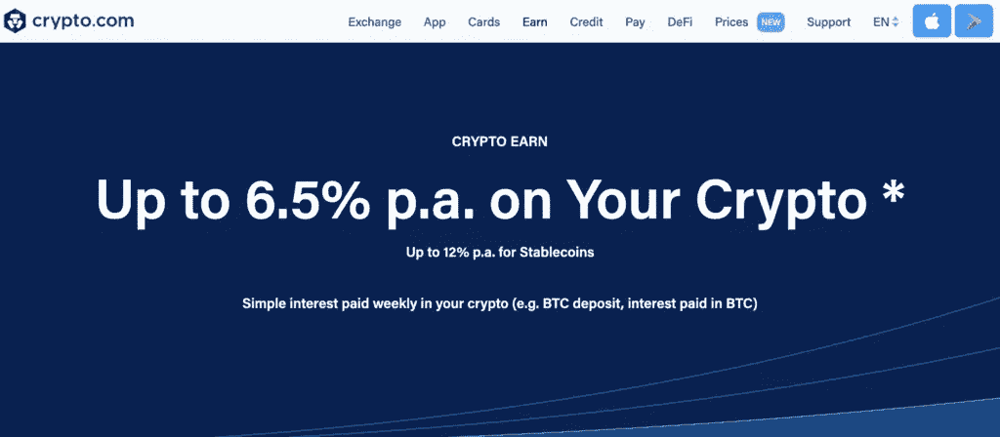
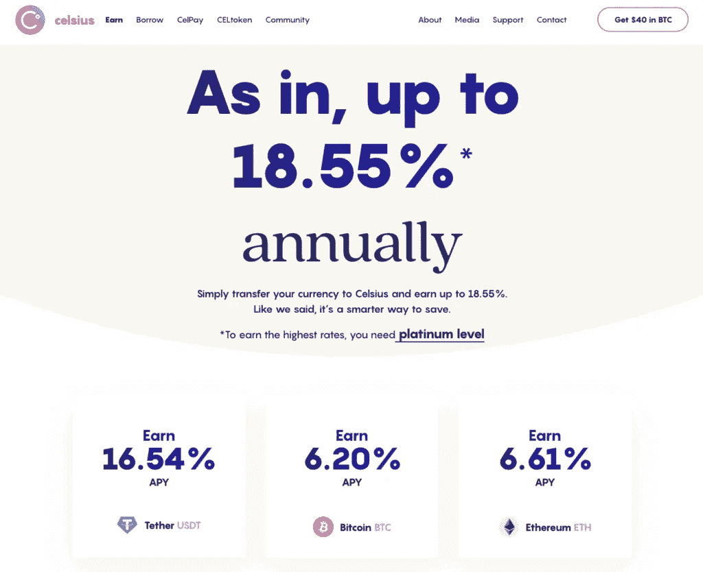
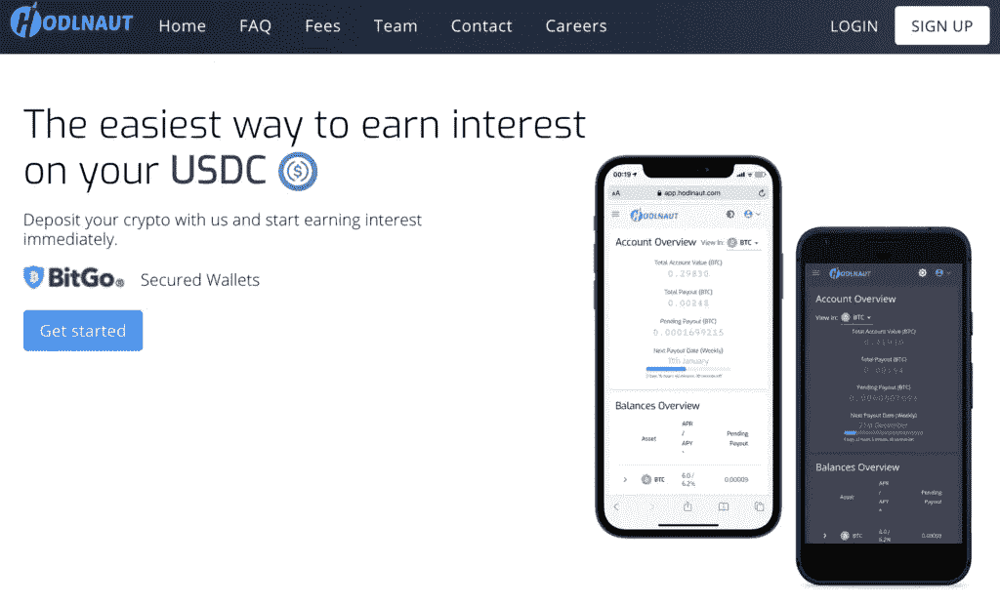

# 6 2021 年最佳比特币储蓄账户

> 原文：<https://medium.com/coinmonks/bitcoin-savings-account-e65b13f92451?source=collection_archive---------4----------------------->

## 开立加密储蓄账户并赚取利息

今年，银行的传统储蓄账户面临着激烈的竞争。随着 [DeFi](https://blog.coincodecap.com/the-ultimate-guide-to-defi-decentralized-finance) 平台和创新金融科技初创公司的崛起，人们正在寻找更好的方法，利用加密货币储蓄账户以安全、稳定的方式提高投资回报。但是哪一个是最好的呢？

有几十个比特币储蓄账户可供选择，但在开始之前，人们应该了解每个选项的利弊，以及加密平台相对于传统银行账户带来的风险。一旦你有了这方面的坚实知识，你就能够利用这项新技术，并获得被动收入。

这张表比较了这些公司最有趣的特点。请阅读以下内容，了解每家公司的更多详细信息。

# 银行 vs 比特币储蓄账户

虽然加密项目提供比传统银行高得多的利率，但它们仍然缺乏银行传统储蓄账户的一些关键功能。以下是几个主题以及这两个选项的不同之处:

## 资金获取

使用传统的银行账户，你储蓄账户里的钱是你的，但它被存在银行里，有时，银行用这笔钱借给其他客户。类似的事情也发生在一些加密储蓄账户中。你的密码被借给别人了。作为交换，该平台承诺为你借给他们的密码支付高额利息。无论哪种选择，你都可以随时取款。

## 保险

根据你生活在世界的哪个地方，你的银行会提供某种保险。[例如，联邦存款保险公司(FDIC)的保险价格为 25 万美元，甚至还有高于这一价格的选项。](https://www.fdic.gov/)

加密平台不像 FDIC 那样有联邦保险。然而，他们中的一些确实提供保护你的资金的私人保险。并不是所有的私人保险公司都很好，所以你应该去找那些与 Ledger Vault 合作的公司，因为它是最有信誉的。

## 利率

比特币储蓄账户的利率通常比你在银行看到的利率高 4-8%。这明显高于银行，因为加密融资的供给和需求以这种方式驱动利率。

## 撤回

从储蓄账户中取款时，银行有一些限制。例如，有些银行限制你每月只能取款六次。然而，许多加密平台可以让你在任何时候取钱，而且没有罚款。

## 复利

一些银行提供储蓄账户的复利，一些加密平台也是如此。如果复利是你想要的，那么确保你找到了你感兴趣的平台。

## 安全性

这可能是要考虑的最重要的部分。银行很难被攻破，你也不太可能在银行里丢失你的资金。也就是说，现代的加密平台也非常安全。丢失密码不再仅仅是丢失手机的问题。

大多数比特币储蓄账户都配备了[多因素认证](https://en.wikipedia.org/wiki/Multi-factor_authentication)，以确保除了你之外没有人可以访问你的账户。虽然黑客事件对一些较弱的平台来说仍然是一个问题，但备受瞩目的平台正在投入大量资金来防止这种黑客攻击。

# 最好的比特币储蓄账户有哪些？

现在，我们已经对加密储蓄账户相对于传统银行的工作原理有了一些介绍，让我们看看市场上最热门的比特币储蓄账户。下面，你会看到我们的建议。要了解每家公司的更多信息，只需点击链接，你就会被引导到他们的登录页面。

## 1.尤霍德勒

总部位于欧洲的金融科技平台不仅仅是一个比特币储蓄账户。除了 20+种其他加密货币外，客户还可以在比特币上获得 4.8%的收益(复利)。T2 优豪德勒银行提供的最高利率是 12%。

除了储蓄账户，YouHodler 还提供加密贷款、通用货币转换和加密乘法工具，如涡轮贷款和多 HODL。

所有这些都封装在一个外观漂亮、易于使用、最重要的是安全的平台中。 [YouHodler 的](https://blog.coincodecap.com/go/youhodler)安全性是顶级的，为客户提供 3 因素身份验证，并从受人尊敬的总账金库中提供 1.5 亿美元的犯罪保险。

这是唯一一个为他们的每一种加密货币和稳定货币提供利息收入潜力的平台，也是唯一一个收费低至 0.5%的通用加密转换平台。该团队定期举办网络研讨会和“AMA”活动，社区非常活跃，欢迎新用户。

阅读我们全面的 [YouHodler 评论](/coinmonks/youhodler-4-easy-ways-to-make-money-98969b9689f2)以了解更多关于该平台的信息。

## 2.BlockFi

对于美国公民来说， [BlockFi](https://blog.coincodecap.com/go/blockfi) 是一个受欢迎的选择，因为除了加密货币之外，它还支付美元利息。BlockFi 有趣的地方在于，它会借出客户的美元来购买以太坊等流行的加密货币。如果这让你不舒服，那么你可能需要去别处看看。

[BlockFi](https://blog.coincodecap.com/go/blockfi) 的主要吸引力在于其用户友好的加密方式。初学者可以轻松浏览网站，注册并开始赚取加密货币的利息，同时获得美元支付。为了保险起见，BlockFi 使用[双子](https://blog.coincodecap.com/go/gemini)托管，这意味着你的资金存储在[双子](https://blog.coincodecap.com/go/gemini)而不是 BlockFi 上。这不是传统意义上的“保险”,但这是朝着安全的正确方向迈出的一步。我们建议阅读 [BlockFi 评论](/coinmonks/blockfi-review-53096053c097)以了解更多关于该平台的信息。

## 3.Crypto.com

[Crypto.com](https://blog.coincodecap.com/go/crypto-com)是最受欢迎的加密贷款平台[之一，提供市场上最高的利率。然而，要得到这些利率，必须遵循一些特定的条款。如果你是一个投资组合规模较小的投资者，你可能会想看看其他地方，以获得稳定的回报。](https://blog.coincodecap.com/top-5-crypto-lending-platforms)

目前平台对 20+加密货币和 [Stablecoins](https://blog.coincodecap.com/stablecoins-a-simple-overview) 支付利息，利息按日计算。为了获得最高收益率，你需要在平台上持有你的资金至少 90 天。

## 4.币安

[币安](https://blog.coincodecap.com/go/binance)并不是因为他们的比特币储蓄账户而出名，但在过去的一年里，他们已经悄然攀升，现在是最热门的选择之一。[币安](https://blog.coincodecap.com/go/binance)储蓄工作原理如下。客户将他们的资产借给平台上的保证金交易者，然后平台将利息还给你，作为让他们借你资金的“感谢”。

有各种各样的选项可供选择，如以太坊(ETH)、比特币(BTC)、[币安](https://blog.coincodecap.com/go/binance)美元(BUSD)等等。[币安借贷](https://www.binance.com/en/lending)有两个产品(定期和灵活存款)。灵活存款让你可以随时提取资金，而且利率会随着时间的推移而变化。它很灵活(因此得名)。对于想要更稳定的人来说，定期存款在一段时间内会给你相同的利率。

币安的传统保险政策不涵盖基金。相反，币安表示，在紧急情况下，所有交易费用的 10%将支付给用户。

## 5.摄氏网络

[Celsius](https://blog.coincodecap.com/go/celsiusnetwork) 是一款点对点加密借贷应用，它的本地令牌(CEL)获得了相当大的关注。从兴趣上来说，入门开个比特币储蓄账户还是挺容易的。用户只需要存款，然后 Celsius network 开始每周支付利息，直到你取款(随时都可以)。摄氏度的主要问题是低利率和透明度。

为了获得平台上宣传的高利率，用户必须首先购买平台的 CEL 令牌并持有它。要获得这些高利率，您的投资组合中必须始终有 15%以上是 CEL 代币。至于安全性， [Celsius](https://blog.coincodecap.com/go/celsiusnetwork) 不再使用 BitGo 作为他们的托管提供商。取而代之的是，现在用防火砖和信托基金来保管和保险。

## 6.霍德瑙特

[Hodlnaut](https://blog.coincodecap.com/go/hodlnaut) 是一个基于新加坡的加密货币生息和[加密借贷平台](https://blog.coincodecap.com/top-5-crypto-lending-platforms)。它们在五个资产类别上提供高达 8.3%的 APY，没有锁定期或最低存款额，Hodlnaut 是提高加密爱好者加密资产生产率的一个不错的选择。

目前， [Hodlnaut](https://blog.coincodecap.com/go/hodlnaut) 支持比特币(BTC)、以太坊(ETH)、戴(Dai)、美元币(USDC)、系绳(USDT)。至于安全性，Hodlnaut 使用 BitGo 作为他们的托管提供商。

但与其他平台相比，这个数量的硬币似乎不够。此外，没有移动应用程序，只有一个网站，没有购买或出售平台内的加密选项。阅读我们的 [Hodlnaut 评论](https://blog.coincodecap.com/hodlnaut-review)以了解关于该平台的更多信息。

# 结论:最好的比特币储蓄账户是什么？

最好的比特币储蓄账户混合了高利息、没有“营销噱头”、某种形式的保险单、许多赚取利息的选项，当然还有钱包安全。一些平台有一些这样的元素，但我们认为 [YouHodler](https://blog.coincodecap.com/go/youhodler) 和 [BlockFi](https://blog.coincodecap.com/go/blockfi) 有完整的包。

客户可以获得高达 12%的利率，而不必购买平台令牌，同时享受 YouHodler 的大量加密金融功能。它由 Ledger Vault 的保险支持这一事实也是一个巨大的奖励，该团队的 24/7 客户支持和社区互动当然也很温暖人心。

另一方面，BlockFi 有风险投资的支持，为美国客户提供了很好的服务。

但是不要相信我们的话。给所有这些平台一个尝试，让我们知道你的想法！

> 加入 Coinmonks [Telegram group](https://t.me/joinchat/EPmjKpNYwRMsBI4p) 学习加密交易和投资

## 另外，阅读

*   什么是[闪贷](https://blog.coincodecap.com/what-are-flash-loans-on-ethereum)？
*   最好的[密码交易机器人](/coinmonks/crypto-trading-bot-c2ffce8acb2a) | [网格交易](https://blog.coincodecap.com/grid-trading)
*   [3 商业评论](/coinmonks/3commas-review-an-excellent-crypto-trading-bot-2020-1313a58bec92) | [Pionex 评论](/coinmonks/pionex-review-exchange-with-crypto-trading-bot-1e459d0191ea) | [Coinrule 评论](https://blog.coincodecap.com/coinrule-review-a-perfect-trading-bot)
*   [AAX 交易所评论](/coinmonks/aax-exchange-review-2021-67c5ea09330c) | [德里比特评论](/coinmonks/deribit-review-options-fees-apis-and-testnet-2ca16c4bbdb2) | [FTX 交易所评论](/coinmonks/ftx-crypto-exchange-review-53664ac1198f)
*   [n rave 零点回顾](/coinmonks/ngrave-zero-review-c465cf8307fc) | [Phemex 回顾](/coinmonks/phemex-review-4cfba0b49e28) | [PrimeXBT 回顾](/coinmonks/primexbt-review-88e0815be858)
*   [by bit Exchange Review](/coinmonks/bybit-exchange-review-dbd570019b71)|[bit yard Review](https://blog.coincodecap.com/bityard-reivew)|[coin spot Review](https://blog.coincodecap.com/coinspot-review)
*   [3 commas vs crypto hopper](/coinmonks/3commas-vs-pionex-vs-cryptohopper-best-crypto-bot-6a98d2baa203)|[赚取加密利息](/coinmonks/earn-crypto-interest-b10b810fdda3)
*   最好的比特币[硬件钱包](/coinmonks/the-best-cryptocurrency-hardware-wallets-of-2020-e28b1c124069?source=friends_link&sk=324dd9ff8556ab578d71e7ad7658ad7c) | [BitBox02 回顾](/coinmonks/bitbox02-review-your-swiss-bitcoin-hardware-wallet-c36c88fff29)
*   [莱杰 vs n 格拉夫](https://blog.coincodecap.com/ngrave-vs-ledger) | [莱杰 nano s vs x](https://blog.coincodecap.com/ledger-nano-s-vs-x)
*   [加密副本交易平台](/coinmonks/top-10-crypto-copy-trading-platforms-for-beginners-d0c37c7d698c) | [比特码副本交易](https://blog.coincodecap.com/bityard-copy-trading)
*   [Vauld Review](https://blog.coincodecap.com/vauld-review)|[you hodler Review](/coinmonks/youhodler-4-easy-ways-to-make-money-98969b9689f2)|[BlockFi Review](/coinmonks/blockfi-review-53096053c097)
*   最好的[加密税务软件](/coinmonks/best-crypto-tax-tool-for-my-money-72d4b430816b) | [硬币追踪评论](/coinmonks/cointracking-review-a-reliable-cryptocurrency-tax-software-5114e3eb5737)
*   最佳[密码借贷平台](/coinmonks/top-5-crypto-lending-platforms-in-2020-that-you-need-to-know-a1b675cec3fa) | [杠杆令牌](/coinmonks/leveraged-token-3f5257808b22)
*   [莱杰纳米 S vs 特雷佐 one vs 特雷佐 T vs 莱杰纳米 X](https://blog.coincodecap.com/ledger-nano-s-vs-trezor-one-ledger-nano-x-trezor-t)
*   [BlockFi vs Celsius](/coinmonks/blockfi-vs-celsius-vs-hodlnaut-8a1cc8c26630)|[Hodlnaut 回顾](https://blog.coincodecap.com/hodlnaut-review)
*   [Bitsgap 审核](/coinmonks/bitsgap-review-a-crypto-trading-bot-that-makes-easy-money-a5d88a336df2) | [Quadency 审核](/coinmonks/quadency-review-a-crypto-trading-automation-platform-3068eaa374e1)
*   [埃利帕尔泰坦评论](/coinmonks/ellipal-titan-review-85e9071dd029) | [赛克斯斯通评论](https://blog.coincodecap.com/secux-stone-hardware-wallet-review)
*   [DEX Explorer](https://explorer.bitquery.io/ethereum/dex)|[w](https://explorer.bitquery.io/graphql)|[local bitcoins 评论](https://blog.coincodecap.com/localbitcoins-review)
*   最佳[区块链分析](https://bitquery.io/blog/best-blockchain-analysis-tools-and-software)工具| [赚比特币](https://blog.coincodecap.com/earn-bitcoin)
*   [加密套利](/coinmonks/crypto-arbitrage-guide-how-to-make-money-as-a-beginner-62bfe5c868f6)指南:新手如何赚钱
*   最佳[加密制图工具](/coinmonks/what-are-the-best-charting-platforms-for-cryptocurrency-trading-85aade584d80) | [最佳加密交易所](/coinmonks/crypto-exchange-dd2f9d6f3769)
*   [如何在印度购买比特币](https://blog.coincodecap.com/buy-bitcoin-app-india)？
*   [印度比特币交易所](/coinmonks/bitcoin-exchange-in-india-7f1fe79715c9)
*   了解比特币最好的[书籍有哪些？](/coinmonks/what-are-the-best-books-to-learn-bitcoin-409aeb9aff4b)

> [直接在您的收件箱中获得最佳软件交易](/coinmonks/newsletters/coinmonks)

*原载于 2021 年 2 月 18 日 https://blog.coincodecap.com**[*。*](https://blog.coincodecap.com/bitcoin-savings-account)*