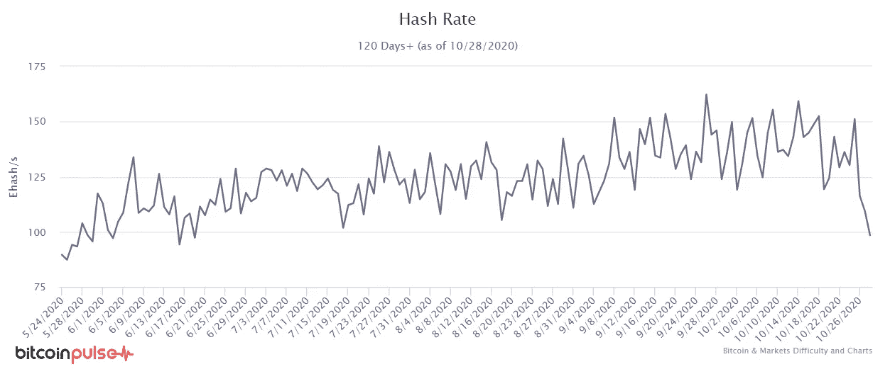
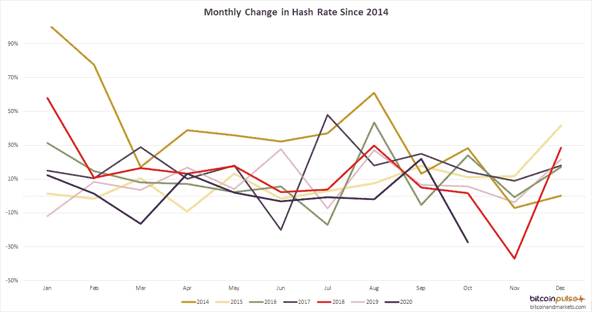
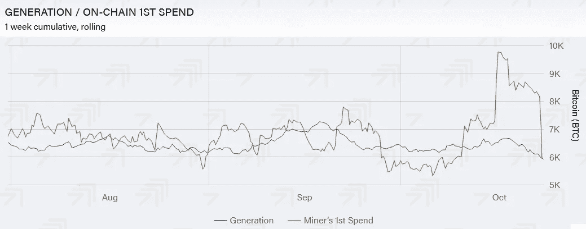

# 比特币季节性杂凑率

> 原文：<https://medium.com/coinmonks/bitcoin-seasonal-hash-rate-60c890c853b0?source=collection_archive---------2----------------------->

最初发表于[btcm.co](https://btcm.co/)

过去一周，比特币杂凑率大幅下降，但我们应该担心吗？是网络薄弱还是受到了某种攻击？又会对价格产生怎样的影响？让我们快速描述一下采矿，上周发生了什么，看看是否有其他数据可以用来评估这种情况。

这些年来，比特币挖矿变得非常专业。今天，对于一个行业的新进入者来说，筹集 1 亿美元或更多的资金来启动这个行业 [**并不是没有听说过**](https://news.bitcoin.com/digital-currency-group-pledges-100-million-to-bolster-bitcoin-mining-industry/) 。该行业有几种类型的成本，芯片和采矿设备，租金，互联网连接，劳动力和电力。大规模成功运营比特币挖矿业务有很多因素，但最重要的可能是最后列出的成本，即电费。

比特币挖矿是一个能源密集型的过程。专门建造的下一代芯片用于每秒进行千万亿次计算。他们正在尝试猜测一个非常困难的随机数。捷径已经被设计淘汰了。矿工们唯一的选择就是强行猜测。更多的猜测需要更多的芯片，需要更多的冷却，更熟练的操作员，一切都需要更多的能量。

比特币挖矿一上台就是一头猪。事实上，这是对其最大的批评之一——“采矿消耗太多能源。”批评者不明白的是，比特币挖矿取代了许多行业的需求。例如，我们不再需要昂贵的、费用驱动的和腐败的金融业。

[比特币](https://blog.coincodecap.com/a-candid-explanation-of-bitcoin)还能捕获多余的能量。这是发电厂在非高峰时段保持系统高效运行所必须产生的能量。例如，一个 1000 兆瓦的发电厂在其最大输出或接近最大输出时运行效率最高。如果需求在非高峰时间大幅下降，工厂通常会继续以最高效率生产，只是浪费能源，因为对他们来说这样做更便宜。比特币采矿为这种废弃能源提供了一种持续且富有成效的利用方式。

最后，比特币采矿可以直接利用地下的废弃能源。石油工业排出的气体被收集并焚烧，否则会危险地排放到大气中。比特币之前之所以不能发生这种情况，是因为电力运输昂贵。比特币可以在偏远地区利用这种能量进行生产，所有矿工需要的只是一个互联网连接。比特币采矿在市场上竞争能源，并在这样做时创造了竞争力，使所有能源消费者更有效率。

# 为什么比特币哈希率在下降？

比特币挖矿速度被称为*哈希速率*，因为它进行的计算被称为哈希。散列率自然是可变的。也许一场暴风雨使一个采矿场离线 12 小时，或者一个装满机器的机架需要更换，或者你要搬到一个电费更低的新地方。哈希速率可以暂时离线的原因有很多，而且新的哈希速率也在不断增加。

即使散列率有各种变化，它几乎总是呈上升趋势。在比特币的早期，它的速度要快得多，但即使在今天，2020 年的散列率也增加了 60%以上，直到本周的下降。

散列率下降了约 1/3，这开始在比特币生态系统中引起热议，认为这可能是对网络的攻击。一个 *51%攻击*是指一个攻击者或一群攻击者获得大部分哈希速率，并恶意使用——即阻止交易通过网络。这种攻击不会伤害比特币，只是在攻击发生时不让人们交易，这非常昂贵。如果一个 51%的攻击有超过 50%的多数，比如 60%的散列率，攻击者理论上可以逆转他/她自己过去的事务，重写几分钟的数据块。

当采矿专家给出一个简单得多的解释时，袭击的谣言很快平息了。10 月 25 日，中国四川省雨季电价正式结束。

这种情况每年都会发生，但从来没有像今年这样迅速而显著地影响散列率。通常，哈希速率在八月和九月达到峰值，之后哈希速率更加稳定，甚至略有下降。然而，今年将是自 2009 年以来(比特币存在的第一年，当时仍可以在笔记本电脑上进行挖掘)10 月份最大的跌幅。

在下面的图表中，为了清楚起见，去掉了头几年的散列率数据。相反，我们使用从 2014 年开始的过去 6 年的月度变化率数据。在我们的图表中，我们可以非常清楚地观察到每年 8 月的增长和 11 月的低谷。

# 为什么今年比特币挖矿受到如此强烈的影响？

我们认为有两种不同的力量导致了今年杂凑率的快速下降。第一，比特币挖矿行业一年比一年专业。在采矿作业受到雨季能源价格影响的地方，他们在预测成本方面变得更加专业，并简化了设施的战略移动。这个雨季特别糟糕，长江上下游出现创纪录的洪水，也许矿工们准备尽快离开那里。他们可以在成本变化时关闭，搬到中国的另一个省，并在一周内开始运行。当然，我们将在未来几周内看到这一理论的预测能力。

其次，最近的价格上涨也可能是一个因素。在过去的几年里，人们假设矿工们将他们的作业分散在几个星期里，以便在任何时候都不会完全离线。然而，随着今年价格减半，价格从 3 月份的低点反弹超过 250%，矿商可能希望在市场回调之前尽可能多地开采硬币。

有证据表明，后一点与以下观点有关:矿商试图在比特币价格高企的情况下，从雨季中获取尽可能多的利润。在上周的 [**基本面报告#112**](https://bitcoinandmarkets.com/r112/) 中，我们收录了矿工*第一次花费*的图表。这是一个 7 天的滚动平均值，但明显显示出 10 月份矿工出售他们开采的硬币的大幅增加，利用了比特币价格的上涨，就在雨季结束之前，并转移了他们的设备。

# 这对价格意味着什么？

比特币开采的暂时放缓对价格有积极影响。发现块的速度更慢，这意味着每秒能够确认的事务更少。然后，比特币在全球的移动速度会更慢。如果需求不变，能够满足需求的比特币越来越少，价格就会上涨。

当区块速度较慢时，每天开采的比特币也较少。比特币被设计为平均每 10 分钟一个区块，即每天 144 个区块。每块奖励 6.25 个比特币，平均每天有 900 个比特币进入市场满足需求。然而，如果砖块慢了 10%，这意味着满足需求的新硬币将减少 10%，810 而不是 900。这听起来不是很多，但以目前 13，000 美元的市场价格计算，每天开采的比特币少了 1，170，000 美元，随着时间的推移，这个数字会增加。

如果哈希速率的下降不被市场视为暂时的，它可能会导致价格更持续的下降，因为市场对网络本身失去了信心。

我们认为，最近的价格变动，在某种程度上，是由于这种动态正在上演。但这也标志着价格在继续上涨前可能会盘整一段时间。价格上涨增加了每个人硬币的价值，这自然导致人们获利。和往常一样，市场正在寻找平衡，因此接下来的几周可能是在年底推高价格之前找到一个新的稳定价格水平的时期。

总之，比特币挖矿仍然是健康的，没有对网络进行攻击的迹象。在这种情况下，价格变动在某种程度上是可以预测的，它给了我们更多关于未来可能的价格变动的信息。希望行业专业人士能从这次经历中吸取教训，并能够将学到的经验应用到未来的运营中。

## 另外，阅读

*   最佳加密交易机器人
*   最好的比特币[硬件钱包](/coinmonks/the-best-cryptocurrency-hardware-wallets-of-2020-e28b1c124069?source=friends_link&sk=324dd9ff8556ab578d71e7ad7658ad7c)
*   [密码本交易平台](/coinmonks/top-10-crypto-copy-trading-platforms-for-beginners-d0c37c7d698c)
*   最好的[加密税务软件](/coinmonks/best-crypto-tax-tool-for-my-money-72d4b430816b)
*   [最佳加密交易平台](/coinmonks/the-best-crypto-trading-platforms-in-2020-the-definitive-guide-updated-c72f8b874555)
*   [unis WAP 最佳钱包](/coinmonks/best-wallets-to-use-uniswap-e91a6385d9e8)
*   最佳[加密贷款平台](/coinmonks/top-5-crypto-lending-platforms-in-2020-that-you-need-to-know-a1b675cec3fa)
*   [block fi vs Celsius](/coinmonks/blockfi-vs-celsius-vs-hodlnaut-8a1cc8c26630)vs Hodlnaut
*   [莱杰 vs 特雷佐](/coinmonks/ledger-vs-trezor-best-hardware-wallet-to-secure-cryptocurrency-22c7a3fd391e)
*   [德里比特评论](/coinmonks/deribit-review-options-fees-apis-and-testnet-2ca16c4bbdb2)
*   Bitsgap 评论——一个轻松赚钱的加密交易机器人
*   为专业人士设计的加密交易机器人
*   [3commas Review](https://blog.coincodecap.com/3commas-review-an-excellent-crypto-trading-bot) |一款优秀的密码交易机器人
*   [3Commas vs Cryptohopper](/coinmonks/cryptohopper-vs-3commas-vs-shrimpy-a2c16095b8fe)
*   Bitmex 保证金交易的白痴指南
*   [加密摇摆交易的权威指南](/coinmonks/the-definitive-guide-to-crypto-swing-trading-7e4af6496d4d?source=friends_link&sk=70448050bd9323b42f63bfc0bb1e60d1)
*   [Bitmex 高级保证金交易指南](/coinmonks/bitmex-advanced-margin-trading-guide-2270c195ce25?source=friends_link&sk=1d986cca731f5084b9a2db4a4bc4a7ad)
*   开发人员的最佳加密 API
*   [加密套利](/coinmonks/crypto-arbitrage-guide-how-to-make-money-as-a-beginner-62bfe5c868f6)指南:新手如何赚钱
*   顶级[比特币节点](https://blog.coincodecap.com/bitcoin-node-solutions)提供商
*   最佳[加密制图工具](/coinmonks/what-are-the-best-charting-platforms-for-cryptocurrency-trading-85aade584d80)
*   了解比特币最好的[书籍有哪些？](/coinmonks/what-are-the-best-books-to-learn-bitcoin-409aeb9aff4b)

> [直接在您的收件箱中获得最佳软件交易](https://coincodecap.com?utm_source=coinmonks)

