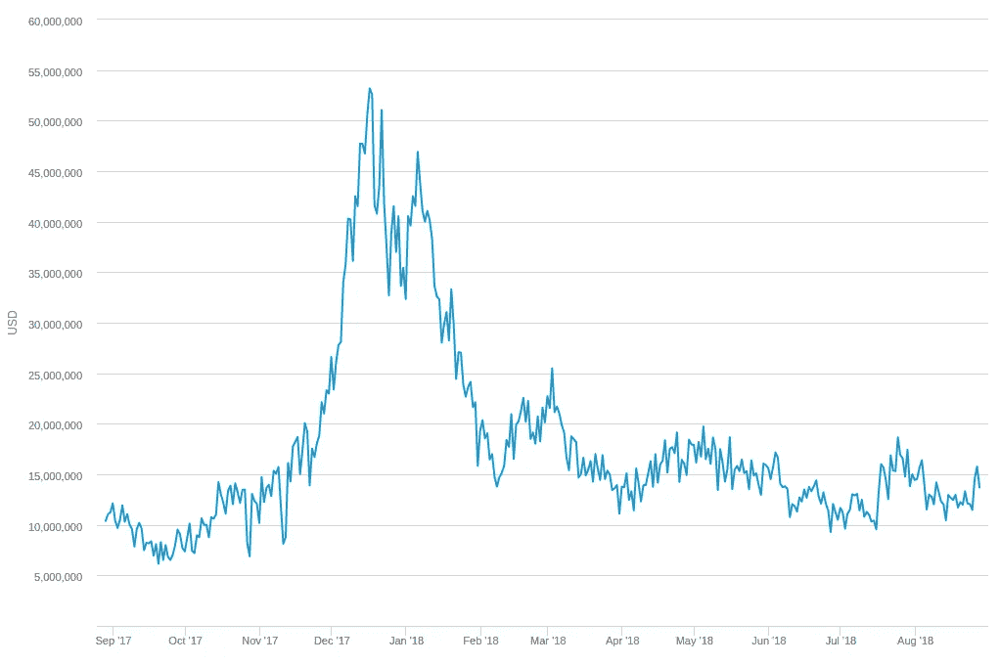

# 比特币安全性:负指数

> 原文：<https://medium.com/coinmonks/bitcoin-security-a-negative-exponential-95e78b6b575?source=collection_archive---------1----------------------->

[Photo Credit](https://unsplash.com/photos/cAq3crYmgno?utm_source=unsplash&utm_medium=referral&utm_content=creditCopyText)

长期以来，我一直怀疑比特币是否会作为未来货币胜出，但鉴于 Twitter 上支持比特币的情绪最近有所上升，我决定我应该尝试找出我错在哪里。

在研究过程中，我遇到了一个问题，随着大宗回报下降，比特币将如何保持安全性。尽管进行了大量的搜索(并在 Twitter 上纠缠人们),我还是惊讶于我发现的讨论是如此之少，而且提议的解决方案看起来是如此糟糕。

除非我完全错过了什么，**我看不出比特币的安全性不会随着区块奖励而下降——区块奖励遵循负指数**！

这个问题*已经在别处*讨论过了( [0](https://en.bitcoin.it/wiki/Tragedy_of_the_Commons) ， [1](https://bitcointalk.org/index.php?topic=67900.0) ， [2](https://bitcointalk.org/index.php?topic=6284.0) ， [3](https://bitcoin.stackexchange.com/questions/3111/will-bitcoin-suffer-from-a-mining-tragedy-of-the-commons-when-mining-fees-drop-t) ， [4](https://cryptofundamental.com/21-done-will-bitcoin-survive-the-tragedy-of-the-commons-271a6cd21b04) )，但是我还没有找到任何一个来源来阐述这个问题*并且*批判性地评估了普遍提出的解决方案。这就是这篇文章的目的。

如果我*错过了*重要的东西，那么这篇文章可以作为[坎宁安定律](https://meta.wikimedia.org/wiki/Cunningham%27s_Law)的一个应用，有人可以启发我。

# 工作证明的基础

价值储存在比特币网络上——这是它的目的。

该网络使用工作证明(PoW)来(除其他外)防范 51%攻击。PoW 通过使它们**变得昂贵**来抵御 51%的攻击——不是不可能！

要成功完成 51%,您需要获得略高于网络一半的散列能力。如果网络具有大量散列能力，那么这可能会很昂贵，因为散列能力具有真实的成本(硬件和电力)。

# 安全预算

电力网络的安全性取决于 51%的成本。51%的成本取决于矿工们的集体支出。矿工的支出取决于他们的薪酬。

因此，电力网络的安全性取决于该网络支付给矿工的金额——这就是为什么我称这个金额为“**安全预算**”。安全预算直接决定安全。

# 最简单的例子

一种新抗 ASIC 的功率加密货币出现了。它支付*正好*100 万美元/天(安全预算！)到矿工，而不管总散列功率等。

一开始一个人挖矿。花在采矿上的钱很少，哈希能力很低，难度也很低，他们每天赚 100 万美元。

新矿工加入。花在采矿上的钱总数增加了，杂凑力量增加了，难度增加了，每天 100 万美元的花费被更多的人分享了。

**当系统接近平衡时，矿工的综合花费(“总花费”)接近*，但总是小于*，100 万美元/天。**

为什么？

如果总支出超过 100 万美元/天，效率较低的矿商就会赔钱，并很快退出——降低总支出。如果总支出比每天 100 万美元少得多，新的矿商就会加入进来，吃掉这些利润，总支出就会攀升。

现在，由于矿工们争取的 100 万美元/天的馅饼的大小取决于他们贡献了多少散列功率，他们不断竞争以每花费一美元输出更多散列功率。

因此，100 万美元/天的安全预算将使网络*接近*100 万美元/天的最大总散列能力*。这很好！*

## 袭击

让我们攻击这个网络。对于 51%的任何 PoW 网络，我们只需要一半多一点的散列功率，对吗？那么，我们需要花多少钱？

我们知道该协议每天支付 100 万美元。因此，矿工们每天的采矿支出不会超过 100 万美元。竞争应该会迫使他们生产出接近 100 万美元/天的最大总散列值——但没关系，它仍然被限制在 100 万美元/天。

因此，我们可以以大约 100 万美元/天的价格关闭网络。

## 防卫

如何阻止我们的攻击？好吧，你所能做的就是让攻击更加昂贵，所以你增加了安全预算。

假设网络将安全预算增加了一倍，达到 100 美元 2M/天.新的矿工加入，总支出增加，哈希力量增加，就像以前一样达到一个新的平衡。现在总花费接近，但是少于，2M/天。而且这个网络已经接近你每天花$2M 就能得到的最大散列能力。

好的。现在我们可以以每天 100 美元的价格关闭电视网.

反过来也一样。如果支付给矿工的金额减半，从每天 100 万美元降至每天 50 万美元，我们就能以每天 50 万美元的价格切断网络。

## 安全预算决定安全！

我们知道 PoW 通过提高价格来抵御 51%的攻击。

现在，我们已经看到，攻击的成本取决于矿工的花费，而这又受到网络支付给矿工的金额——“安全预算”的限制。

所以我们可以看到**安全预算决定网络安全**。

# ASIC 示例

在上面的例子中，网络是抗 ASIC 的，我们的结论是安全预算决定安全。

如果加上 ASICs，这个结论会改变吗？比特币毕竟有 ASICs，这个帖子(按说)是关于比特币的。

— — —

一种新的*专用加密货币*出现。它向矿工支付 100 万美元/天(3.65 亿美元/年)。矿工必须购买并定期升级用于在网络上采矿的专用集成电路——这可以摊销到一个 ***年度硬件成本*** 。他们还要承担一笔**(平时的电费等)。**

**或许可以算出，矿商每年在硬件上花费 2.5 亿美元，在运营成本上花费 1 亿美元。无论崩溃是什么，他们都不可能持续地花得比挣得多。所以，这些的总和会趋近，但一般会*小于*，年度矿工收入—又名 ***年度安全预算*** :**

*****年度硬件成本+年度运营成本≤年度安全预算*****

**和以前一样，在给定安全预算的情况下，矿工池将倾向于产生最大的散列能力。为了最大化散列能力，他们必须计算出每年升级硬件的花费。矿工不喜欢升级硬件，但随着硬件老化，竞争侵蚀了他们的运营利润。最终找到一些平衡硬件消耗。**

**所有这些的结果是，如果该协议每年在矿工身上花费 3 . 65 亿美元，那么它就接近于“真正的”每年 3 . 65 亿美元的散列功率，而不管硬件花费如何。所以，一切都像以前一样。**

*   **我说“可持续地”是因为如果收入很高，矿商可能会在硬件上花很多钱，并期望它保持在高水平。然后价格下降，他们在硬件上的预算超出了较低的收入水平。但只要收入超过运营成本，他们就会继续开采。因此，你可以拥有价值 3 亿美元的硬件开采，而目前的收入只有 2.5 亿美元。尽管随着硬件的更新，这种过度分配会逐渐向下调整。这应该不会超过一个完整的硬件刷新周期。**

## **袭击**

**攻击成本会因硬件更新周期的长短而有所不同。假设矿工每年在硬件上花费 3 亿美元，每年花费 6500 万美元(17.8 万美元/天)，硬件的使用寿命为 3 年。**

**这意味着在任何给定的时间都有价值 9 亿美元的硬件开采，并且每天燃烧 17.8 万美元。因此，要攻击网络，我们必须在 ASICs 上花费 9 亿美元，每天花费 17.8 万美元。**

## **防卫**

**社区预料到了我们的攻击。他们如何预防？再说一次，他们所能做的就是增加安全预算。**

**该网络将安全预算增加了一倍，达到每天 100 美元 2M .新的矿工购买 ASICs 并开始采矿，哈希功率增加，一段时间后达到新的平衡。**

**硬件支出与运营支出的比率应该保持*大致*不变，因此现在我们可以预计在 ASICs 上的支出是两倍，每天在攻击上的支出也是两倍。**

****和之前一样，这也是另一种方式**。如果安全预算减半至 500，000 美元/天，并且达到平衡，我们可以预计花费一半在 ASICs 上，一半花费在攻击上。**

## **安全预算(仍然)决定安全**

**ASICs 使得 51%的攻击更加昂贵——假设我们比较的是相对短暂的攻击——但是**攻击成本仍然受到安全预算**的限制和决定。怎么可能不是呢？**

**不管是不是 ASICs，网络*要想有高安全性，就必须*有高安全预算。**

# **绝对散列率**

**注意，在这些例子中，我们不需要关心*绝对*散列率。攻击成本的最终决定因素是矿工们的花费——这取决于他们的收入。**

**因此，由矿工池产生的绝对散列率不是安全的直接衡量标准——它是安全的一种代理，甚至是一种转移注意力的方法。**

**例子:想象一个网络，无论如何，它每天都要向矿工支付 100 万美元，永远不变。它有一个恒定的安全级别——无论我们今天攻击，还是一年后攻击，我们都有望每天支付 100 万美元。**

**但是，这个网络的哈希幂图会是什么样的呢？它会上升到右边。硬件总是在进步的。你明年每美元可以获得比今天更多的散列。**

**如果只看到不断增长的哈希力量，就简单地得出网络随着时间的推移变得越来越安全的结论，那将是一个错误。**

**花费的成本(安全预算！)—而不是绝对散列率—决定安全性…这就是为什么像下面这样的语句毫无意义。**

> **随着 ASICs 变得更加高效，我们可以降低采矿的总成本！**

****

**[Photo Credit](https://unsplash.com/photos/RWD07TnE7bQ?utm_source=unsplash&utm_medium=referral&utm_content=creditCopyText)**

# **比特币(终于)**

**在谈到比特币的安全预算和这篇文章的动机之前，还有一件事。**

## **绝对散列率**

**下图显示了过去一年的比特币**散列率**。紧接着的图表显示了去年**矿工的收入**。**

****

**[Bitcoin Hash Rate](https://www.blockchain.com/charts/hash-rate?timespan=1year)**

****

**[Miner Revenue](https://www.blockchain.com/charts/miners-revenue?timespan=1year) (Security Budget!)**

**哪个图是网络安全的更好的指示器？假设一个有效的矿业市场，第二个图表是更好的指标——绝对散列率是一个转移视线的东西。**

**记住上面的例子。由于硬件的进步，绝对散列能力总是趋向于增加——即使安全预算(和攻击成本)是固定的。**

**如果安全预算下降*比每次哈希/秒的成本下降*更快，哈希速率仅*随时间下降*——这很糟糕！甚至一个*常数*散列率也表明安全性在下降。**

## **比特币安全预算**

**好的。因此，我们已经确定，无论是不是 ASICs，电力网络都必须有很高的安全预算，才能有很高的安全性(我知道我已经说过 50 次了)。**

**这适用于比特币(它是一个 PoW 网络)，那么比特币的安全预算是如何资助的？**

**比特币 100%的矿工收入(安全预算)来自大宗奖励和交易(tx)费用。**

****比特币安全预算=区块奖励+ tx 费用****

**因此，如果比特币要保持安全，我们需要确保*块奖励+ tx 费用*总是等于一大笔钱。**

# **问题是**

**区块奖励构成了目前比特币安全预算的 98%，每 210，000 个区块(大约 4 年)*它们就会被减半，直到消失。**

****比特币的安全预算，以及网络的安全性，每 4 年就会减半。** **随着时间的推移，网络变得越来越不安全！****

*   ****当前 tx 费用=*[*【20 万美元/天*](https://www.blockchain.com/charts/transaction-fees-usd) *，当前 block 奖励=～1260 万美元/天(按 7000 美元/BTC)。12.6/(12.6+.2) = 0.984***
*   ***目前每个街区发出 12.5 个 BTC(约 10 分钟)。这将在[*2020 年 5 月*](https://www.bitcoinblockhalf.com/)*(2024 年再次以此类推)*的某个时候减半至 6.25 BTC/块**

****

**[Photo Credit](https://unsplash.com/photos/sz3AWACktLc?utm_source=unsplash&utm_medium=referral&utm_content=creditCopyText)**

# **解决方案/对策**

**由于比特币的完整性取决于它能抵抗 51%的攻击，这个问题绝对是比特币生存的核心。对于这个问题，肯定有一个坚如磐石、从游戏理论上来说合理、非人为的解决方案吧？**

**这些是我遇到的反应。无属性引用块要么是我听过的一般形式的论点，要么是我对自己的反驳。**

## **持续上涨的价格**

> **如果比特币价格随着大宗奖励的下降而上涨，那么安全预算实际上可能会保持不变，甚至有所增长。**

**首先，依靠价格以某种特定的节奏*持续上涨，以保证绝对安全 ***不下降*** 才是真正可怕的。没有人知道价格会怎样。我们不能指望它上涨。***

**此外，价格不可能每 4 年翻一番:**

*   **4 倍:11 万美元/BTC。好的，当然…**
*   **7 倍:90 万美元/BTC。不太确定。**
*   **9 倍:360 万美元/BTC。[比特币市值现已超过全球 GDP](https://bitcoin.stackexchange.com/a/6090) 。**
*   **12 倍:2600 万美元/BTC。现在进入了愚蠢的领域。**
*   **31 翻倍(2140 年):15 吨/BTC。*_***

## **安全因素**

**但情况变得更糟了。让我们假设比特币价格(以及市值)*实际上每 4 年翻一倍，整体回报减半，而攻击成本保持不变。***

***那么攻击成本*相对于整个网络价值的*会随着时间而下降，但是*绝对攻击成本*会保持不变。好像还行？***

**一点都不好！**

****攻击一个网络的成本必须与网络的价值成正比！**网络必须保持我所说的“T12”安全因素。**

**如果摧毁一个价值 1 亿美元的网络需要 1000 万美元，那么它的安全系数是 10%。随着网络变得越来越有价值，它们应该保持恒定的 ***安全系数***——这样，它们的 ***安全预算*** 就会随着网络的价值而增加。**

**想象一下，你可以用 100 万美元干掉年收入 10 万美元的乔氏管道公司。可能没人会在意。现在想象一下，你可以用 100 万美元干掉谷歌/亚马逊/脸书。无数的团体会因为很多很多的原因而乐意支付这笔费用(想想竞争对手、民族国家、恐怖分子、对冲基金，甚至疯狂的富人)。**

**比特币价值约 1000 亿美元(按市值计算)，攻击它的成本约为 100 亿美元([、8.8 亿美元硬件+600 万美元/天的电费](https://gobitcoin.io/tools/cost-51-attack/))。因此，目前比特币的安全系数约为 **10%** (攻击成本/网络价值)。**

**在其他条件相同的情况下，如果 BTC 价格在 2020 年块报酬减半时翻倍，那么网络价值为 2000 亿美元，而攻击成本仍然为 100 亿美元——安全系数已经从*下降到~ **5%** 。这种情况每 4 年就会发生一次。***

**想象一下 [spawn camp](https://twitter.com/VitalikButerin/status/827783678910558208) 比特币死亡的成本保持在 100 亿美元不变，而价格和市值持续上升。**

**你认为没有政府/竞争链/银行阴谋/做空对冲基金/等等。会愿意在某个时候支付那 100 亿美元吗？比特币会继续增长，在世界范围内取代法币，成为全球储备货币，上面有一个 100 亿美元未按下的“杀死这种货币”按钮？**

**没有人知道保护比特币需要多大的安全系数，但这有点像我们在进行一个*实验来找出*。**

## **快速上涨的价格**

> **好吧，BTC 的价格上涨实际上可能会超过整体奖励的下降。那么绝对安全预算将会增加。**

**当然 BTC 价格*可以*超过块奖励减少(一段时间)——虽然再次，这将是疯狂的依赖这种情况发生——但即使这样，我们仍然有一个下降的安全系数！**

**假设费用保持不变(或者随着价格的增长而增长)，拥有一个*恒定*安全系数的唯一方法是稳步*增加*块奖励与总供应量的比例，这样比特币就有一个恒定的 X%通货膨胀率——这是社区永远不会接受的。**

## **交易费将节省我们**

> **随着大宗报酬的下降，交易费用将会增加，以弥补差额。**

**据我所知，这是比特币社区中解决这个问题的领先解决方案，甚至 Satoshi 似乎也支持这个解决方案:**

> **在报酬变得太少的几十年里，交易费将成为节点的主要补偿。我确信，20 年后，要么交易量非常大，要么没有交易量。— *聪***

**但是，为什么支付的总费用会随着块报酬的下降而突然增加呢？用户总是希望支付最少的费用。根据目前的数字，费用需要上涨 37 倍才能补偿 2020 年的减半。**

> **也许收费不需要 37x，也许现在的收费水平就够了？**

**如果费用相对于市值保持在当前水平*,我们将看到随着整体奖励的取消，安全预算将减少 98%。这将相当于能够用 2 亿英镑杀死今天的比特币——0.2%的安全系数。这样够了吗？谁知道呢。我不想打赌。***

> **矿商将要求更高的费用。**

****这不是采矿的工作方式**。支付的总费用是用户对块空间需求的函数。矿工无法控制这一点。如果矿商串通起来排斥低费用的 tx，他们只能推高费用。这个肯定不是我们的安全解决方案吧？**

**此外，该系统旨在防止这种情况。**

**如果你是一个矿工，不包括没有达到最低门槛费用的 tx，我可以作为一个自私的矿工出现，通过包括所有最高费用到最低费用的 tx 来比你赚更多的钱。**

**矿工和用户都可能从支付给矿工的高安全性和高费用中受益，但没有人愿意实际支付这笔费用。我们有一个 [**公地悲剧**](https://en.wikipedia.org/wiki/Tragedy_of_the_commons) 的问题。**

**甚至比特币维基百科也指出了这一点:**

> **矿工将接受任何费用的交易(因为包含它们的边际成本是最小的)，用户将支付越来越低的费用(以 satoshis 的顺序)**

**所以，矿工不能强制执行高收费…**

> **我们把最低费用硬编码到协议里怎么样？**

**这不仅看起来真的*不好，*，而且也没有解决公地问题的悲剧。**

> **交易量将会增加，从而产生更多的收入。**

**依靠 tx 音量的增加来防止安全性的*下降*是不好的，因为同样的原因，依靠安全性的价格增加也是不好的。我们不知道未来的 tx 音量会是什么样子(尤其是第二层扩展使事情变得复杂)。**

**此外，这似乎意味着增加 tx *供应*将带来更多的费用收入。但是用户总是支付他们能支付的最低费用，矿工是自私的——他们简单地包括尽可能多的 tx，按费用高低排序。为了让用户支付更多的 tx 费用，他们这边的*需求*必须真正增加。**

**即使 tx 收入增加，我们怎么知道它会增加到足以保护网络？**

## **别担心，这都是几十年后的事了**

> **格挡奖励要到 2140 年才会归零！**

**这可能是我听到的对这个问题的第二个最常见的回答。**

**首先，说一个问题“遥遥无期”一点也不让人放心——尤其是当我们谈论一个长期的价值储存时。)。*也许*如果这真的在 2140 年之前根本不是问题**我们可以听之任之，但事实并非如此。****

****街区奖励在 2140 年达到了零，但仅仅两年后就减半了，10 年后下降了 88%至 1.5625 BTC/街区。在 14 年里，它们下降了 97%至 0.390625 BTC/块。****

****看看图表就知道了。蓝色破折号代表奖励金额。我们现在在左边第三个**上**。再减半 4 到 5 次后，我们的街区奖励几乎为零。****

********

****[Controlled Supply](https://en.bitcoin.it/wiki/Controlled_supply)****

****还是那句话，可怕的是没人知道比特币的安全系数(和安全预算)需要多大。显然，目前 10%和 100 亿美元已经足够了。但是下一次减半是在 2020 年。5%的安全系数够用吗？如果 BTC 普莱斯 10 倍和一些大机构感到威胁怎么办？然后在 2024 年再减半，2028 年再减半…****

****此外，人们也不是看不到未来，看不到事情的发展方向。如果没有一个超级可靠、防弹、经济合理、长期的安全解决方案，比特币持有者怎么能对比特币储存价值的能力有信心呢？****

## ****主导保证合同****

> ****我有很多比特币，所以我受益于高散列率。因此我[承诺](https://en.bitcoin.it/wiki/Dominant_Assurance_Contracts)给下一个区块的矿工 0.1 BTC，只要承诺的总金额达到 10 BTC。****

****所以，捐款？[我们将通过捐赠为 21 世纪全球储备货币的安全提供资金？](https://en.wikipedia.org/wiki/Tragedy_of_the_commons)****

## ****慈善采矿****

> ****比特币将如此重要，以至于矿工们会亏本开采。****

****再次，[捐款](https://en.wikipedia.org/wiki/Tragedy_of_the_commons)？！？****

> ****有些人永远愿意为了乐趣/研究/善意而采矿。****

****当然，有些人会“免费”采矿。但是我们根本不可能依靠慈善采矿来提供我们需要的 1000 万美元/天(或者其他任何数字)的矿工支出来保护比特币——更不用说维持安全系数了。****

## ****防御性采矿****

> ****持有比特币股份的矿商可能会亏本开矿，以捍卫网络。****

****如果一个资金充足的攻击者开始挖掘，他们会给网络增加大量的散列能量。如果市场相对有效，利润微薄，那么一些矿商现在开采的每一秒钟都会赔钱。****

****这些矿工必须选择要么退出并减少损失，要么继续亏本开采，以便“尽自己的一份力量”并拯救网络。这里再次出现了公地问题的悲剧。****

****但更糟糕的是，如果矿商认为攻击者资金充足，最终可能会赢，他们应该现在就减少损失(并试图出售他们的硬件和硬币)，而不是在下个月亏损开采，然后在花了更多钱后放弃。****

## ****以太坊也有这个问题！****

****这就是“[你也是](https://en.wikipedia.org/wiki/Tu_quoque)”的逻辑谬误，因为以太坊有同样的问题对比特币没有帮助。但我认为以太坊的情况没有那么糟糕。****

****首先，以太坊尚未承诺通缩发行，而比特币肯定已经承诺了。事实上，我认为比特币的支持者会同意比特币的 2100 万供应上限在这一点上是绝对不可谈判的。****

****以太坊也早就计划转向股权证明，这*应该*允许每一美元的安全预算有更大的安全性，因此更低的安全预算和更低的发行——尽管可能永远不会是零发行。****

****但不管怎样，以太坊的安全性对比特币来说其实并不重要。****

## ****利害关系证明？****

****说到以太坊，也许股权证明(PoS)可以为比特币解决这个问题？来自[比特币维基](https://en.bitcoin.it/wiki/Proof_of_Stake):****

> ****一些人认为，仅基于工作证明的方法可能会导致加密货币的网络安全性较低，由于[公地悲剧](https://en.bitcoin.it/wiki/Tragedy_of_the_Commons)，块激励会随着时间的推移而下降(如比特币)，而股权证明是改变矿工激励以支持更高网络安全性的一种方式。****

****据我所知，这是唯一可行的解决方案。根据[以太坊 PoS wiki](https://github.com/ethereum/wiki/wiki/Proof-of-Stake-FAQs#what-are-the-benefits-of-proof-of-stake-as-opposed-to-proof-of-work) 的说法，甚至有可能通过 PoS 实现*零*(或负)发行(不要问我如何实现)，这将允许比特币坚持 2100 万 BTC 的硬上限。****

****但这是比特币社区中一个活跃的研究领域吗？社区会容忍迁移到 PoS 吗？当然[看起来不像](https://bitcointalk.org/index.php?topic=2050869.0)。看起来比特币在可预见的未来，无论是好是坏，都将致力于 PoW。****

********

****[Photo Credit](https://unsplash.com/photos/h7bQ8VEZtws?utm_source=unsplash&utm_medium=referral&utm_content=creditCopyText)****

# ****结论****

****我对比特币没有深仇大恨，但我也不在乎比特币*具体来说*是否赢得了加密战。我也不关心以太坊或 Dogecoin 赢了。****

****我关心的是，加密货币展现了我所认为的巨大潜力。我希望**最好的**、最安全的、最有用的**赢(如果我能找到赢家并下些注，那也不错:)。******

******我们应该对所有我们珍视的密码技术持高度批评态度，因为我们最不需要的就是社会大众采用这些东西中的一种，结果只会让它在他们面前爆炸，让整个领域倒退 10 年。******

******正如我在开头所说的，如果我错过了一些东西，而这个问题并不是真正的问题，或者有一些很棒的解决方案我完全错过了，请让我知道*确切地说*我错过了什么，我想知道。******

********也就是说，我将继续寻找这个问题的答案，直到要么:我找到一个，要么我被 Twitter 上的每个比特币最大化者屏蔽，因为他们发了这个帖子！********

******— — —******

******感谢 [@dinocellotti](https://twitter.com/dinocelotti) 和 [@adampwilkinson](https://twitter.com/adampwilkinson) 对这篇文章的反馈。******

******我的推特: [@jordanmmck](https://twitter.com/jordanmmck)******

## ********更新:********

******我为这篇文章做了一个 [Tweetstorm，引起了很多有趣的讨论。对于比特币创造者来说，收费市场显然是解决这个问题的首选方案。](https://twitter.com/jordanmmck/status/1035216406952861696)******

******(查看[这篇文章](/@matteoleibowitz/bitcoin-disinflating-to-death-b4ba7b691969)对这个问题的收费市场解决方案进行了更深入的反驳。)******

******我*没有*听到任何令人信服的理由来解释为什么 tx 费用收入占网络价值的百分比应该增加——因此极低的安全系数看起来是可能的。******

******我也没有听到任何关于为什么我们应该期待比特币在安全系数低得多的情况下生存的论点。在我看来，比特币社区或多或少只是希望收费市场是足够的。******

********第二部分** : [比特币安全一张图](/coinmonks/bitcoin-security-in-one-chart-694ee3ed8c2d)******

> ******[直接在您的收件箱中获得最佳软件交易](https://coincodecap.com/?utm_source=coinmonks)******

************