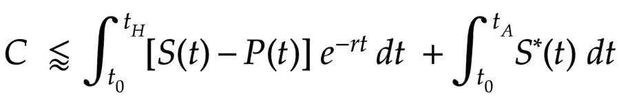
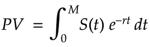
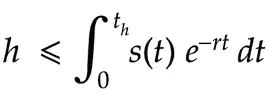
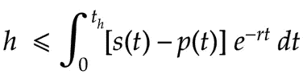
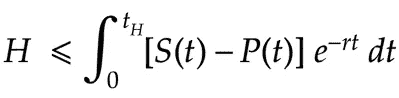
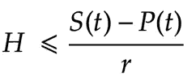
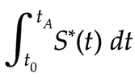

# 比特币安全预算:ASIC 版

> 原文：<https://medium.com/coinmonks/bitcoin-security-budget-asic-edition-59a8323f9529?source=collection_archive---------5----------------------->

Approximate bounding inequality for attack cost (with ASICs)

这是关于比特币不断下降的块奖励对网络安全的影响的一系列帖子中的第三部分。

**第一部分:** [**比特币安全性:负指数**](/coinmonks/bitcoin-security-a-negative-exponential-95e78b6b575) **。**[**tweet storm**](https://twitter.com/jordanmmck/status/1034834965127557120)**。**

**第二部分:** [**比特币安全一体图**](/coinmonks/bitcoin-security-in-one-chart-694ee3ed8c2d) **。**[**tweet storm**](https://twitter.com/jordanmmck/status/1042074859977592833)**。**

在第一篇文章中，我认为比特币等验证系统的攻击成本(以及安全性)最终取决于矿商的收入——“安全预算”。

为了说明这种关系，我使用了一个简化的模型——加密货币，不含专用集成电路。我*包含了第二个更短的例子*和*ASIC，但是我没有花太多时间。*

在我看来，ASICs 似乎改变了攻击成本*曲线*(通过“前期加载”攻击成本)，但安全预算仍然[主导着](https://en.wikipedia.org/wiki/Asymptotic_analysis)攻击成本等式——这是我的论点的全部要点。

但是，为了结束这三部曲，我觉得我需要沿着这条路走下去，并确定*攻击成本是否最终由安全预算决定——是否有 ASIC！*

# 初始硬件

所以你想 51%攻击比特币(或者任何 ASIC 挖掘的电力系统)。首先你需要买硬件。那要花多少钱？

假设网络产生每秒 10 次的速度。最坏的情况是，您还必须购买每秒 10 次的硬件，那么您将拥有 50%的总哈希能力。事实上，效率较低的矿商将会退出，因为你增加了散列功率，并扼杀了他们的利润，所以在最好的情况下，你可以购买低至约 5/s 的产品。

但是我们关心的*成本*，*，*并不是绝对的哈希功率。矿商如何决定在任何给定的时间里有多少资金应该被限制在 ASICs 中？

## 收入流的现值

矿工由协议提供的收入流资助(区块奖励+ tx 费用)。他们关心的是这个流的美元数量。这是我在之前的帖子中谈到的**安全预算**。

该流的大小(美元/时间)由硬币价格、通货膨胀率和块空间需求决定。采矿者对收入流没有影响，除非他们影响提到的因素——他们只是根据各自的哈希功率贡献来分割收入流(无论它是什么)。

矿商购买 ASICs 是为了获取部分收入。如果他们是理性的，他们在硬件上的花费不会超过他们计划用硬件获得的*预期*收入流份额的**现值**。

**注意**:这些收入流和成本流是对未来的*预测*。考虑到各种风险因素和不确定性，这些现金流的预期利润必须大打折扣(见附录)。

## 现值方程

一些收入流的现值可以用… [现值公式](http://faculty.atu.edu/mfinan/2243/business65.pdf)来确定:

**变量** : ***PV*** 是收入流的现值。*是收入流。积分的界限， ***0*** 和 ***M*** ，定义时间跨度， ***r*** 为现行利率(5%或其他)。*

*这个等式告诉你现在需要多少钱，这样到某个时期结束时，你就和有收入流的人一样富裕了——它确实给出了收入流的现值。*

*将该等式应用于矿工情况，我们得到:*

**

***变量** : ***h*** 就是矿工在硬件上花了多少钱。**、*、*、**的集成上限是硬件的可盈利寿命。***【s(t)***是预期收入流。 ***r*** 是通常的利率。*

*这个计算中矿工关心的收入流实际上是扣除费用后的收入流*。如果 ***p(t)*** 是预期运营成本(电费、租金等)，则我们得到:**

**

*因此，如果矿商认为某个硬件单位将获得的预期风险贴现收入流的现值(减去运行成本)超过了硬件的成本，他们就会购买该硬件单位。*

## *所有矿工的总和*

*每个矿工单独进行这种计算——他们通过花费*少于*现金流部分的现值来要求总收入流(安全预算)的一部分。*

*当你对*所有*矿工的这种行为求和时，你对*更大收入流的所有*部分求和，*和*你对每个部分各自的硬件支出求和。*

***求和的结果是，矿工在硬件上的总支出少于总预期收入流的风险调整现值，即安全预算！***

*怎么可能不是呢？如果矿工集体持续*花费*比收入流的现值更多*来获取收入流，他们实际上是在赔钱——这不会持续。*

*但是，假设矿商高估了收入流，并在硬件上花费了比他们应该花费的更多，那么这个硬件的价值是什么？*

***硬件在任一时间点的价值被*定义为*硬件获取的收入流的现值！**不管矿工们*为硬件支付了*多少钱，它现在的*价值*正是它预期获得的任何收入的现值。*

*如果你想从矿工那里购买一些硬件，你不会支付他们支付的价格。你不会比它为你所赚的多付一分钱。同样，ASIC 销售人员将无法以高于预期的 PV 价格销售硬件…*

*因此，整个网络的总硬件价值**以预计的安全预算为上限，***【H】******【S(t)***减去运营成本 ***P(t)*** 。 ***tH*** 是硬件的平均寿命:*

**

***硬件支出基于对未来的预测。如果预测有误，矿商可能会在硬件上过度支出或支出不足。然而，这种不确定性会被计入支出，并且随着时间的推移会趋于平稳。见附录。**

****假设硬件不断升级平均单位会中年，那么* ***tH*** *可能太过宽泛——高估成本。另一方面，较新的单元可能代表多数哈希功率，有可能新的硬件版本刚刚发布，大多数单元都非常年轻。**

## *如果 ASICs 停止前进了呢？*

*如果 ASIC 的进步停滞不前，那么矿工只需要购买一次硬件，就可以永远开采。 ***tH*** 则无穷。 ***H*** 是否变大？这打破界限了吗？*

*当 ***tH*** 为无穷大时，表达式收敛:*

**

# *运营和升级成本*

*因此，我们对硬件成本有一个上限。*

*现在，我们需要考虑运行所有硬件的成本，以及在整个攻击过程中升级硬件的成本*。*

*我想我找到了升级总成本的精确描述(见附录)，但找不到数学来表达它。相反，我使用的是 ***S*(t)*** —随着时间的推移支付的*实际*总矿工收入(之前的 ***S*** 是*预计*收入)——作为升级成本*和*运营成本(电费等)的粗略界限。*

*矿工不会花比他们挣得更多的钱来运行他们的硬件。不过，他们可能会在硬件上花很多钱。因此，在短时间内，总支出可能会超过总收入，但随着时间的推移，这种情况会变得平稳——最多需要一个硬件更新周期——在长时间内，收入*必须*超过支出。*

**

***变量** : ***S*(t)*** 为实际总收入。 ***t0*** 是攻击开始的时候， ***tA*** 是攻击结束的时候。*

*但是如果攻击者有一半的 hash 能力，他们不就得到一半的收益——一半的 ***S*(t)*** ？如果是这样的话，诚实的矿工会把**的*一半*S *(t)**花在运营和升级上。然后攻击者可以将他们的花费与他的“攻击收入”相匹配。那么这一项将变成零。*

*我不确定这实际上会如何发展，但我认为这笔收入不能指望 T47，这对我的论点无关紧要。所以，我假设攻击者没有收入，使用安全上界 ***S*(t)*** 。*

*矿工似乎不太可能在受到攻击时升级硬件——现在难度更高了，长期信心也很低——但我在为攻击者设想最坏的情况。*

# *最终表达式*

*将初始硬件投资成本(第一个积分)与运营和升级成本(第二个积分)相结合，我们得到:*

**

# *结论*

*所以方程有*， ***S**** ， ***P*** ， ***r*** ，和界限 ***t0*** ，**

********

****利率 ***r*** 在协议之外，因此可以被视为常数。***【tA】******t0***是各种自由变量。*由 R & D pace 等外部因素决定，不在协议范围内。*****

*****所以，那就只剩下***S******S ****和 ***P*** 。 ***P*** 做什么其实并不重要——被 ***S*** 封顶，反正小的时候成本最高。 ***S*** 和 ***S**** 只是安保预算的不同形式——一个是预测，一个是实际。所以一切都归结于安全预算。*****

******安全预算决定攻击成本——不管是不是 ASICs！******

****— — —****

******第一部分:** [**比特币安全性:负指数**](/coinmonks/bitcoin-security-a-negative-exponential-95e78b6b575) **。******

******第二部分:** [**比特币安全一体图**](/coinmonks/bitcoin-security-in-one-chart-694ee3ed8c2d) **。******

****推特: [@jordanmmck](https://twitter.com/jordanmmck)****

****感谢[迪诺·阿图罗·塞洛蒂](https://medium.com/u/46ac237febff?source=post_page-----59a8323f9529--------------------------------)、[克里斯·麦考伊](https://twitter.com/chrisamccoy)、[马特·莱博维茨](https://medium.com/u/79921b07b948?source=post_page-----59a8323f9529--------------------------------)和杰森·瓦尔纳。****

# ****附录****

## ****升级成本的更精确描述****

****网络分块升级。一个矿商做了一个计算，确定他们可以获得总收入流的一部分，***【S(t)***小于该收入流部分的 PV。****

****矿工 1 为他们期望的当前投影片***【S(t)***找到 PV，并且在硬件上花费少于该数量。矿工 2 为他们期望的*新*投影的***【t】***的切片找到 PV，并且在硬件上花费比那个少。诸如此类。 ***S(t)*** 是一个投影——它在每次迭代中被*更新*。****

****因此，在一段时间内在网络硬件上花费的总量应该由升级挖掘器在这段时间内计算的这些变化的***【t】***流片段的所有 PV 的总和来限定。****

****这可以表示为积分之和，但我们不知道发生了多少次离散升级——看起来应该是某种二重积分。我试过了，但是没有成功。****

## ****贴现收入流****

****假设硬件进步，即使安全预算(矿工总收入)不变，网络产生的总哈希功率也会增加。因此，由任何给定硬件产生的总散列功率的百分比将随着时间的推移而下降。****

****因此***s(t)****任何一块硬件捕获的收入流，都是向下倾斜的。*****

*****在某种程度上，硬件的运行成本超过了它的价值，因此收入流、***【s(t)****-****【p(t)***变为零。这种情况发生在一段时间*之后。******

*****整体收入流也趋于下降(块报酬下降)。这必须成为矿工长期决策的考虑因素。*****

*****收入流，***【t】***也必须因风险而大幅折现——这取决于价格、大宗奖励和费用，其中两项是不可预测的。*****

****所有这些因素和不确定性导致矿商对其收入流的预期价值大打折扣。****

## ****硬件过度分配消除****

****硬件支出基于一些收入流预测的现值(PV)。如果事情蓬勃发展，预计的收入流可能证明矿商购买大量硬件是合理的。****

****然后，经济衰退发生了，预计收入很低，矿工们有“太多”的硬件。然而，只要不赔钱，他们就会继续开采。****

****当然，矿商试图通过保守的硬件购买来避免这种情况，并且通常倾向于尽可能少地升级。随着时间的推移，过度分配也会变得平稳。持续过度配置硬件的矿工会被榨干。****

> ****[直接在您的收件箱中获得最佳软件交易](https://coincodecap.com/?utm_source=coinmonks)****

********