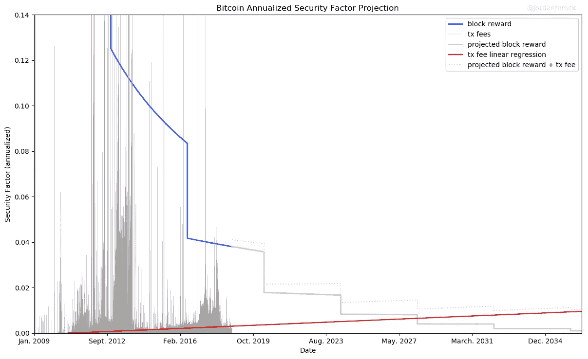
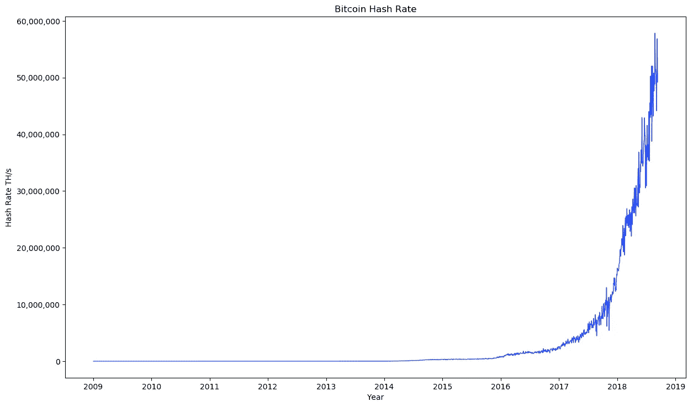
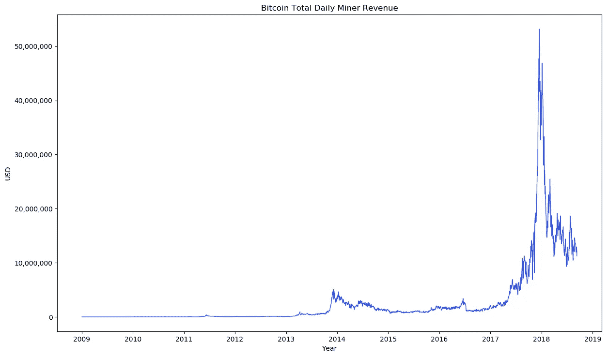

# 一张图中的比特币安全性

> 原文：<https://medium.com/coinmonks/bitcoin-security-in-one-chart-694ee3ed8c2d?source=collection_archive---------0----------------------->



Bitcoin security factor ([data source](https://btc.com/api-doc))

我最近发表了一篇文章([比特币安全:一个负指数](/coinmonks/bitcoin-security-a-negative-exponential-95e78b6b575))，其中我研究了比特币不断下降的块奖励对网络安全的影响。

在[随后的讨论](https://twitter.com/jordanmmck/status/1035216406952861696)中变得很清楚，交易费是解决这个问题的首选方案——随着大宗报酬的下降，矿商的收入将从主要是大宗报酬转变为主要(然后完全)是费用。

我想找出在这种情况下我们可能期望的安全级别，所以我创建了如上所示的图。该图显示了一段时间内的历史“安全系数”水平，并推断出未来的数据。

我认为安全系数是最重要的安全指标，所以我认为这张图表给出了比特币安全性最清晰的单一图像。

# 哈希速率

*hash rate 不是给出了比特币安全随着时间推移的真实情况吗？*

不完全是。绝对散列率具有误导性。**提高哈希速率不一定*意味着提高安全性*。**

想象一个年复一年哈希幂为 100 次方/秒不变的网络。网络有持续的安全性吗？不会。只要采矿硬件在改进，获得 100 TH/s 的成本每年都会下降— **恒定散列率意味着*安全性*下降**。

如果你想要一个恒定的安全级别，你需要散列函数以硬件发展的速度增长。只有比硬件改进更快的散列率才真正意味着增加 T21 安全性。



Bitcoin hash rate ([data source](https://www.blockchain.com/charts/hash-rate))

# 安全预算

如果不是绝对散列率，那么什么最能代表安全性呢？

工作证明通过使攻击变得昂贵来提供安全性。矿商们正在花费大量金钱进行开采(并竞相产生每美元的最大散列率),因此攻击者将不得不花费大量金钱进行攻击。所以花费的总数最终决定了攻击的成本。

由于矿工的总支出受到他们收入的限制(他们需要盈利),所以矿工的总收入才是决定安全级别的真正因素。这就是为什么我一直称矿工收入为“**安全预算**”(SB)。

**注意**:ASIC 使攻击成本曲线变得复杂，但它们并没有实质性地改变这种关系——攻击成本等式仍然由 SB 术语 [Big(O)](https://en.wikipedia.org/wiki/Big_O_notation) 风格**支配**(post coming only)。



Bitcoin miner revenue (security budget) ([data source](https://www.blockchain.com/charts/miners-revenue))

# 安全系数

*那么，最好的安全状况是矿工的总收入？*

我觉得还有更好的…

我一直认为，攻击网络(如比特币)的成本应该与网络的价值成比例——网络必须保持某种“**安全系数**”(SF 的定义是*攻击成本/网络价值* ) *。*

想象一下，花 100 万美元摧毁一个价值 1000 万美元的网络(10% SF)。这很好。但是如果网络增长到 **$1B** 而攻击成本*保持在*$ 100 万(SF 下降到 0.1%)，那么这就不好了——攻击成本应该随着网络的增长而增长。

我认为 SF 是关键的安全指标。它提供了比 SB 更丰富的网络安全信息。绝对攻击成本当然很重要，但是如果没有网络价值的背景，它并不能真正告诉我们网络是否安全。

如果你只知道成功攻击一个网络需要 100 万美元，你能说说这种攻击发生的概率吗？不完全是。

*(例外是攻击成本极高的时候。如果攻击成本是 1 万亿美元，那么无论网络价值如何，我们都有信心不会发生攻击。)*

科幻小说对系统的基本设计提出了一些建议。如果我们看到某个网络在价格波动的情况下仍然保持着较高的 SF，那么它很可能具有设计良好的安全机制。

**我们正处于一个寒武纪大爆发的秘密经济时期** [**机器/有机体**](/@jordanmmck/cryptocurrencies-as-abstract-lifeforms-9e35138d63ed) **年代“试图弄清楚哪些会存活下来。具有基本上健壮的安全机制的系统更适合 T21。**

我们想排除价格等外部因素。价格不是系统固有的，也不是机器的一个方面——价格是噪音而不是信号。

*(事实上，收费收入也不是系统固有的！这就是为什么我认为依靠收费市场来保障安全是极其危险的。我将它包括在图表中，因为它是唯一的其他矿商收入来源，并将越来越成为主要来源...)*

如下所示，SF 正是这样做的——它排除了价格噪音。我们从 SF 定义开始，然后由于矿工收入(安全预算)是 PoW 下攻击成本的主要决定因素，我们用 SB 代替攻击成本，并排除价格因素:

```
SF = attack_cost/network_value
SF = SB/network_value
SF = SB/market_cap
SF = (block_rewards_usd + tx_fees_usd) / market_cap
SF = (block_rewards_btc * price + tx_fees_btc * price) / market_cap
SF = (block_rewards_btc + tx_fees_btc) * price / market_cap
SF = (block_rewards_btc + tx_fees_btc) * price / supply * price
SF = (block_rewards_btc + tx_fees_btc) / supply
SF = block_rewards_btc / supply + tx_fees_btc / supply
SF = **block_reward_security_factor** + **tx_fees_sec**
```

*(当 SF 定义为攻击 _ 成本/网络 _ 价值时我们希望它尽可能的高。然而，在现有系统下，高 SF 是有成本的——这意味着总代币的大部分被转移给矿工/赌注者以支付安全费用。因此，只要 SF 对用户意味着成本，我们就希望它尽可能低，但仍远高于危险水平。)*

鉴于 SF 是如此重要的安全指标，我们*真的*想知道它如何**走向**(以及为什么)。下降趋势的 SF 有点可怕，尽管如果我们确定它不会低于某个**安全水平**它可能是好的…

# 图表

最后我们看到了图表。

蓝色向下步进线是来自块奖励的 SF。当线条变为浅蓝色时，我们预测未来(因为我们知道区块奖励计划，所以这里没有推测)。

灰色尖峰数据来自交易费。红线是通过对所有现有费用数据进行线性回归得出的，它预测了未来的纯费用 SF。

淡紫色虚线是预计的块报酬 SF 和预计的仅收费 SF 的总和。


Bitcoin security factor ([data source](https://btc.com/api-doc))

因此，目前的比特币 SF 约为 4%，根据数据，我们将在 2030 年后的某个时候降至约 1%的低点…

*这样不好吗？1%够好吗？*

没人知道！我们能确定的是，以前的 SF 水平约为 4%或更高已经足够了。也许 1%就可以了，也许不行。

我们真的能确定我们正在向 1%前进吗？

肯定不是！看看只收费的 SF 水平有多不稳定。一个线性回归指向约 1%，但也许这是完全错误的推断。

*闪电网上线，纯收费的顺丰到底怎么了？*

?!?

这种不确定性正是我认为依赖收费市场来保障基本面安全如此危险的原因。没有人知道费用市场会做什么。它在协议之外，由用户端需求驱动，我们无法控制。

— — —

**注**:图表显示*年化* SF 数字。因此，如果给定区块的总矿工收入为 15 BTC，则年化 SF 为:

```
15 * blocks_per_year / supply
```

**代码**:所有用于生成图的代码都可以在 [GitHub](https://github.com/jordanmmck/btc_security_factor) 上获得。数据在发布时是最新的。要在以后生成最新的图表，只需克隆 repo 并运行脚本。一切都应该自动更新。

**第一部分** : [比特币安全性:负指数](/coinmonks/bitcoin-security-a-negative-exponential-95e78b6b575)。

**推特** : @ [乔丹·麦克](https://twitter.com/jordanmmck)

感谢@ [dinocelotti](https://twitter.com/dinocelotti) 对这篇文章的反馈！

[](http://bit.ly/2G71Sp7)

> [在您的收件箱中直接获得最佳软件交易](https://coincodecap.com/?utm_source=coinmonks)

[](https://coincodecap.com/?utm_source=coinmonks)