# 用 Gensim LDAModel 和 TextBlob 进行比特币情感分析和话题建模

> 原文：<https://medium.com/coinmonks/bitcoin-sentiment-analysis-and-topic-modeling-with-gensim-ldamodel-and-textblob-6fb60e5610db?source=collection_archive---------9----------------------->

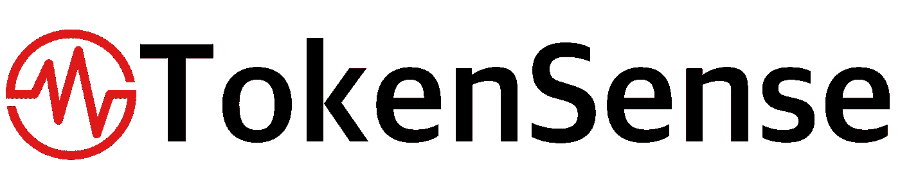

# 摘要

我已经建立了一个(非货币化，不经常更新，投资组合项目)网络应用程序，跟踪比特币社区的脉搏。我将这个应用程序命名为 [**TokenSense**](https://share.streamlit.io/drwismer/metis_unsupervised_learning_module/main/tokensense.py) ，它利用各种价格信息、活动指标和情绪指标，为比特币买家和卖家的总体情绪提供可操作的见解。我还使用了**无监督聚类技术**来根据不同的情绪和活动水平对历史日期进行分组。最近市场过热了吗？它是扁平的吗？TokenSense 可以提供更清晰的画面，也可以更深入。使用**主题建模**和**情感分析**，TokenSense 计算并可视化新闻文章主题随时间的流行度和情感。

[点击此处](https://share.streamlit.io/drwismer/metis_unsupervised_learning_module/main/tokensense.py)访问 TokenSense。确保使用下拉菜单滚动浏览可用的仪表板。

该项目作为 [Metis 数据科学训练营](https://www.thisismetis.com/bootcamps/online-data-science-bootcamp)的一部分完成。

访问我的 [GitHub 知识库](https://github.com/drwismer/metis_unsupervised_learning_module)获取项目评论和该项目的所有代码。

访问我的 YouTube 频道，观看该项目的 powerpoint 演示文稿和 web 应用程序和项目代码的完整演示。

# 项目设计

这个项目在一定程度上是为了提供一幅截至选定时间点的比特币社区的总体情绪图。它还旨在提供历史背景，允许用户挖掘过去的趋势，并对未来可能发生的事情做出结论。为了实现这一点，我开始构建两个主要功能:

## 1.情感按日期聚类

使用三种类型的指标对日期进行聚类:比特币价格水平指标、社区活动指标和情绪指标。这些指标构成了一个非常有用的仪表板，可以将一个给定的日期与价格、活动和情绪指标的历史分布进行比较。通过根据当前价格相对于历史高点的位置、比特币市场和社区的活跃程度以及情绪水平对日期进行聚类，我们可以判断比特币社区何时感到沮丧、兴奋或介于两者之间。通过研究过去聚类的趋势，我们也许能够对未来的价格变动做出更有根据的猜测。导航到 web 应用程序中的**情感聚类分析**仪表板，查看历史日期的聚类。

## 2.主题建模、流行度和情感

从 2017 年 1 月到 2021 年 6 月的新闻文章被聚集到各种有凝聚力的主题中。文章主题分布用于按日期生成平均主题分布，这允许跟踪主题随时间的流行程度。你可以在 [TokenSense](https://share.streamlit.io/drwismer/metis_unsupervised_learning_module/main/tokensense.py) 或 [Tableau 公共仪表盘](https://public.tableau.com/app/profile/david.wismer/viz/TokenSense-BitcoinSentimentAnalysis/TopicPrevalenceandSentiment)上看到这一点。除了查看哪些主题在受欢迎程度方面上升和下降，还可以通过基于主题分布为每篇文章分配主导主题来逐个主题地生成情感分析。通过对每天的文章进行平均，我们可以跟踪主题的极性和主观性随时间的变化。

# 数据收集和准备

要查看数据收集的代码，请访问以下 GitHub 链接:

*   [网页刮 Jupyter 笔记本](https://github.com/drwismer/metis_unsupervised_learning_module/blob/main/Bitcoin%20Sentiment%20-%20Web%20Scraping%20-%20Articles.ipynb)
*   [谷歌和 Reddit Python 脚本](https://github.com/drwismer/metis_unsupervised_learning_module/blob/main/update_db_sentiment.ipynb)
*   [金融数据 Python 脚本](https://github.com/drwismer/metis_unsupervised_learning_module/blob/main/update_db_financial.ipynb)

这个项目需要大量的文本数据来分析话题流行度和情绪如何随时间变化。除了文本数据，我还需要获得同一时间段的活动和价格相关信息。我获得的数据详述如下。

## 文本数据

*   **60，000 篇新闻文章** (19，000 篇用于主题建模)——我使用[硒](https://selenium-python.readthedocs.io/)和[美汤](https://beautiful-soup-4.readthedocs.io/en/latest/)的组合构建了四个独立的**网页抓取器**。我刮了四个网站找新文章:[Bitcoin.com](https://news.bitcoin.com/)，[BitcoinMagazine.com](https://bitcoinmagazine.com/)，[CoinTelegraph.com](https://cointelegraph.com/)，[CryptoSlate.com](https://cryptoslate.com/)。获得的文章日期从 2013 年 1 月到 2021 年 6 月，但 2017 年之前的文章太稀疏。对于主题建模，我排除了所有发表日期在 2017 年 1 月 1 日之前的文章。
*   **115，000 条 Reddit 评论**——使用 [PRAW 图书馆和 Reddit API](https://praw.readthedocs.io/en/stable/) ，我从 2018 年 1 月到 2021 年 6 月的 r/Bitcoin 子编辑中的每个每日讨论主题中获得了前 100 条评论的文本数据。

## 活动数据

*   Reddit 活动 —除了文本数据，我还获得了每个每日讨论主题的评论总数，作为 Reddit 活动的代理。
*   **谷歌活动** —我使用 [PyTrends](/the-data-science-publication/how-to-use-the-pytrends-api-to-get-google-trends-data-4378acbaaa8a#:~:text=Pytrends%2C%20according%20to%20the%20Pytrends,ability%20to%20use%20the%20library.) 库获取了 2015 年 1 月至 2018 年 6 月期间“比特币”关键词的谷歌活动。
*   **活动地址** —使用 [Glassnode API](https://docs.glassnode.com/api/addresses) 从 Glassnode.com 获得。

## 链上指标

*   **未实现净损益**(NUPL)——使用 Glassnode API 从 Glassnode.com 获得。
*   **净传输量** (NTV) —使用 Glassnode API 从 Glassnode.com 获得。

## 特征工程和数据转换

*   **与历史高点的比较** —对于许多特征，尤其是价格和活动特征，历史峰值往往是抛物线。将这些指标从原始形式转换为与前一历史高点的比较是有益的。这样做是为了价格、活跃地址和 Reddit 活动。
*   **每日情绪指标** — [TextBlob](https://textblob.readthedocs.io/en/dev/) 用于为我数据库中的每条 Reddit 评论和新闻文章生成极性(积极/消极)和主观性(固执己见)指标。我使用文档特定情感来计算 Reddit 和新闻文章的日平均极性和主观性，这两者都在聚类练习中使用。
*   **标准缩放** —使用 Sci-kit 学习库中的 StandardScaler 对所有数据进行缩放。

# 主成分分析和聚类——情感分析

要查看 PCA 和日期的情感聚类，请访问 GitHub 上我的 [Jupyter 笔记本](https://github.com/drwismer/metis_unsupervised_learning_module/blob/main/Bitcoin%20Sentiment%20-%20PCA%20and%20Clustering%20-%20Sentiment.ipynb)。

在数据收集和特征工程之后，是时候执行[主成分分析](https://towardsdatascience.com/pca-using-python-scikit-learn-e653f8989e60) (PCA)和使用我所掌握的特征通过集体情绪聚类日期了。聚类功能分为三类:

## **价格水平**

*   **比特币价格与之前的历史高点** —当价格达到新的历史高点时，市场会对它可以达到的高度感到兴奋。在急剧下跌期间，市场变得恐惧。
*   **净未实现损益**(NUPL)——NUPL 是一个传统的情绪指标，反映了目前拥有比特币的人在货币中的比例。
*   **净转移量**(NTV)——NTV 是衡量比特币是从存储(如硬件钱包)流入交易所还是从交易所流出的指标。该理论认为，比特币往往会在抛售之前流入交易所，当投资者打算长期持有比特币时，就会流出交易所。

## **活动水平**

*   **活动地址与历史最高值** —该指标反映了事务中涉及的地址数量与之前峰值的对比。
*   **谷歌活动** —这反映了谷歌趋势数据。
*   **Reddit 活跃度对比之前的历史高点**——在比特币 subreddit 上有一个每日讨论线程。这个指标反映了每天有多少评论被发表在每日线程上。

## **情绪水平，使用文本块**确定

*   **Reddit 极性** —这一指标反映了给定日期评论的平均正面/负面情绪
*   **Reddit 主观性** —这一指标反映了给定日期内评论的平均固执己见程度。
*   **新闻文章极性** —这一指标反映了给定日期新闻文章的平均正面/负面情绪。
*   **新闻文章主观性** —这一指标反映了给定日期内新闻文章的平均固执己见程度。

我很乐意将组件减少到能够解释我的方差**的 95%的水平。这是五氯苯甲醚的常见阈值。在进行 PCA 时，我能够将 11 个组件减少到 8 个组件，同时仍然满足 95%的阈值，如下所示。**

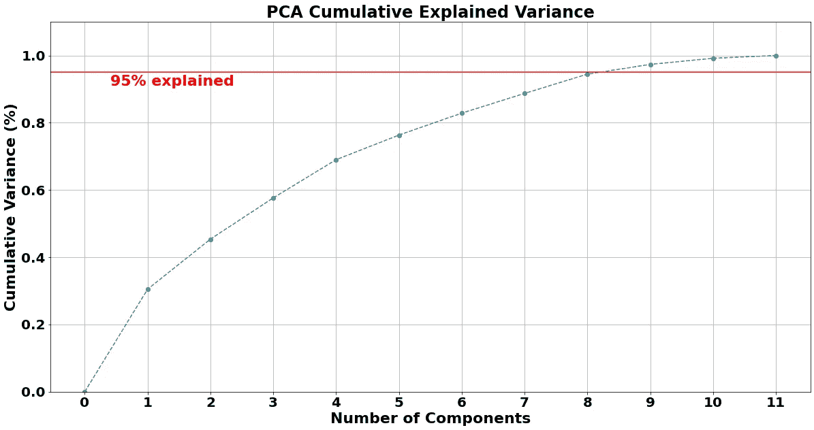

在确定了 8 个主成分后，我将 PCA 应用于我的标准缩放数据，并测试了各种不同的聚类方法:

*   k 均值
*   高斯混合
*   DBSCAN 和 HDBSCAN
*   均值漂移
*   层次凝聚聚类

基于密度的算法(DBSCAN 和 HDBSCAN)，即使调整了参数，也没有返回合理的聚类，因为我的许多特征都相当密集地集中在平均值周围。K-Means、HAC 和高斯混合方法返回更合理的聚类。**高斯混合**脱颖而出，因为它能够挑出比 K-Means 和 HAC 更多的椭圆形。由于我的项目关注的是**时间序列数据**，其中一些长方形形状的形成是有道理的，因为这些特征有时可能会在几天、几周或几个月的过程中缓慢变化。

下面，您将首先看到显示几种聚类方法的前 3 个成分的 PCA 的图。HDBSCAN 与不同密度的簇进行斗争，高斯混合簇比 K-Means 和 HAC 具有更多的长方形形状。

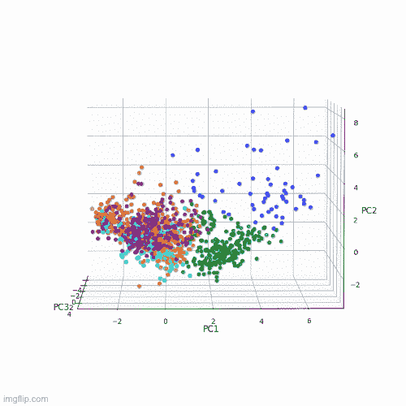

K-Means Clustering PCA

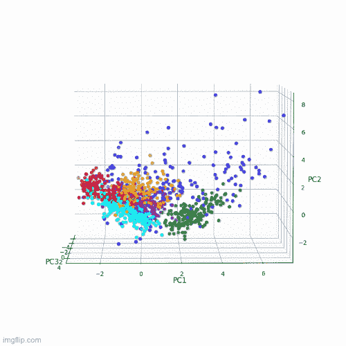

Gaussian Mixture Clustering PCA

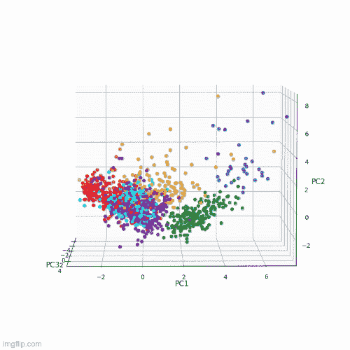

Hierarchical Agglomerative Clustering (HAC) PCA

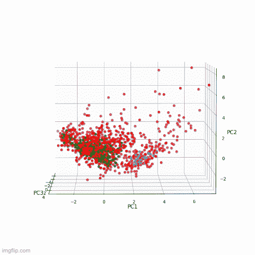

HDBSCAN Clustering PCA

**注意:**如果你对制作这样的 3D 绘图 GIF 感兴趣，[点击这个链接](https://aegis4048.github.io/mutiple_linear_regression_and_visualization_in_python)！

接下来，看看按日期排列的 K-均值和高斯混合聚类，显示在价格与历史高点面积图中。这些图显示了高斯混合法如何比 K-Means 更好地将天数和周数聚集在一起。需要更多的分析来确定一种特定的聚类方法是否比另一种更有价值(即预测能力)。两者都可以在我的 [Tableau 仪表盘](https://public.tableau.com/app/profile/david.wismer/viz/TokenSense-BitcoinSentimentAnalysis/SentimentClusters)中查看，HAC 也是。

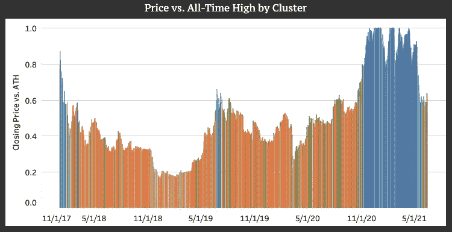

K-Means Clusters by Date

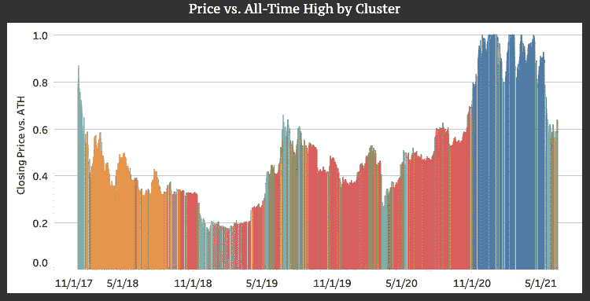

Gaussian Mixture CLusters by Date

# 选择聚类的数量

## k 均值

我使用了**肘方法**和**侧影评分回顾**来帮助确定 K 均值聚类的最佳数量。在这两种情况下，6 到 9 个集群似乎是合理的。肘图见下文。肘部出现在大约 6-9 个集群中。在下降之前，轮廓分数仅在 2 个聚类(0.26)处达到峰值，并且范围非常接近地从 3 个聚类(0.147)到 10 个聚类(0.133)。最终，我决定只使用 6 个集群，因为性能分数接近顶部，添加任何更多的集群都会导致更困难的解释。

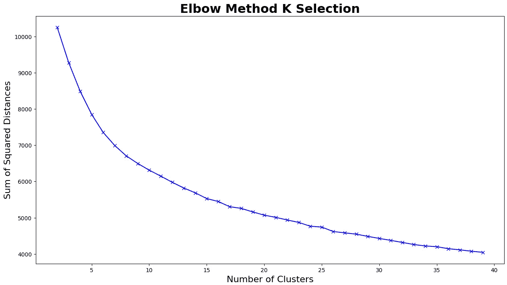

## 高斯混合物

对于高斯混合方法，我绘制了**贝叶斯信息标准** (BIC)和**阿凯克信息标准** (AIC)来帮助确定最佳的聚类数。对于 BIC 和 AIC，该方法包括选择提供最小值的聚类数。如下图所示，BIC 在 4 个集群处达到局部最小值。在合理的集群数量下，AIC 不会接近最小值，但是拐点在 4-6 个集群左右。为了保持聚类方法的一致性，我也为高斯混合选择了 6 个聚类。

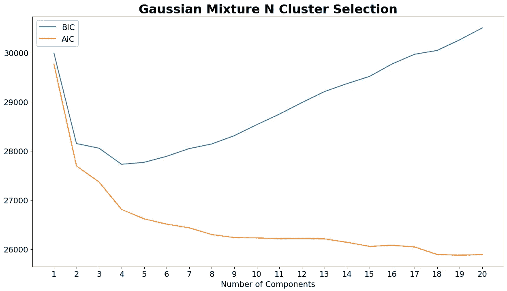

# 主题建模

要查看主题建模代码，请前往我的 GitHub 上的 [Jupyter 笔记本](https://github.com/drwismer/metis_unsupervised_learning_module/blob/main/Bitcoin%20Sentiment%20-%20Topic%20Modeling%20-%20Articles.ipynb)。

真正有趣的东西！到目前为止，我已经展示了一些基于文本的分析，但这实际上只是将文章和 Reddit 评论扔进 TextBlob 情绪分析器工具的问题。主题建模是开始变得有趣的地方。

我的主题建模的最终目标是从与比特币相关的新闻文章中产生明显独特的主题，然后随着时间的推移跟踪主题分布(或流行度)和主题情绪。我决定使用 Gensim 库中的**潜在狄利克雷分配模型**。 [Gensim LDA 模型](https://radimrehurek.com/gensim/models/ldamodel.html)返回每篇文章的主题分布，以及主题内的术语分布，这允许非常有趣的可视化，可以帮助用户深入了解各个主题。

在进入主题建模过程之前，我想强烈推荐 Selva Prabhakaran 的一篇文章。[这篇文章](https://www.machinelearningplus.com/nlp/topic-modeling-gensim-python/#2prerequisitesdownloadnltkstopwordsandspacymodelforlemmatization)从头到尾介绍了如何使用 Gensim 库建立一个 LDA 主题建模项目，并且对我自己的项目非常有帮助。

我的主题建模过程如下:

1.  **去除数据中的噪声。首先，我需要去掉文章中无关的文字。这包括像免责声明，图像学分，或其他文章的建议等句子。接下来，我排除了太短或与比特币无关的文章。我删除了所有不超过 200 个单词的文章(使用 [NLTK](https://www.nltk.org/) 分词器确定)。我还删除了标题中不包含“比特币”或“BTC”以及文章正文中由“比特币”或“BTC”组成的字数不超过 1%的文章我还删除了“比特币”和“BTC”占字数不到 0.5%的文章，即使标题中包含“比特币”或“BTC”。最后，由于数据稀疏，我排除了 2017 年之前的所有数据。在这个截止日期之后，我这段时间里的每一天都至少有几篇文章。**
2.  **用 Gensim 重塑 LDA 建模数据。**
    —标记文章。
    —删除停用词(从 NLTK 加载)。
    —生成二元模型和三元模型。
    —对数据进行符号化。我只保留了某些词类:名词、形容词、动词和副词。
    —创建词典(词汇)和语料库。
    —过滤掉出现在 60%或以上的文章中的单词和出现在 50 篇或以下的文章中的单词。
3.  **LDA 参数调谐。**我构建了一个模拟网格搜索的自定义函数，以便找到使我的 LDA 模型的**一致性分数**最大化并且理想情况下使**困惑分数**最小化的参数组合。通过参数调优，我能够将一致性分数从没有调优时的 0.472 提高到调优后的 0.523，提高了近 11%。困惑没有明显改变。更重要的是，最佳模型产生的主题相当容易区分。下面列出了网格搜索中包含的参数以及网格搜索确定的最优值:
    —数量 _ 主题:25
    —衰减:0.5
    —每字 _ 主题:真
    —更新 _ 每:1
    —阿尔法:“非对称”
    —块大小:1500
    —遍数:10
    —迭代次数:200
4.  **文章主题标注。创建主题后，我为每篇文章创建了一个主题分布矩阵。然后，我计算了每篇文章的**主导主题**和主导主题份额百分比。这个矩阵是随着时间的推移跟踪主题情绪的关键输入。**
5.  **计算每日患病率。**因为我已经确定了数据库中每篇文章的主题分布，所以我能够对该时间段内每个日期的文章进行平均，以确定任何给定日期的**主题分布。在[的 Tableau 仪表盘](https://public.tableau.com/app/profile/david.wismer/viz/TokenSense-BitcoinSentimentAnalysis/TopicPrevalenceandSentiment)中，我可以看到语料库中的主题分布在数据的时间段内是如何变化的。下面可以看到仪表板的截图。**
6.  **标注主题。**填充 Tableau 仪表板之前的最后一步是为我的 25 个主题中的每一个创建合理的标签。这需要人情味。话题标签从“比特币 ETF”到“政府监管”再到“区块链创新”。有些主题虽然可以区分，但多少有些关联。例如，“犯罪”、“黑客”和“诉讼”都有共同的主题。我在一个 [Tableau dashboard](https://public.tableau.com/app/profile/david.wismer/viz/TokenSense-BitcoinSentimentAnalysis/TopicDeepDive) 中包含了跟踪主题组合的情感和流行度的功能。
7.  **随时间可视化话题情绪。**作为我已经完成的聚类练习的一部分，我对每篇文章进行了极性和主观性评分。在主题建模之后，我有了每篇文章的主要主题。在 Tableau 中，我能够创建一些有用的可视化工具来显示话题情绪的趋势。其中一些如下图所示。

# 通过 Tableau 和 Streamlit 交付调查结果

要查看 Streamlit 代码，[请点击链接](https://github.com/drwismer/metis_unsupervised_learning_module/blob/main/tokensense.py)查看我的 GitHub。

为了显示主题建模、情感聚类等等，我创建了一个名为 TokenSense 的 [Streamlit 应用程序(我没有更新这个网站，因为它纯粹是一个作品集)。我鼓励你访问这个网站，自己做一次深度探索。确保单击下拉菜单以查看所有可用的工具。这个 web 应用程序有几个 Tableau 仪表板。如果您想了解我是如何构建仪表板的，其中包括几个参数、过滤器和计算字段，请访问我的](https://share.streamlit.io/drwismer/metis_unsupervised_learning_module/main/tokensense.py) [Tableau 公共配置文件](https://public.tableau.com/app/profile/david.wismer)。

如果你懒得去查看 Streamlit 应用程序或 Tableau 公共仪表板，请参见下面的几张截图。

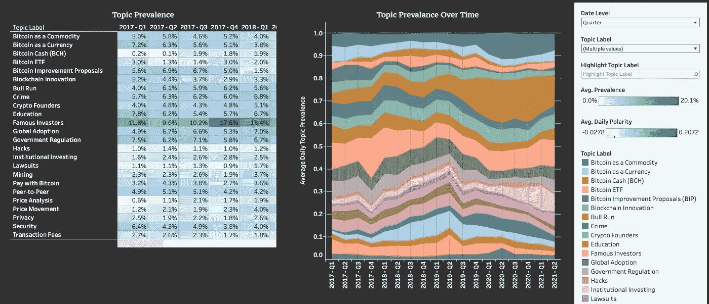

[Link to **Topic Prevalence** Dashboard](https://public.tableau.com/app/profile/david.wismer/viz/TokenSense-BitcoinSentimentAnalysis/TopicPrevalenceandSentiment)

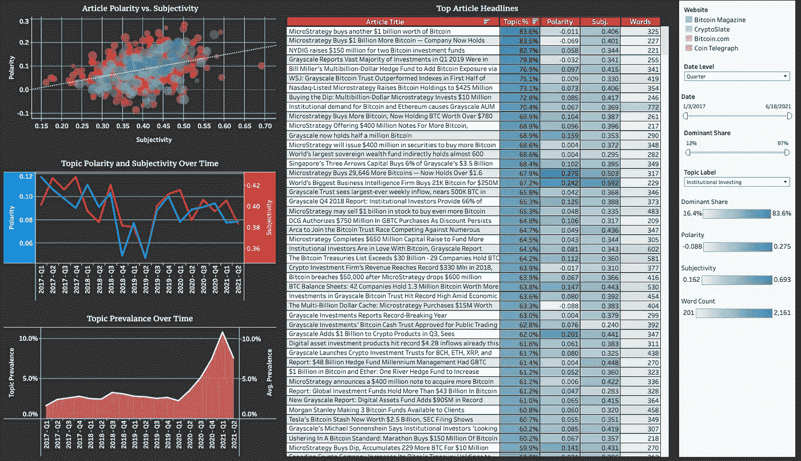

[Link to **Topic Deep Dive** Dashboard](https://public.tableau.com/app/profile/david.wismer/viz/TokenSense-BitcoinSentimentAnalysis/TopicDeepDive)

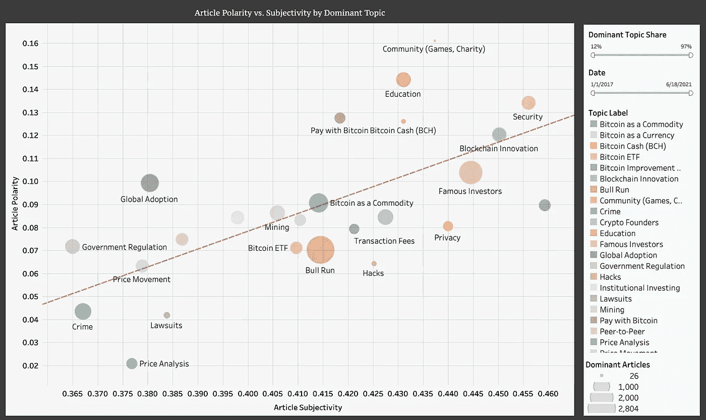

[Link to **Polarity vs Subjectivity** Dashboard](https://public.tableau.com/app/profile/david.wismer/viz/TokenSense-BitcoinSentimentAnalysis/TopicPolarityandSubjectivity)

如果您已经做到了这一步，感谢您的关注！如果您有任何意见、问题或批评，请随时在评论中或 LinkedIn 上联系我们。

> 加入 Coinmonks [电报频道](https://t.me/coincodecap)和 [Youtube 频道](https://www.youtube.com/c/coinmonks/videos)了解加密交易和投资

## 另外，阅读

*   [电网交易机器人](https://blog.coincodecap.com/grid-trading) | [Cryptohopper 审查](/coinmonks/cryptohopper-review-a388ff5bae88) | [Bexplus 审查](https://blog.coincodecap.com/bexplus-review)
*   [7 个最佳零费用加密交易平台](https://blog.coincodecap.com/zero-fee-crypto-exchanges)
*   [分散交易所](https://blog.coincodecap.com/what-are-decentralized-exchanges) | [比特 FIP](https://blog.coincodecap.com/bitbns-fip) | [Pionex 审查](https://blog.coincodecap.com/pionex-review-exchange-with-crypto-trading-bot)
*   [用信用卡购买密码的 10 个最佳地点](https://blog.coincodecap.com/buy-crypto-with-credit-card)
*   [3Commas 对 Pionex 对 Cryptohopper](https://blog.coincodecap.com/3commas-vs-pionex-vs-cryptohopper)
*   [加密复制交易平台](/coinmonks/top-10-crypto-copy-trading-platforms-for-beginners-d0c37c7d698c) | [如何在 WazirX 上购买比特币](/coinmonks/buy-bitcoin-on-wazirx-2d12b7989af1)
*   [CoinLoan 点评](https://blog.coincodecap.com/coinloan-review)|[Crypto.com 点评](/coinmonks/crypto-com-review-f143dca1f74c) | [火币保证金交易](/coinmonks/huobi-margin-trading-b3b06cdc1519)
*   [Bookmap 评论](https://blog.coincodecap.com/bookmap-review-2021-best-trading-software) | [美国 5 大最佳加密交易所](https://blog.coincodecap.com/crypto-exchange-usa)
*   最佳加密[硬件钱包](/coinmonks/hardware-wallets-dfa1211730c6) | [Bitbns 评论](/coinmonks/bitbns-review-38256a07e161)
*   [新加坡十大最佳密码交易所](https://blog.coincodecap.com/crypto-exchange-in-singapore) | [收购 AXS](https://blog.coincodecap.com/buy-axs-token)
*   [投资印度的最佳加密软件](https://blog.coincodecap.com/best-crypto-to-invest-in-india-in-2021) | [WazirX P2P](https://blog.coincodecap.com/wazirx-p2p)
*   [加拿大最佳加密交易机器人](https://blog.coincodecap.com/5-best-crypto-trading-bots-in-canada) | [库币评论](https://blog.coincodecap.com/kucoin-review)
*   [火币加密交易信号](https://blog.coincodecap.com/huobi-crypto-trading-signals) | [HitBTC 审核](/coinmonks/hitbtc-review-c5143c5d53c2)
*   [如何在 FTX 交易所交易期货](https://blog.coincodecap.com/ftx-futures-trading) | [OKEx vs 币安](https://blog.coincodecap.com/okex-vs-binance)
*   [OKEx vs KuCoin](https://blog.coincodecap.com/okex-kucoin) | [摄氏替代品](https://blog.coincodecap.com/celsius-alternatives) | [如何购买 VeChain](https://blog.coincodecap.com/buy-vechain)
*   [币安期货交易](https://blog.coincodecap.com/binance-futures-trading)|[3 commas vs Mudrex vs eToro](https://blog.coincodecap.com/mudrex-3commas-etoro)
*   [如何购买 Monero](https://blog.coincodecap.com/buy-monero) | [IDEX 评论](https://blog.coincodecap.com/idex-review) | [BitKan 交易机器人](https://blog.coincodecap.com/bitkan-trading-bot)
*   [尤霍德勒 vs 考尼洛 vs 霍德诺特](/coinmonks/youhodler-vs-coinloan-vs-hodlnaut-b1050acde55a) | [Cryptohopper vs 哈斯博特](https://blog.coincodecap.com/cryptohopper-vs-haasbot)
*   [顶级付费加密货币和区块链课程](https://blog.coincodecap.com/blockchain-courses) | [币安评论](/coinmonks/binance-review-ee10d3bf3b6e)
*   [MXC 交易所评论](/coinmonks/mxc-exchange-review-3af0ec1cba8c) | [Pionex vs 币安](https://blog.coincodecap.com/pionex-vs-binance) | [Pionex 套利机器人](https://blog.coincodecap.com/pionex-arbitrage-bot)
*   [如何在印度购买比特币？](/coinmonks/buy-bitcoin-in-india-feb50ddfef94) | [WazirX 审核](/coinmonks/wazirx-review-5c811b074f5b) | [BitMEX 审核](https://blog.coincodecap.com/bitmex-review)