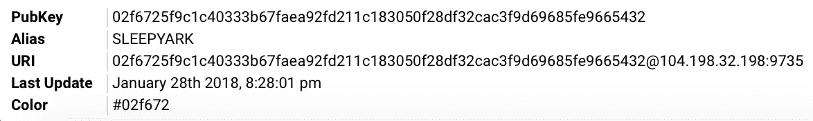
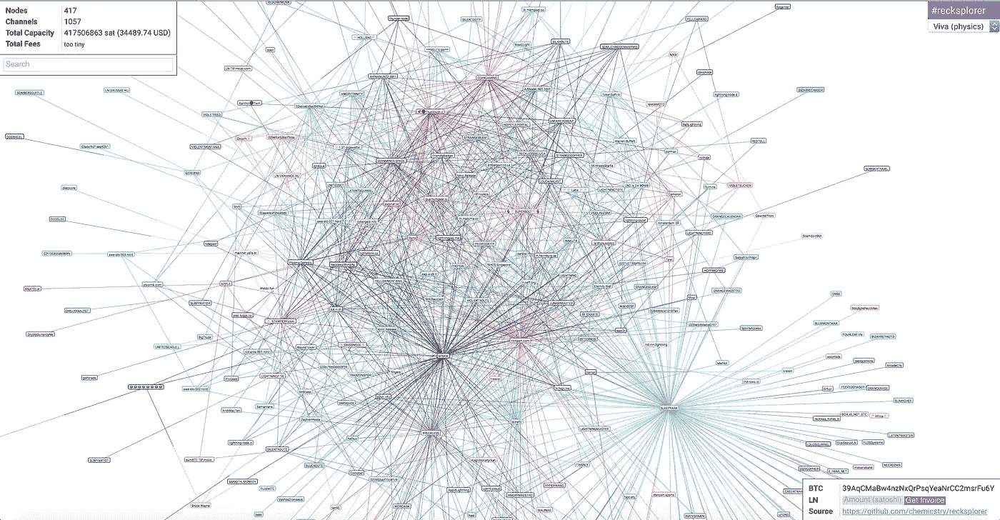
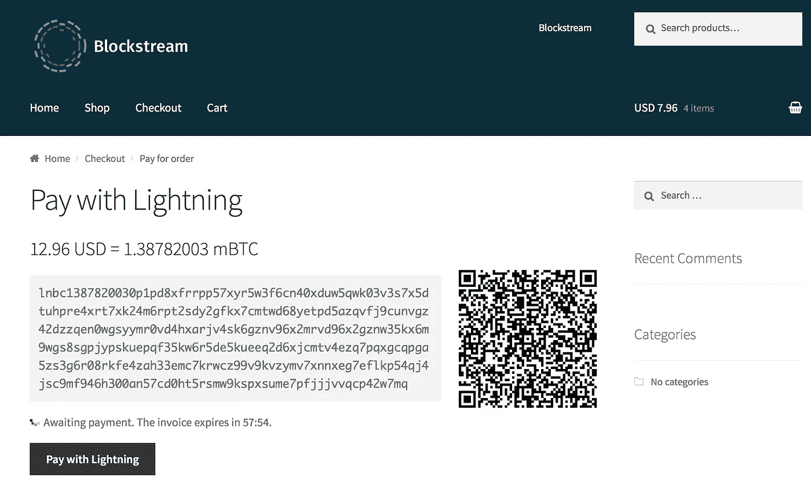
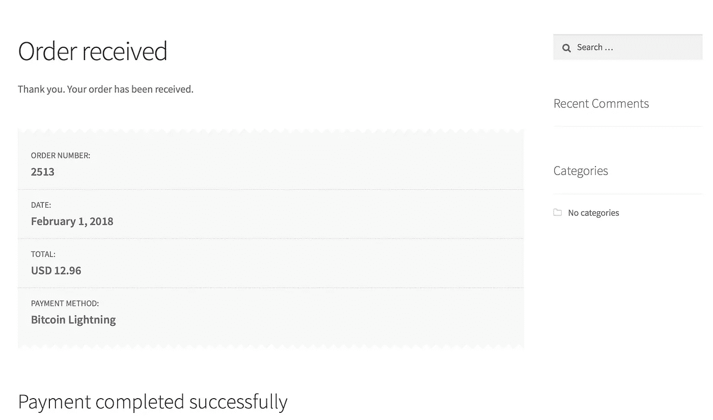

# 比特币——在 mainnet 上设置自己的⚡lightning ⚡节点！

> 原文：<https://medium.com/coinmonks/bitcoin-setup-your-own-lightning-node-on-mainnet-94337bda09fa?source=collection_archive---------0----------------------->

在过去的两年里，我一直在关注比特币和加密货币。我想我看过所有围绕题目的纪录片！安德烈亚斯·安东诺普洛斯(Andreas Antonopolous)的《掌握比特币》(Mastering Bitcoin)是一个很好的资源。你应该在 youtube 上看看他的演讲。

我希望我能参与到比特币早期运行自己的节点或采矿设备的过程中。但现在，随着即将到来的闪电网络和成为比特币第二层扩展解决方案一部分的机会，我知道我必须运行自己的闪电节点，并参与其中。这个帖子将描述我的经历。

> [在您的收件箱中直接获得最佳软件交易](https://coincodecap.com/?utm_source=coinmonks)

[](https://coincodecap.com/?utm_source=coinmonks)

*免责声明:lightning 网络仍未准备好投入生产，不建议用于高价值交易。当前的实现可能包含可能导致资金损失的错误。请在完成自己的尽职调查后继续。*


## 入门指南

我有自己的 Ubuntu 16.04 服务器，有足够的存储空间与比特币区块链同步。你还需要 bitcoind 和 lightningd。以下是步骤:

1.  安装 bitcoind:

```
$ sudo apt-get install software-properties-common
$ sudo add-apt-repository ppa:bitcoin/bitcoin
$ sudo apt-get update
$ sudo apt-get install -y bitcoind
$ bitcoind --daemon --datadir=<optional/path/to/bitcoind>
```

您可以指定下载区块链数据的可选数据目录。在我的设置中，由于空间需求(169 GB，每 10 分钟增加 1 MB ),我使用外部安装的存储器作为我的数据目录。

2.允许节点与区块链完全同步。监控进度:

```
$ bitcoin-cli --datadir=<optional/path/to/bitcoin> getinfo{
"deprecation-warning": "WARNING: getinfo is deprecated and will be fully removed in 0.16\. Projects should transition to using getblockchaininfo, getnetworkinfo, and getwalletinfo before upgrading to 0.16",
"version": 150100,
"protocolversion": 70015,
"walletversion": 139900,
"balance": 0.00000000,
"blocks": 507134,
"timeoffset": -1,
"connections": 42,
"proxy": "",
"difficulty": 2603077300218.593,
"testnet": false,
"keypoololdest": 1516978369,
"keypoolsize": 2000,
"paytxfee": 0.00000000,
"relayfee": 0.00001000,
"errors": ""
}
```

注意块数。您将需要同步到当前块高度。你可以在这里查看当前高度[。](https://blockchain.info)

3.安装照明设备 d:

```
$ git clone https://github.com/ElementsProject/lightning.git
$ cd lightning
$ make
$ screen -S lightningd
$ lightningd --alias=<your_alias> --rgb=<your_hex_color_value> --network=bitcoin --lightning-dir=<optional/path/to/lightningd> --bitcoin-datadir <optional/path/to/bitcoind> --log-level=debug[CTRL A, then D] to detach the screen session. You can reattach with: screen -r lightningd
```

您还可以为 lightning 指定一个可选的数据目录。您还需要指定您的 bitcoind 数据目录。

## 你的闪电节点的初始设置

4.获得一个闪电存款地址，以便您向其发送资金(我放入了 0.003BTC)。把这个地址想象成你的钱包:

```
$ lightning-cli newaddr
{ "address" : "[39b4uZiuuDfCdymLs3mapAPagEWp2u9mVr](https://blockchain.info/address/39b4uZiuuDfCdymLs3mapAPagEWp2u9mVr)" }
```

您可以查看您的余额/资金:

```
$ lightning-cli --lightning-dir=<optional/path/to/lightning> listfunds
{ "outputs" :
[
{ "txid" : "a7f2741a0950019c020caad26f0c3600d2f20e8f85344bf23b0153c7973489a6", "output" : 0, "value" : 49117 },
{ "txid" : "42da2d234675e08ea21ab64ec63638529bdef29d560cf53d54b78771376a0654", "output" : 0, "value" : 221965 }
]
}
```

## 设置您的闪电支付渠道

5.连接到另一个 lightning 节点以创建支付通道(我连接到 SLEEPYARK，它看起来连接得非常好):



```
$ lightning-cli --lightning-dir=<optional/path/to/lightning> connect 02f6725f9c1c40333b67faea92fd211c183050f28df32cac3f9d69685fe9665432 104.198.32.198 9735
```

查看[闪电网络](https://lnmainnet.gaben.win)的当前部署。此时，我们在 mainnet 上的节点数高达 417 个！



您可以与您的同行验证渠道状态:

```
$ lightning-cli --lightning-dir=<optional/path/to/lightning> listpeers{ "peers" :
[
{ "state" : "**GOSSIPING**", "id" : "02f6725f9c1c40333b67faea92fd211c183050f28df32cac3f9d69685fe9665432", "netaddr" :
[ "104.198.32.198:9735" ], "connected" : true, "owner" : "lightning_gossipd" }
]
}
```

6.现在，你需要为这个支付渠道提供资金。您需要指定对等体 id 和 satoshi 数量(在我的例子中，230000 Satoshi/0.0023 BTC):

```
$ lightning-cli --lightning-dir=<optional/path/to/lightning> fundchannel 02f6725f9c1c40333b67faea92fd211c183050f28df32cac3f9d69685fe9665432 230000{ "tx" : "0200000000010254066a377187b7543df50c569df2de9b523836c64eb61aa28ee07546232dda420000000000ffffffffa6893497c753013bf24b34858f0ef2d200360c6fd2aa0c029c0150091a74f2a70000000000ffffffff025b120000000000001600149befef0cd1e1e281d9efa23aa275d98d64fdb9ae7082030000000000220020f77d81d394fdce27f7f4419464723cd1b1af927600d57362024d75bbe278288902483045022100e0ffe33682c8cc2b9fcd087ac5616ea2034e370f846f212c879c162fd769aca002205e768ed3bdf6f81ffdc9ebe2f8f2fc37e967dc28296ba0136379e58cb621f4b8012103be9c9ff74a27576357def749de3d8bdf71678a6f3299613832fb6a4069cdced102473044022006ba24e444dbc229c05892ce834560a795a5966688f2470dc79652c9e63b1830022064cb139d7355ed8ed1ae1d381b8db7bd3df86b07a4655323c032fed2ecbe5378012103c422f654d078785baddf803d586d29dd188deaf41801fe4e73b3f3f8e9666c5a00000000", "txid" : "[066363dcd11c9f5268fee778aed72f290bef3bfa2a32d77611fbd4a3ec7f0ef3](https://blockchain.info/tx/066363dcd11c9f5268fee778aed72f290bef3bfa2a32d77611fbd4a3ec7f0ef3)" }
```

记下 txid 值。这是您可以在区块链上查找的资金交易散列。继续操作之前，请等待至少 6 次确认。与此同时，您的同级状态应该是这样的:

```
$ lightning-cli --lightning-dir=<optional/path/to/lightning> listpeers{ "peers" :
{ "id" : "02f6725f9c1c40333b67faea92fd211c183050f28df32cac3f9d69685fe9665432", "connected" : true, "netaddr" :
[ "104.198.32.198:9735" ], "channels" :
[
{ "state" : "**CHANNELD_AWAITING_LOCKIN**", "owner" : "lightning_channeld", "funding_txid" : "066363dcd11c9f5268fee778aed72f290bef3bfa2a32d77611fbd4a3ec7f0ef3", "msatoshi_to_us" : 230000000, "msatoshi_total" : 230000000, "dust_limit_satoshis" : 546, "max_htlc_value_in_flight_msat" : 18446744073709551615, "channel_reserve_satoshis" : 0, "htlc_minimum_msat" : 0, "to_self_delay" : 144, "max_accepted_htlcs" : 483 }
]
}
]
}
```

6 次确认后，寻找**通道 _ 正常**状态:

```
$ lightning-cli --lightning-dir=<optional/path/to/lightning> listpeers{ "peers" :
[
{ "id" : "02f6725f9c1c40333b67faea92fd211c183050f28df32cac3f9d69685fe9665432", "connected" : true, "netaddr" :
[ "104.198.32.198:9735" ], "channels" :
[
{ "state" : "**CHANNELD_NORMAL**", "owner" : "lightning_channeld", "short_channel_id" : "507047:2309:1", "funding_txid" : "066363dcd11c9f5268fee778aed72f290bef3bfa2a32d77611fbd4a3ec7f0ef3", "msatoshi_to_us" : 91217997, "msatoshi_total" : 230000000, "dust_limit_satoshis" : 546, "max_htlc_value_in_flight_msat" : 18446744073709551615, "channel_reserve_satoshis" : 0, "htlc_minimum_msat" : 0, "to_self_delay" : 144, "max_accepted_htlcs" : 483
}
]
}
]
}
```

此时，您将看到您的 lightning wallet 余额发生了变化，以反映为支付渠道提供资金所做的扣除:

```
$ lightning-cli --lightning-dir=<optional/path/to/lightning> listfunds{ "outputs" :
[
{ "txid" : "066363dcd11c9f5268fee778aed72f290bef3bfa2a32d77611fbd4a3ec7f0ef3", "output" : 0, "value" : 4699 }
]
}
```

## 不计后果，让你的闪电付款！！

7.我在[街区商店](https://store.blockstream.com)上购买了一些贴纸。发票看起来是这样的:



你可以解码这张 BOLT11 付款编码发票。您将看到所有必需的付款细节都包括在内:

```
$ lightning-cli --lightning-dir=<optional/path/to/lightning> decodepay lnbc1387820030p1pd8xfrrpp57xyr5w3f6cn40xduw5qwk03v3s7x5dtuhpre4xrt7xk24m6rpt2sdy2gfkx7cmtwd68yetpd5azqvfj9cunvgz42dzzqen0wgsyymr0vd4hxarjv4sk6gznv96x2mrvd96x2gznw35kx6m9wgs8sgpjypskuepqf35kw6r5de5kueeq2d6xjcmtv4ezq7pqxgcqpga5zs3g6r08rkfe4zah33emc7krwcz99v9kvzymv7xnnxeg7eflkp54qj4jsc9mf946h300an57cd0ht5rsmw9kspxsume7pfjjjvvqcp42w7mq{ "currency" : "bc", "timestamp" : 1517495395, "created_at" : 1517495395, "expiry" : 3600, "payee" : "02f6725f9c1c40333b67faea92fd211c183050f28df32cac3f9d69685fe9665432", "msatoshi" : 138782003, "description" : "Blockstream: 12.96 USD for Blockstream Satellite Sticker x 2 and Lightning Sticker x 2", "min_final_cltv_expiry" : 8, "payment_hash" : "f1883a3a29d6275799bc7500eb3e2c8c3c6a357cb8479a986bf1acaaef430ad5", "signature" : "3045022100ed0508a34379c764e6a2ede31cef1eb0dd8114ac2d98226d9e34e66ca3d94fec02201a5412aca182ed25aeaf17bfb3a7b0d7dd741c36e2da013439bcf82994a4c603" }
```

出于好奇，您可以看到这种支付将如何在闪电网络中进行。看起来块流节点有 9 跳远:

```
$ lightning-cli --lightning-dir=<optional/path/to/lightning> getroute 02f6725f9c1c40333b67faea92fd211c183050f28df32cac3f9d69685fe9665432 138782003 0
{ "route" :
[
{ "id" : "02f6725f9c1c40333b67faea92fd211c183050f28df32cac3f9d69685fe9665432", "channel" : "507047:2309:1", "msatoshi" : 138782003, "delay" : 9 } ]
}
```

最后，你可以付款了(这很快，所以尽量不要眨眼！):

```
$ lightning-cli --lightning-dir=<optional/path/to/lightning> pay lnbc1387820030p1pd8xfrrpp57xyr5w3f6cn40xduw5qwk03v3s7x5dtuhpre4xrt7xk24m6rpt2sdy2gfkx7cmtwd68yetpd5azqvfj9cunvgz42dzzqen0wgsyymr0vd4hxarjv4sk6gznv96x2mrvd96x2gznw35kx6m9wgs8sgpjypskuepqf35kw6r5de5kueeq2d6xjcmtv4ezq7pqxgcqpga5zs3g6r08rkfe4zah33emc7krwcz99v9kvzymv7xnnxeg7eflkp54qj4jsc9mf946h300an57cd0ht5rsmw9kspxsume7pfjjjvvqcp42w7mq{ "preimage" : "1af7e9d5f8942bc7cffb0512441679a7a0f30436706f13621528932c908d8b39" }
```



以下是我的闪电支付经历:

希望有人觉得这有用！感谢所有参与实现这一目标的开发人员。我个人迫不及待地想让它成为主流。