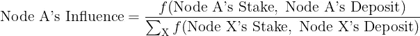

# 比特币、主权和圣杯

> 原文：<https://medium.com/coinmonks/bitcoin-sovereignty-and-the-holy-grail-of-stablecoins-3988b44d9e3a?source=collection_archive---------2----------------------->

this beautiful piece was painted for us by [Andrew Maleski](https://www.deviantart.com/andrewmaleskiart)

如果任务是回答问题*“有任何与金钱相关的应用程序受益于去中心化吗？”*，你会怎么接近？一个途径是科学方法，从实验中收集观察结果，并用这些来反驳或证实一个假设。

运用这种方法，答案显而易见，而且可能令人震惊。

Tether——由美元“支持”的单一集中代币——的日交易量，大于所有“分散”代币的总和。如果我们进一步包括其他集中的代币，如 USDC，币安美元，以及更多，那么分散的应用程序将永远不会在竞争中超过其集中的对手的推测得到了有力的支持。我们甚至还没有接触到央行数字货币！

稍加思考，这一结果应该不会让任何人感到意外，因为货币的效用高于一切，源于其维持稳定购买力的可信度。这与我们的常识是一致的:只要观察任何真实世界的恶性通货膨胀——信誉崩溃——你通常会发现人们恐慌地疯狂兑换美元，而美元是目前世界上最可信的货币。

# 寻找圣杯

将我们的注意力转向集中式稳定硬币(例如，Tether，)与“分散式”稳定硬币(例如，Dai、TerraUSD、Celo Dollar 等)的效用，情况仍然相同。所有这些代币都被设计成数字现金——以一个稳定的单位促进在线支付——人们显然倾向于集中式版本，因为它们更稳定。

尽管这种悲观的状态，还是有希望去中心化的版本有一天会占主导地位。一个圣杯，如果实现，将使这成为现实。

这个圣杯就是在稳定的货币上提供由市场决定的无风险利率。

但无风险利率似乎是一种相当人为的东西，不应该自然而然地出现。毕竟，如果一个人不能承担风险来从投资于他们的资金中获利，他们为什么要提供任何利息作为回报呢？

这就是为什么到目前为止，无风险利率必须由央行提供(通过增税或印钞融资)。无风险利率的高低是一种货币政策工具；控制部分准备金制度中的债务数量。如果没有央行“人为”提供这一利率，经济将会不稳定，在经济低迷时期也很难提供刺激。

那么，随着分散化货币的出现——这可能会让我们找到圣杯——发生了什么变化，以至于无风险利率不再由中央决定(T2 )?答案很简单:比特币。

# 进入主权领土

历史上第一次，中本聪的发明证明了一个点对点网络可以通过不断地为任何愿意运营一个节点的人产生经济激励而自我维持。这些激励来自于使用网络所支付的费用——而且这些费用还在不断流动——因为网络为用户提供了效用。

这听起来有点像政府如何从税收中获得收入，其中一部分作为主权债券的利息支付重新分配给债权人，不是吗？

让我们回忆一下我们之前的博客文章 [***的主要观点:比特币是一件防弹长袍***](/coinmonks/bitcoin-is-a-bulletproof-ball-gown-1426da6522fb) :去中心化的区块链具有极高的防篡改能力，几乎没有应用程序需要这种能力，因为这种权衡不值得。具体来说，比特币具有防篡改能力，可以让一个应用程序甚至连政府都无法有效操纵或审查。但是对于这样的功能，可能有什么合法的应用程序呢？

这就是:允许市场发现货币的“价格”，换句话说，就是利率。为了实现这一点，市场*必须*去中心化。这样，发行货币的国家就可以可信地限制自己影响利率的能力。

但是等等..这听起来不奇怪吗？为什么有人会选择限制自己的权力，更不用说政府了？对其管辖范围内的无风险利率拥有自由裁量权的需要通常是一种不必要的负担，央行希望这种负担能够可信地*和可核实地*置于他们无法触及的地方。比特币使得将这种权力让给一种被视为中立的机制(市场)成为可能。**

正如我们将在下一篇博文中解释的那样，允许市场决定货币的“价格”可以在不放弃货币主权的情况下提高一个国家货币政策的可信度。是..你没听错..以比特币为代表的区块链去中心化技术对政府来说非常有价值。

# 由市场决定的无风险利率

那么，如何才能将来自分散化区块链的激励转化为稳定货币的无风险利率呢？DeFi 的研究人员一直在努力解决这个问题——它远非显而易见。你不能简单地将“*”替换为“ ***稳定存款证明***”——因为安全模型要求通过重大经济损失的风险来阻止不诚实的行为——这在稳定的单位中是站不住脚的。*

*我们的关键见解如下:到目前为止，所有基于令牌的安全模型(例如，利害关系证明)都推导出节点对单个令牌化数量的“影响”，例如，持有本地令牌。这种影响通常最终与节点从参与中获得的收入成比例。例如:*

**

*现在，如果..影响是基于不是一个，而是两个令牌？例如:*

**

*给定函数 *f、*和的特定选择，其中一个代币是稳定币，节点被激励提供委托给它们的稳定币的存款利率，因为这样做将最大化它们的影响，从而最大化它们的利润。这一利率不仅是“无风险的”，因为授权不会将稳定货币的控制权转移给一个节点(我们假设分散网络完全关闭的可能性可以忽略不计)，而且还将处于市场决定的水平。*

*[我们在白皮书](http://files.cambridgecryptographic.com/whitepapers/risk_free_v0.4.pdf)中概述了我们提案的具体细节。*

*综上所述，我们提出以下主张:*

1.  *在市场决定的水平上提供稳定的无风险利率，需要分散化。这是一种竞争优势，是集中的稳定资本所不具备的。*
2.  *我们提出的解决方案会自我产生需求，从而产生分散稳定货币的流动性。*
3.  *当与符号化计算能力(一个被忽视的工作证明实施)结合使用时，无风险利率可以支持反周期货币政策。*

*在我们的下一篇文章中，我们将详细阐述这最后一个观点。正如我们将要解释的，稳定硬币的最终形式是 CBDC。通过采用对等 CBDC，一个国家可以提高其货币的可信度，从而在主权债务方面获得相对于其他国家的竞争优势。*