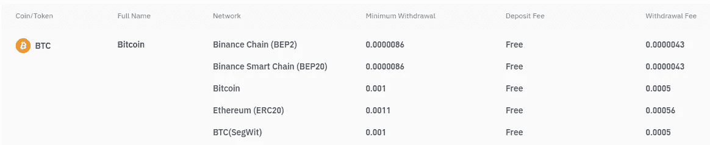
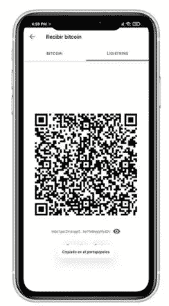
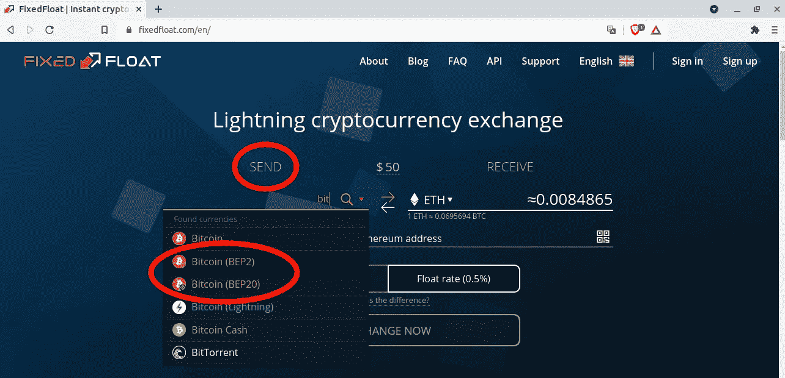
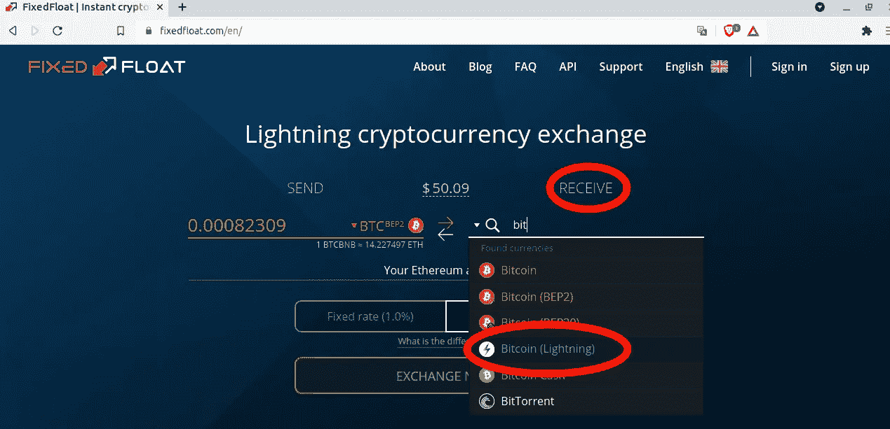
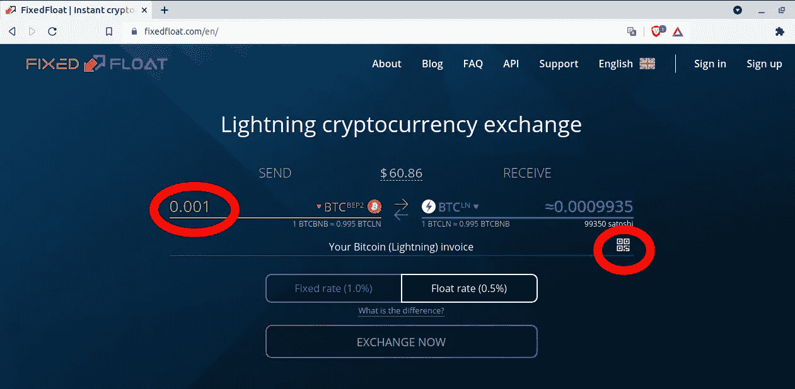
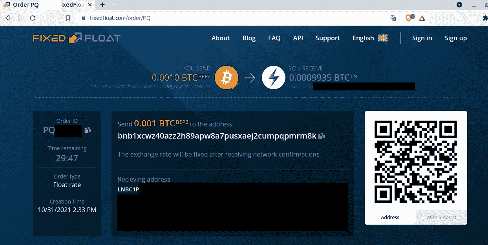
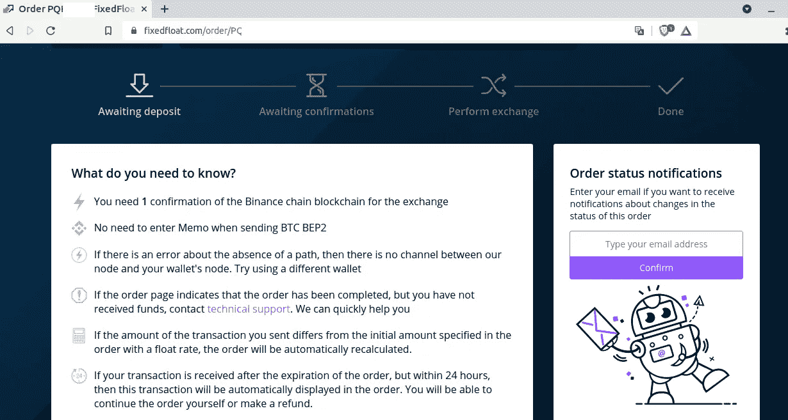
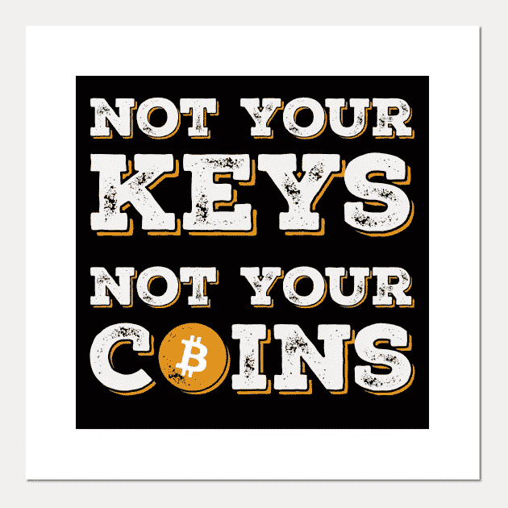

# 比特币:堆积在非保管钱包上，同时避免交易所高昂的取款费

> 原文：<https://medium.com/coinmonks/bitcoin-stacking-on-a-non-custodial-wallet-while-avoiding-exchanges-high-withdrawal-fees-8b9324af2273?source=collection_archive---------4----------------------->

# 介绍

“不是你的钥匙，不是你的硬币”/“不要相信，验证”。

这是成为比特币创造者需要学习的两大课程。然而，现在越来越多的人使用加密交换服务(例如币安)为 BTC 改变他们的法定货币。但是交易所有自己的利益。

作为一个第三方实体，有些特征可能不是 BTC 范式试图强加的。虽然重要的是时间，使通过菲亚特加密，严重的关切可以提出时，考虑离开 BTC 在那里作为储蓄。

在这个问题上，下面的问题出现了:我们能信任交换吗？

# 堆叠成比特币

将你的比特币堆放在交易所似乎不是一个好主意。首先，我们真的能确定他们显示的资金余额是真实存在的吗？当我们与交易所互动时，我们是在与实体系统互动，所以当我们思考交易所如何与比特币区块链互动时，我们必须非常谨慎。

另一方面，我们真的能相信第三方拥有你的私钥吗？这难道不像比特币试图改变的实际系统吗？在这个系统中，第三方(交易所、银行)控制着你的钱。在过去的几年里，我们可以发现许多例子，表明我们不要相信中央集权的实体。我们可以提到 2001 年的阿根廷，2015 年的希腊，以及加密领域的 Thodex(土耳其)和 Quadriga(加拿大)。

交易所知道这一点，虽然存款几乎免费，但使用比特币网络取款却要收取巨额费用。你也可以发现缺乏与闪电网络的整合，作为一种保留你的卫星服务“俘虏”的方式。

让我们来看看 https://www.binance.com/en/fee/cryptoFee 上币安的费用。

[https://www.binance.com/en/fee/cryptoFee](https://www.binance.com/en/fee/cryptoFee) — Screenshot taken on the 2021–10–31

虽然他们对存款加密不收取任何费用，但取款却收取 0.0005 BTC(约 30 美元)。这太疯狂了。！！

在下一节中，我将尝试展示一种方法，从这些交换中撤回您的 sat，并将它们存放在一个地址上，在这个地址上，您只需要控制几个 sat 的私钥。

# 像冠军一样撤回 sat

要从交易所提取资金并要求这些 sat 的真正所有权，您需要:

*   ***一个交易所:*** 例如，我将使用 [**币安**](https://www.binance.com/) 但它可以是任何支持使用 BEP2 或 BEP20 网络取款的交易所。
*   ***集成闪电网络的非托管钱包:*** 在这个问题上，我推荐 [**Muun 钱包**](https://muun.com/es/) ，因为它很好地抽象了链上和闪电网络上的交易
*   ***交易媒介:*** 在这种情况下，我们将使用[**【fixed float】**](https://fixedfloat.com/en/)提供的服务，这些服务具有出色的客户服务，并且不需要 KyC 数据。

说到这里，让我们从流程开始:

1.  下载穆恩·⬇️.备份您的钱包恢复代码！！📝
2.  为您要提取的 sat 金额创建发票。要做到这一点，进入你的 Muun 应用程序并点击:“接收”——即“闪电”。
    将生成一个二维码，以及一个照明发票地址(以 lnbc1…开头)

Create a lightning invoice on Muun. Go to “Receive” and then tap “Lightning” a QR code will be displayed along with the lightning address

3.打开 fixedfloat.com，选择您要发送的货币类型和您将收到的货币类型。

*   发送货币↗️:如果您从币安(或任何支持 BEP2(币安链)和 BEP20(币安智能链)网络取款的交易所)提取 BTC，我们将选择“比特币 BEP2”或“比特币 BEP20”。
    举个例子，我选“比特币 BEP2”。

Send: select Bitcoin over BEP2 or BEP20 network

*   在这里接收货币↘️:，我们将选择“比特币(闪电)”

Receive: select Bitcoin over lightning network

4.输入您想要提取的金额💰:您将看到自动计算出的您将收到的比特币数量。这将是你想提取的金额，减去固定浮动手续费的 0.5%。例如，如果我想提取 0.001 BTC (~ 60 美元)，FixedFloat 收取的费用将是 0.0000065 BTC (~0.3 美元)。
然后扫描闪电发票(首选)或者复制/粘贴 Muun 钱包生成的闪电地址。

Put the amount you want to send and scan the lightning QR code provided by Muun Wallet

5.点击“立即交换”。将生成一个 BEP2 地址。去币安把你的钱存到那个钱包里。记得检查你是否使用了正确的网络(根据你之前的选择是 BEP2 还是 BEP20)。还要注意 FixedFloat 提供的“订单 ID”。如果您有任何问题，这将是与客户支持人员聊天的方式。

如果您有任何疑问(确认的数量、备忘录字段等)，请参考 FixedFloat 页面上的说明。Fixedfloat 将为您进行转换，BTC 将存入您的 Muun 钱包。

Enter to Binance (or your Exchange with BEP2 support) and send your BTC to the address provided by FixedFloat

Instructions are also provided by FixedFloat

# 结论

让我们比较一下取出 0.001 BTC (~ 60 美元)并把它们堆在我们的非保管钱包里的成本:

*   **以“生”的方式(使用比特币网络)撤离币安:**

比特币网络提现的币安费:0.0005 BTC ( ~ 30 美元)，与金额无关。

取款总费用 0.001: **0.0005 BTC ( ~ 30 美元)**

*   **使用所提供的解决方案撤出币安—从 BEP2 到 lightning network 的固定浮动转换:**

在 BEP2 网络取款的币安费:0.0000043 BTC ( ~ 0.26 美元)，与金额无关

固定浮动费:金额的 0.5%。对于我们的例子，它将是大约 0.0000065 BTC (~0.3 美元)

闪电网费:~1 satoshi

取款总费用 0.001 BTC:**0.0000109 BTC(~ 0.65 美元)**

**那么，你是否足够聪明，能够掌控自己的财务，成为自己金钱的真正主人？**

> 加入 Coinmonks [电报频道](https://t.me/coincodecap)和 [Youtube 频道](https://www.youtube.com/c/coinmonks/videos)了解加密交易和投资

## 也阅读

 [## 最佳加密交易所| 2021 年十大加密货币交易所

### 编辑描述

blog.coincodecap.com](https://blog.coincodecap.com/crypto-exchange)  [## 2021 年 10 大最佳加密贷款平台| CoinCodeCap

### 编辑描述

blog.coincodecap.com](https://blog.coincodecap.com/crypto-lending)  [## 2021 年最佳免费加密交易机器人

### 2021 年币安、比特币基地、库币和其他密码交易所的最佳密码交易机器人。四进制，位间隙…

medium.com](/coinmonks/crypto-trading-bot-c2ffce8acb2a)  [## 最佳 4 个加密交易信号电报通道

### 这是乏味的找到正确的加密交易信号提供商。因此，在本文中，我们将讨论最好的…

medium.com](/coinmonks/best-crypto-signals-telegram-5785cdbc4b2b)  [## BlockFi 评论 2021:利弊和利率| CoinCodeCap

### 编辑描述

blog.coincodecap.com](https://blog.coincodecap.com/blockfi-review)  [## 如何在印度购买比特币？2021 年购买比特币的 7 款最佳应用[手机版]

### 如何使用移动应用程序购买比特币印度

medium.com](/coinmonks/buy-bitcoin-in-india-feb50ddfef94)  [## 加密税务软件——五大最佳比特币税务计算器[2021]

### 不管你是刚接触加密还是已经在这个领域呆了一段时间，你都需要交税。

medium.com](/coinmonks/best-crypto-tax-tool-for-my-money-72d4b430816b)  [## 存储比特币的最佳加密硬件钱包[2021] | CoinCodeCap

### 编辑描述

blog.coincodecap.com](https://blog.coincodecap.com/best-hardware-wallet-bitcoin)  [## Pionex 评论 2021 |免费加密交易机器人和交换

### Pionex 是为交易自动化提供工具的后起之秀。Pionex 上提供了 9 个加密交易机器人…

medium.com](/coinmonks/pionex-review-exchange-with-crypto-trading-bot-1e459d0191ea)