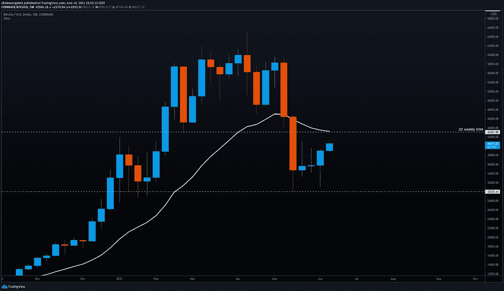
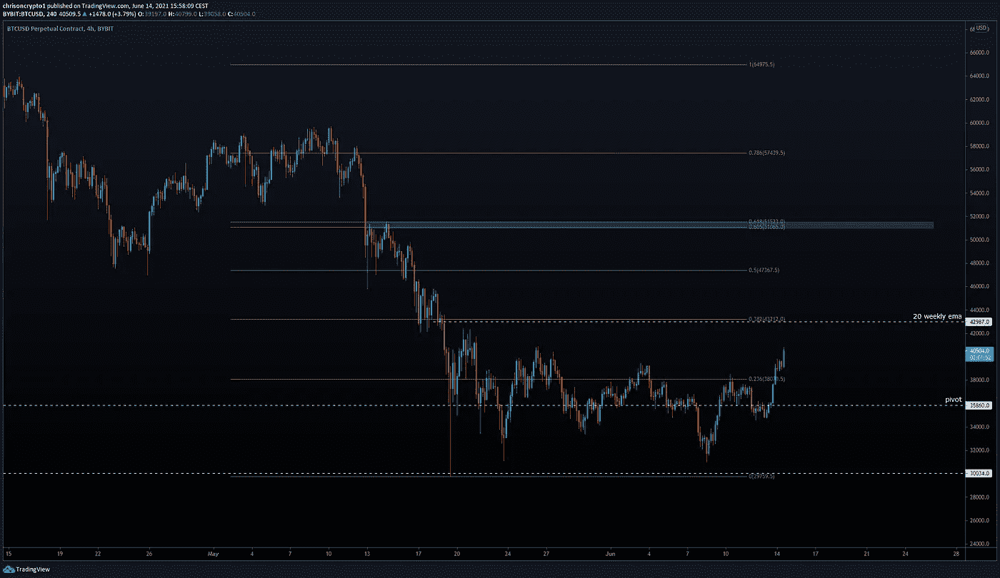
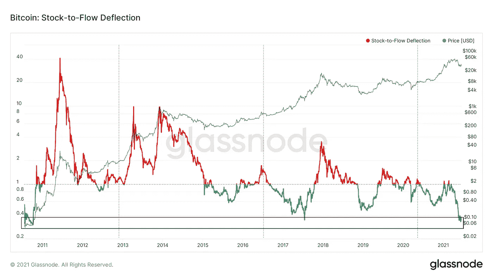
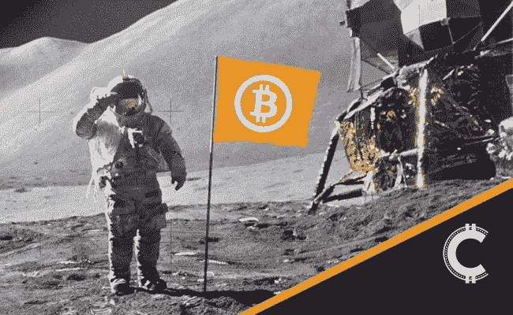

# 自 2010 年以来，比特币的存量与流量偏差从未如此之低

> 原文：<https://medium.com/coinmonks/bitcoin-stock-to-flow-deflection-hasnt-been-this-low-since-2010-9fbdf3823507?source=collection_archive---------4----------------------->

在链上数据显示自 2010 年以来，比特币的库存与流量偏差从未如此之高的背景下，比特币已经回到了 40，000 美元。与此同时，美国官方通胀率自 2008 年以来从未如此之高。

我们来挖一下。

# 通货膨胀率达到 2008 年以来的最高水平，显示出 BTC 的必要性

根据美国劳工统计局的数据，衡量某些消费品和服务价格的美国消费者价格指数(CPI)年增长率为 5%，达到 2008 年 8 月以来的最高水平。

去年，美联储改变了通胀目标，允许通胀比平时更高，以支持劳动力市场。这一举措明显不同于以往根据基本经济状况调整目标的方法。

美国前财政部长拉里·萨默斯最近对此举表示担忧:

*“我们在通胀方面承担了非常大的风险……经济政策制定者所投射的平静和自满的感觉，即这一切都可以很容易地得到管理，是错误的。*

**查看** [全篇点击这里](https://chrisoncrypto.com/blog/f/inflation-hits-highest-rate-since-2008-outlining-the-need-for-btc) **！**

# 技术上来说

## 比特币触及 4 万美元

BTC/美元交易于 40，000 美元上方，接近 20 周指数移动平均线(43，300 美元)。征服这一周均线将会把头号硬币扔回到汹涌的牛市中，但在此之前，back 美元只是在以前的[简讯](https://mailchi.mp/f5ae823a629f/btc-bounces-as-short-traders-risk-getting-caught-in-the-crossfire)定义的参数范围内波动。

价格波动持续的时间可能比人们想象的要长得多。这是事件的不可预测性的一部分，已知的未知和未知的未知，应该作为避免任何偏离理性的理由。信息技术通常不起作用。

尽管如此，比特币的实际价值远高于每枚 10 万美元，因为如果央行印钞没有底部，那么任何比特币/法定货币对都没有顶部。问题是，而且一直是“何时”而不是“如果”市场会认识到这一真理。

虽然 BTC/美元徘徊在牛市区域的边缘，但值得考虑的是，如果 20 周均线被令人信服地夺回，会发生什么。

假设典型的 Fib 水平从 65，000 美元的历史高点开始，那么回撤至黄金口袋(. 618 fib 水平)将使比特币再次回到 51，000 美元。对于给定的市场偏差，这通常是公认的最大回撤(即，在这种情况下，中期看跌论点可能有意义，直到达到. 618 Fib 水平)。在我看来，20 周均线定义了牛市/熊市，但是考虑交易另一方的想法总是值得的。

如果 20 周均线作为阻力，那么 back 美元可能会回到支点，再次测试 36，000 美元水平，并打开通往更低目标的大门。如果我们到了这座桥，我们会过桥的。

尽管如此，在市场给出更明确的迹象表明比特币可能的走向之前，有理由假设比特币的价格在 43，000 美元至 30，000 美元之间，直到证明并非如此。

## **要观看的关卡**

*   每周收回 43，300 美元，意味着要收回 51，000 美元(0.618 美元)
*   每周从 43，300 美元拒绝建议移动到 36，000 美元

## BTC:库存与流量偏差峰值

与此同时，链上数据显示，库存与流量的偏差率达到了历史最高水平(自 2010 年以来)。

库存-流动偏差模型基于 PlanB 的 S2F 预测。如果偏差大于或等于 1，那么比特币被高估了。否则，它被低估了。

照此计算，BTC 兑美元自 2010 年以来从未被如此低估过。负偏差从未如此之大。

这实际上意味着，长期熊市可能会打破股票-流量模型，对信奉圣经数学的比特币制造者造成沉重打击。

时间会证明普兰布的预言吗？你知道我的钱在哪里。

我们开始吧。

下次再见。

**加入** [电报](https://t.me/chrisoncryptochannel) **频道，实时更新&设置！
关注我** [推特](https://twitter.com/ChrisOnCrypto1) **&** [多嘴多舌](https://gab.com/chrisoncrypto) **下面还有我的社交门户。**

[https://www.paypal.com/donate?hosted_button_id=C9VRLGTBHQX2N](https://www.paypal.com/donate?hosted_button_id=C9VRLGTBHQX2N)

# 阅读更多:国际货币基金组织担心萨尔瓦多采用 BTC 后变得无关紧要

[https://chrisoncrypto.com/blog/f/the-imf-fears-becoming-irrelevant-after-el-salvador-adopts-btc](https://chrisoncrypto.com/blog/f/the-imf-fears-becoming-irrelevant-after-el-salvador-adopts-btc)

[http://www.chrisoncrypto.com/](http://www.chrisoncrypto.com/)

你也可以用比特币支持我！
**BTC** 地址:**3 eydseypjhn 68 axkncuqbb 7 ebqcxrejamr**

最诚挚的问候，
**克里斯托弗·阿塔尔德**
克里斯对加密的创始人
投稿人[www.cityam.com](https://www.cityam.com)
直接接通:[电报](https://t.me/chrisoncrypto)

*最初发布于*[*https://mailchi . MP*](https://mailchi.mp/35660964dbd1/bitcoin-stock-to-flow-deflection-hasnt-been-this-low-since-2010?e=[UNIQID])*。*

## 另外，阅读

*   [网格交易机器人](https://blog.coincodecap.com/grid-trading) | [加密交易机器人](/coinmonks/cryptohopper-review-a388ff5bae88) | [加密交易机器人](https://blog.coincodecap.com/best-crypto-trading-bots)
*   [加密复制交易平台](/coinmonks/top-10-crypto-copy-trading-platforms-for-beginners-d0c37c7d698c) | [如何在 WazirX 上购买比特币](/coinmonks/buy-bitcoin-on-wazirx-2d12b7989af1)
*   [CoinLoan 点评](/coinmonks/coinloan-review-18128b9badc4)|[Crypto.com 点评](/coinmonks/crypto-com-review-f143dca1f74c) | [火币保证金交易](/coinmonks/huobi-margin-trading-b3b06cdc1519)
*   [尤霍德勒 vs 考尼洛 vs 霍德诺特](/coinmonks/youhodler-vs-coinloan-vs-hodlnaut-b1050acde55a) | [Cryptohopper vs 哈斯博特](https://blog.coincodecap.com/cryptohopper-vs-haasbot)
*   [Botsfolio vs nap bots vs Mudrex](/coinmonks/botsfolio-vs-napbots-vs-mudrex-c81344970c02)|[gate . io 交流回顾](/coinmonks/gate-io-exchange-review-61bf87b7078f)
*   [最佳比特币保证金交易](/coinmonks/bitcoin-margin-trading-exchange-bcbfcbf7b8e3) | [萝莉点评](/coinmonks/lolli-review-e6ddc7895ad8) | [比特币保证金交易](https://blog.coincodecap.com/bityard-margin-trading)
*   [创造并出售你的第一个 NFT](https://blog.coincodecap.com/create-nft) | [本地比特币评论](/coinmonks/localbitcoins-review-6cc001c6ed56) | [Prokey 评论](/coinmonks/prokey-review-26611173c13c)
*   [加密保证金交易交易所](/coinmonks/crypto-margin-trading-exchanges-428b1f7ad108) | [赚取比特币](/coinmonks/earn-bitcoin-6e8bd3c592d9) | [Mudrex 投资](https://blog.coincodecap.com/mudrex-invest-review-the-best-way-to-invest-in-crypto)
*   [WazirX vs coin dcx vs bit bns](/coinmonks/wazirx-vs-coindcx-vs-bitbns-149f4f19a2f1)|[block fi vs coin loan vs Nexo](/coinmonks/blockfi-vs-coinloan-vs-nexo-cb624635230d)
*   [杠杆代币](/coinmonks/leveraged-token-3f5257808b22) | [最佳密码交易所](/coinmonks/crypto-exchange-dd2f9d6f3769) | [Paxful 点评](/coinmonks/paxful-review-4daf2354ab70)
*   [加密套利](/coinmonks/crypto-arbitrage-guide-how-to-make-money-as-a-beginner-62bfe5c868f6)指南| [如何做空比特币](/coinmonks/how-to-short-bitcoin-568a2d0b4ae5) | [1xBit 回顾](https://blog.coincodecap.com/1xbit-review)
*   [如何在印度购买以太坊？](https://blog.coincodecap.com/buy-ethereum-in-india) | [如何在币安购买比特币](https://blog.coincodecap.com/buy-bitcoin-binance)
*   [在美国如何使用 BitMEX？](https://blog.coincodecap.com/use-bitmex-in-usa) | [BitMEX 评论](https://blog.coincodecap.com/bitmex-review) | [期货交易机器人](/coinmonks/futures-trading-bots-5a282ccee3f5)
*   [最佳加密交易信号电报](/coinmonks/best-crypto-signals-telegram-5785cdbc4b2b) | [MoonXBT 评论](/coinmonks/moonxbt-review-6e4ab26d037)