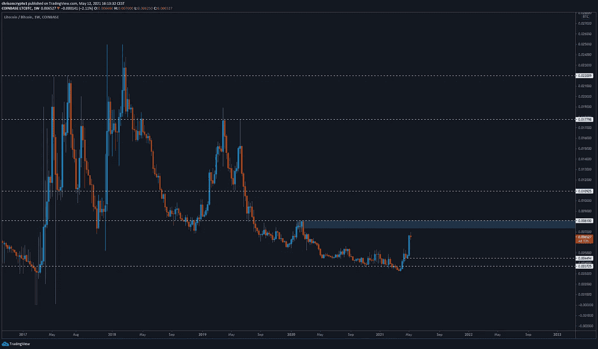
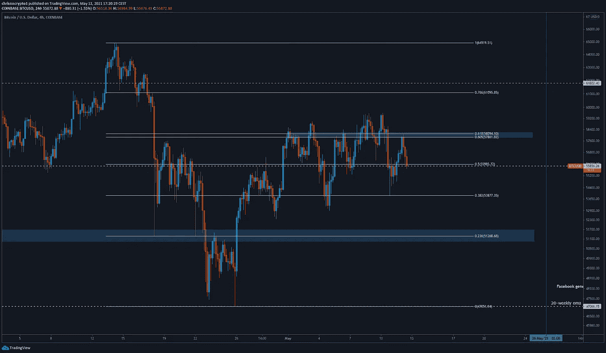

# 比特币陷入炼狱，因为市场选择迷因币而不是有用的项目

> 原文：<https://medium.com/coinmonks/bitcoin-stuck-in-purgatory-as-market-chooses-meme-coins-over-useful-projects-f9239a8d60c?source=collection_archive---------10----------------------->

加密替代硬币处于巨大的泡沫中。Meme 币已经占领了这个领域，积累了数十亿美元的估值，并在流行的加密排名网站上排名前十。虽然这与伟大的比特币交易没有任何关系，但值得注意的是，这种市场行为在过去发生过，并且总是以同样的方式结束。

咱们挖吧。

# 彼得·泰尔的 Palantir 接受比特币作为支付手段

Data analytics，一位投资者询问 Palantir 的资产负债表上是否会有比特币或任何其他加密货币，对此 Palantir 的首席财务官大卫·格雷泽说:“也在考虑在其资产负债表上持有比特币，在适当的时候可能会加入像 [Microstrategy](https://chrisoncrypto.com/blog/f/microstrategy-ceo-tells-paul-tudor-jones-to-invest-more-in-btc) 、 [Tesla](https://chrisoncrypto.com/blog/f/tesla-buys-15-billion-in-bitcoin) 、 [Square](https://chrisoncrypto.com/blog/f/elon-musk-jack-dorsey-bitcoin-incentivises-renewable-energy) 和其他公司的行列。

**查看** [全文点击这里](https://chrisoncrypto.com/blog/f/peter-thiels-palantir-accepts-bitcoin-as-means-of-payment) **！**

# 眼泪上的莱特币

BTC 猛虎解放组织正在迅猛发展，并继续显示出强大的迹象。这对组合剩下的最后一个阻力是₿0.008，一旦它消失了，天空就是极限。

在 BTC 对中，市场结构看起来像第一根冲动的周线蜡烛。如果价格跌破₿0.0057，继续看涨的理由就站不住脚了。目前，没有理由期待除了继续以外的任何事情，直到证明不是这样。

与此同时，美元对形成了有史以来的最高周收盘价。截至目前，没有明显的技术阻力，最接近的日线[支撑位](https://www.tradingview.com/x/FWC7MplQ/)停留在 345-356 美元。在此之下，如果市场选择更大的折价，我们可以预计 300 美元的心理水平将发挥支撑作用。

5 月初，我们概述了莱特币在加密货币领域发挥作用的原因。你可以在这里找到更多关于[莱特币的情况。](https://chrisoncrypto.com/blog/f/silver-to-bitcoins-gold-the-case-for-litecoin)

# BTC 被困在炼狱里了吗？

BTC/美元已经持续波动了 91 天。这是迄今为止持续时间最长的一轮整合，而且看不到结束的迹象。

在较低的时间框架内，BTC/美元提供了两个买入机会。今天早上早些时候，普莱斯拒绝了金口袋，价格约为 58，000 美元。如果空头跟进，低于 53，000 美元的弱势将打开通往更低水平的大门，即 51，000 美元(. 235 纤维)水平。另一方面，夺回黄金口袋(. 618 fib 比率)将是比特币多头回归的第一个迹象。

除此之外，BTC/美元价格走势是低时间框架的死亡陷阱，不值得关注。价格波动的不可预测性很少会带来好的波动交易，尽管这可能是黄牛的天堂。

话虽如此，比特币的网络实力正在增强。比特币价格继续飙升，矿商正在积累更多的比特币，没有迹象表明严肃的投资者会很快(或永远)撤出。恰恰相反，现在有传言称，Facebok 可能很快就会正式将比特币记入公司的账本。

# 巨大的气泡接管了密码

零售显然是加密的。解决这个问题的一个方法是查看 exchange 注册。事实上，比特币基地从 1 月到 3 月增加了[1300 万](https://backlinko.com/coinbase-users)顾客。罗宾汉也提到了类似的数字(950 万)，因为显然 GME [丑闻](https://chrisoncrypto.com/blog/f/dex-trading-takes-off-as-robinhood-defrauds-its-own-customers)不足以阻止人们使用该平台。

零售业加入游戏的另一个迹象是流入 DOGE 等 meme 币的资金增加了——年初至今增加了 10300%。其他动物币，如“柴币”也在 24 小时内实现了 100%的反弹。

这些新参与者的心理相当直截了当(也有缺陷)。他们看到比特币，认为它大幅上涨，因此选择风险越来越大的赌注，以至于你可能还在玩彩票。基本面、市值、流通供给、开发团队、令牌经济学、项目愿景或任何技术或基本面预测都被抛到了九霄云外，一切都是关于下一个炒作周期——下一个迷因。

这些参与者将继续循环资金到下一个项目，直到音乐停止。许多人将被留下来拿着袋子，因为他们目睹了 99%的蒸汽器皿代币提款。比如最近以太坊经典跑赢了以太坊。记住，ETC 经常受到 51%的攻击(即网络不安全)，人们只能假设新参与者错误地购买了它而不是以太坊。

这些都是泡沫的迹象(与比特币不同)。当你的家人或附近的人开始问你开始交易哪些替代币时，这绝对不是投资替代币的时候。事实上，现在可能是把它们换成比特币、稳定币或至少一年后的东西的好时机。

在我看来，我们已经接近这个另类投资泡沫的顶峰，原因很简单，所有迹象都指向那个方向。这并不意味着比特币被高估，因为比特币完全自成一派，而且一直如此。需要记住的一件重要事情是，如果比特币下跌 10%-15%，altcoins 将损失 70%-99%的估值。另一方面，如果比特币选择另一条路，资本将流回国王，替代硬币将会流失。

这件事发生在 2020 年 8 月。我完全期待这一次也是如此。

最后，比特币已经处于一个区间 91 天了。它不会盘整太久。

下次再见。

**加入** [电报](https://t.me/chrisoncryptochannel) **频道，实时更新&设置！
关注我** [推特](https://twitter.com/ChrisOnCrypto1) **&** [多嘴多舌](https://gab.com/chrisoncrypto) **下面还有我的社交门户。**

[https://www.paypal.com/donate?hosted_button_id=C9VRLGTBHQX2N](https://www.paypal.com/donate?hosted_button_id=C9VRLGTBHQX2N)

[http://www.chrisoncrypto.com/](http://www.chrisoncrypto.com/)

你也可以用比特币支持我！
**BTC** 地址:**3 eydseypjhn 68 axkncuqbb 7 ebqcxrejamr**

最诚挚的问候，
T21 克里斯托
克里斯托
上的加密创始人[www.cityam.com](https://www.cityam.com)上的
直接接通:[电报](https://t.me/chrisoncrypto)

*最初发布于*[*https://mailchi . MP*](https://mailchi.mp/de766f04ae1e/bitcoin-stuck-in-purgatory-as-market-chooses-meme-coins-over-useful-projects?e=[UNIQID])*。*