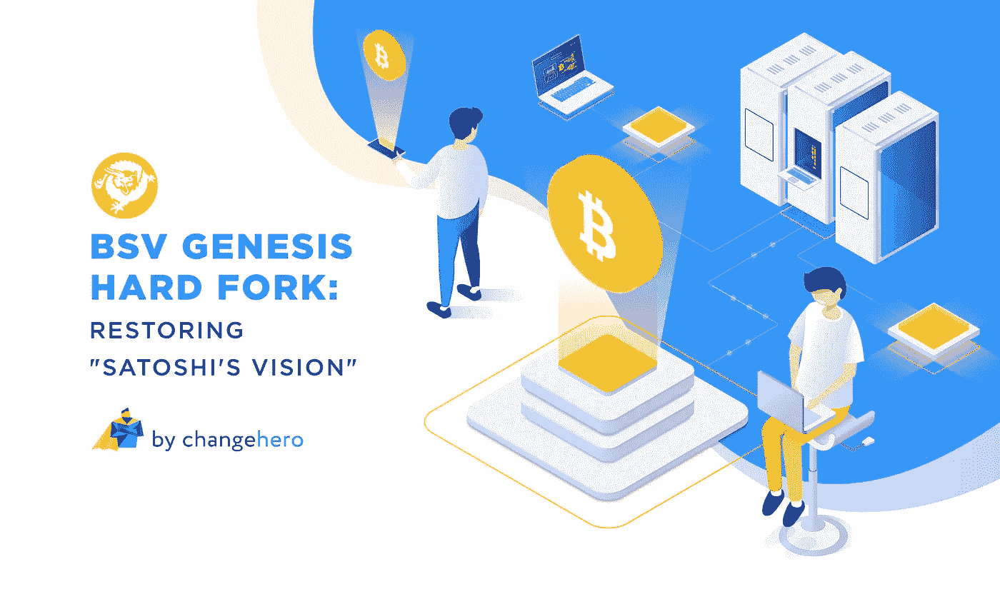

# 比特币 SV 创世纪硬分叉:还原“聪视”

> 原文：<https://medium.com/coinmonks/bitcoin-sv-genesis-hard-fork-restoring-satoshis-vision-a58c3a870714?source=collection_archive---------0----------------------->

比特币 SV 的出现是为了将 Satoshi 的愿景带回协议，但最终却不情愿地陷入了一系列索赔和争议。除了严厉的批评，BSV 有一个邪教以下，并继续在市场上表现良好，因为衍生。该项目再次以其即将到来的 Genesis Hard Fork 引起了社区的注意，该团队相信这一重大升级将使他们更接近实现 Satoshi 的愿景。

> [发现并回顾最佳加密软件](https://coincodecap.com)

在这篇文章中， [ChangeHero](https://changehero.io/) 将会给你一个创世纪硬分叉和需要注意的事情的快速概述。

## **分叉——测试网**

硬分叉因催生新的加密货币而臭名昭著，比特币 SV 也是同一俱乐部的后代。这家年轻的加密公司计划在 2020 年 2 月 4 日举办一场大型硬分叉活动。与流行的观点相反，这是一个预先计划好的分叉事件，旨在升级网络，恢复最初的比特币协议。

BSV 团队已经开发了两个测试网:Genesis Testnet 或 GT 已经在运行，具有 mainnet 的计划功能和改进，使用户能够在硬分叉之前测试他们的应用程序行为。另一方面，Genesis Reset(GR)是在分叉过程中测试应用程序行为的一种独特方式，将有 48 小时的重置周期，以确保可重复和稳定的分叉。最近部署了一个稳定的版本，并且定于 1 月 21 日发布一个扩展测试网络(STN ),使用户能够在不影响 mainnet 的情况下通过发送大量事务量和块来测试可扩展性。最后，mainnet 上的 Genesis 硬分叉激活将在块高度 620538 处进行，预计在 2020 年 2 月 4 日。

## **旧情复燃**

可伸缩性是区块链项目最关心的问题之一，它阻碍了开发人员和用户充分利用它。通过 Genesis hard fork，BSV 旨在通过取消块大小限制来释放网络的全部潜力。采矿者可以选择配置自己的区块大小限制，或者根本不配置，以竞争和提供最佳服务。此外，更新放宽了对数据载体大小和 25 个交易链的限制。

此外，fork 将使 OP_RETURN 的原始设计生效，这对开发人员来说是一个巨大的解脱。此外，该团队旨在通过用“大数”替换 32 位数字来提高脚本语言的数学能力。此外，nLockTime 和 nSequence 也将恢复到其功能的原始状态，只有当达到某个时间或阻塞高度时，用户才有机会在区块链中进行交易。非标准和复杂的交易也将向所有人开放，并消除与矿商谈判以推动交易的需要。

令人惊讶的是，BSV 团队宣布，在即将到来的硬分叉之后，新的支付到脚本哈希(P2SH)交易将不会被允许，并声称这将导致链上更好的隐私和记录保存。最重要的是，Genesis 升级将带来更多功能，如令牌化、基于 Metanet 的应用程序、智能合同、即时确认等等。

与该项目类似，分叉事件也受到了加密社区的批评，P2SH 的衰落也受到了影响者的抨击。更糟糕的是，Bitgo [宣布](https://thedailychain.com/bitgo-to-halt-bitcoin-sv-support-in-february-2020/)其用户在硬分叉后将无法接收 BSV。相反，它们似乎都没有妨碍 BSV，团队正忙于破解代码和发布更新。BSV 团队还坚持只在测试网上升级和测试软件，而不是在主网上。查看他们的[支持页面](https://bitcoinsv.io/genesis-hard-fork/)了解更多技术细节。

## **一次值得一看的尝试**

Genesis Hard Fork 似乎是复兴比特币协议的坚定尝试，在某些方面看起来很有希望。尽管经历了淘洗，BSV 在市场上有着良好的记录，是最有价值的加密货币之一。尽管这个项目前景黯淡，但值得一提的是，BSV 正在努力恢复聪的视觉，这绝对值得怀疑。

如果你喜欢这篇文章，给我们一个掌声，并在下面留下评论来引发讨论。在[推特](https://twitter.com/Changehero_io?lang=en)、[脸书](https://www.facebook.com/Changehero.io/)和[媒体](/@changehero)上关注 [ChangeHero](https://changehero.io/) ，获取更多此类有趣的文章、秘密新闻和令人兴奋的优惠。

> [在您的收件箱中直接获得最佳软件交易](https://coincodecap.com/?utm_source=coinmonks)

