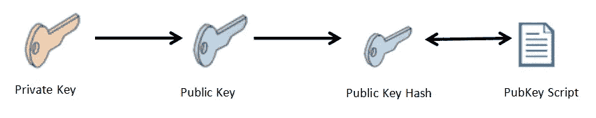
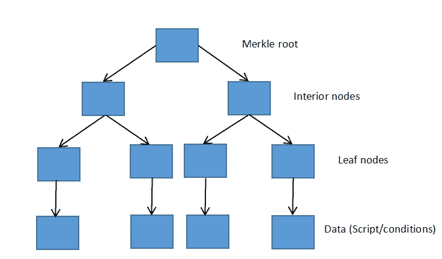

# 比特币主根——一个技术解释[2021]

> 原文：<https://medium.com/coinmonks/bitcoin-taproot-cdf96c2e100?source=collection_archive---------3----------------------->

Bitcoin Taproot

本文将讨论 **Taproot，**一个提议的对[比特币](https://blog.coincodecap.com/a-candid-explanation-of-bitcoin)的升级，它将带来许多新功能。本文将涵盖 Taproot 的所有技术方面，此次升级所涉及的技术，以及这些技术如何让比特币用户受益。

# 什么是直根？

Taproot 由比特币核心贡献者 [Gregory Maxwell](https://cryptoanarchy.wiki/people/gregory-maxwell) 于 2018 年首次提出。其实施仍在进行中。如果没有 Taproot，这些复杂的事务(timelock， [multisig](https://blog.coincodecap.com/multi-signature-wallet) )需要多个事务，因此很容易扣除。

> Taproot 以一种看起来像单个比特币交易的方式记录这些复杂的交易(Multisig，Timelock)，因此增强了比特币的隐私性。

直根升级涉及三项重大技术变革或概念，以提高比特币的可扩展性、隐私性和灵活性

*   P2SH
*   桅杆
*   Schnorr 签名

我们将从技术上讨论这三个概念，以了解 Taproot 升级如何让比特币用户受益。

# P2SH(付费脚本哈希)

比特币地址是一串字母数字字符，用户可以与任何希望向其发送 BTC 的人分享。比特币有两大交易标准:Pay-to-PubKeyHash (P2PKH)和 Pay-to-ScriptHash (P2SH)。

我们将讨论 P2SH(付费脚本哈希)和 P2PKH(付费公钥哈希)。但在跳到这些概念之前，首先，要熟悉一些关于比特币的事情——

*   在比特币网络上只能花 UTXOs。UTXO 代表**未用事务(TX)输出。**是加密货币交易执行后剩余的数字货币的数量。比如，你的比特币钱包里有 10 个 BTC，你想转 5 个 BTC 给你的朋友。比特币区块链的做法非常不同。它将花费 10 BTC(全部金额)并将 5 BTC 转移到您朋友的钱包中，并将剩余的 5 BTC (10 BTC-5 BTC = 5 BTC)转移到您的钱包中。所以现在，你和你的朋友都有 5 BTC 作为未用完的 BTC。
*   比特币使用**脚本(代码行)**，这是一种指定花费比特币或未用完交易输出(UTXOs)的条件的方式。它被用作锁定机制。
*   比特币被锁定在一个脚本中，当该脚本返回 true 或满意时，比特币被解锁。
*   任何人都可以向任何比特币地址发送比特币；这些资金只有在满足脚本中定义的特定条件时才能使用。它规定了下一个人可以如何花费发送的比特币。当发送方在一个事务中包含一个脚本时被称为 **PubKey 脚本，也称为锁定脚本。**发送过来的比特币的接收者会生成一个**签名脚本，也称为解锁脚本**，是满足一个 PubKey 脚本的数据参数集合。签名脚本在代码中被称为 **scriptSig** 。
*   在上面的例子中，在向你的朋友发送 5 BTC 的同时，脚本也可以包含在事务中。如果您的朋友想要使用这些 BTC，他必须生成一个满足锁定脚本中指定条件的解锁脚本。

# 支付到公钥哈希(P2PKH)

Pay-to-PubKeyHash 是一种传统的比特币地址格式。它的地址以数字 1 开始。

只有 P2PKH 地址的所有者能够通过提供公钥散列和私钥签名来解锁公钥脚本并花费发送的资金。需要一个私钥来证明公钥哈希的所有权。

正如我们所讨论的，脚本定义了在什么条件下，特定地址上的比特币可以被消费。当特定的条件被满足时，也是由网络验证的，该地址上的比特币被解锁，你可以花掉它们。

它是如何工作的？— 接收方首先生成公钥脚本，并与发送方共享。发送方将在发送 BTC 时将公钥脚本附加到事务中。在接收 BTC 时，如果接收者想要解锁未用完的 BTC，他需要提供公钥散列、私钥签名，并满足公钥脚本中提到的条件。

条件可以像—

*   解锁比特币至少需要 2 个签名。
*   提供密码以解锁。
*   比特币会在一定时间过去后解锁。

这些令人惊讶的事情可以作为解锁比特币的条件。

发送者在发送比特币时需要在交易中包含 **PubKey 脚本**。因此，这将增加交易的规模，费用将比正常交易高出约五倍。

在这里，寄件人必须承担额外的费用。Pay-to-ScriptHash 将有助于克服向发送方收取的额外费用。

# 付费脚本哈希(P2SH)

支付给脚本哈希(P2SH)克服了向发送方收取的额外费用，并将这一责任(额外费用)转移给实际需要利用锁定脚本中指定的条件的接收方。Pay-to-ScriptHash 比特币地址以数字 3 开头。

在这个交易标准中，发送者不需要在他们的交易中使用长公钥脚本。这里，锁定脚本被一个赎回脚本散列所取代。兑换脚本哈希源自兑换脚本，类似于 PubKey 脚本，包含接收者在花费未用输出之前必须满足的条件。**发送方只需在交易**中指定兑换脚本的散列。脚本的散列可以被翻译成标准的比特币地址，发送者可以将比特币发送到这些地址，而无需任何特别的努力或额外的费用。

当接收者想要解锁这个 P2SH 地址上的硬币时，他们需要产生具有相同散列值的兑换脚本，并将其包括在交易中。因此，接收方解锁未用金额的交易规模将增加，并且执行交易的成本将更高。

例如，爱丽丝想发送 10 BTC 给鲍勃。Alice 必须将赎回脚本散列附加到事务中。因此，首先，Bob 将发送 redempt 脚本来解锁未用完的输出。然后将兑换脚本散列发送给 Alice，以便 Alice 可以将该散列添加到交易中并发起交易。如果 Bob 想要花掉未用完的比特币，他必须生成一个具有相同哈希值的解锁脚本，并满足脚本中提到的条件。

请记住，Alice 只需添加 redempte 脚本的散列，而不是整个脚本。因此，爱丽丝不需要承担额外的费用。

# 付费脚本哈希优势

*   他们的加密散列取代了冗长的脚本。
*   发送者可以放置任意数量的兑换脚本散列，而不知道脚本中指定了什么消费条件。
*   它降低了发送者的交易费用。

P2SH 为 P2SH 地址的所有者(接收者)创建数据密集型比特币交易。

# MAST(合并的抽象语法树)

MAST 代表 **Merklized 抽象语法树。**

**为什么桅杆？—** 如果想从 P2SH 地址消费比特币，需要产生具有相同哈希值的 redempt 脚本，并将其包含在交易中。如果脚本中包含如此多的条件，这会使事务变得非常大。MAST 为此提供了一个解决方案。

Merklized 抽象语法树是 Merkle 树和抽象语法树的组合。

就像支付给脚本散列(P2SH)支付给匹配散列的脚本一样，MAST 支付给 Merkle 根的散列。MAST trick 创建了一个包含单个脚本(条件)哈希树，这些脚本是一个大型条件集的一部分。Merkle 根是通过散列所有条件创建的单个散列。

**但是 Merkle 根和树是怎么形成的呢？**

首先，所有脚本(条件)被单独散列；然后，产生的哈希值再次与附近的其他哈希值组合，再次形成一组新的哈希值。这个过程将继续下去，直到只剩下一个散列，这就是所谓的 Merkle 根。

例如，首先对四组条件分别进行哈希处理，然后从这四个哈希中生成两个哈希。这将从这两对散列中生成另外两个散列，这两个散列将被再次组合以创建最终的散列。这被称为 Merkle 根。

你也可以把这个 Merkle root 翻译成一个有效的可支付的比特币地址，叫做 **Merklized 比特币地址**。它有几个好处，主要的好处是能够在不知道所有脚本的情况下验证 Merkle 树中任意位置的脚本。这种技术叫做 **Merkle Proof** 。这有助于轻松验证具有若干条件的比特币交易。

在 MAST 中，比特币被锁定在 Merkle 树中。Merkle tree 将指定所有可以解锁未用完的 BTC 的复杂条件。每个叶节点指定一个条件。在尝试解锁未用完的 BTC 时，您将生成一个满足 Merkle 树的任何分支的脚本。默克尔根足以检查条件是否是原始条件集的一部分。如果区块链发现脚本(条件)只是这个 Merkle 树的一部分，区块链就会知道硬币被锁定在这个脚本中并解锁它们。因此，我们不需要生成并包含整个脚本来花费未用完的 BTC。这有助于减少交易规模，花不完的 BTC。

# Schnorr 签名

在密码学中，Schnorr 签名是由 [Claus Schnorr](https://en.wikipedia.org/wiki/Claus_P._Schnorr) 描述的 Schnorr 签名算法产生的数字签名。这是一种以简单著称的数字签名方案。它将多个签名聚合为一个签名，以优化验证和认证过程。建议在[多信号](https://blog.coincodecap.com/multi-signature-wallet)交易的情况下使用。

如您所知，要执行事务，您需要用您的私钥签名，以证明您是特定公钥上的 BTC 的所有者。但是在 Multisig 交易中，你必须提供多个签名，这会占用额外的空间。

例如，20 个多重签名交易中有 12 个。这里，20 个中的 12 个意味着执行交易至少需要 20 个签名中的 12 个。在签署交易时，签名也存储在块上。如果我们认为一个签名的大小为 5 字节，那么 12 个签名将使用该块中的 60(5*12 = 60)字节内存。如果需要 100 个签名，则需要 500 个字节。这增加了内存的使用。为了解决这个问题， **Schnorr Signatures** 出现了。

**要理解 Schnorr 签名，请浏览以下示例:**

*   你想给你的朋友寄 1.5 BTC，而你钱包的三个不同地址上有 0.5 BTC。你将签署三次，因为你必须从不同的三个钱包发送 1.5 BTC，这将增加交易的规模和费用。在这里，所有三个标志都是你一个人做的。因此，如果在比特币的区块链上启用了 Schnorr 签名，那么你的比特币钱包将把你的三个签名聚合成一个签名，这将有效地从所有三个钱包发送 BTC。
*   在 MultiSig 事务的情况下，如果您需要 100 个签名，每个 5 字节，则 Schnorr 签名方案会将这 100 个签名减少到只有一个 64 字节的 schnorr 签名，并且会为更多的事务节省 436(5 * 100–64 = 436)字节的额外空间。

**比特币升级** — Taproot 计划纳入上述概念，以实现更好的可扩展性、隐私性和灵活性。

# 比特币主根:结论

在浏览了关于 Taproot 的文章后，我们可以总结出以下几点

*   Taproot 是比特币核心贡献者 Gregory Maxwell 在 2018 年提出的比特币升级。
*   Taproot 以一种看起来像单个比特币交易的方式记录这些复杂的交易(Multisig，Timelock)，因此增强了比特币的隐私性。
*   直根升级涉及三大技术概念——P2SH、MAST、Schnorr 签名。
*   比特币使用一种脚本，这是一种指定花费比特币或未用完交易输出(UTXOs)的条件的方式。
*   支付给脚本哈希(P2SH)克服了向发送方收取的额外费用，并将这一责任(额外费用)转移给实际需要利用锁定脚本中指定的条件的接收方。
*   在 MAST 中，比特币被锁定在 Merkle 树中。Merkle 树指定了所有可以解锁未用完的 BTC 的复杂条件。merklized Abstract Syntax Trees(MAST)是比特币的拟议补充，允许较小的交易规模来解锁未用完的 BTC，无需生成冗长的脚本。相反，Merkel root 足以检查一个接收者生成的小脚本是否是原始条件集的一部分。
*   Schnorr 签名将多个签名聚合为一个签名。

***包括附属链接**

## 另外，阅读

*   最好的[密码交易机器人](/coinmonks/crypto-trading-bot-c2ffce8acb2a)
*   [以太坊面试问题—第一部分](https://blog.coincodecap.com/ethereum-interview-questions-part-1)
*   [区块链技术和加密词汇](https://blog.coincodecap.com/blockchain-technology-and-crypto-vocabulary)
*   [以太坊对比特币](https://blog.coincodecap.com/ethereum-versus-bitcoin)
*   [什么是多签名钱包？5 个最佳 Multisig 钱包【2021】](https://blog.coincodecap.com/multi-signature-wallet)
*   [比特币基地卡评 2021:最佳加密借记卡](https://blog.coincodecap.com/?p=8686)

*原载于 2021 年 6 月 1 日 https://blog.coincodecap.com***。**