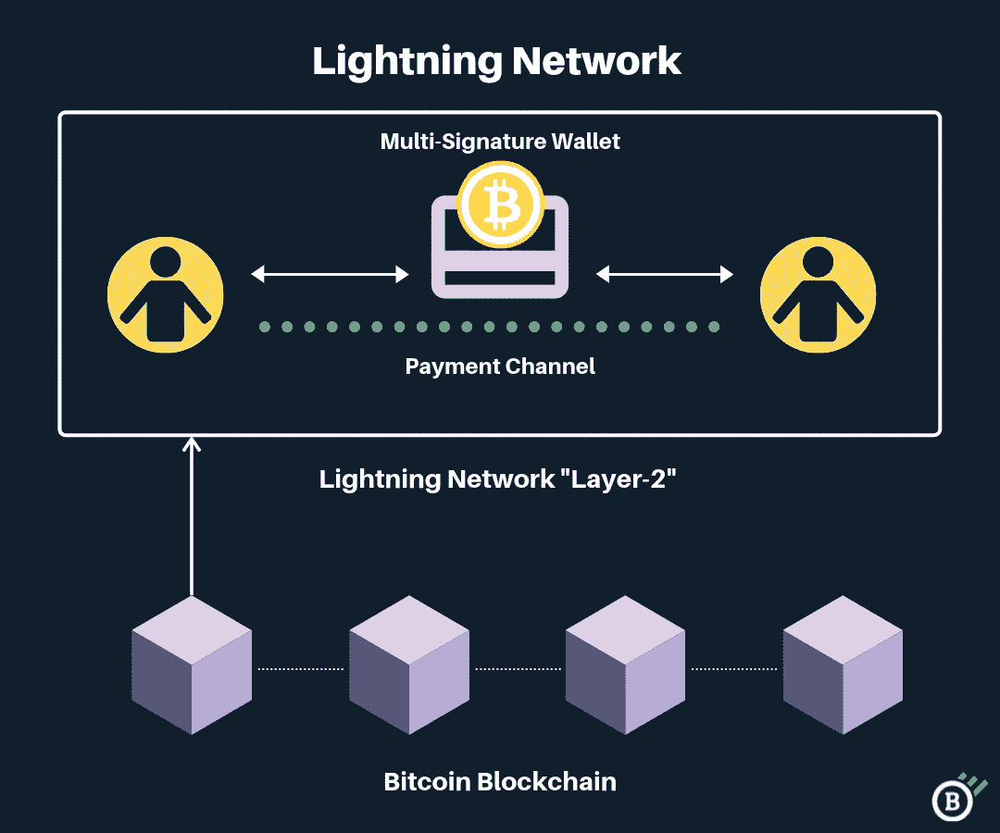

# 比特币:中本聪时代

> 原文：<https://medium.com/coinmonks/bitcoin-the-age-of-satoshi-nakamoto-fe58157e740d?source=collection_archive---------4----------------------->

## 片名像不像电影？是的，它是！完全是受到复仇者联盟电影第二部装置的启发；然而，中本聪在这里指的是视觉而不是奥创(IYKYK)。

> “从绝望中进化。”

如果你看过漫威的第一部电影，你可能不会忘记托尼(又名钢铁侠)把核弹带到天空的洞里，然后及时掉出来的场景。我特别喜欢那个场景，因为它完全不同意这样的说法， ***“你不是那个做出牺牲，躺在钢丝上让别人从你身上爬过去的人”*** *【是的，我来自钢铁侠团队】。*

现在，前进到复仇者联盟 2 *【又名复仇者联盟:奥创时代】，*托尼和班纳得到洛基的权杖或心灵之石，并开始为更美好的未来建造一些东西。但话说回来，事情出了差错，奥创出生了，他的目标是消灭人类。

现在，奥创试图自己获得一个新的身体，并将心灵之石放入其中；这一次，为了变得更好，奥创试图将自己上传到他的新身体，但被帽子、寡妇和鹰眼阻止。这就是视觉诞生的地方，一个强壮、诚实、独一无二的机器人，控制着心灵之石。

Avengers: Age of Ultron

托尼不顾一切地将盔甲包裹在地球上，保护每一个人，而奥创不顾一切地摧毁每一个现存的生命形式。他们的绝望导致了他们没有想到的东西的产生。这就是为什么我认为 Satoshi 做了同样的事情，他不顾一切地寻找解决目前金融障碍的方法，因此他能够创造比特币，但他成功了吗？是的。

> “有几十年什么都没发生，也有几周几十年都发生了。”

这是俄罗斯政治家弗拉基米尔·伊里奇·列宁的一句名言。那我为什么把它放在这里？因为这是比特币和现在金融体系的历程，已经运行了 600 多年。而比特币出现才十几年，现在它对传统金融体系构成了威胁。

比特币，我们资产的救星，金融体系的革命，去中心化的关键。我们，相信它的人，认为聪是最终的救世主。然而，我们常常忘记，为比特币提供价值的不仅仅是聪、你、我。因此，如果我把我们所有人都称为 Satoshis 也不会错，因为我们毕竟在一个更大的故事中扮演着一个角色。所以让我们从一切开始的地方开始吧！

# 开始

与此类似的文章大多从 2008 年开始，不过还是从实际开始说起吧，二战。随着时间的推移，很明显，战争推动进化；美国能够制造核武器只是因为他们需要赢得战争。如果不是这样，广岛和长崎的后果会有所不同。

不管怎样，让我们不要陷入其中，不要绕圈子。英国数学家、计算机科学家和密码分析学家艾伦·图灵是为我们今天所知的密码学奠定基础的第一人。之后的 1949 年，克劳德·沙农(Claude Shanon)在一份技术期刊上发表了一篇名为《密码学的数学理论》(A mathematical theory of Cryptography)的文章，被认为是现代密码学的基础。

Bitcoin Timeline

快进 25 年，1974 年，瑟夫和卡恩发表了一篇名为《分组网络互通协议》的论文。该论文提出了一种协议，该协议支持存在于不同分组交换网络中的资源共享。

将时间快进到另一个 34 年的 Satoshi，在密码学的帮助下，他创造了数量有限的 2100 万张数字点对点现金。此外，这种电子现金的用户将能够在没有任何第三方的情况下相互支付。这种数字现金就是比特币。

> 我们提出了一种使用对等网络来解决重复花费问题的解决方案。网络通过将事务散列到正在进行的基于散列的工作证明链中来对事务进行时间戳标记，从而形成在不重做工作证明的情况下无法更改的记录。最长的链不仅证明了所见证的事件序列，还证明了它来自最大的 CPU 能力池。只要不合作攻击网络的节点控制着大部分 CPU 能力，它们就会产生最长的链，超过攻击者。

> *Satoshi Nakamto，比特币白皮书*

# 这和钱有什么关系？

在这之前我写过两篇关于“ [***钱是什么*** ”的文章？](/coinmonks/is-the-100-bill-in-your-wallet-money-or-something-that-has-no-value-99263e8dfba6?source=user_profile---------0----------------------------)[***银行会灭亡还是会适应***](/coinmonks/will-banks-perish-or-adapt-the-future-of-defi-will-decide-80f13284f76?source=user_profile---------3----------------------------) 。”所以在这里总结一下，我要说，如果你认为拥有菲亚特是为退休储蓄的最佳方式，那你肯定是注定要失败的。因为如果你存进银行账户的钱每年贬值 10%，你会怎么做？

此外，比特币的起源并不是因为它是一项革命性的技术，而是因为它是一种针对我们金融体系的拟议解决方案。此外，它的成功也只是因为人们认为目前的金融体系是不称职的，并接受它是有史以来最好的替代方案。

Photo by Eugene Baron

# 什么是工作证明？

> 网络通过将事务散列到基于散列的工作证明的连续链中来为事务添加时间戳，从而形成一个不重做工作证明就无法更改的记录
> 
> 中本聪，比特币白皮书

这到底是什么意思？好吧，简而言之(像四个字简而言之)，“*比特币不能腐败。”*

有比特币矿工操作的节点，每个节点都盯着另一个节点，以确保一切正常运行。此外，这些节点还会相互竞争解决复杂的数学难题，之后网络会奖励它们比特币。

事情开始时，一名矿工因计算出解决数学难题所需的电能而获得了 BTC 奖。然而，随着其需求的增加，市场价值增加[ *仍在上升，正如我写这个* ]。

*“工作验证包括扫描一个值，当散列时，如 SHA-256，散列以零比特数开始。”*

工作证明解决了决策过程，因为每个 CPU 都有一票，任何拥有高 CPU 能力的人都将在决策过程中拥有重要的发言权。此外，最有可能的是，没有不诚实的节点能够篡改时间戳。因为试图篡改东西的人必须改变该块及其后所有块的数据。此外，它需要在计算能力上超过诚实节点。这是极不可能的，除非某个对事情有重大控制权的人介入(政府？).

最后，网络自动处理提供给矿工的谜题级别。如果谜题太简单，新的方块很快就会被挖掘出来，这就增加了难度。如果矿工花太多时间开采一个新区块，网络降低了难度。

Source: Level of coding

# 背后的经济学

10 年前，1 万个比特币可能可以给你买 2 个披萨，截至 2021 年，你可以用这个金额购买[$ 6.4 亿]几乎所有东西。所以后悔当时和女朋友的披萨约会也没用，不如买比特币。因为说实话，世界上大部分人都是在拥有一整枚比特币的成本太高之后才知道比特币的。

想象过从南极空运一亿吨黄金到北极吗？有没有可能，也许？但是可行吗？我想不会。好吧，假设你想从美国汇 500 万美元到澳大利亚；会发生什么？消耗太多时间？电汇收费合理吗？依靠第三方？最重要的是，将美元兑换成澳元。

我们人类一直面临的最大问题是在时间和空间上转移价值。所以，Satoshi 的心血结晶，比特币瞬间解决了其中的这个问题。你可以在一瞬间(通过闪电网络)将比特币转移到世界任何地方。

# 问题解决了

> 任何一个积累了大量财富而又独立于军事政治指挥结构的人都面临着捍卫自己所获财富的问题。除非一个商人能指望得到某个强大人物的保护，否则没有什么能阻止当地统治者在他的货物触手可及的时候没收他的财产。获得有效的保护很可能是昂贵的——昂贵到抑制私人资本的大规模积累。

威廉·麦克尼尔

许多人不知道这一点，但战争推动创新和经济。或者我会说，一些渴望生存的人决定了他们适应和进步的速度。这很有趣，因为人类在他们的房子周围躺了整整几个星期，什么都不做，但当战争爆发时，他们可以建造核武器，可以在眨眼之间摧毁整个城市。

但这不是这里的重点；关键是，如果你很富有，或者你在体制内，那么很可能没有人会从你那里拿走你已经拥有的东西。

Credits: The Cartoonist Group

然而，如果你属于能够保护自己财产的那一类人，那么在家里储存一公斤黄金并忍受不眠之夜是没有意义的。因为拜托，谁都可以一枪爆头把它抢走。

但比特币却不是这样；一旦你藏起了你的私人钥匙或者记住了它们，并且销毁了它们存在的任何可能的物理证据，除了你之外，没有人能访问你的比特币。

Credit: VectorStock

任何政府都不能把它从你手中夺走；他们不能说它不再有效，因为拜托，你不记得在朝鲜发生了什么吗？政府宣布你在银行外的韩元将不再有效，你最多只能兑换 11，000 韩元。对于一个把一生的积蓄存放在银行之外并兑换成韩元的人来说，这是一种创伤。

*当我们需要一些东西更好地工作或者我们需要解决一个问题的时候，进化就很突出了*。因此，我相信比特币会给我们带来进化。矿工需要更快的处理速度；有人会创造它，他们会采纳它。有人发明了一种以更少的能源消耗开采 BTC 的方法；矿工会采用它。任何持续运行比特币的东西都会被假设。这本身就是一件好事，因为气候变化等问题继续质疑比特币的存在，最终将推动创新者提出更好的计划。

# 遗留的问题

不知情的人用语句痛击比特币。它消耗大量的能量，慢慢地变成了一个数字化的东西，传输更小的量也要收费。他们往往会忘记，许多比特币矿工依赖于可再生能源，如水电、天然气泄漏等。最近，总统[纳伊布·布克勒开始利用火山能量开采比特币](https://blog.coincodecap.com/bitcoin-news-4-october-2021)。

比特币是最好的价值储存手段，区块链是未来。然而，在我们拿出更好的版本之前，区块链支付在近期任何时候都不可行。由于我们需要支付非常高的费用，即使是更小的交易，单笔交易可能需要几个小时才能处理完毕。

Visa 的交易量高达每秒 24，000 笔。相比之下，比特币每秒只能处理 7 笔交易[> 300 倍]。此外，如果我们在全球范围内接受比特币作为替代品，它将会下跌，因为没有人愿意仅仅因为买不起零食而排队几个小时。*【想象你想和某人发生性关系，你买了避孕套，你很饥渴，现在你不得不在商店里等 5 个小时，因为你的付款没有被处理。该死的。]*

这就是比特币闪电网络的用武之地。

# 闪电网络

现在，使用小额支付渠道可以解决可扩展性问题。例如，假设你从一个卖主那里买了一个柠檬，现在你需要向他们付款，显然，全世界都不需要知道你从某某卖主那里买了一个柠檬。因此，通过在你和供应商之间建立一个小渠道，你可以完成交易。这大大提高了两个人之间正常交易的速度。

Credit: Blockonomics

*“通过创建这些双方分类账条目的网络，有可能找到一条类似于在互联网上路由数据包的跨网络路径。沿着路径的节点是不可信的，因为支付是使用脚本来执行的，该脚本通过递减时间锁来执行原子性(整个支付成功或失败)*

此外，闪电网络可以为我们提供一天处理数十亿笔交易的能力。所以现在，你不用排队买你刚买的避孕套了。

# 聪是奥创还是视觉？

比特币是否类似于奥创或愿景并不重要，因为当他们的时代到来时，他们都倒下了。比特币之所以存在，是因为它不仅更强、更硬、更安全，更重要的是它还具有抗脆弱性。

下周末我会带着另一篇文章回来。在那之前，请点击“关注”按钮继续阅读我的文章，如果你读得不错，请鼓掌表示支持！

与我联系，

[推特](https://twitter.com/prabxat) | [领英](https://www.linkedin.com/in/praxhat/)

1.  [BTCST 刚刚在 3 天内涨了 5 倍|它的目标是 1000 美元吗？](/coinmonks/btcst-just-went-5x-in-3-days-is-it-aiming-for-1-000-9dcba894c954?source=user_profile---------1----------------------------)
2.  【2021 年 10 月可购买的前 5 种替代币
3.  [银行会灭亡还是会适应？DeFi 的未来将会决定。](/coinmonks/will-banks-perish-or-adapt-the-future-of-defi-will-decide-80f13284f76?source=user_profile---------1----------------------------)
4.  [你钱包里的 100 元钞票，是钱，还是没有价值的东西？](/coinmonks/is-the-100-bill-in-your-wallet-money-or-something-that-has-no-value-99263e8dfba6?source=user_profile---------0----------------------------)
5.  [2021 年底前比特币还在破 100K 的路上吗？](/coinmonks/is-bitcoin-still-on-its-path-to-break-100k-before-the-end-of-2021-4716a56745ce?source=user_profile---------1----------------------------)
6.  [我是如何在大学本科阶段开始投资 Crypto 的？](https://praxhat.medium.com/how-did-i-start-investing-in-crypto-as-a-college-undergrad-ac9635d9d6b3?source=user_profile---------2----------------------------)

> 这篇文章中所写的一切都是我所相信的，很可能你的想法和我的不同(显然我们是两个不同的人)。此外，本文中没有任何内容是一条财务建议，所写的一切仅包含我的信念。

**同样，阅读**

*   [币安 vs 北海巨妖](https://blog.coincodecap.com/binance-vs-kraken) | [美元成本平均交易机器人](https://blog.coincodecap.com/pionex-dca-bot)
*   [如何在印度购买比特币？](/coinmonks/buy-bitcoin-in-india-feb50ddfef94) | [WazirX 审查](/coinmonks/wazirx-review-5c811b074f5b) | [BitMEX 审查](https://blog.coincodecap.com/bitmex-review)
*   [比特币主根](https://blog.coincodecap.com/bitcoin-taproot) | [Bitso 回顾](https://blog.coincodecap.com/bitso-review) | [排名前 6 的比特币信用卡](/coinmonks/bitcoin-credit-card-bc8ab6f377c6)
*   [双子座 vs 比特币基地](https://blog.coincodecap.com/gemini-vs-coinbase) | [比特币基地 vs 北海巨妖](https://blog.coincodecap.com/kraken-vs-coinbase) | [CoinJar vs CoinSpot](https://blog.coincodecap.com/coinspot-vs-coinjar)
*   [印度加密交易所](/coinmonks/bitcoin-exchange-in-india-7f1fe79715c9) | [比特币储蓄账户](/coinmonks/bitcoin-savings-account-e65b13f92451) | [Paxful 审核](/coinmonks/paxful-review-4daf2354ab70)
*   [杠杆令牌](/coinmonks/leveraged-token-3f5257808b22) | [最佳加密交易所](/coinmonks/crypto-exchange-dd2f9d6f3769) | [AscendEX 评论](/coinmonks/ascendex-review-53e829cf75fa)
*   [Godex.io 审核](/coinmonks/godex-io-review-7366086519fb) | [邀请审核](/coinmonks/invity-review-70f3030c0502) | [BitForex 审核](https://blog.coincodecap.com/bitforex-review) | [HitBTC 审核](/coinmonks/hitbtc-review-c5143c5d53c2)
*   [Crypto.com 费用](/coinmonks/binance-fees-8588ec17965) | [僵尸加密审查](/coinmonks/botcrypto-review-2021-build-your-own-trading-bot-coincodecap-6b8332d736c7) | [替代品](https://blog.coincodecap.com/crypto-com-alternatives)
*   [有哪些交易信号？](https://blog.coincodecap.com/trading-signal) | [Bitstamp vs 比特币基地](https://blog.coincodecap.com/bitstamp-coinbase)
*   [ProfitFarmers 点评](https://blog.coincodecap.com/profitfarmers-review) | [如何使用 Cornix 交易机器人](https://blog.coincodecap.com/cornix-trading-bot)
*   [MXC 交易所评论](/coinmonks/mxc-exchange-review-3af0ec1cba8c) | [Pionex vs 币安](https://blog.coincodecap.com/pionex-vs-binance) | [Pionex 套利机器人](https://blog.coincodecap.com/pionex-arbitrage-bot)
*   [我的密码交易经验](/coinmonks/my-experience-with-crypto-copy-trading-d6feb2ce3ac5) | [比特币基地评论](/coinmonks/coinbase-review-6ef4e0f56064)
*   [CoinFLEX 评论](https://blog.coincodecap.com/coinflex-review) | [AEX 交易所评论](https://blog.coincodecap.com/aex-exchange-review) | [UPbit 评论](https://blog.coincodecap.com/upbit-review)
*   [AscendEx 保证金交易](https://blog.coincodecap.com/ascendex-margin-trading) | [Bitfinex 赌注](https://blog.coincodecap.com/bitfinex-staking) | [bitFlyer 点评](https://blog.coincodecap.com/bitflyer-review)
*   [麻雀交换评论](https://blog.coincodecap.com/sparrow-exchange-review) | [纳什交换评论](https://blog.coincodecap.com/nash-exchange-review)
*   [加密货币储蓄账户](/coinmonks/cryptocurrency-savings-accounts-be3bc0feffbf) | [赌注加密](https://blog.coincodecap.com/staking-crypto)
*   [BigONE 交易所评论](/coinmonks/bigone-exchange-review-64705d85a1d4) | [CEX。IO 审查](https://blog.coincodecap.com/cex-io-review) | [交换区审查](/coinmonks/swapzone-review-crypto-exchange-data-aggregator-e0ad78e55ed7)
*   [最佳比特币保证金交易](/coinmonks/bitcoin-margin-trading-exchange-bcbfcbf7b8e3) | [比特币保证金交易](https://blog.coincodecap.com/bityard-margin-trading)
*   [加密保证金交易交易所](/coinmonks/crypto-margin-trading-exchanges-428b1f7ad108) | [赚取比特币](/coinmonks/earn-bitcoin-6e8bd3c592d9) | [Mudrex 投资](https://blog.coincodecap.com/mudrex-invest-review-the-best-way-to-invest-in-crypto)
*   [WazirX vs coin dcx vs bit bns](/coinmonks/wazirx-vs-coindcx-vs-bitbns-149f4f19a2f1)|[block fi vs coin loan vs Nexo](/coinmonks/blockfi-vs-coinloan-vs-nexo-cb624635230d)
*   [BlockFi 信用卡](https://blog.coincodecap.com/blockfi-credit-card) | [如何在币安购买比特币](https://blog.coincodecap.com/buy-bitcoin-binance)
*   [火币交易机器人](https://blog.coincodecap.com/huobi-trading-bot) | [如何购买 ADA](https://blog.coincodecap.com/buy-ada-cardano) | [Geco。一次回顾](https://blog.coincodecap.com/geco-one-review)
*   [加密复制交易平台](/coinmonks/top-10-crypto-copy-trading-platforms-for-beginners-d0c37c7d698c) | [五大 BlockFi 替代品](https://blog.coincodecap.com/blockfi-alternatives)
*   [CoinLoan 点评](https://blog.coincodecap.com/coinloan-review)|[Crypto.com 点评](/coinmonks/crypto-com-review-f143dca1f74c) | [火币保证金交易](/coinmonks/huobi-margin-trading-b3b06cdc1519)
*   [Bybit vs 币安](https://blog.coincodecap.com/bybit-binance-moonxbt)|[stealth x 回顾](/coinmonks/stealthex-review-396c67309988) | [Probit 回顾](https://blog.coincodecap.com/probit-review)

mXc6Ii9z8Af5EOe9ZG6akEnqC3G2