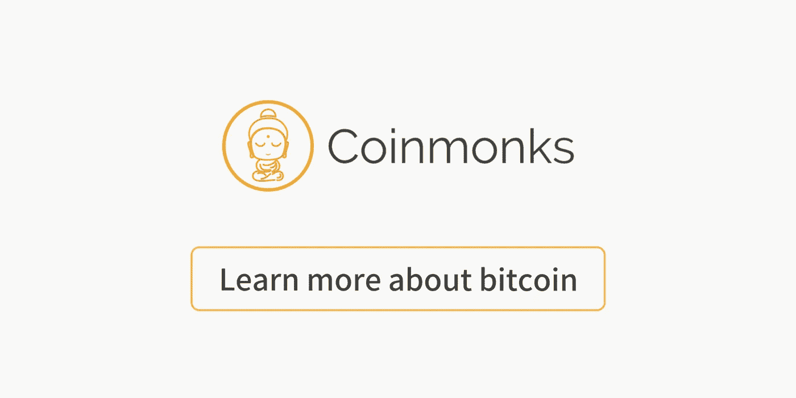

# 比特币——互联网货币的大爆炸

> 原文：<https://medium.com/coinmonks/bitcoin-the-big-bang-of-internet-money-525b4eb2a7c5?source=collection_archive---------8----------------------->

## 阅读一些发表在 Coinmonks 上的关于比特币的最佳文章

**I picture Internet like this and bitcoin is gravity of this internet (**[**source**](https://www.youtube.com/watch?v=St57hBxH_Fw)**)**

[**使用 Coinmonks 作业门户**查找加密作业](https://coinmonks.com/)

***[加入投币僧侣电报组。](/coinmonks/coinnmonks-crypto-writers-telegram-group-f56b4621af0a)***

[***捐钱给僧侣***](/coinmonks/monks-need-your-help-7440418d67ec)

在 2009 年，Satoshi 在计算机内存中编写了线下代码，它成为了下一次革命的基础，这一革命正在改变今天货币的定义。

> “泰晤士报 03/1/2009 财政大臣处于第二次银行救助的边缘”——[比特币起源区块](https://en.bitcoin.it/wiki/Genesis_block)

从 Coinmonks 上一些最受欢迎的文章中了解比特币。

来自[普拉蒂克·古尔哈](https://medium.com/u/e771482aa1e2?source=post_page-----525b4eb2a7c5--------------------------------)和[抛物线轨道](https://medium.com/u/aa1e573dda8b?source=post_page-----525b4eb2a7c5--------------------------------)

[**构建比特币经济:完整的契约治理平台**](/coinmonks/building-the-bitcoin-economy-the-complete-contract-governance-platform-54f723e88ccf)

 [## 构建比特币经济:完整的契约治理平台

### 普拉蒂克·古尔哈&抛物线轨道

medium.com](/coinmonks/building-the-bitcoin-economy-the-complete-contract-governance-platform-54f723e88ccf) 

丹尼尔·西姆林

[**深入探讨比特币网络效应**](/coinmonks/a-deeper-look-into-bitcoin-network-effects-d6b4b8a16f03)

 [## 对比特币网络效应的深入研究

### Multicoin Capital 的 Kyle Samani 最近写了一篇发人深省的文章，论述了价值储存的网络效应…

medium.com](/coinmonks/a-deeper-look-into-bitcoin-network-effects-d6b4b8a16f03) 

来自[马克·哈维](https://medium.com/u/3aa6aece50a3?source=post_page-----525b4eb2a7c5--------------------------------)

[**比特币是唯一重要的区块链**](/coinmonks/bitcoin-is-the-only-blockchain-that-matters-74f1e53221cb)

 [## 比特币是唯一重要的区块链

### 关于什么是区块链以及如何用它来解决现实世界的问题，尤其是在…

medium.com](/coinmonks/bitcoin-is-the-only-blockchain-that-matters-74f1e53221cb) 

山姆·阿姆斯特朗

[**比特币的基本面价值**](/coinmonks/an-open-letter-to-peter-schiff-bitcoin-has-use-value-3e7af5740f78)

 [## 比特币的基本价值

### 我注意到彼得·希夫以奥地利逆向投资者的身份重返财经访谈类节目。正如经常发生的那样…

medium.com](/coinmonks/an-open-letter-to-peter-schiff-bitcoin-has-use-value-3e7af5740f78) 

来自[艾米莉亚·丹尼尔·米雷亚](https://medium.com/u/7d5406f39b7b?source=post_page-----525b4eb2a7c5--------------------------------)

[**为什么比特币没有更进一步|社会实验**](/coinmonks/why-isnt-bitcoin-going-further-social-experiment-8c6895ed952)

 [## 为什么比特币没有更进一步|社会实验

### 我将以一个超越常规思维的人，一个理解新概念的人的身份开始这篇博文…

medium.com](/coinmonks/why-isnt-bitcoin-going-further-social-experiment-8c6895ed952) 

来自[安东尼·史蒂文斯](https://medium.com/u/6b730dc51e4a?source=post_page-----525b4eb2a7c5--------------------------------)

[**了解拜占庭将军的问题(及其对你的影响)**](/coinmonks/a-note-from-anthony-if-you-havent-already-please-read-the-article-gaining-clarity-on-key-787989107969)

 [## 理解拜占庭将军的问题(以及它如何影响你)

### 安东尼的一个提示:如果你还没有，请阅读文章《弄清楚关键术语:比特币…

medium.com](/coinmonks/a-note-from-anthony-if-you-havent-already-please-read-the-article-gaining-clarity-on-key-787989107969) 

戴安娜·阿吉拉尔

[**在委内瑞拉解构关于比特币的神话和戏剧。**](/coinmonks/deconstructing-myths-and-drama-about-bitcoin-in-venezuela-c6319cb70835)

 [## 解构委内瑞拉关于比特币的神话和戏剧。

### 当我们谈论加密货币作为关键经济体的某种“生命救星”时，我们确实倾向于把更多的…

medium.com](/coinmonks/deconstructing-myths-and-drama-about-bitcoin-in-venezuela-c6319cb70835) 

我相信每篇文章都是最好的，值得一读，所以感谢每一位为 Coinmonks 做出贡献的作家🙏。

> 如果你喜欢这些故事，你可以给👏给这些了不起的作家、学习者和制作者，与我们分享这些教育故事，别忘了关注我们的 Coinmonks 出版物。请告诉我们您想了解区块链领域的哪些内容。😃

**Click to read more stories about bitcoin**