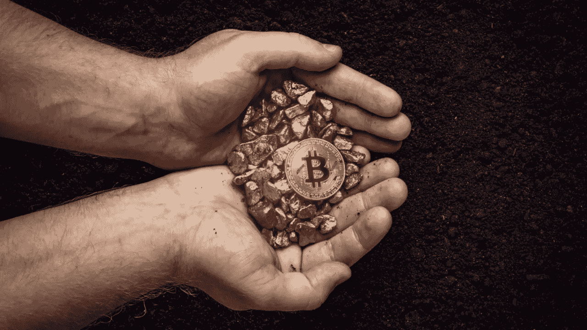
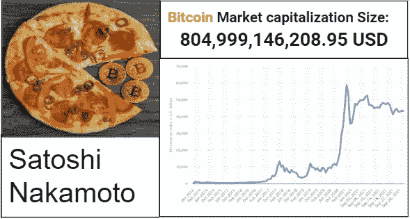

# 比特币:数字黄金

> 原文：<https://medium.com/coinmonks/bitcoin-the-digital-gold-d104dfaf6a83?source=collection_archive---------3----------------------->

## 信息丰富的演讲

如果你正在寻找一个关于比特币的信息丰富的话题，并对它有更多的了解，那么你绝对来对地方了！

这篇文章是我的公共演讲课的一部分，具有信息演讲的结构。我期待看到你从中受益。

> **我们开始吧！**

你想象过没有现金的世界吗？从字面上看，银行不必印刷任何纸币？你有没有想象过，我们可以不通过银行来发送和接收资金，银行是确保交易和我们数据安全的可信赖的第三方？这可能吗？你猜到我要说什么了吗？

如果你还没猜到，我要说的话题是所谓的加密货币，更确切地说是第一种存在的加密货币:比特币。我相信你们都曾经看过这样的新闻，比如特斯拉购买了 15 亿美元的比特币，或者唐纳德·特朗普在推特上发布了关于比特币的消息，或者某个国家宣布所有加密货币交易都是非法的，这等同于禁止比特币。或者另一个国家宣布接受比特币支付。

然而，这是我们每天听到的最热门、最有争议和最热门的话题之一。让我与你分享一些有趣的必须知道的事实，这是我在区块链领域实习时发现的，比特币正是基于这一技术。今天，我将带你了解一些事实，但首先，我们将从比特币发明背后的历史开始。

> 订阅 [**Coinmonks Youtube 频道**](https://www.youtube.com/c/coinmonks/videos) 获取每日加密新闻。

2008 年 10 月 31 日，首次介绍比特币的白皮书在对密码学感兴趣的人的邮件列表上流传。“我一直在研究一种新的电子货币系统，这种系统完全是点对点的，没有可信的第三方，”所谓的比特币创始人中本聪写道。

早在 2007-2008 年，全球金融危机、金融危机和几家美国银行(如标志性的美国投资银行雷曼兄弟控股公司)的倒闭动摇了人们对银行的信心，并导致了比特币的诞生。简而言之，比特币是人们通过互联网收发资金的一种新方式。一个没有中央控制的替代支付系统，基于一个分散的网络，有一套透明的规则，提供更多的安全性，更不容易受到黑客攻击。Andreas M. Antonopoulos 在她的著作《掌握比特币》中将其定义为四个要素:去中心化的点对点网络、公共交易账本、共识规则以及就有效区块链达成全球去中心化共识的机制。

话虽如此，在比特币存在的最初几个月，它一文不值，直到著名的披萨日。2010 年 5 月 22 日，拉兹洛·汉耶茨花了 1 万 BTC 买了两个棒约翰披萨，现在价值约 4.15 亿美元。这是比特币第一次被赋予货币价值的商业交易，现在每年都以比特币披萨日来纪念。

最后但同样重要的是，让我提醒你注意其他一些有趣的问题。比特币最初从 0.0008 美元左右开始交易，并于 2021 年 4 月 14 日达到 64863 美元的历史最高价。比特币提供了低交易费用、更快的处理速度和更好的可追溯性，这增加了金融包容性，克服了社会信任的缺乏。 *Paul Vigna* 在他的书*加密货币的时代中，*说我们有机会改革金融系统，把它变成它应该成为的公共事业。

比特币的市值规模价值 804，999，146，208.95 美元。大约 20%的比特币已经永远消失了。根据加密货币新闻和信息的领导者 Coindesk 平台的说法，最后一个比特币将在 2140 年被开采出来。

总之，比特币，或者我们所说的数字黄金和加密货币，总的来说，是 21 世纪的货币革命，代表着金融系统的一条新路。是的，截至 2021 年 9 月，现有超过 6500 种加密货币。

希望你已经享受了学习所有这些关于比特币的事实！你现在对它的起源和进化有了更清晰的了解。

Visuals I used during the speech — the word Bitcoin was hidden before revealing the topic

> 引用的作品

 [## 比特币 P2P 电子现金论文|中本聪研究所

### 我一直在开发一个新的电子现金系统，它是完全点对点的，没有可信的第三方。论文是…

satoshi.nakamotoinstitute.org](https://satoshi.nakamotoinstitute.org/emails/cryptography/threads/1/) 

“比特币和数字货币如何挑战全球经济秩序”。2015 年 1 月 27 日

《掌握比特币:编程开放区块链》Andreas M. Antonopoulos。2014 年 12 月

[https://www . coin base . com/learn/crypto-basics/什么是比特币减半](https://www.coinbase.com/learn/crypto-basics/what-is-a-bitcoin-halving)