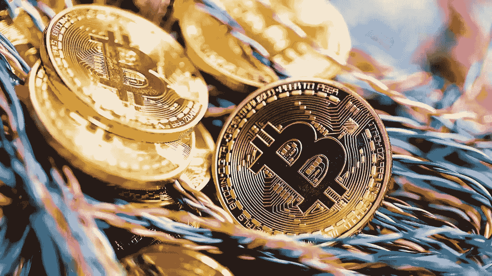
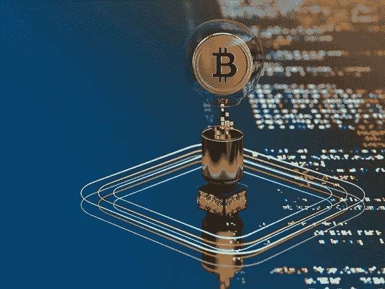
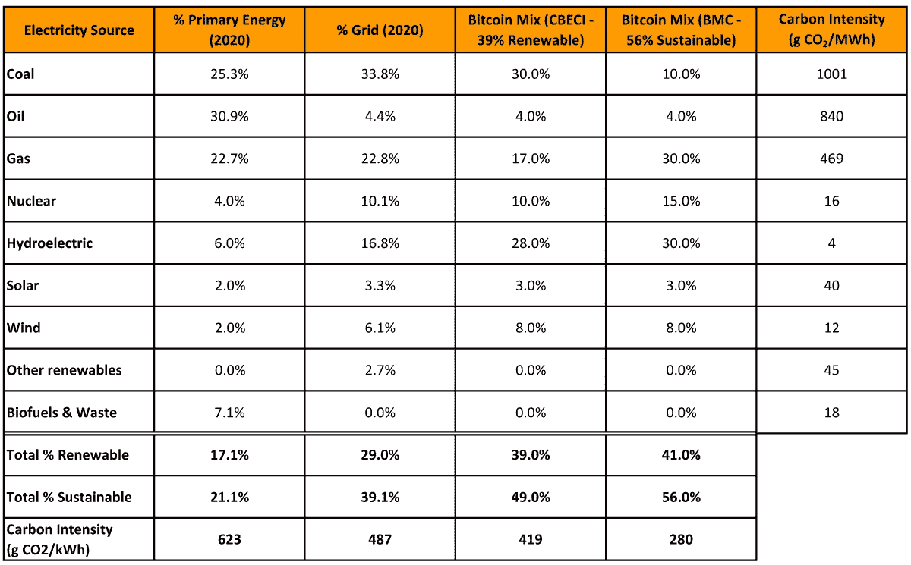
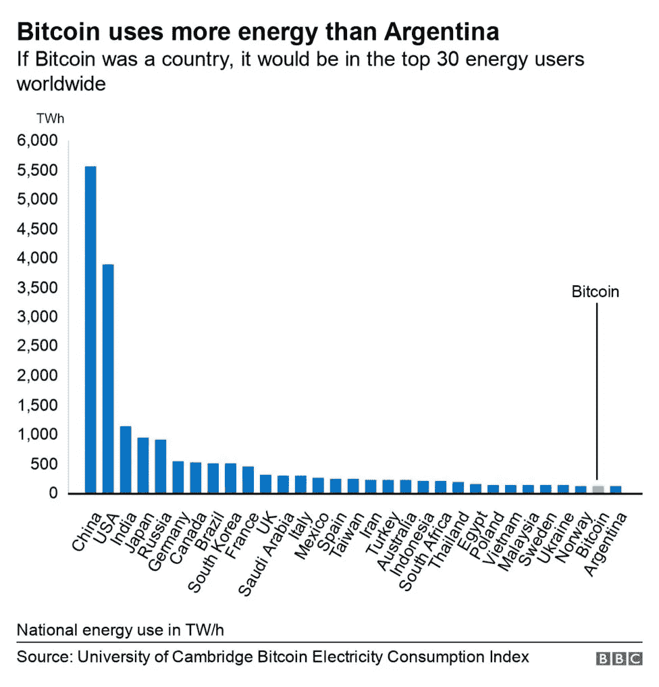
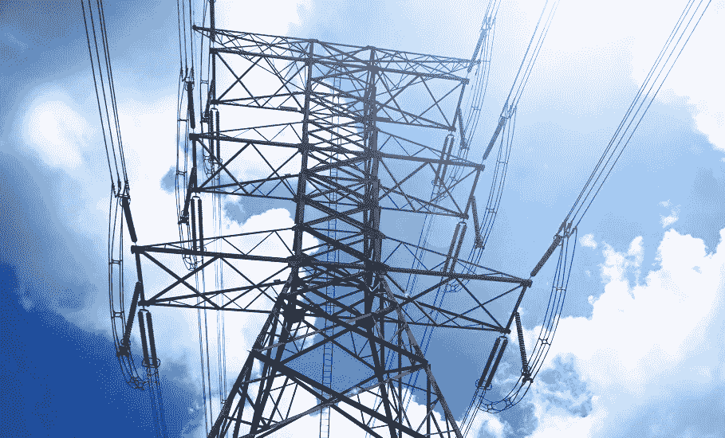
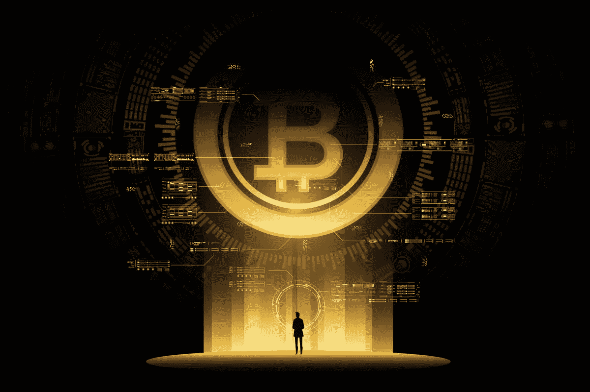
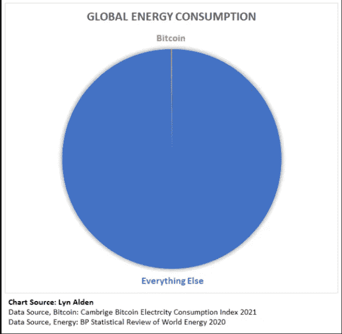
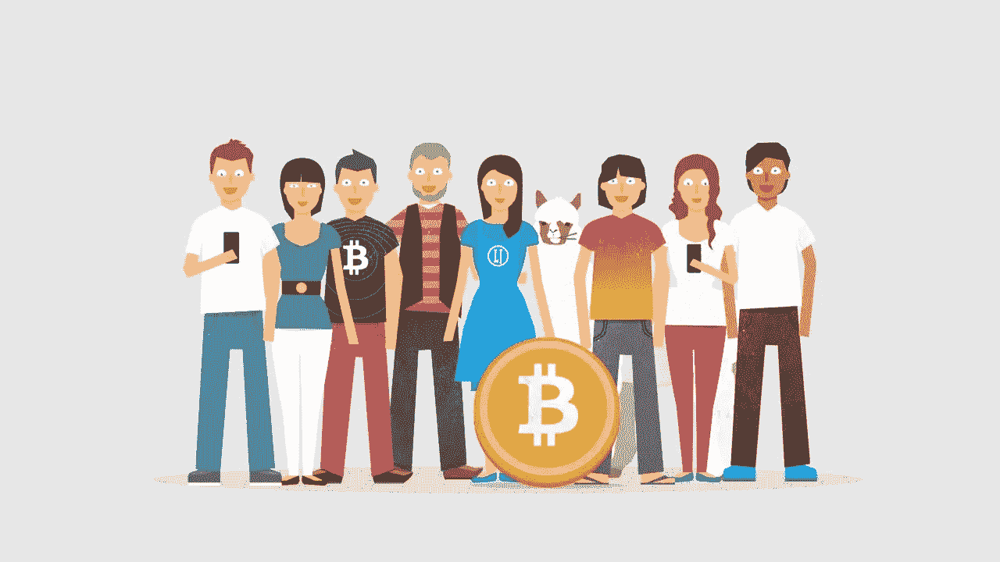

# 比特币&能源之争

> 原文：<https://medium.com/coinmonks/bitcoin-the-energy-debate-b25ca499d3e5?source=collection_archive---------9----------------------->

## 第二部分——比特币的地位如何？

# “比特币消耗多少电能？”

这是一个已经争论了多年的问题，尤其是当价格上涨和最近飙升至历史新高时，这无疑使争论重新活跃起来。

这个问题通常伴随着强烈的怀疑和批判:从骗局、庞氏骗局到在黑社会犯罪中进行交易的手段，再到作为有效支付工具的失败。

> 这不是什么新闻——因为以一种持续的、令人恼火的方式抱怨某事是人类的天性。

这导致我们一方面有两个研究，如 ***剑桥另类金融中心(CCAF)***

 [## 剑桥比特币用电指数(CBECI)

### 比特币网络电力需求历史每 24 小时更新一次理论下限 4.67 年化消费帮助…

ccaf.io](https://ccaf.io/cbeci/index) 

声称*比特币*网络消费大约是每年 ***112 太瓦时***——或者说 ***全球能源生产***的 0.55%****(*大约相当于马来西亚或者瑞典*等小国一年的能源消耗——还有 ***像*** 哈萨克斯坦*最近的能源紧张***

** [## 比特币开采继续给哈萨克斯坦的电网带来压力。原因如下——解密

### 比特币挖矿可以非常赚钱。图片:Shutterstock 当中国在五月禁止时，许多当地人嗤之以鼻，而且…

decrypt.co](https://decrypt.co/87293/bitcoin-mining-kazakhstan-power-china-hash-rate-price) 

但另一方面，不可否认的是，*比特币*已经**深深地激励了可再生能源的实施，并进一步推动了这一基础领域的创新**，这将是我们不远的将来的关键角色之一。

 [## 大规模比特币开采如何推动清洁能源创新

### 比特币开采的能源消耗是巨大的，人们正在注意到这一点。增长速度很快…

bitcoinmagazine.com](https://bitcoinmagazine.com/business/bitcoin-mining-drives-clean-energy) 

但是问题仍然存在:

## 一个货币体系应该消耗多少能量？那么，在这场辩论中，谁是正确的呢？

*让我们一起来寻找答案。*

# 二项式比特币——浪费

iStock Image

自然，关于比特币能源的争论中有政治因素。有些人可能希望强调甚至夸大比特币的功耗，这是有原因的，正如人们希望大力捍卫比特币也有意识形态上的原因。

任何关于比特币能源使用的客观案例都必须放在背景中，并列出该资产更广泛的好处。毕竟*不是零和游戏*。我们都同意无数的技术和系统会对环境造成损害，但当对比它们的优势时——例如对经济、金融包容性或人类健康——事情似乎并不那么简单。

Table: *Carbon intensity and energy mix comparative data, CBECI and BMC scenarios — Bitcoin Magazine*

对于*比特币*的支持者来说，这种能源支出对于一种抗审查的数字无记名资产来说是一个很小的代价，这种资产让世界公民摆脱了一个破碎的中央货币体系。据***The Crypto Voices***最新发布的全球货币基础、

 [## 基础货币-加密声音

### 上表中的政府法定基础货币供应量来源于世界上排名前 30 位的浮动货币

cryptovoices.com](https://cryptovoices.com/basemoney) 

*比特币*是地球上第六大基础货币(不包括 ***黄金和白银*** )，仅次于欧元区、日本、美国、中国和英国。随着矿商向不断扩张的比特币区块链添加新的交易区块，这种崇高的地位必然需要巨大的能量。

答同样，当与民族国家的电力输出相比时，比特币的消费少于 ***28*** 国家:在排行榜上，它夹在*乌克兰*和*阿根廷*之间。

虽然询问比特币所需的能量是否应该与整个国家的能量相当是合乎逻辑的，但这样做必须考虑价值。
所有开采出来的比特币的价值是*[***1.07 万亿美元***](https://www.investopedia.com/tech/how-much-worlds-money-bitcoin/#:~:text=What%20is%20the%20total%20value,bitcoins%20totaled%20over%20%241.03%20trillion)——大于*乌克兰*的 **GDP** 和第二大能源消费国*瑞典*的 **GDP** 的***5350 亿美元*** 。*

* [## 各国国内生产总值

### 世界各国按国内生产总值(GDP)排名。GDP 增长、人均 GDP 和…

www.worldometers.info](https://www.worldometers.info/gdp/gdp-by-country/)* 

# *比特币 vs 黄金*

**

*然而，比特币不是与国家竞争，而是与竞争对手的资产竞争，比如各国央行发行的法定货币，或者相对而言作为价值储存手段的黄金，这是一种每年都以工业规模开采的贵金属。*

****黄金开采*** 当然，严重依赖电网电力和直接化石燃料发电。去年， ***世界黄金协会(WGC)*** 的一份报告建议，到 2050 年*黄金行业的排放量必须减少*【80%】，才能与《巴黎协定》*中概述的****两度***情景保持一致。*******

**** [## 黄金矿工必须增加可再生能源，以满足气候目标:工业集团

### 路透多伦多/约翰内斯堡----如果整个行业陷入困境，金矿开采商必须迅速转向可再生能源发电

www.reuters.com](https://www.reuters.com/article/us-mining-gold-emissions-idUSKBN28J0Z4) 

相比之下，最新的 ***全球加密资产基准研究*** 显示*工作证明*中的*39%的采矿是由可再生能源驱动的，主要是水电能源。超过四分之三的哈希人也使用可再生能源作为他们的能源组合的一部分。*

## *这似乎是对这个行业的一个小小的打击，而这个行业无疑是变革的倡导者。***** 

# *****比特币 vs 银行业*****

**********

*****继 [***银河数码***](https://www.galaxydigital.io/) ( *一家金融服务和投资管理公司*)在***2021 年 5 月*** 发布的一份报告显示，*比特币*网络消耗的能源还不到银行业消耗的一半。*****

**** [## 阅读关于比特币能源消耗的银河数字矿业报告

### 文档发送

docsend.com](https://docsend.com/view/adwmdeeyfvqwecj2) 

报告发现(*当时的*)*比特币*每年消耗 ***113.89 太瓦时*** ( **TWh** )，而银行业每年消耗 ***263.72 太瓦时*** 。

 [## 比特币使用的电力是你的银行的一半，在传输过程中损失了 19 倍…

### 人生没有太多的确定，但有些事是确定的。日复一日，埃隆·马斯克在推特上写了一些关于…

www.news18.com](https://www.news18.com/news/tech/bitcoin-is-using-half-the-electricity-as-your-bank-and-there-is-19x-more-lost-in-transmission-yearly-3748892.html) 

该报告通过提炼比特币的一些独特特征以及它们如何与能源消耗相关联并对其产生影响，对比特币的能源消耗进行了透视，明确强调了该资产及其相关网络的特征:

> ***比特币不仅仅是一个结算层，不仅仅是一个价值储存手段，也不仅仅是一个交易媒介***

不可否认，比特币网络消耗了大量能源，但正是这种能源消耗让它变得如此强大和安全。

该报告真正揭示的是一种根深蒂固的(但不明智的)信念，即矿工消耗的能源要么是从更具生产力的使用案例中窃取的，要么导致能源消耗增加，但他们未能注意到当前能源系统的明显低效:

# 比特币矿工受到激励，利用非竞争对手的能源，否则可能会被浪费或利用不足，因为这种电力往往是最便宜的。

Source: Bitcoin Magazine

换句话说，这只是另一个空洞的、不健全的批评话题，却被大量用来转移(*或完全忽视*)对网络的好处和这个新网络的创新的注意力。

# 为什么比特币可能是我们能源网的最佳未来

*相对于全球能源使用量，比特币的*能源使用量只是一个舍入误差。通常得出世界能源使用量数据的科学家很容易在两个方向上相差 **1%** 到 **2%** ，这里我们说的是其中的十分之一。简直少得可怜。

*比特币的能源使用量会随着时间的推移而上升吗？* ***是*** 。

如果比特币成功成为世界的“能源货币”，它的能源支出必须上升，以捍卫行之有效的共识和网络。如果它对人类的价值增加，它的能源使用也会增加。

*比特币*有很大的效用，对人类很重要。今天，并不是每个人都使用或欣赏它的效用，这很好，但这并不意味着它对其他人没有效用。

## 目前，全球超过 1 万亿美元的财富存储在其中，这是一个不容忽视的巨大货币能量。

*比特币*，其实对于它未来可能储存的价值，可能用的能量太少了。考虑到比特币在未来十年的增长，并储存了*20*万亿美元的世界财富，甚至可能*50 万亿美元*，或者，我敢说*100*万亿美元，这是一大笔需要安全保护的货币能量。我们应该比现在投入更多的精力来保护网络。

底线是:随着可再生能源变得越来越便宜，比特币将变得更加绿色——其他一切也是如此。毫无疑问，**比特币**、**区块链**、**加密货币**和**分布式账本技术** ( ***、DLT*** )协议都必须寻求降低能耗和减少碳足迹——但我们都在这么做:央行、金融机构、矿业部门……还有*你*和*我*。

> *我们需要缩小视野，从更宏观的角度看待问题*

我们可以同意，比特币能源之争肯定会平息。

那些强烈反对加密货币的人将继续强调其对环境的影响，而不把这种情况放在背景中。与此同时，捍卫者们将为比特币而战——就像他们的生命依赖于此一样。然而，如果我们有兴趣参与全球数字专家(T21)和决策者(T23)的讨论，我们可以做的是用可靠的事实来证明我们的观点。辩论的任何一方下来都是完全可以接受的，但是一定要做出一个 ***知情的案例*** 。

> 最终，市场是比特币是否物有所值的仲裁者。

> 第 2 部分结束

**查看我们的新平台**👉**[**https://thecapital.io/**](https://thecapital.io/)**

**[https://twitter.com/thecapital_io](https://twitter.com/thecapital_io)**

> **加入 Coinmonks [电报频道](https://t.me/coincodecap)和 [Youtube 频道](https://www.youtube.com/c/coinmonks/videos)了解加密交易和投资**

# **另外，阅读**

*   **[币安 vs FTX](https://coincodecap.com/binance-vs-ftx) | [最佳(索尔)索拉纳钱包](https://coincodecap.com/solana-wallets)**
*   **[比诺莫评论](https://coincodecap.com/binomo-review) | [斯多葛派 vs 3Commas vs TradeSanta](https://coincodecap.com/stoic-vs-3commas-vs-tradesanta)**
*   **[Capital.com 审查](https://coincodecap.com/capital-com-review) | [港加密借贷平台](https://coincodecap.com/crypto-lending-hong-kong)**
*   **[如何在 Uniswap 上交换加密？](https://coincodecap.com/swap-crypto-on-uniswap) | [A-Ads 审核](https://coincodecap.com/a-ads-review)**
*   **[WazirX vs coin dcx vs bit bns](/coinmonks/wazirx-vs-coindcx-vs-bitbns-149f4f19a2f1)|[block fi vs coin loan vs Nexo](/coinmonks/blockfi-vs-coinloan-vs-nexo-cb624635230d)********