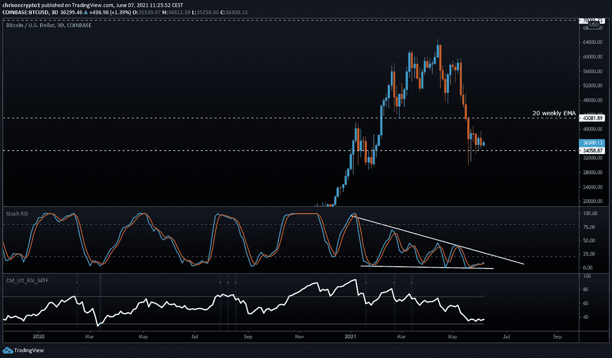
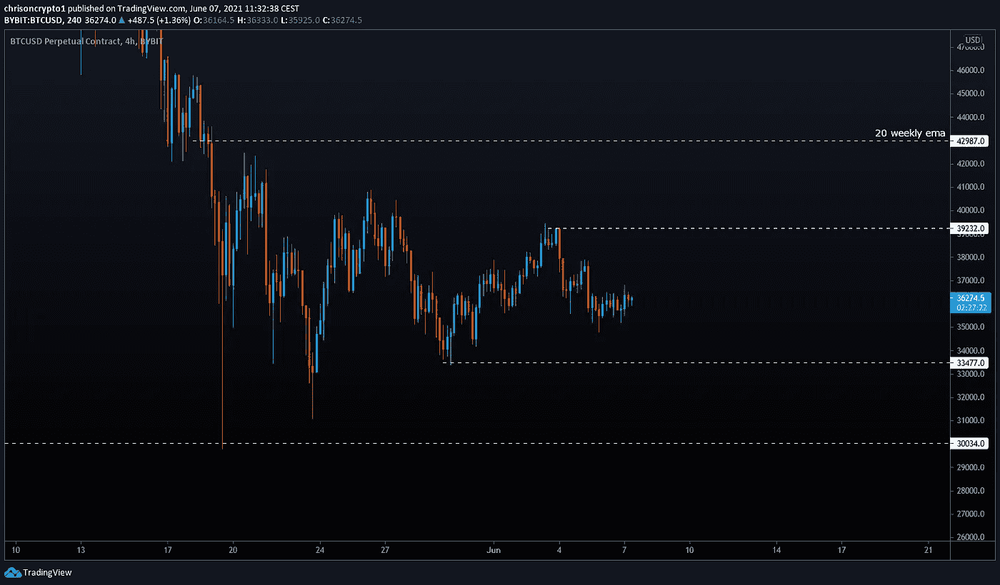
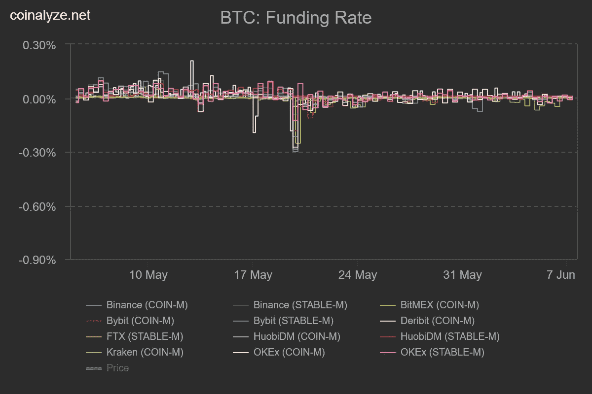
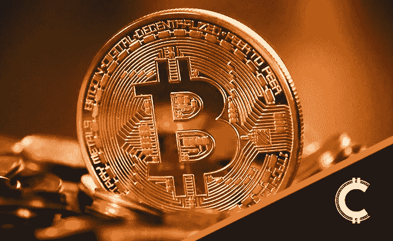

# 在广泛的市场稳定中，比特币将被认可为法定货币

> 原文：<https://medium.com/coinmonks/bitcoin-to-be-recognised-as-legal-tender-amid-broad-market-stability-3c0fc158cb70?source=collection_archive---------3----------------------->

所有迹象都指向一个波动的市场，因为比特币拒绝做出这样或那样的承诺。但萨尔瓦多采用比特币的消息会对市场产生立竿见影的影响吗？

我们来挖一下。

## 萨尔瓦多将使比特币成为法定货币

随着全球货币体系面临解体的威胁，萨尔瓦多希望成为地球上第一个承认比特币为法定货币的国家，以此来对冲风险。

几周前，美国美联储和欧洲央行(ECB)等央行行长宣布加快央行数字货币(CBDCs)的开发。

**查看** [全篇此处](https://chrisoncrypto.com/blog/f/el-salvador-to-make-bitcoin-legal-tender) **！**

# 技术上来说

## 比特币处于超卖区间

BTC/美元处于超卖区域。3 日比特币图表显示，在低于 20 点区域的技术超卖区域内，随机相对强度指数(RSI)存在卷起效应。发展中的结构表明，这种趋势应该在 6 月 15 日至 18 日结束，在这一点上，波动性应该回升。

RSI 是价格的导数，而 StochRSI 是 RSI 本身的导数，或者是价格的二阶导数。一个主要的区别是指标变化的速度。StochRSI 从超买到超卖非常快，反之亦然，而 RSI 是一个移动较慢的指标。一个不比另一个好，StochRSI 只是比 RSI 移动得更多(更快)。

在较低的时间框架内，BTC/美元价格走势趋紧。有各种各样的方法来绘制图表，但是由于[三角旗结构](https://mailchi.mp/001e0e31c9ab/fed-propels-the-dollar-towards-hyper-inflationary-collapse)不被尊重，我们继续假设价格在进一步通知之前都是浮动的。在区间市场中，水平支撑位和阻力位(S/Rs)更可靠，但是图表技术没有对错之分。

**观看级别**

*   收盘在 39，230 美元以上，表明要向 20 周均线移动
*   低于 33，470 美元的 4 小时收盘价表明价格将升至 30，000 美元

## 永久禁止

由于更广泛的市场超卖的本质，我认为更有可能的情况是对更高水平的强烈重新测试。拉长的价格走势降低了长期熊市延续的概率，因为当模式不受尊重时，往往意味着有其他事情正在发生。

此外，越来越窄的区间产生了流动性，增加了突破方向的动力(因为杠杆交易者需要回购，创造了一个自我延续的反馈循环)。因此，无论从哪个方向看，在较低的时间框架内伪造情景和流动性都不应令人感到意外。

总而言之，在进一步通知之前，市场处于超卖区间。关于萨尔瓦多和巴拉圭采用比特币的主要消息目前尚未对 BTC/美元价格产生任何实质性影响。与此同时，今天是星期一，所以这可能会在 24-48 小时内发生变化，因为传统主流媒体会关注新闻。也就是说，一般来说，交易时价格行为远比消息重要。

与此同时，由于未平仓利率徘徊在 2 月至 2021 年的水平，永久合约融资利率全线为中性至负值。

这种动态告诉我们，比特币期货市场尚未复苏，实际上处于冬眠状态，直到下一个趋势变得更加明显。

总而言之，BTC/美元显示出波动和重新积累的迹象。紧缩的低时限价格行为表明，更大范围内的波动即将出现。永久基金还没有从崩盘中恢复过来，目前最糟糕的情况可能已经过去。

下次再见。

**加入** [电报](https://t.me/chrisoncryptochannel) **频道，实时更新&设置！
关注我** [推特](https://twitter.com/ChrisOnCrypto1) **&** [多嘴多舌](https://gab.com/chrisoncrypto) **下面还有我的社交门户。**

[https://www.paypal.com/donate?hosted_button_id=C9VRLGTBHQX2N](https://www.paypal.com/donate?hosted_button_id=C9VRLGTBHQX2N)

# 阅读更多:萨尔瓦多将比特币变成法定货币

[https://chrisoncrypto.com/blog/f/what-is-the-bitcoin-taproot-update](https://chrisoncrypto.com/blog/f/what-is-the-bitcoin-taproot-update)

[http://www.chrisoncrypto.com/](http://www.chrisoncrypto.com/)

你也可以用比特币支持我！
**BTC** 地址:**3 eydseypjhn 68 axkncuqbb 7 ebqcxrejamr**

最诚挚的问候，
T21【克里斯】阿塔尔德克里斯关于密码的创始人
直接接通:[电报](https://t.me/chrisoncrypto)

*原发布于*[*https://mailchi . MP*](https://mailchi.mp/f26a0b82ed55/bitcoin-to-be-recognised-as-legal-tender-amid-broad-market-stability?e=[UNIQID])*。*

> 加入 [Coinmonks 电报频道](https://t.me/coincodecap)，了解加密交易和投资

## 另外，阅读

*   [尤霍德勒 vs 考尼洛 vs 霍德诺特](/coinmonks/youhodler-vs-coinloan-vs-hodlnaut-b1050acde55a) | [Cryptohopper vs 哈斯博特](https://blog.coincodecap.com/cryptohopper-vs-haasbot)
*   [币安 vs 北海巨妖](https://blog.coincodecap.com/binance-vs-kraken) | [美元成本平均交易机器人](https://blog.coincodecap.com/pionex-dca-bot)
*   [如何在印度购买比特币？](/coinmonks/buy-bitcoin-in-india-feb50ddfef94) | [WazirX 评论](/coinmonks/wazirx-review-5c811b074f5b) | [BitMEX 评论](https://blog.coincodecap.com/bitmex-review)
*   [比特币主根](https://blog.coincodecap.com/bitcoin-taproot) | [Bitso 点评](https://blog.coincodecap.com/bitso-review) | [排名前 6 的比特币信用卡](/coinmonks/bitcoin-credit-card-bc8ab6f377c6)
*   [双子座 vs 比特币基地](https://blog.coincodecap.com/gemini-vs-coinbase) | [比特币基地 vs 北海巨妖](https://blog.coincodecap.com/kraken-vs-coinbase) | [硬币罐 vs 硬币点](https://blog.coincodecap.com/coinspot-vs-coinjar)
*   [印度比特币交易所](/coinmonks/bitcoin-exchange-in-india-7f1fe79715c9) | [比特币储蓄账户](/coinmonks/bitcoin-savings-account-e65b13f92451) | [Paxful 点评](/coinmonks/paxful-review-4daf2354ab70)
*   [杠杆令牌](/coinmonks/leveraged-token-3f5257808b22) | [最佳密码交易所](/coinmonks/crypto-exchange-dd2f9d6f3769) | [密码交易机器人](https://blog.coincodecap.com/best-crypto-trading-bots)
*   [Crypto.com 费用](/coinmonks/binance-fees-8588ec17965) | [僵尸加密审查](/coinmonks/botcrypto-review-2021-build-your-own-trading-bot-coincodecap-6b8332d736c7) | [替代品](https://blog.coincodecap.com/crypto-com-alternatives)
*   [MXC 交易所评论](/coinmonks/mxc-exchange-review-3af0ec1cba8c) | [Pionex vs 币安](https://blog.coincodecap.com/pionex-vs-binance) | [Pionex 套利机器人](https://blog.coincodecap.com/pionex-arbitrage-bot)
*   [我的密码交易经验](/coinmonks/my-experience-with-crypto-copy-trading-d6feb2ce3ac5) | [比特币基地评论](/coinmonks/coinbase-review-6ef4e0f56064)
*   [加密货币储蓄账户](/coinmonks/cryptocurrency-savings-accounts-be3bc0feffbf) | [赌注加密](https://blog.coincodecap.com/staking-crypto) | [CEX。IO 审查](https://blog.coincodecap.com/cex-io-review)
*   [最佳比特币保证金交易](/coinmonks/bitcoin-margin-trading-exchange-bcbfcbf7b8e3) | [比特币保证金交易](https://blog.coincodecap.com/bityard-margin-trading)
*   [加密保证金交易交易所](/coinmonks/crypto-margin-trading-exchanges-428b1f7ad108) | [赚取比特币](/coinmonks/earn-bitcoin-6e8bd3c592d9) | [Mudrex 投资](https://blog.coincodecap.com/mudrex-invest-review-the-best-way-to-invest-in-crypto)
*   [BlockFi 信用卡](https://blog.coincodecap.com/blockfi-credit-card) | [如何在币安购买比特币](https://blog.coincodecap.com/buy-bitcoin-binance) | [网格交易机器人](https://blog.coincodecap.com/grid-trading)
*   [加密副本交易平台](/coinmonks/top-10-crypto-copy-trading-platforms-for-beginners-d0c37c7d698c) | [五大 BlockFi 替代方案](https://blog.coincodecap.com/blockfi-alternatives)
*   [CoinLoan 审核](/coinmonks/coinloan-review-18128b9badc4)|[Crypto.com 审核](/coinmonks/crypto-com-review-f143dca1f74c) | [火币保证金交易](/coinmonks/huobi-margin-trading-b3b06cdc1519)
*   [顶级付费加密货币和区块链课程](https://blog.coincodecap.com/blockchain-courses) | [币安评论](/coinmonks/binance-review-ee10d3bf3b6e)
*   [在美国如何使用 BitMEX？](https://blog.coincodecap.com/use-bitmex-in-usa) | [BitMEX 回顾](https://blog.coincodecap.com/bitmex-review) | [币安 vs Bittrex](https://blog.coincodecap.com/binance-vs-bittrex)
*   [最佳免费加密信号](https://blog.coincodecap.com/free-crypto-signals) | [YoBit 评论](/coinmonks/yobit-review-175464162c62) | [Bitbns 评论](/coinmonks/bitbns-review-38256a07e161)
*   [比特币基地跑马圈地](https://blog.coincodecap.com/coinbase-staking) | [Hotbit 评论](/coinmonks/hotbit-review-cd5bec41dafb) | [KuCoin 评论](https://blog.coincodecap.com/kucoin-review)
*   [最佳加密交易信号电报](/coinmonks/best-crypto-signals-telegram-5785cdbc4b2b)