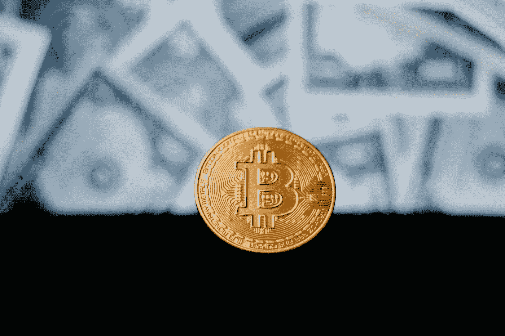

# 比特币:太合法而不能退出，监管=合法化

> 原文：<https://medium.com/coinmonks/bitcoin-too-legit-to-quit-regulation-legitimization-ef85ec968dac?source=collection_archive---------7----------------------->

## 过去一年的 10 项发展证明了加密技术的存在

Photo by [AronPW](https://unsplash.com/@aronpw?utm_source=unsplash&utm_medium=referral&utm_content=creditCopyText) on [Unsplash](https://unsplash.com/s/photos/bitcoin?utm_source=unsplash&utm_medium=referral&utm_content=creditCopyText)

大约一个月前，我登录了我的北海巨妖账户，试图做一些杠杆交易，试图利用最近(也许是最后一次？)蘸以太坊，得到这个错误信息。