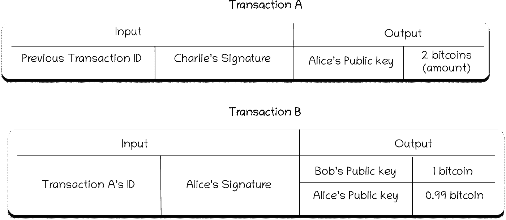
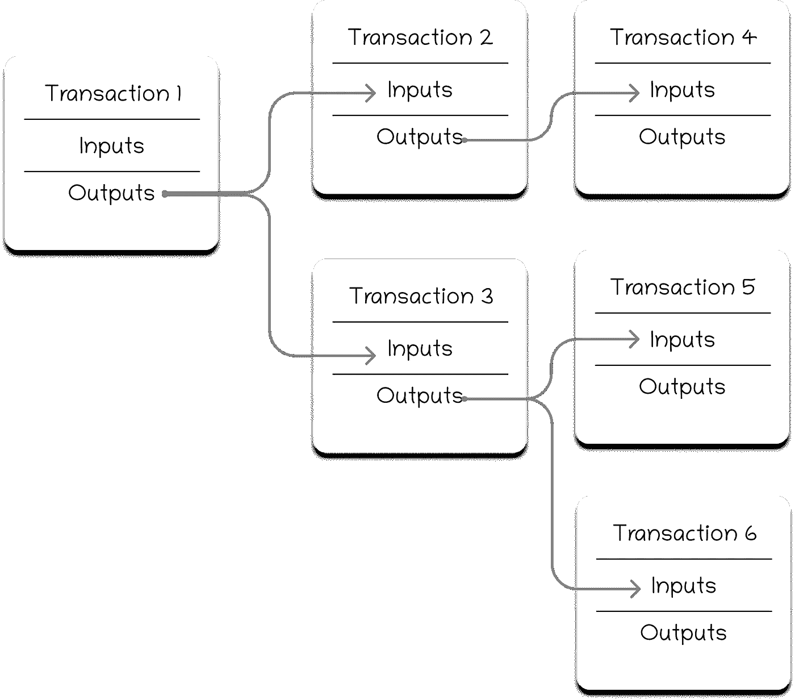

# 比特币交易

> 原文：<https://medium.com/coinmonks/bitcoin-transactions-b05a75643ccf?source=collection_archive---------13----------------------->

现在在我们所有的文章中，我们代表了爱丽丝付给鲍勃 10，000 美元的交易。它帮助我们理解了这些概念，但现在是时候考虑交易如何存储在比特币区块链账本中了。假设爱丽丝要付给鲍勃**一个**比特币。首先，爱丽丝必须有**一个**比特币与她的比特币地址相关联。现在，区块链如何检查 Alice 的地址中是否有那么多钱呢？这比你想象的要简单得多。为了花钱，我需要拥有金钱。为了占有金钱，必须有人给我一些钱。我只能花别人给我的钱(或者我已经**开采了**，在加密货币的情况下)，我不能凭空创造钱。比特币区块链也是用同样的概念。

区块链的所有交易都有两个主要部分——输入和输出。比特币区块链中的每笔交易都使用交易 ID 进行识别。输入指的是(指向)过去向您付款的交易，输出指定我们汇款的地址。比方说前段时间，爱丽丝从查理那里收到了**两个**比特币。今天爱丽丝想付给鲍勃一个比特币。她必须在区块链上创建一个交易。

事务的输入和输出(当然是以简化的形式)将如下所示

**输入**:一个月前收到查理两个比特币。如果您想查看，这是该交易的交易 ID。这个交易 ID 会证明我拥有这两个比特币。

**输出**:付给 Bob **一个**比特币，XXXXXX 是他的地址，在剩下的一个比特币中， **0.99** 比特币留在我这里——YYYYYYY 这是我的地址

你可能会注意到交易中总投入和总产出之间的差异——0.01 个比特币。这个差额就是 Alice 愿意支付给他们区块的采矿费。

一旦 Alice 使用了 Charlie 事务的输出，她就不能再使用它了。也就是说，她现在不能从查理的输出中取出一些比特币，并在不同的交易中使用一些。她 ***有*** 将查理交易输出的**两个**比特币全部花光，向鲍勃支付**一个**比特币，将 **0.99** 比特币返还给自己(差额——**0.01**比特币，作为矿工的交易费用扣除)。下次她想花掉这笔交易剩余的 **0.99** 比特币，就要参考她付给 Bob **一个**比特币并自己留着 **0.99** 比特币的交易(不是 Charlie 付给她**两个**比特币的交易)。

在上面的例子中，Alice 使用单个交易作为输入，并向多个地址(她自己和 Bob)付款。比特币区块链允许用户给出多个输入和多个输出。

现在，我认为我们已经准备好接受一些技术术语了——在比特币区块链中，用户(一对公私密钥)只能花费 UTXO——未用完的交易输出。这意味着一个地址(用户)只能花费支付给他的交易输出中的比特币数量。

潜得更深-

为了从现在开始把事情说清楚，让我们讨论两个交易(上面提到的)

*   交易“A”——爱丽丝上个月从查理那里收到了两个 T21 比特币
*   交易“B”——爱丽丝现在向鲍勃支付一个比特币(并支付给她自己剩余的金额，不包括交易费)

在交易 B 的输入中，Alice 必须附上交易 A 的交易 ID，在交易 A 中，她总共收到了**两个**比特币。除了这个交易 ID，她还必须在输入中提供她的“数字签名”(请阅读我们关于[数字签名](/@vsurya.ayyagari/distributed-ledger-6c3508ee73bf)的文章以了解更多信息)。在交易 B 的输出中，Alice 必须附加 Bob 和 Alice 的公钥以及要转移到每个公钥的金额。以后 Bob 要花这个 **one** 比特币，会参考 Alice 附上的交易 B 的输出。

所以之前查理付给爱丽丝**两个**比特币的时候，他也在输出中附上了爱丽丝的公钥。我们在文章'[数字签名](/@vsurya.ayyagari/distributed-ledger-6c3508ee73bf)'中解释了如何使用公钥和私钥组合来验证资产的所有权。

现在考虑事务 B，在输入中，Alice 提到了事务 A 的事务 ID 并提供了一个数字签名。区块链算法将检查爱丽丝在交易 B 的输入中提供的数字签名是否是由爱丽丝的私钥生成的。如果签名是由 Alice 的私钥生成的，并且输入的比特币总和大于输出的比特币总和，则交易被视为有效，并在网络中广播。现在，网络上的矿工将看到该交易，并根据提供的交易费用(投入和产出的差异)决定是否要将其添加到他们试图创建的区块中。采矿者通常更喜欢支付更高交易费的交易，因此，你愿意支付的交易费越高，你的交易被挖掘和添加到区块链的速度就越快。

下面的类比可能有助于你更好地理解这一点:

把每一个输入看作是一个你可以从中取钱的盒子，把输出看作是一个你必须往里面放钱的盒子。您的私人密钥是锁定输入框和解锁输出框的密钥。盒子一打开，里面所有的东西都得拿出来。谁在送钱，谁就把箱子锁上，说谁有我这里说的公钥的私钥，谁就能打开箱子。在交易 A 中，Charlie 锁定了只能用 Alice 的私钥打开的盒子。现在在交易 B 中，在打开查理的盒子后，爱丽丝会将其内容(比特币)移动到两个新的盒子中——一个盒子只能由鲍勃打开，另一个盒子只能由爱丽丝打开。

下图是比特币交易的工作原理:

请记住，交易费用是作为交易中总产出和总投入之间的差额计算的，它不必在交易中明确提及。

我们在文章中谈到的只是对事务如何工作的简要概述。我们可以使用比特币进行的交易种类非常灵活，除了交易中涉及的输入和输出之外，几乎没有其他元素。如果您有兴趣阅读更多内容，并希望深入了解比特币交易(关于必须附加到输出中的脚本等。)—看看这篇[文章](https://developer.bitcoin.org/devguide/transactions.html)。

本文原载于博客，blockchainiseasy . github . io .【https://blockchainiseasy.github.io/bitcoin-transactions/】T3

如果你喜欢你所读的，并想读更多，请查看我们关于[积木](/@vsurya.ayyagari/blocks-e0338f2a7f2a)的文章。

> 加入 Coinmonks [电报频道](https://t.me/coincodecap)和 [Youtube 频道](https://www.youtube.com/c/coinmonks/videos)了解加密交易和投资

## 也阅读

 [## 杠杆代币[多头代币]终极指南

### 杠杆化令牌是具有杠杆化风险敞口的 ERC20 令牌，不考虑保证金、要求、管理…

medium.com](/coinmonks/leveraged-token-3f5257808b22)  [## 最佳加密交易所| 2021 年十大加密货币交易所

### 编辑描述

blog.coincodecap.com](https://blog.coincodecap.com/crypto-exchange)  [## 2021 年最佳加密交换平台| CoinCodeCap

### 编辑描述

blog.coincodecap.com](https://blog.coincodecap.com/best-swap-platforms)  [## 2021 年最佳加密借贷平台| 6 大比特币借贷平台

### 获得比特币和其他加密货币的最佳贷款利率

medium.com](/coinmonks/top-5-crypto-lending-platforms-in-2020-that-you-need-to-know-a1b675cec3fa)  [## 2021 年 6 大最佳硬件钱包|顶级加密硬件钱包[更新]

### 最好的加密货币硬件钱包是绝对必要的。我们将在 NGRAVE、Ledger Nano X 和…

medium.com](/coinmonks/the-best-cryptocurrency-hardware-wallets-of-2020-e28b1c124069)  [## 2021 年最佳免费加密交易机器人

### 2021 年币安、比特币基地、库币和其他密码交易所的最佳密码交易机器人。四进制，位间隙…

medium.com](/coinmonks/crypto-trading-bot-c2ffce8acb2a)  [## 最佳 4 个加密交易信号电报通道

### 这是乏味的找到正确的加密交易信号提供商。因此，在本文中，我们将讨论最好的…

medium.com](/coinmonks/best-crypto-signals-telegram-5785cdbc4b2b)  [## 获取信号、交易机器人和套利

### 编辑描述

blog.coincodecap.com](https://blog.coincodecap.com/bitsgap-review)  [## 40 个最佳电报频道，用于加密、电影、表演和演讲| CoinCodeCap

### 编辑描述

blog.coincodecap.com](https://blog.coincodecap.com/best-telegram-channels)