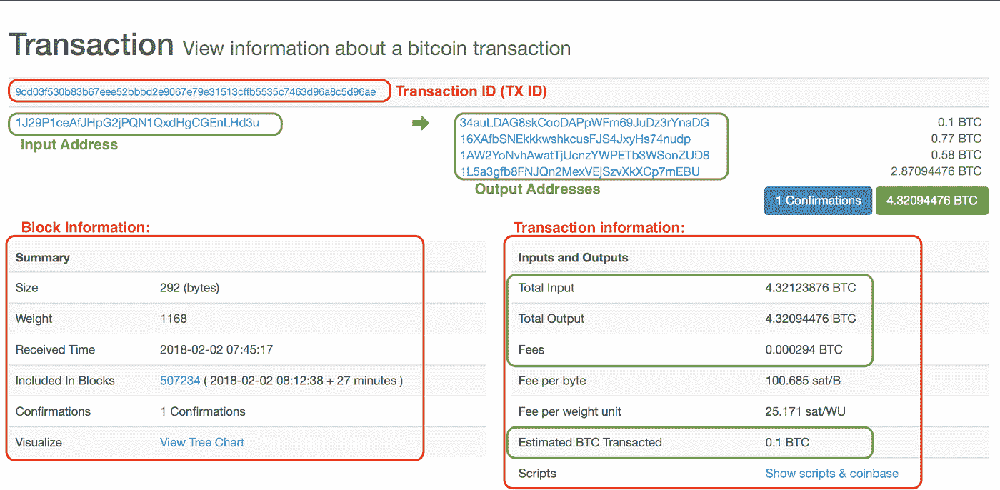
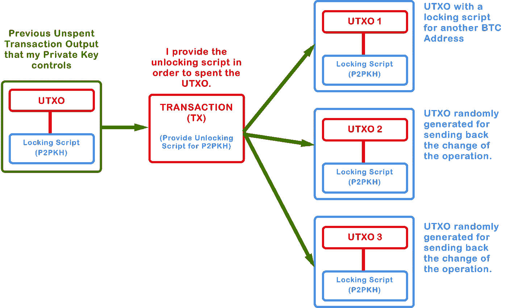

# 比特币交易

> 原文：<https://medium.com/coinmonks/bitcoin-transactions-be401b48afe6?source=collection_archive---------0----------------------->

## 在本帖中，我们将探讨什么是比特币交易以及它是如何运作的。

# **什么是交易**

交易是比特币区块链的基本组成部分。这是我们以安全的方式将价值从一方转移到另一方的操作。在这里，您可以看到一个区块链中带有一个确认的随机交易:

A transaction on the Bitcoin block explorer

这个图表显示了交易的一些信息，但它并没有反映出交易的真实运作方式。这只是一种以可读的用户友好的方式将信息放在一起的方式。

我们将回顾这张图表中的一些概念，我们将看看比特币在协议层面上根本不是“硬币”的事实。也没有任何比特币余额或存储，比特币作为“分布式账本”的定义非常重要，因为正是如此，一个用输入和输出记录交易的账本！

*关于比特币的一个注意事项:一个比特币可以被分割成八个小数位，每个小数位被称为“satoshis”。所以在一次交易中，我发送 0.00000045 个比特币，我可以说我花了 45 个比特币。*

一个事务由输入和输出组成。如图所示，这些不仅仅是地址。从现在开始，我们将以正确的方式调用输出:**未用完的事务输出或 UTXO 的**。在比特币协议中，**交易输入也是来自之前交易**的 UTXO，因此 UTXO 是比特币交易的基本构件。

*顺便提一下，为了清楚起见，我们说输入是来自先前事务的 UTXO，这是真的，但是在本文后面，我们将看到也有位于 UTXO 中的解锁脚本充当输入。*

你对比特币区块链的工作原理有了基本的了解了吗？请记住，这是一个分布式账本，记录了每一个 UTXO。现在更清楚为什么没有任何比特币或存储，都在交易历史中！

例如，为了让加密钱包显示您的“余额”，它必须在区块链中查找您的私钥控制的 UTXO。然后，它将 UTXO 的值相加，并显示最终的余额。同样，当你想花一个比特币时，你的钱包会检查你是否有足够的 UTXOs 加起来是一个比特币。如果你有足够的钱，钱包将创建另一个交易，把这些 UTXO 作为输入。

*加密钱包和轻型客户端通常会跟踪它们拥有的私钥的 UTXO。完整节点客户端跟踪其 UTXO 集中网络的所有 UTXO。*

UTXO 是以 satoshis 命名的离散且不可分割的价值单位。当我们说 UTXO 是**不可分割的**时，我们想到的第一个问题是:当我们试图花费少于我们拥有的 UTXO 时会发生什么？让我们看一个例子:

我想给莎拉发送 0.5 个比特币，而我的余额中有 1 个比特币只来自一个 UTXO，所以我不能分割一个比特币的 UTXO，**我必须在交易中发送整个比特币，并创建另一个输出作为我的零钱。**类似于当我们用一张五美元的钞票支付只有两美元的东西时，我们不能分割五美元的钞票，所以我们用整个五美元钞票支付，并得到三美元的零钱。这是比特币交易的一个重要方面。

如果我们再次观看比特币交易图表，我们会看到来自之前 UTXO 的总输入为 4.32123876 BTC，在估计的比特币交易中，我们看到 0.1BTC，在输出中，我们可以看到 4 个不同的地址，可能具有 0.1 BTC 的地址是交易的接收方，其他三个是随机生成的地址，用于返回零钱。出于安全和匿名的原因，一些钱包会产生随机的比特币地址，并分割零钱支付，以便更难跟踪花费的资金，这也是为什么我们看到“估计”的比特币交易。

> 对于不使用先前生成的 UTXO 的事务有一个例外，这些事务被称为“coinbase”事务。这是一个区块中的第一笔交易，由该区块中要支付给矿工的交易费用产生。

# **交易费用**

你注意到总投入和总产出之间的差异了吗？如果你看看交易的费用值，你会发现费用是总投入和总产出之间的差额。所以计算费用的公式是:

> 总投入—总产出=费用
> 
> 这一点很重要，因为它是必须“即时”计算的东西，在交易结构中没有任何节省费用的空间。在构造事务时，我们必须创建一个比输入稍小的输出，以便让挖掘者知道事务带来的费用。

大多数交易都包含一笔费用，意在补偿矿商保护网络的费用。阻止垃圾邮件发送者发送持续的事务也是有益的。这些费用由矿商收取，包括区块链下一个区块的交易。另一个重要的方面是费用不是强制性的，但是零费用的交易很少被挖掘，有时甚至不会在网络上传播。

## **费用的大小是如何计算的？**

为了选择总投入和总产出之间的差异，我们必须看看交易有多复杂。费用的大小是根据以千字节为单位的交易规模计算的，而不是根据交易的比特币数量。10 BTC 的交易可能比 2 BTC 的交易费用低。

现在，有一些服务可以根据用户的输入动态地计算费用的大小。用户可以在高、中、低费用之间进行选择。费用的大小影响交易的处理优先级，这意味着采矿者将首先寻找费用较高的交易进行开采，因为他们将收取更多的钱，因此较低的费用将导致更多的时间处理。

# 如何使用 UTXOs 或如何创建交易输入？

在本节中，我们将探讨比特币的机制，以验证 UTXO 由其所有者使用，在使用后，接收者拥有作为输出创建的 UTXO 的所有权。为此，每笔交易都有一个非常基本的密码难题或锁定脚本，作为交易的验证程序。对于要解决的锁定脚本，还有一个解锁脚本。让我们更详细地看看它们:

# **锁定和解锁脚本**

**锁定脚本**指定了放置在 UTXO 上的条件。这一条件是为了在未来花费这一产出而必须满足的条件。另一方面,**解锁脚本**满足锁定脚本对输出设置的条件，并允许输出被花费。解锁脚本存在于事务输入中。

This is a chart showing the concept of a transaction

在创建输入时，我们必须提供一个解锁脚本来满足某个 UTXO 的锁定脚本。然后，验证事务的节点将获得解锁脚本的输入，因此它们必须跟踪所需的 UTXO，并从中获取锁定脚本。之后，节点一起执行锁定和解锁脚本。如果解锁脚本满足锁定脚本条件，则输入有效。

# **密码语言**

比特币交易语言叫做 Scrypt。这是编写锁定和解锁脚本的语言。它是一种图灵不完全编程语言**的设计**，这意味着它缺少其他图灵完全语言所具有的某些控制流——出于安全原因。具体来说，Scrypt 没有循环或复杂的流量控制功能。这确保了该语言具有有限的复杂性和可预测的执行时间，从而减少了程序员入侵或引入错误的机会。

重要的是要理解锁定和解锁脚本是基于编程语言的，所以它们被绑定到代码内部的逻辑，所以它可以是程序员想要的任何东西，允许表达几乎无限多种条件。换句话说，事务验证不是基于静态模式的。

也就是说，比特币网络中的大部分交易都被一个**支付公钥哈希**或 **P2PKH** 脚本锁定。这些输出包含一个锁定脚本，将输出锁定到一个比特币地址。使用“P2PKH”脚本锁定的输出只能通过提供公钥和由相应私钥创建的数字签名来使用。

总而言之，在比特币中，几乎所有交易都使用 P2PKH 锁定脚本来锁定未用完的交易。这意味着我们必须在事务输入中提供数字签名和相应的公钥作为解锁脚本。然后，验证节点将获取相应的 UTXO，用我们的解锁脚本执行相关的锁定脚本，并检查它是否有效。如果是，事务将被验证并添加到一个块中，以便传播到网络。

这就是比特币交易的工作方式，非常感谢你学到了这一点，我希望你对这项神奇的技术有了新的了解。

下次见！

# 行动呼吁

[如果您想了解更多关于区块链的信息，请加入我们的每周简讯，了解加密领域的所有新闻。](https://mailchi.mp/fe27d17793e9/cryptolitics)

> [直接在您的收件箱中获得最佳软件交易](https://coincodecap.com/?utm_source=coinmonks)

