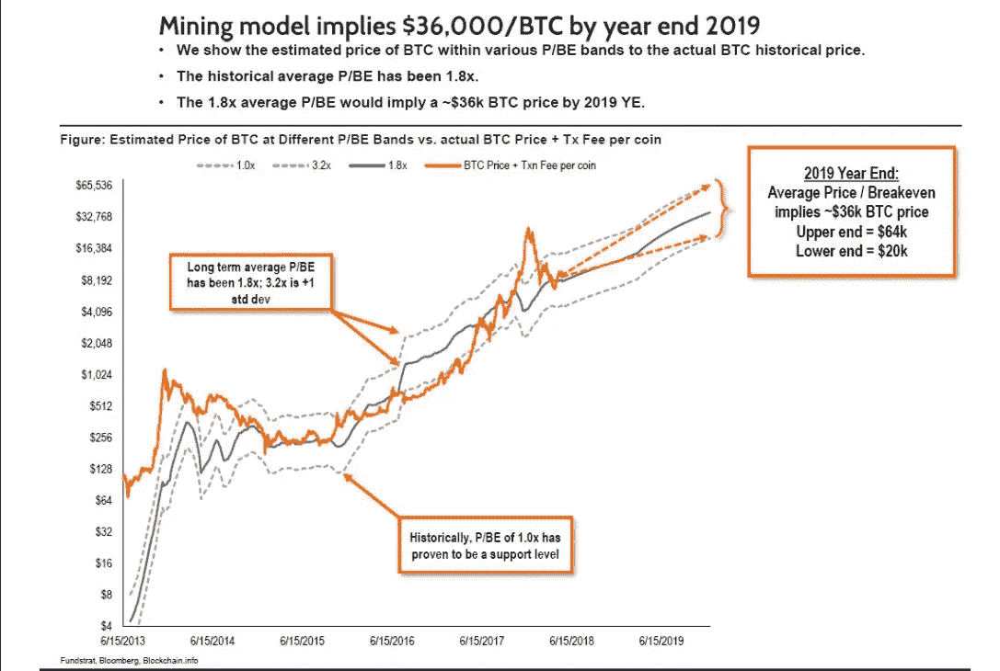
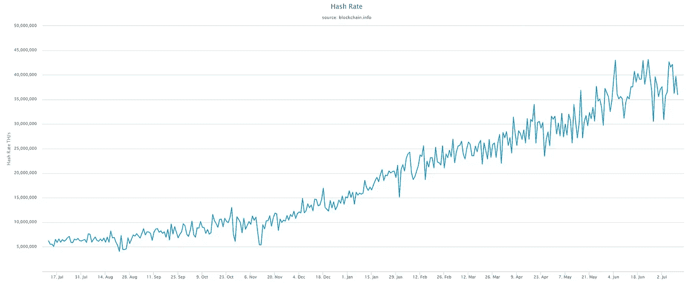
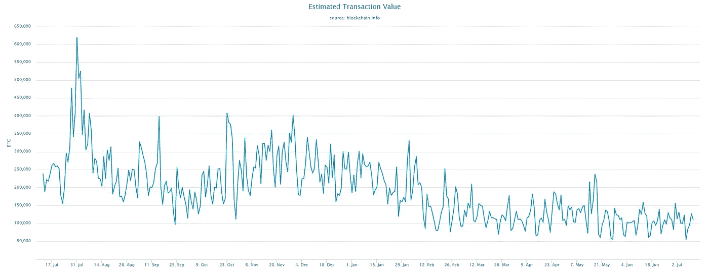

# 比特币:一片树林里分出两条路..

> 原文：<https://medium.com/coinmonks/bitcoin-two-roads-diverged-in-a-wood-ca08282c0443?source=collection_archive---------15----------------------->

参考 Fundstrat，预计 2018 年底比特币的挖矿成本在 8000 美元左右。这不是全部现金成本，因为它不包括资本支出和管理成本。虽然这些次要成本可能会随着时间的推移而下降，但公平的做法是将可变成本的 25%分配给生产比特币的 10，000 全球平均全现金成本。那比特币怎么会低于这个成本交易呢？

首先，让我们回到之前发生的事情:根据下面的 Fundstat 图表，自 2013 年年中以来，在 2016 年年中上升到 1，000 美元时，只有轻微违反 1.0 倍成本界限。如果今天的价格保持不变，那么到年底，违约率将会更高。是什么导致了这个问题？毕竟一年来价格大幅上涨，那么成本怎么会增加这么多呢？

Fundstat’s Mining Model Chart

答案大概就在下面。我们可以采取一点一滴的方法。尽管在 2010 年至 2011 年和 2013 年至 2014 年，hashrate 有较大幅度的增长，但总 hashrate 要低得多。2011 年 hashrate 反弹在 2014 年 10 月 10 日以 300，000 次/秒结束。现在我们在 37，000，000 次/秒。简单地说，即使相对而言(从对数图中可以看出),涨幅也较为温和，名义涨幅(由于基数较大)非常可观。也可能是最后一滴让茶杯溢出来。

Blockchain.com 1 Yr Bitcoin Hashrate

有没有可能专注于事务性度量而不是 hashrate 来解释这种情况？我们能说 BTC 的使用增加了这么多，哈希拉特的增长是合理的吗？虽然对此有不同的计算，但我会忽略净值是否正确，而是专注于比较趋势。

如下图所示，使用率大约是 1 年前的 60%。等等，现在的 hashrate 是一年前的 700%。因此，每笔 BTC 交易的散列值增加了 11.5 倍(同样不考虑投机目的)。成本方面已经脱离了使用。这是比特币价格和挖矿成本关系破裂的主要原因。那么这对罗伯特·弗罗斯特来说应该是个好消息吗？

Estimated Transaction Value in BTC from Blockchain.com

我相信答案将会在 6 个月内揭晓，而我们所选择的道路将会在事后显现。比特币的使用似乎不太可能很快出现大幅增长。因此，好消息可能是类似于矿工集体罢工的破坏性减少。这将产生一个更加平衡的生态系统，可以随着使用或主要市场金融适应而缓慢增长。请注意，如果 hashrate 的降低随着当前的交易数据推迟，可能会有一段时间价格和网络质量剧烈波动。

更糟糕的选择是，相对于开采成本的比特币价格可能预示着长期反转。每天发送的 60 亿美元(根据 Bitinfochart.com)很可能至少有 75%以上是与外汇相关的交易。我没有证据，但有足够的观察表明这个数字可能会更高。那么，在包括转账功能在内的约 15 亿美元非投机交易中，比特币需要多大的网络价值？这个数字的几倍——也许是 100 亿美元？这是一种价格风险情景，无论出于何种原因，巨大的投机持仓开始瓦解，价格可能跌至 600-1000 美元区间。在这一转移过程中，点燃燃料将是巨大的产能过剩。

我想该选择走哪条路了。六个月到一年后，我会非常惊讶地看到比特币在目前的价格上下波动。要么测试新高，要么回到 2016 年。