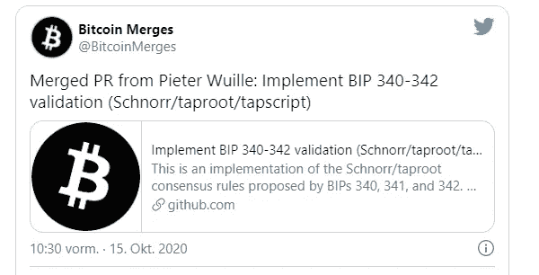

# 比特币更新:Schnorr 和 Taproot 现在在代码中

> 原文：<https://medium.com/coinmonks/bitcoin-update-scrounger-and-taproot-now-in-code-c55480ad8dbb?source=collection_archive---------3----------------------->

借助今天的新闻，我们可以捕捉到[比特币](https://blog.coincodecap.com/a-candid-explanation-of-bitcoin)历史上的一个小小的历史瞬间。经过 Schnorr 和 Taproot 的长时间讨论，两个比特币改进提案(BIP)现在已经在核心中实现，即比特币核心。

# 比特币的 Schnorr 和 Taproot:网络改进