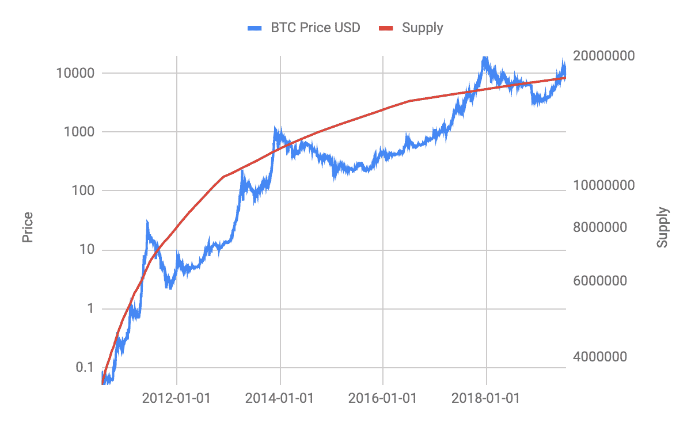
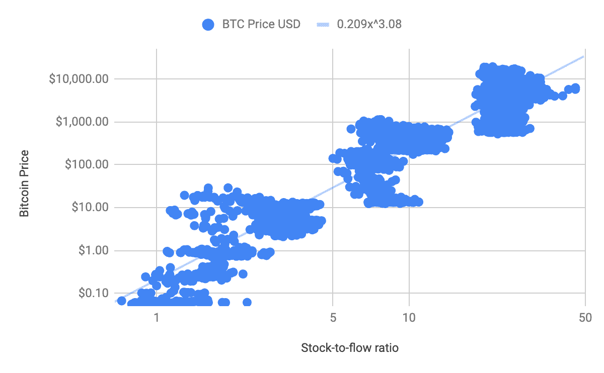
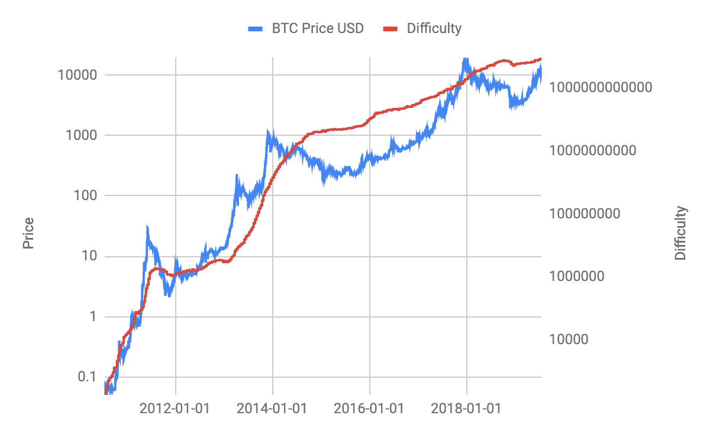
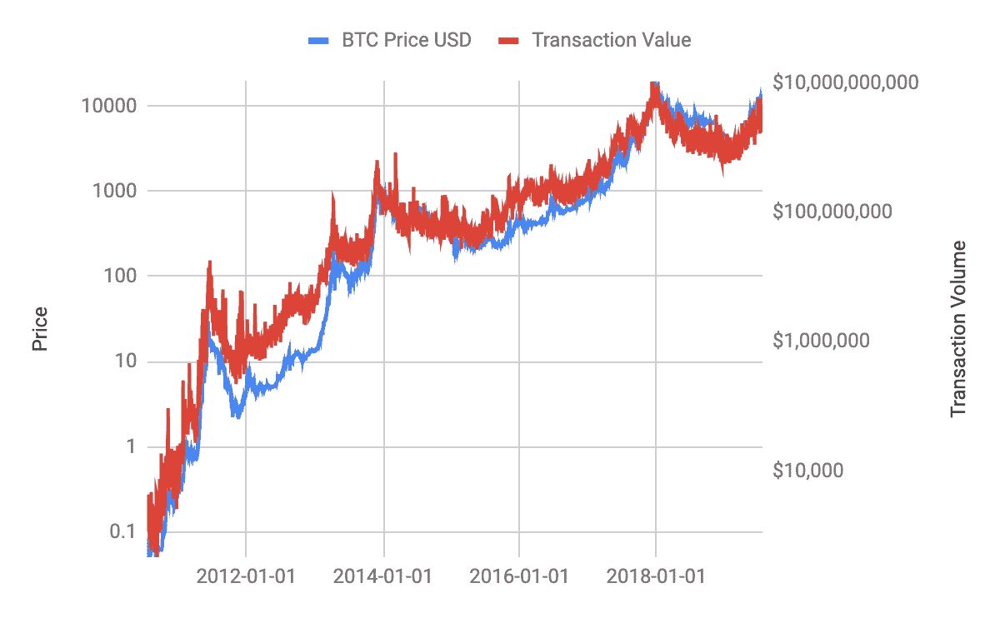
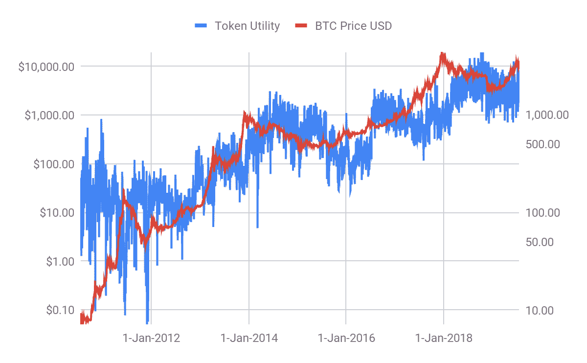
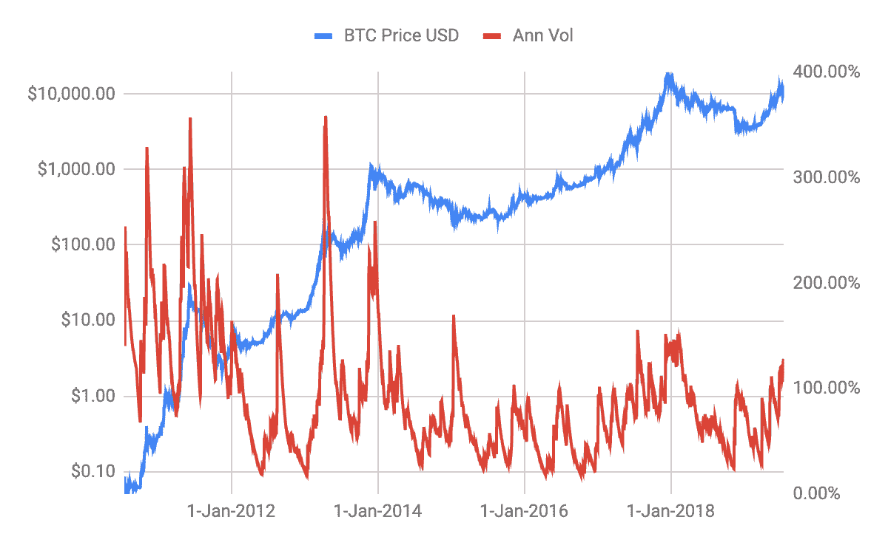

# 比特币可以被认为是主权货币吗？

> 原文：<https://medium.com/coinmonks/bitcoin-valuation-models-4a1e8eebe944?source=collection_archive---------0----------------------->

2008 年，当一位化名的程序员在网上邮件列表中介绍“一种完全点对点的新电子现金系统，没有可信的第三方”时，很少有人关注。十年后，尽管困难重重，这一新兴的自主去中心化软件为现代央行提供了一个全球可用的替代方案。

虽然比特币是数字时代的新发明，但它旨在解决的问题与人类社会本身一样古老:跨越时间和空间转移价值。Ammous 表明，人类最崇高的成就出现在享有健全货币制度好处的社会中并非巧合，货币崩溃通常伴随着文明崩溃也并非巧合。

比特币是一种去中心化的分布式软件，可以将电力和处理能力转化为无可争议的准确记录。对于比特币区块链来说，情况依然如此，尽管黑客已经能够窃取私钥。因此，比特币允许其用户利用互联网执行传统的货币功能，而不必依赖或信任现实世界中的任何权威机构，只要他们保持自己的私钥安全。

比特币还拥有自动化和完全可预测的货币政策，以及在几分钟内完成全球大额最终结算的能力。

> 在这篇文章中，我们将分析主权货币的不同功能，并审查比特币是否显示出实施的迹象。

# 价值储存手段

价值储存是主要主权货币的三大功能之一(另外两个是交换媒介和记账单位)。“价值储存”是指货币随着时间的推移保持或增加其购买力的功能。

> 一般来说，要成为价值储存手段，通胀必须非常有限

比特币的通货膨胀被定义为随着时间的推移而降低到零。下图显示了比特币价格与比特币总供应量的关系。随着时间的推移，比特币的供应量不断减少，目前比特币的供应量正以每年约 3.8%的速度膨胀。随着下一个块奖励时间减半(可能在 2020 年)，比特币将以每年不到 2%的速度膨胀(或 50 以上的股流比)。

Figure: Bitcoin price and supply over time

衡量价值储存的一种方式是根据累计采矿奖励，这是由比特币的通货膨胀驱动的(见[此处](/@aenigmacapital/the-price-to-store-of-value-p-sov-ratio-fd48991b3efb))。通货膨胀也可以与代币的供应联系起来，这被称为股票流量比(见[这里](https://bitcoinist.com/bitcoin-price-stock-to-flow-ahead-7300/)或 Saifedean Ammous 的“比特币标准”)。存货与流动比率是可用资产的数量除以每年的产量:

> SF 比率=代币供应量/每年稀释率= 1 /每年通货膨胀率

下图显示了不同的股票流量比与比特币价格的关系。股流比已经从 2008-2012 年期间的约 2，到 2012-2016 年期间的约 8，到 2016 年以来的约 25，并且可能直到 2020 年，下一个[减半](https://www.coingecko.com/de/explain/bitcoin_halving)到约 60 的股流比出现。各国央行的目标是 2%的通胀率，因此库存与流量之比约为 50。所以随着下一个减半，比特币将达到这个指标。不同之处当然在于，接下来的步骤是预先编程的，库存与流量的比率将趋于无穷大。

Figure: Bitcoin price versus stock-to-flow ratio.

当然，我们还没有看到股票与流量比率的很多变化，但迄今为止，这些变化与比特币价格的阶跃变化有关。假设这种模式继续下去，图表可以用一条回归线来拟合

> 比特币价格= 0.209 * stock_to_flow_ratio^3.08

目前，这种回归意味着比特币价格会随着时间的推移而上涨。论点是，采矿过程产生比特币，这些比特币必须在市场上不断出售，以支付电费。在下一次减半之后，市场吸收这些比特币的压力将只有 50%，因此可能会缓解比特币的价格。PlanB 在这里发布了一张随时间变化的图表[，用存量-流量比来展示比特币价格的潜在发展。](https://twitter.com/100trillionusd/status/1102869191546294272)

*总体而言，尽管比特币仍在偏离这些模型的预测，但它似乎正朝着价值储存的方向发展。*

# 交换媒介

比特币的另一个重要价值是作为交换媒介。尤其是比特币是支付比特币交易所必须的。目前，交易必须用非常少量的比特币支付，因为交易大多被比特币的通胀所覆盖。这种通货膨胀为参与交易的矿工支付了一笔大宗报酬。矿工必须使用能量来运行采矿机器，并赢得一个区块，以获得区块奖励。

奖励金额由全局哈希表决定。本质上，单个矿工的散列能力除以全局散列率，这定义了随着时间的推移所产生的比特币。保证适应全局哈希表变化的机制是全局阻塞困难。难度衡量的是找到低于给定目标的散列的难度，有效块必须具有低于该目标的散列。随着机器数量的增加，全局块难度也随之增加，因此全局散列率也随之增加，反之亦然。因此，全球区块难度保证了生产的比特币数量符合预定义的通胀率(见上文)。

下图显示了全球区块难度的持续增加，以及全球 hashrate 与比特币价格的关系。难度的持续增加是由于更好的硬件以及参与采矿过程的机器数量的增加。如果这种趋势持续下去，生产比特币的成本将变得非常昂贵，因此矿商可能会期望比特币价格的上涨能够得到补偿。然而，比特币价格在很大程度上围绕难度水平徘徊，难度水平也降低了数倍。

总的来说，比特币的价格似乎是造成困难的原因，而不是相反。如果比特币价格高，矿商就有动力插入更多机器，如果比特币价格低，矿商就没有动力。当然，由于有一个人工过程，难度会随着时间的推移而变化。例如在 2018 年，虽然比特币价格暴跌，但难度继续增加。由于比特币价格和难度高度相关，我们很可能会看到对冲产品来承担难度变化的风险。

Figure: Bitcoin price and global block difficulty over time.

比特币的另一个内在价值可以从比特币的交易量中推导出来，这里用 NVT 比率[来概括。NVT 比率被定义为](https://woobull.com/nvt-signal-a-new-trading-indicator-to-pick-tops-and-bottoms/)

> NVT 比率=网络价值/交易量
> 
> =(代币价格*代币供应量)/(代币价格*交易代币)
> 
> =令牌提供者/交易令牌
> 
> = 1/令牌速度

其逻辑是，以美元计算的交易量越多，比特币就越有价值。这种观点类似于亚马逊(Amazon)等 SaaS 公司，这些公司很少有利润，但它们的价值在于其平台上推动收入的营业额。

下图显示，交易量比率很好地跟踪了比特币价格，但也因为比特币价格是交易量的一个如此大的驱动因素。

NVT 比率的局限性在于假设加密货币的基本价值仅来源于其作为交易媒介的功能，该功能由令牌速度表示。模型中忽略了加密货币作为价值储存手段的使用，以及一些超级用户可能推动网络的价值(类似于社交平台)。

为了说明这一点:由于交易量的减少而导致的 NVT 比率的增加并不一定意味着令牌的高估。也可能是越来越多的长期霍德勒囤积更多代币，从而导致交易量下降的结果(见[https://medium . com/coin monks/cryptocurrency-evaluation-d 9979074404](/coinmonks/cryptocurrency-valuation-d9979074404))。

此外，当 NVT 比率低于正常范围时，NVT 比率未能解释 2017 年的加密牛市，因此表明低估。NVT 比率也未能识别 2018 年的秘密熊市，当时市场明显崩溃，而 NVT 比率仍在正常范围内。

*总体而言，比特币最大的特点可能是交易能力。我们的结论是，比特币可以被认为是一种交换媒介。*

> 价值储存和交易媒介可以结合在一个指标中，并根据比特币价格进行测试

刘玉琳[提出](/coinmonks/cryptocurrency-valuation-d9979074404)用代币流通速度(仅指交易，不包括价格)、赌注比率(用于持有的代币百分比)和稀释率的组合来衡量比特币的价值:

> 代币效用=代币速度*赌注比率/稀释率

该图显示了 1 天赌注比率的令牌效用与比特币价格的关系。

赌注比率和稀释率可以被认为是价值储存的指标，而代币流通速度则是交换媒介的指标。[刘玉琳](/coinmonks/cryptocurrency-valuation-d9979074404)认为，PU 比率(价格对令牌效用)检测到了 2013 年底和 2017 年底的两次比特币大泡沫时期，当时 P/U 比率远远超出了 50 至 200 的正常范围。

# 记算单位

但在我们结束分析之前，我们将考虑作为主权货币的最终功能。这一功能是记账单位，因此也是价格的可比性。比特币和其他加密货币通常具有超过 100%的非常大的年波动率。作为参考，我们每天使用 EWMA 模型计算波动率[这里是](http://protosterminal.com/)。一般来说，要成为记账单位，波动性必须大幅降低。

事实上，目前比特币的波动性已经从 300%以上的水平下降到 100%的水平。到 2021 年，波动性应该会降至 20%以下，这将使其与波动性约为 8%的法定货币相当，但波动性确实会定期飙升至 20%。

波动性下降背后的驱动力可能是对估值模型的更好理解和市场中更多的流动性。市场上的流动性已经从 2014 年的每天 1000 万增加到今天的每天 100 多亿(见 https://coinmarketcap.com)。

*我们在这里得出结论，比特币不能仅仅因为波动性太高而作为记账单位。我们确实同意波动性正在下降，但这似乎还有很长的路要走。*

# 摘要

比特币可能会为现代央行提供一个全球可用的替代方案。主要主权货币的功能是价值储存、交换媒介和记账单位。比特币提供了一种预编程的通胀和一种无国界的价值转移手段，但相对于其他主权法定货币，其价格波动性也非常高。

总之，我们建议比特币价格应取决于代币流通速度(交易媒介)、赌注比率(价值储存)和稀释率(价值储存)以及比特币价格的波动性，以实现以下记账单位

> 公允价值=代币流通速度*赌注比率*波动性/稀释率

这一比率包含了比特币要想立足就必须支持的主权货币的所有三项指标。目前，比特币没有实现这一目标，但似乎正朝着这个方向发展。

> [直接在您的收件箱中获得最佳软件交易](https://coincodecap.com/?utm_source=coinmonks)

