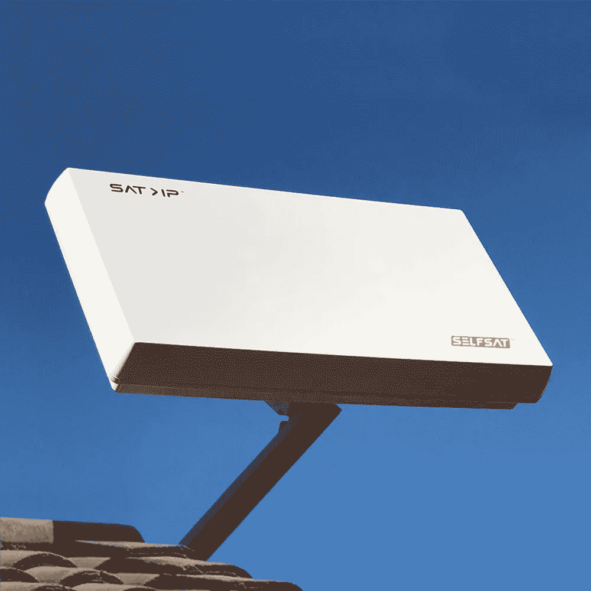
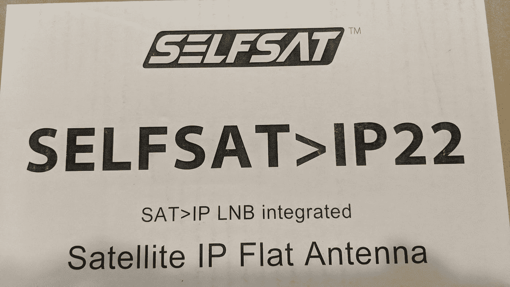
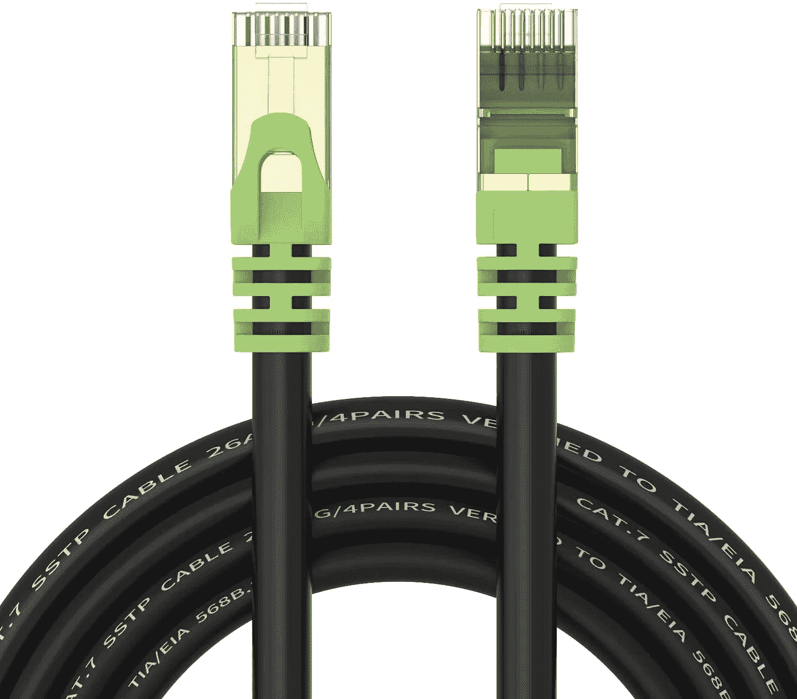
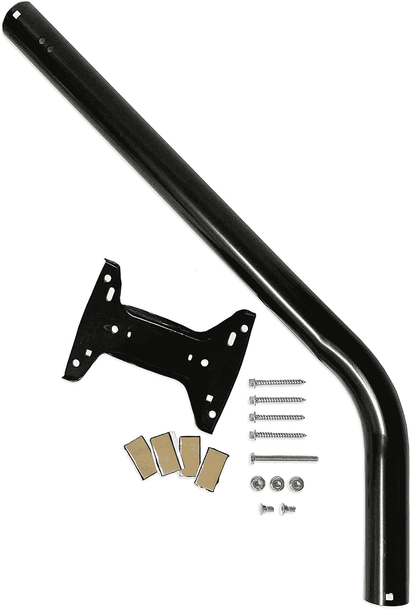

# 通过卫星的比特币！

> 原文：<https://medium.com/coinmonks/bitcoin-via-satellite-f04904c52347?source=collection_archive---------5----------------------->

## Twitter 上的一些人询问了更多关于我使用 [Blockstream 卫星套件](https://store.blockstream.com/product/blockstream-satellite-base-station/)的信息:

让我们看看我是否能在这里记录我的旅程。

**天线安装**

从 Blockstream 收到套件后，我正在等待一些硬件，以便能够在屋顶上安装天线和 50' Cat7 室外以太网电缆。弄清楚你需要什么需要一点计划。

为了减少从天线到节点的信号损失，你不会想要太长的以太网电缆，所以我的第一个任务是找到在屋顶放置天线的正确位置。

正如 [@Blockstream](http://twitter.com/Blockstream) 指南[此处](https://help.blockstream.com/hc/en-us/articles/900001613686)所建议的，我从[此处](https://play.google.com/store/apps/details?id=com.tda.satpointer&hl=en_US&gl=US)下载了**卫星指针应用**(←安卓链接但也有苹果版本)。

该应用程序有一个非常有用的 AR(增强现实)功能，允许你根据你的手机摄像头指向哪里，向你显示所有卫星的位置。

如果应用程序表现怪异，你可能需要在空中画 8 个形状来校准你的手机指南针。在**校准手机指南针**时，保持手机垂直。

目标是在天线点和你要瞄准的卫星之间的视线上找到一个没有障碍物(树木或建筑物)的点(我所在的星系 18——这将最终成为一个“错误”的假设)。

该应用程序还会告诉你安装后正确指向天线所需的一些坐标:我的理解是**方位角**和**仰角**对于平板类型的天线来说应该足够了(我也会发现这是一个错误的假设……)。

回**以太网电缆长度**。一旦你知道了放置天线的位置，就要想出进入你的房子到你放置局域网硬件(通常是 WiFi 路由器)的地方的路径。

测量电缆的大致长度。它应该比需要的多一点，但尽可能短。我就是这样想出我的 50 分的。

我发现我需要的另一件东西是一个**车顶天线支架**。我订购了[这款](http://amazon.com/gp/product/B002GBWLMQ/ref=ppx_yo_dt_b_asin_title_o07_s00?ie=UTF8&psc=1)，因为它带有螺丝和车顶密封垫:

现在，在等待我的硬件交付的时候，我试着去看看接下来会发生什么。不幸的是， [@Blockstream](http://twitter.com/Blockstream) 网站上的指南缺少了一个重要的部分。

没有关于如何“**配置基站**的说明。
好吧，我们来看看 GitHub。给你:[https://blockstream.github.io/satellite/](https://blockstream.github.io/satellite/)这本指南更详细，似乎有我需要的信息。

我寻找的缺失信息也在[快速参考指南](https://blockstream.github.io/satellite/doc/quick-reference.html#receiver-specific-configuration-steps)中。

好的。硬件在这里，以太网电缆在适当的位置，并连接到随套件提供的 PoE(以太网供电)设备。

下一步:将天线安装在屋顶的正确位置，并调整到最佳信号接收。

敬请期待！

[未完待续……](/@BitcoinBellyB/bitcoin-via-satellite-episode-2-e56a345b0003)

如果你喜欢我的文章，请考虑通过 Twitter Tips 进行小额捐赠:@[bitcoinbellib](https://twitter.com/BitcoinBellyB)！

:-D

> 加入 Coinmonks [电报频道](https://t.me/coincodecap)和 [Youtube 频道](https://www.youtube.com/c/coinmonks/videos)了解加密交易和投资

## 也阅读

 [## 最佳加密交易所| 2021 年十大加密货币交易所

### ICON _ PLACEHOLDEREstimated 预计阅读时间:28 分钟加密货币交易所的加密交易需要知识…

blog.coincodecap.com](https://blog.coincodecap.com/crypto-exchange)  [## 2021 年 10 大最佳加密贷款平台| CoinCodeCap

### 当谈到加密货币贷款时，大量因素等同于良好的收入状况。此外，借款的一部分…

blog.coincodecap.com](https://blog.coincodecap.com/crypto-lending)  [## 2021 年最佳免费加密交易机器人

### 2021 年币安、比特币基地、库币和其他密码交易所的最佳密码交易机器人。四进制，位间隙…

medium.com](/coinmonks/crypto-trading-bot-c2ffce8acb2a)  [## 最佳 4 个加密交易信号电报通道

### 这是乏味的找到正确的加密交易信号提供商。因此，在本文中，我们将讨论最好的…

medium.com](/coinmonks/best-crypto-signals-telegram-5785cdbc4b2b)  [## BlockFi 评论 2021:利弊和利率| CoinCodeCap

### 今天，我们提出了一个全面的 BlockFi 评论，这是一个成立于 2017 年的加密贷款平台，拥有其…

blog.coincodecap.com](https://blog.coincodecap.com/blockfi-review)  [## 如何在印度购买比特币？2021 年购买比特币的 7 款最佳应用[手机版]

### 如何使用移动应用程序购买比特币印度

medium.com](/coinmonks/buy-bitcoin-in-india-feb50ddfef94)  [## 加密税务软件——五大最佳比特币税务计算器[2021]

### 不管你是刚接触加密还是已经在这个领域呆了一段时间，你都需要交税。

medium.com](/coinmonks/best-crypto-tax-tool-for-my-money-72d4b430816b)  [## 存储比特币的最佳加密硬件钱包[2021] | CoinCodeCap

### 保管您的数字资产很容易，但找到正确的存储方式却是一项繁琐的任务。在线钱包有一个风险…

blog.coincodecap.com](https://blog.coincodecap.com/best-hardware-wallet-bitcoin)