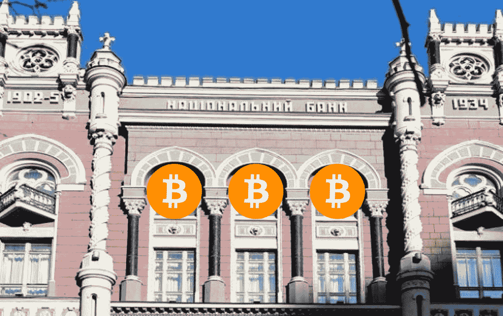
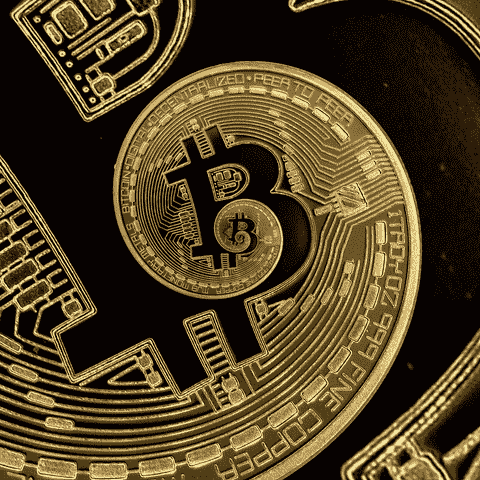

# 比特币与银行:10 年后

> 原文：<https://medium.com/coinmonks/bitcoin-vs-banks-10-years-later-c0bab53de75c?source=collection_archive---------1----------------------->

*Denys Andrushchenko，* [*WTFBit Media*](https://wtfbit.media/ua/)

当你用密码买大麻时，很方便。当你可以给世界上任何地方任何专业水平的工人发工资的时候——太棒了。你看，当我们抛开杂乱的东西，一头扎进免费的前提——密码真正是什么——时，很难抗拒。银行目睹了它的成功，现在渴望同样的风格。

# 你的银行家梦到了什么

正如本文的大多数读者一样，我不时浏览 Cointelegraph 的新闻，以“了解”正在发生的事情。如果我对[集体幻觉](https://www.ted.com/talks/anil_seth_how_your_brain_hallucinates_your_conscious_reality#t-504836)有任何影响的话就不会，但它确实对我的现实产生了一点影响。所有这些摩根大通和花旗银行先是忽视了比特币，然后害怕得开始密切关注比特币的底层技术。

因此，超过 300 家公司正在探索、测试和整合区块链到他们自己的垂直业务中。这听起来很有希望，但却遥不可及。crypto 如何影响您开户和存款的当地银行？在乌克兰，我被邀请参加一个银行会议来回答这个问题。

Volodymyr Solovyov shared a technical analysis of Bitcoin bubbles. Credits: Cherkasy Banking Institute

“金融市场全球化条件下世界银行体系的发展”是这次实践会议的名称，我花了几个小时试着把自己放在银行体系的鞋子里。

*对区块链革命有什么期待？*

我们——金融机构——关注过吗？

*我们真的需要与加密货币合作吗？*

会议首先介绍了银行服务和全球金融市场的总体趋势。在场的观众——当地银行家以及来自乌克兰首都和海外的银行家——讨论了移动银行的投资和加密货币的相对受欢迎程度。在新兴技术出现之前，我看到了一种兴奋，包括分布式账本技术、人工智能(AI)、聊天机器人和其他类型的自动化。然而，我也感觉到了怀疑。

## 银行:我们的角色是什么？

随着比特币作为支付手段越来越受欢迎，银行机构的相关性问题也随之上升，这是有道理的。基本上，**你的比特币钱包就是银行**。如果这还不够，金融科技公司开始通过消除实体办公室和向客户付费(被称为“返现”)来为金融发展做出贡献。

然而，银行不会消失。此外，伴随着改革、品牌重塑和与金融科技的合作，它们庞大的资产和负债存量将有助于重新确立主导地位。

这些快速调整的金融机构将帮助我们:

●通过机器顾问和人工智能改善服务

●管理我们的加密资产和贷款

●把我们有 100 万英镑的账本放在保险箱里

只是为了评论最后一点:当每个人都知道每个人都把现金放在家里的床垫下时，没有人愿意处于这样的境地。即使是 USB 上的虚拟现金，也会引发不久前在阿根廷看到的疯狂。

各大银行已开始大举投资区块链项目，以促进对加密货币和区块链技术日益增长的需求。Federated Investors 副总裁 Steve Chiavarone 表示:

> *“许多投资者首先进入比特币，因为这是进入区块链的第一条途径。大银行在这方面投资巨大。美国银行在达沃斯吹嘘说，他们投资最多。*

像 [Bluzelle](https://bluzelle.com/) 这样的区块链初创公司已经在为毕马威、汇丰、微软和 MUFG 这样的巨头提供可信的区块链网络，这些巨头也继续通过几个区块链财团利用 Ripple 和以太坊这样的区块链网络。

## 采用加密的基础。我们真的需要它吗？

**稳定的声音**

目前有许多问题阻碍了加密货币融入主流。Stablecoins 可能是一个解决方案。这些加密货币越来越受欢迎，并且比普通加密货币更加固定，因为它们的价值与其他资产挂钩，如美元或黄金。因此，stablecoins 受益于加密货币(安全性、隐私性、透明性等。)没有数字硬币固有的极端波动性。

**区块链财团**

区块链财团背后的理念是确保天生互不信任的各方之间的信任。区块链实施旨在通过一个包含所有相关方都能同意的“普遍真理”的分布式数据库来解决这种缺乏可信度的问题。

例如，国际银行业区块链财团 R3 由摩根士丹利、美林、高盛、BBVA、荷兰国际集团、Nordea、阿尔法银行和其他金融机构组成。此外， [R3 希望利用区块链技术](https://www.coindesk.com/beyond-banking-r3-expanding-vision-global-blockchain)展示其在金融领域之外的新野心。

另一个全球区块链联盟 [Hyperledger 和企业以太坊联盟(EEA)已经宣布合作](https://www.hyperledger.org/announcements/2018/10/01/enterprise-ethereum-alliance-and-hyperledger-to-advance-the-global-blockchain-business-ecosystem)，旨在为这两个组织的参与者开发的企业分布式网络创建统一标准。这种跨平台的合作很可能会加速区块链技术在商业环境中的大规模应用。

*Original photo: National Bank of Ukraine*

**法律框架**

律师 Anatoly Chernyavsky 在长期研究全球和国家实践后分享了他的想法。以下是他提出的一些观点:

●其他国家的经验不是国际性的，而是本国的

●采矿可能会有所不同，这就是为什么很难制定适当的法规

●加密货币交易所可以伪装成“慈善组织”来避税

律师举了一个[库纳](https://kuna.io/)货币兑换的例子:组织的域在**里。ua** 域区，但股票交易却在**区。io** 域区属于英属印度洋领地。切尔尼亚夫斯基解释说:

> *“当我们谈论货币兑换时，尤其是当出现有争议的情况时，总会有仲裁或证券交易委员会处理这些问题(监管的私人中心)。但是，有可能与证券交易所本身发生纠纷。在这种情况下，需要向本交易所注册地国家的法院提出申请。”*

在**中。io** 域区，没有平民，没有民事法院，没有民事诉讼法，也就是说你不能对股票交易活动提起诉讼。只有美国海军法庭对美国海军军人做出独特的裁决。因此，本质上，用户不能与 KUNA 建立任何法律关系，因为它需要一个法律监管机构。

因此，您对(任何)交易所的每一笔捐款都是慈善性的。值得注意的是，Kuna 本身警告用户，把你的资产放在网站上不是一个好主意。这是对所有密码爱好者的一般建议，因为黑客从不睡觉。

**加密资产的法律地位**

加密资产是由它们的状态决定的，不出所料，每个国家的状态都不一样。加密有以下定义:

●禁止或未确定

●加密货币=产品

●加密货币=货币

我们确实需要某种权威来帮助在国际上确定这一地位。因此，密码爱好者和政治家都强烈要求法律框架适应现代经济。如果货币的地位确定了，密码就成为自由贸易的对象，应该受到保护。如果产品的状态被确定，它将被认为不是自由操作。必须支付加密资产的增值税并清关。

阿纳托利·切尔尼亚夫斯基总结说，国际货币基金组织可以成为这种权威的典范。然而，它将仅出于防止非官方资金转移的目的参与对加密货币的监管(由反洗钱目的涵盖)。我不会深究阴谋( [*债务:前 5000 年*](https://www.amazon.com/Debt-Updated-Expanded-First-Years-ebook/dp/B00Q1HZMCW/ref=sr_1_1?s=books&ie=UTF8&qid=1546514449&sr=1-1&keywords=debt+the+5000) 做你的向导)，但我会指出唯一的解决办法将是消除别名或进行完整的交易识别。

这位律师表示，事实上，这将使加密货币这个术语过时。迟早，国际货币基金组织会禁止加密货币，但没人知道什么时候。不过，我会把这个想法推迟到以后的思考中。

## 都是关于人的，笨蛋

在大学里进行这样的讨论具有象征意义。几位学生参加了会议，并有机会提出关于加密货币的匿名性和有效性的问题。

然而，重点是高素质人才的严重短缺:

●市场需求和金融教育之间存在巨大差距

●金融机构需要懂大数据、代数、编程(至少懂 Python)的银行家

●如今乌克兰大学教授的经济理论与现实和需求不符(我们打赌这是全世界都要担心的事情；阅读 [*为什么明斯基关系重大*](https://www.amazon.com/Why-Minsky-Matters-Introduction-Economist-ebook/dp/B00XNZA8CO/ref=sr_1_1?s=books&ie=UTF8&qid=1546513502&sr=1-1&keywords=Why+Minsky+Matter) 或 [*抗脆弱*](https://www.amazon.com/Antifragile-Things-That-Disorder-Incerto/dp/0812979680)

●金融科技将成为希望在劳动力市场拥有竞争优势的年轻银行员工的基础

加密货币的潜力仍然模糊不清。金融科技似乎是银行面临的主要挑战。我将在以后的文章中谈到它，但现在我留给你这个:区块链分裂成两个阵营。一种将被银行依次收购的初创公司采用。第二个**是** **银行**。它的名字叫比特币。

[*WTFBit Media*](https://wtfbit.media/ua/) *以深入浅出的方式，带着幽默，写下了区块链和新兴技术。我们还与不同的客户合作，帮助他们有效地向受众传递信息。*

*特别感谢 Pantyleeva Natalia 的邀请，并感谢 Cherkasy 银行研究所就相关主题进行富有成效的讨论。*

## ***后穴***

*我们需要开始禁止这些用硬币代替比特币代码的误导性图片。不过，很懒。*

> [直接在您的收件箱中获得最佳软件交易](https://coincodecap.com/?utm_source=coinmonks)

