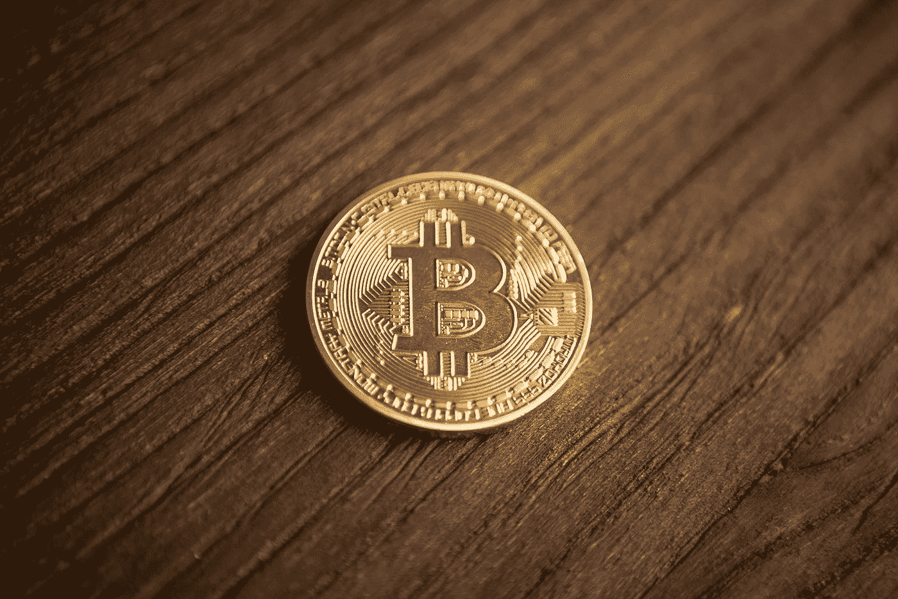

# 比特币与比特币现金:用例、分叉以及你应该投资哪一个

> 原文：<https://medium.com/coinmonks/bitcoin-vs-bitcoin-cash-use-cases-the-fork-and-in-which-of-the-two-you-should-invest-4950531eb608?source=collection_archive---------1----------------------->

任何接触过 Reddit 或 Bitcointalk 的人都知道，在加密领域，几乎没有比比特币与比特币现金之间的战斗更大的了。两个学派都深信不疑的信徒争论哪个比特币是真的，哪个更好。尽管争论非常激烈，但人们往往对两者的不同之处感到困惑或缺乏了解。

Photo by [André François McKenzie](https://unsplash.com/@silverhousehd?utm_source=medium&utm_medium=referral) on [Unsplash](https://unsplash.com?utm_source=medium&utm_medium=referral)