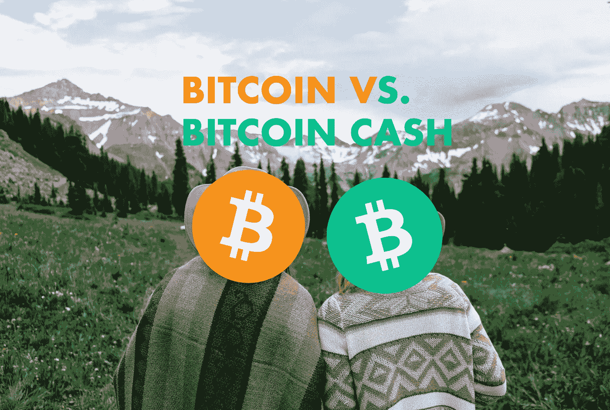

# 比特币 vs 比特币现金:该买什么？

> 原文：<https://medium.com/coinmonks/bitcoin-vs-bitcoin-cash-what-should-you-buy-16a809e83349?source=collection_archive---------9----------------------->

加密爱好者正在讨论比特币或比特币现金是否是真正的交易。有的甚至认为是一样的。下面，文章将阐述两种硬币的**区别和优点。**

Twins! — Photo by [Nathaniel Kohfield](https://unsplash.com/@nathanielkohfield?utm_source=unsplash&utm_medium=referral&utm_content=creditCopyText) on [Unsplash](https://unsplash.com/s/photos/twin?utm_source=unsplash&utm_medium=referral&utm_content=creditCopyText), edited by the author

# 比特币

比特币是第一种，也是迄今为止最受欢迎的加密货币，目前市值超过 11700 亿美元…