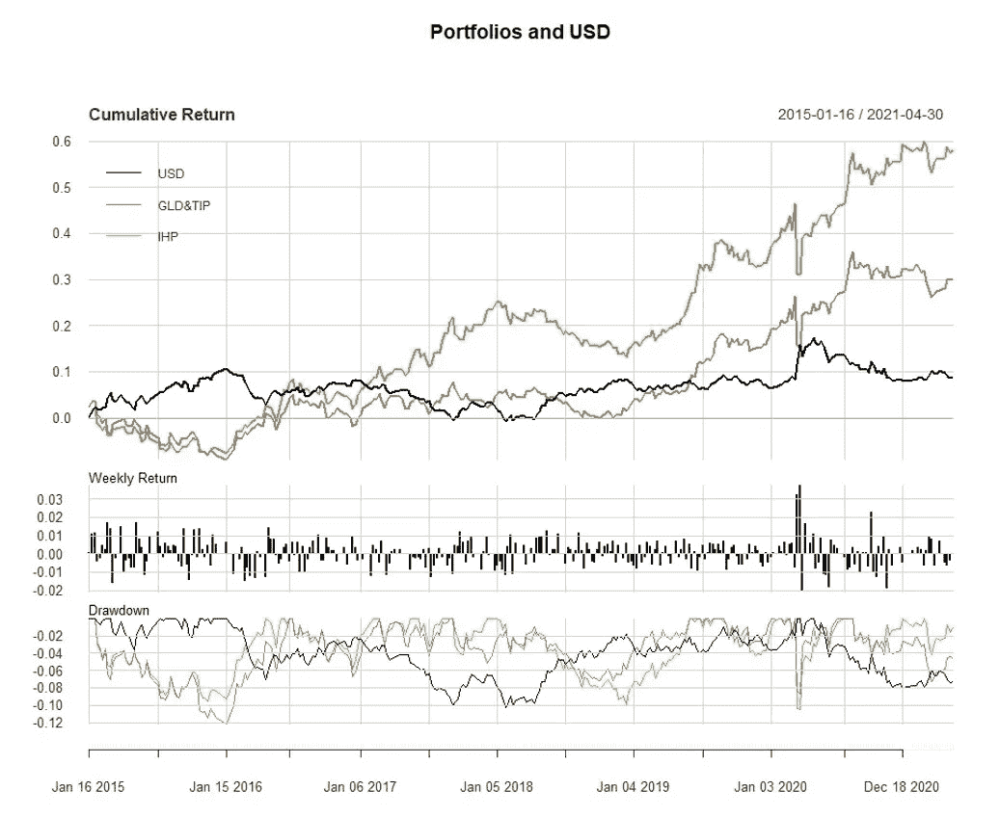

# 比特币与通货膨胀

> 原文：<https://medium.com/coinmonks/bitcoin-vs-inflation-24fd103e9dca?source=collection_archive---------2----------------------->

Photo by [Imelda](https://unsplash.com/@unleashed_?utm_source=medium&utm_medium=referral) on [Unsplash](https://unsplash.com?utm_source=medium&utm_medium=referral)

比特币(“BTC”)最近受到了很多关注，许多人认为它可以发挥类似于黄金的作用，作为价值储存和通胀对冲。在这篇短文中，我将看看 BTC 如何在一个“玩具”投资组合中与另外两种通常用于抵御通胀的资产合作:黄金和通胀保值债券(“TIPS”)。让我们称这个玩具投资组合为“通胀对冲投资组合”，或简称为“IHP”。我们将使用 GLD 和 TIP ETFs 的同等权重组合作为基准。

首先，BTC 与美元、黄金或 TIPS 没有实质性关联。这表明，通过增加一点多样化的好处，BTC 可能会与 GLD 和蒂普在投资组合中玩得很好(见图 1)。

比特币的 ***非常*** 不稳定，因此任何对 BTC 的大规模配置都可能淹没 GLD 和 TIP 的回报，除非我们以某种方式均衡配置的波动性(见图 2)。有许多选项可以尝试均衡不同投资的风险，但对于本说明，我们将对 BTC 使用 5%的任意小分配，对 GLD 和 TIP 使用相等的权重[TIP/GLD/BTC 为 47.5/47.5/5]。在现实生活中，我们可能会在一个或多个短时间内估计风险，并经常重新平衡，但我们在这里将只使用静态目标分配和每月重新平衡。

在我们考察的时期内，IHP 有着诱人的回报和风险，并且轻松超越了 GLD/TIP 基准。虽然这很好，但我们建立这个投资组合的主要原因是为了抵御通胀。从下面我们可以看出，投资组合与美元之间存在显著的负相关关系(t 值:-9.181，p 值:0.0000，调整后的 R 平方值:0.2179)。GLD 和 TIP 的基准投资组合与美元的关系非常相似(t 值:-9.579，p 值:0.0000，调整后的 R 平方:0.2329)。这表明任何一个投资组合*都可能*具有*对抗通胀的潜力*。我不确定这种差异是否显著，但 IHP 对美元的负面影响确实比 GLD/TIP 要小一些。

我们当然应该非常谨慎，不要急于下任何结论。正如坎贝尔·哈维和他的合著者指出的那样；样本很小，而且我们没有 BTC 在通货膨胀时期的任何观测数据。这一快速分析并非结论性的，但它确实表明，一点点 BTC *可能会*提振黄金和小费的投资组合，而不会在本质上削弱抵御通胀的潜力。

**插图**

1.  2015 年 1 月至 2021 年 4 月的周收益率相关性

2.周收益率的年化标准差

3.假设的投资组合表现

4.假设投资组合统计

5.假设投资组合相关矩阵

6.美元指数与“通胀对冲组合”的周回报率散点图

**参考文献&资源**

*   示例 R 代码:[https://github . com/rufusrankin/jff-BTC-vs-inflation/blob/main/Code](https://github.com/rufusrankin/jff-btc-vs-inflation/blob/main/code)
*   内维尔、德赖斯马、漏斗、哈维和范·赫梅特，“**通货膨胀时期的最佳策略**”2021 年 4 月 13 日版本。来自[www.ssrn.com](http://www.ssrn.com)
*   彭博:“**比特币正在取代黄金成为通胀对冲工具**”2021 年 4 月 8 日。

**数据**

*   雅虎财经的 GLD 和 TIP 价格数据
*   美元贸易加权指数 **(DTWEXBGS)** 来自[弗雷德](https://fred.stlouisfed.org/series/DTWEXBGS)
*   来自[里因戈/廷戈](https://cran.r-project.org/web/packages/riingo/index.html)的 BTC 价格

**免责声明**

***本文仅供参考，不构成投资建议。任何观点都是作者的观点，不代表 Ampersand、Drexel University 或其任何附属机构的观点。***