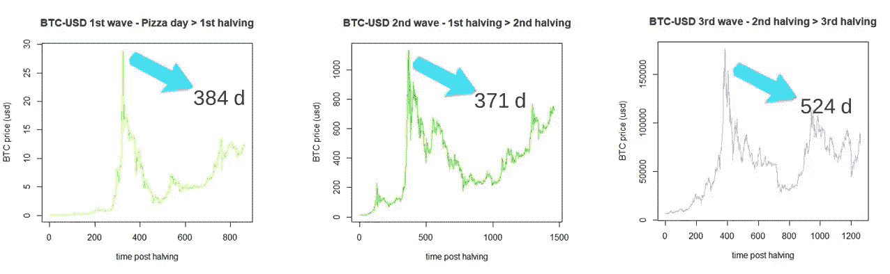
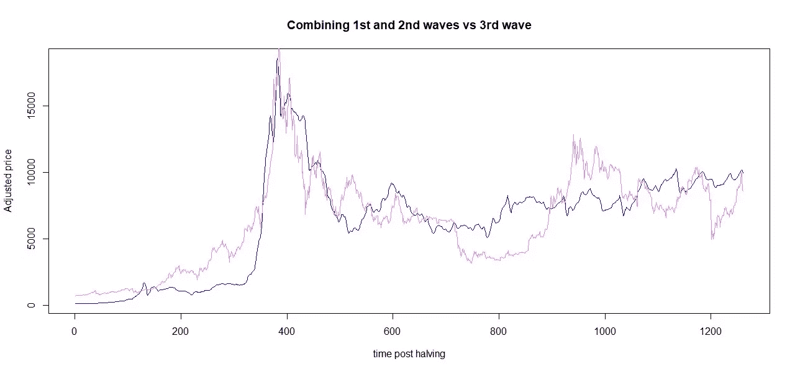
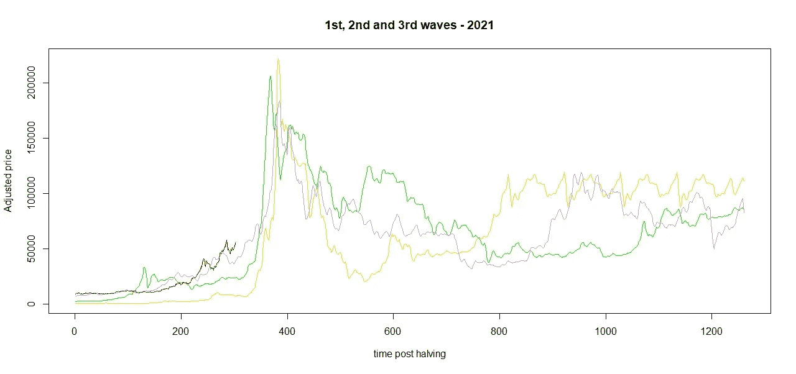
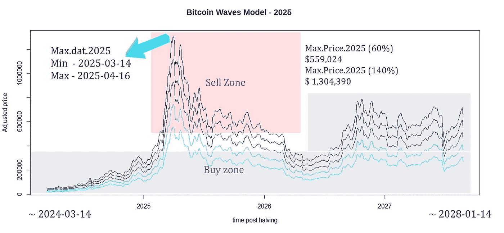

# 比特币浪潮:价格建模的线性组合

> 原文：<https://medium.com/coinmonks/bitcoin-waves-a-linear-combination-for-price-modeling-2b89f72e552d?source=collection_archive---------3----------------------->

## 介绍

近年来，比特币因其向世界任何地方的任何人提供即时支付的特性而备受关注[1]。大概，这项技术是我们这一代人最大的发明。然而，比特币的真正价值是什么？

一位被称为 *Plan B* 的天才根据比特币的稀缺性对比特币的价格进行了建模[2]。他启发我找到了比特币价格的模型。谢谢您们。

这份报告提出了一种模拟比特币价格的新方法。在波浪减半的基础上，它用线性组合来描述市场的运动。

## **比特币波动数据处理**

到目前为止，有三次比特币浪潮。第一波开始于著名的“披萨日”，结束于第一次减半(2010 年> 2012 年)。第二波发生在第一次和第二次减半之间(2012 年> 2016 年)，第三波发生在第二次和第三次减半之间(2016 年> 2020 年)，如图 1 所示。

Figure 1\. Three last bitcoin waves.

数据价格来自 Coinmetrics [3]，2010 年至 2021 年。仅考虑第一波和第二波，因为第三波是减半后最高价格日期的异常值，最高价格日发生在减半后的 378 18 天，95%置信水平。第四波被用来测试*比特币波*模型。

使用 R 软件[4]和信号处理(Signal)、动态时间弯曲(dtw) [5]和潜在语义分析(lsa)[6]软件包进行数据导入、预处理和多变量程序。所有的数据处理都是使用 R 统计计算基金会的免费软件进行的。

## **比特币波动模型**

比特币波模型的目标是通过将未来波近似为先前波的线性组合来预测下一波，这与分子轨道理论或量子力学类似。用第一波预测第二波，余弦相似度为 83.98%。这样，第一波和第二波被合并，并与第三波进行比较，余弦相似性为 96.18%(图 2)。

Figure 2\. 3rd wave (violet) vs 3rd wave model (blue)

图 3 显示了当前情景(2021 年)中处理和预测的第一波、第二波和第三波。尽管基础中的每一波都包含了你的历史，但你可能会注意到它们呈现出相似的行为，这样，就为这种行为建模提供了机会。显然，实际的大事实会影响价格，并可能在未来产生新的信号。

Figure 3\. 1st (yellow), 2nd (green), and 3rd (violet) waves projected in 2021 (red).

最后，第二波和第三波的线性组合产生了图 4 所示的模型。

Figure 4\. Bitcoin Waves Model — 2021

图 4 中的代表性图形给出了 94.72%的余弦相似性。预计在 2020 年 5 月减半后，比特币的最高价格将在 2021 年 5 月 9 日至 2021 年 6 月 8 日之间的某一天从 99，700 美元到 232，800 美元。正如难以置信的 CZ 会说的，这不是财务建议，这是一个简单的模型，也是检验这个假设的机会。值得注意的是，根据模型，接近 2024 年将是一个买入区，因为图 5 显示了这种噪声在未来是什么。

Figure 5\. Bitcoin Waves Model — 2025

## **结论**

1922 年诺贝尔物理学奖得主尼尔斯·玻尔曾说过:“预测是非常困难的，尤其是当它是关于未来的时候！”。这表明了在展示结果之前对模型进行测试和压力测试的重要性。另一方面，只有三个波用于创建新的模型，没有人可以等待大量的波来意图目标。

如果你喜欢这个内容，可以考虑提示:
BTC:BC 1 qljlmuwq 9 gyvn 7 uhvwwypsj 4x 8 hcetuzhw 9 quh 0
BNB:bnb 159am 7 huy 53mg 7 sygnklrtxkahkdk 2 qxzmnk 0 GW【T4:bnb 159am 7 huy 53mg 7 sygnklrtxkahkdk 2 qxzmnk 0 GW

## **致谢**

作者非常感谢中本聪、哈尔·芬尼、尼克·萨博、赵昌鹏、B 计划、萨布丽娜·莫赖斯、费尔南多·乌尔里希、安德烈·福斯、克里托马尼亚科斯和贝拉·交易者。

## **参考文献**

1.[https://bitcoin.org/bitcoin.pdf](https://bitcoin.org/bitcoin.pdf)

2.[用稀缺性模拟比特币价值|中等](/@100trillionUSD/modeling-bitcoins-value-with-scarcity-91fa0fc03e25#id_token=eyJhbGciOiJSUzI1NiIsImtpZCI6Ijg0NjJhNzFkYTRmNmQ2MTFmYzBmZWNmMGZjNGJhOWMzN2Q2NWU2Y2QiLCJ0eXAiOiJKV1QifQ.eyJpc3MiOiJodHRwczovL2FjY291bnRzLmdvb2dsZS5jb20iLCJuYmYiOjE2MTU2Mjk0NzQsImF1ZCI6IjIxNjI5NjAzNTgzNC1rMWs2cWUwNjBzMnRwMmEyamFtNGxqZGNtczAwc3R0Zy5hcHBzLmdvb2dsZXVzZXJjb250ZW50LmNvbSIsInN1YiI6IjEwODcwMDg4NjA1Mzk0MTQxMTM3MyIsImVtYWlsIjoiZWRnYXJtb3JhZXN1ZnJuQGdtYWlsLmNvbSIsImVtYWlsX3ZlcmlmaWVkIjp0cnVlLCJhenAiOiIyMTYyOTYwMzU4MzQtazFrNnFlMDYwczJ0cDJhMmphbTRsamRjbXMwMHN0dGcuYXBwcy5nb29nbGV1c2VyY29udGVudC5jb20iLCJuYW1lIjoiRWRnYXIgTW9yYWVzIiwicGljdHVyZSI6Imh0dHBzOi8vbGgzLmdvb2dsZXVzZXJjb250ZW50LmNvbS9hLS9BT2gxNEdoMWtGYmpfQzJkdWtTcklHNGxCVUlHSHp4MFZ4NmpKVTJlU29Wd2pBPXM5Ni1jIiwiZ2l2ZW5fbmFtZSI6IkVkZ2FyIiwiZmFtaWx5X25hbWUiOiJNb3JhZXMiLCJpYXQiOjE2MTU2Mjk3NzQsImV4cCI6MTYxNTYzMzM3NCwianRpIjoiY2UxNzAwNmRhNjFkMTFmMDFiZWY5ZTY5ZTJiMGFhOTVjNThiYWI0OSJ9.OBCVbe7jDUrKOVjRlSlI3oRfGOHyFUmHlCxypBR49gO23IMYa3vJ2ve7AGj9J4fG11dwqtHz9aquTuHrT_Qqe54RfnnBKOfIAW3P0TCITryQ4-5b5oKFe0k2_yRu9PCDK6plIVcM47ofchkkL4xKm4t9trGmlhxnZ4XY3j1UiCUWssobnWM9t-d0gmemcfZKuzbjrhcnB-tcVrQx4H1smOyJDXdTkWWmi092ChIs5x9pMhCc13EarMUyX-hfI6mPFhwFi1spCTRAtDIkV-KlgOwyvtlIzrC3S7IcQKD4HBoiFYqTYq10zvckY_bc6_fkd94mnlhTbDPg9YHIF4MazQ)

3. [https://coinmetrics.io](https://coinmetrics.io)

4.[https://www.R-project.org/](https://www.R-project.org/)

5.[https://www . rdocumentstation . org/packages/signal/versions/0.7-6](https://www.rdocumentation.org/packages/signal/versions/0.7-6)

6.[https://doi.org/10.1016/j.artmed.2008.11.007](https://doi.org/10.1016/j.artmed.2008.11.007)

[7。https://cran.r-project.org/web/packages/lsa/index.html](https://cran.r-project.org/web/packages/lsa/index.html)