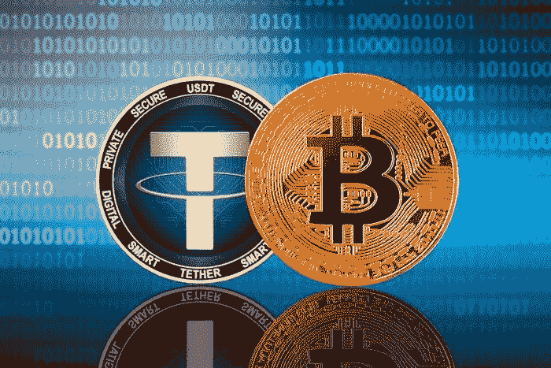

# 比特币:欢迎来到 Bitfinex 的第二个系绳泡沫

> 原文：<https://medium.com/coinmonks/bitcoin-welcome-to-bitfinexs-second-tether-bubble-29e69126257e?source=collection_archive---------1----------------------->

*自 2015 年 1 月 15 日以来，Bitfinex 以 1:1 的比例贷记 USDT 的存款，但随着 Bitfinex 引入 USDT/美元交叉汇率交易，这一平价于 2018 年 11 月 27 日结束。2018 年 12 月 21 日，该交易所推出了杠杆高达 3.3 倍的保证金交易。2019 年 3 月 11 日，BTC/USDT 上市，但在此之前，Bitfinex 上的 BTC 实际上是以 USDT 计价的。4 月 24 日纽约* …