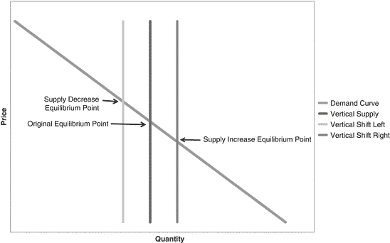
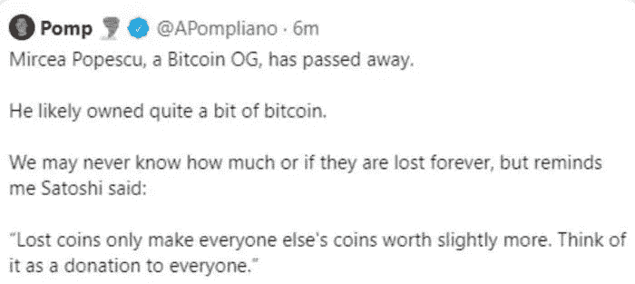
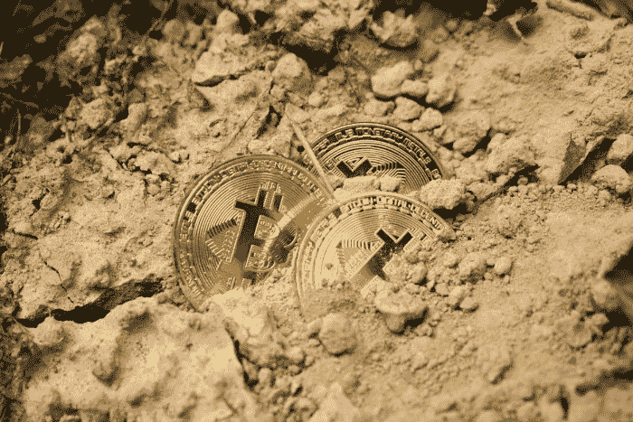
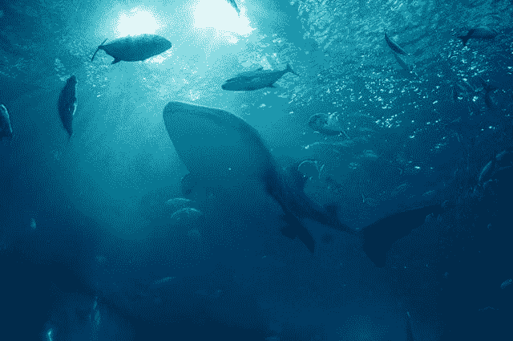

# 比特币鲸鱼受到威胁

> 原文：<https://medium.com/coinmonks/bitcoin-whales-under-threat-a7d5efdf3943?source=collection_archive---------3----------------------->

比特币(BTC)如今是一万亿美元的资产。

比特币的早期采用者(2009 年至 2012 年)积累的利润值得称赞。新来者通常会说他们很幸运，因为在比特币的价格只有一美元甚至更低的时候偶然发现了它。然而，运气是不可能的。

比特币的早期采用者也在开采 BTC，至少直到 2011 年，随着 ASICs 硬件集成，采矿转变为工业规模。

比特币的数量不断增加，但直到 2013 年，它的用户群才实现了极端增长。

他们中的一些人积累了如此多的比特币，达到了“鲸鱼”的地位。以美元计算，鲸鱼的 BTC 财富的估值今天已经达到数百万甚至数十亿美元。

虽然，最近出现了更多的鲸鱼。Microstrategy，特斯拉，像 Bakkt，PayPal，gray 这样的交易服务。BTC 已经达到了一个全新的投资水平，现在甚至被机构投资者视为优先投资对象。

BTC 已经变成了控制世界大部分财富的人。

今年，随着比特币在当前 50，000 美元的价格水平上升值，早期的鲸鱼正面临恐惧，特别是在约翰·迈克菲和米尔恰·波佩斯库([阅读](https://nypost.com/2021/07/02/bitcoin-billionaire-mircea-popescu-dies-leaving-lost-fortune/))的可疑死亡，或 2017 年美国政府官员[针对朱利安·阿桑奇的暗杀阴谋](https://noise.cash/post/3j700ggb2k5z)的最新披露之后。

> 订阅 [**Coinmonks Youtube 频道**](https://www.youtube.com/c/coinmonks/videos) 获取每日加密新闻。

# 谁是早期的鲸鱼？

Sketch of Tim Drapper — *Source:* [*Flickr*](https://www.flickr.com/photos/donkeyhotey/41762269342/) *,* [*Creative Commons Licence*](https://creativecommons.org/licenses/by-sa/2.0/)*.*

一些精通技术的个人和开发者，徘徊在互联网的黑暗角落，寻找任何新的和创新的东西。下载几十个应用程序，每天测试它们，编写代码，研究技术论坛，他们中的许多人对密码学有着不可否认的兴趣。

此外，一些硅谷投资者在 2010 年至 2012 年间读到了比特币，并在正确的时间买入。

在早期阶段，第一批比特币爱好者运用逻辑和数学发现，如果需求继续以如此高的速度增长，这种资产的价格可能会迅速升值。一些知名人士(如哈尔·芬尼(Hal Finney))提出了一个比特币 100 万美元的价格，甚至追溯到最初，当时比特币的价格仅为美分。

# 价格的升值是一个特征

[*Source*](https://link.springer.com/chapter/10.1057/978-1-137-45559-8_5)

## **需求**

早期采用者很早就发现，仅仅通过积累 BTC(有时，通过任何可能的手段)就有太多的潜力，因为它的价格在接下来的几年里会大幅升值。

而且，随着对比特币的需求不断上升，价格也在不断升值。尽管还有第二个因素，但直到 2012 年第一个因素减半时才被考虑。

## **供给**

BTC 的供应量已经接近 1900 万。只剩下 220 万 BTC 有待开采，约为固定限额的 10%。由于只有 2100 万比特币，我们可以将这个数字视为图表中的固定值。然而，研究人员计算出，大约有 400 万个比特币已经丢失，并且无法挽回。([来源](https://finance.yahoo.com/news/6-million-bitcoin-lost-stolen-173256647.html)

比特币，除了其他一切，都是用稀缺性来设计的。新 BTC 的新鲜供应量有限，目前为每 10 分钟 6,25BTC，即每天有 900 个新 BTC 进入流通。回到 2013 年，这个数字是 3600。

减半意味着采矿奖励减半。矿工们经营着一家企业，必须支付巨额费用，费用因电力消耗和价格而异。

几年后，早期采用者发现丢失的比特币也是一个重要的变量，没有被考虑，直到后来才被定价。

在这两种情况下，总供应量都会下降。

Satoshi 解释了这一点，但可能只有少数人知道适用于此的金融法则。

随着需求的稳定，供应曲线的减少(在 BTC 的情况下，垂直线考虑到总的 2100 万 BTC)必然会提高价格。

# 当 BTC 鲸鱼带着钥匙

Mircea Popescu, *Source:* [*Bitcointalk Forum*](https://bitcointalk.org/index.php?topic=5346243.0)

BTC 社区的一部分人似乎无法掩饰他们的兴奋，甚至当鲸鱼死亡发生的时候！

米尔恰·波佩斯库(Mircea Popescu)的意外死亡也是如此。波佩斯库是一个颇具争议的人物，如今比特币的创造者们争相称其为“OG”。不过，他们最关心的是他在 BTC 的藏毒数量。

*Source:* [*Twitter*](https://www.ft.com/content/4a626a60-2708-4099-abd1-6dce686819ae) *(ThisTweet was deleted a few minutes later)*

读完这条推文后，我们可以假设的一件事是，蓬皮亚诺不拥有任何比特币，这意味着，**他不拥有能让他获得任何重要财富的私钥。**他在发布之前显然没有考虑清楚这一点，并被建议删除该推文。

对太多的人来说，BTC 只是今天交易所里的一个数字。

> **“就当是给大家的捐赠吧。”**
> 
> *-Satoshi，当被问及丢失的硬币时*

聪的说法是正确的。

在没有(过多)政府干预的自由市场中，市场这只看不见的手决定着资产的价格。当今最大的自由市场是加密货币市场。没有一个政府能够设定 BTC 的价格并给它封顶。没有一家交易所能做到这一点。

虽然存在操纵，但这只能影响短期价格行动。真正的行动是长期的，是由需求驱动的。但是供应同样重要。图表解释了在大多数情况下供应的减少是如何导致价格上涨的。BTC 也是如此。在需求稳定的情况下，供应的减少会提高其价格。

因此，通过在“失去的 BTC”中增加更多的 BTC 来减少供应将会提高价格。

也许这就是当比特币丢失时，鲸鱼(新的和早期的)高兴的原因，不管它们是否和主人在一起。

# BTC 时运不济增加了剩余的价值

*Source:* [*Unsplash*](https://unsplash.com/photos/xZJpKskRdOg)*, by* [*Dmitry Demidko*](https://unsplash.com/@wildbook)

尽管约翰·迈克菲从未承认持有任何比特币，但许多人普遍怀疑他持有大量比特币。

波佩斯库是比特币的早期采用者，有人认为他可能控制了 100 万枚比特币，尽管数量可能少得多，但也不是微不足道。

朱利安·阿桑奇(Julian Assange)在 2017 年公布了捐赠给维基解密的比特币如何自 2010 年以来升值了 5 万倍([来源](https://www.cnbc.com/2017/10/16/wikileaks-julian-assange-bitcoin-50000-percent-return-thanks-to-us-government.html))，尽管几乎没有关于维基解密或阿桑奇目前持有量的公开信息。

目前还不能确定迈克菲和波佩斯库的死是否与他们持有的比特币有关。对于 McAfee，我们对他最近是否持有任何加密货币的信息有限。阿桑奇也一样。

当然，每个人都在采取措施增加隐私，隐藏比特币财富。区块链是一个公共账本，随着区块链分析的最新发展，研究人员可以将这些点联系起来，在大多数情况下，甚至可以绕过模糊机制(混合器)，并追踪比特币的路线，以确定身份。

有些地址与名字有关，这些地址是为捐款和支付而公布的。随着像 Chainalysis 这样的一些公司拥有的高级分析的使用，可以合理地假设研究人员可以发现 BTC 持有的大约数量。虽然可能只有少数人知道这些数字。

## BTC 鲸的捕杀

*Source:* [*Flickr*](https://www.flickr.com/photos/upnorthmemories/38227653796)*,* [*Creative Commons Licence*](https://creativecommons.org/licenses/by-nc-nd/2.0/)

私钥是一项巨大的责任。尽管在极少数情况下，密码被恢复，但没有恢复过程。

有一些机制可以保护秘密财富，并在所有者去世等事件发生后将其传递给其他人。例如，多签名钱包就是一种安全的方法。将需要 2/3 或 3/4 个人和任何组合集来申请访问硬币。虽然，这也可能是一个有问题的方法。风险是这样划分的，但并没有被控制。

鲸鱼正在采取一切必要的额外措施来保护它们的财富不被窃取。他们会把私人钥匙拆开，甚至可能把它们锁在世界各地的银行金库里。

虽然，也许，今天的目标不是钥匙，而是鲸鱼本身。

受剩余比特币升值的推动，也许一些鲸鱼会考虑通过消灭其他鲸鱼来从总供应量中移除更多的 BTC。或者这已经发生了。

“丢失的”比特币将随着这种方式增加，BTC 的价格将会升值。取消了钥匙的持有者并且没有钥匙的继承者。

我们或许可以在今天的克雷曼案例中找到相似之处。

> “克雷曼于 2013 年 4 月在家中去世，死因似乎是与耐甲氧西林金黄色葡萄球菌感染并发症有关的自然原因。”
> 
> [-维基百科](https://en.wikipedia.org/wiki/Dave_Kleiman)

克雷曼的例子也需要大量的讨论，(涉及到克雷格·赖特和更多的人)，所以我不能在这篇文章中引入更多的细节，但也许在以后的某个时候会继续。

简而言之，根据克雷格·赖特的说法，克雷曼和他一起创造了比特币，而克雷格·赖特就是聪。根据[的一项研究【Satoshi 已经挖掘了超过 100 万个比特币，这些比特币从未被转移过(除了第一笔交易转给了 Hal Finney)。](https://coincodex.com/article/8329/what-is-the-patoshi-pattern-and-what-does-it-have-to-do-with-bitcoin-inventor-satoshi-nakamoto/)

# 最后

*Source:* [*Unsplash*](https://unsplash.com/photos/1jyy7ouBb8M)*, by* [*Evan Buchholz*](https://unsplash.com/@vnbuchholz92)

有一些关于比特币最高专家米尔恰·波佩斯库最近死亡的猜测，尽管官方声明是。一些出版物甚至提到了自杀的可能性。他当然是一个有争议的人物，积累了大量比特币财富。

蓬皮亚诺只是从外部投机者和观察者的角度陈述了显而易见的事实。这是每个人脑海中的第一个想法，我们已经知道鲸鱼的行为，而在波佩斯库的情况下，这些硬币(私人密钥)的访问权限现在可能丢失了。这确实增加了其余部分的价值。

也许会有(或曾经有)消灭顶级鲸鱼的尝试，任何拥有过多顶级鲸鱼的人都应该重新考虑他们的方法。

一个 BTC 持有者的死亡和他所拥有的丢失的 BTC 增加了 BTC 其余部分的价值。对于所有具有固定供应和稳定需求的加密货币来说也是如此。BTC 的价格在此事件后迅速回升，迈克菲的情况也是如此。他也有可能在 BTC 和其他加密货币中持有大量财富，尽管他从未宣布过，但仍然有人在寻找。

大多数 BTC 鲸已经设置了机制，在它们去世的情况下，将它们的财产转移给亲属。虽然不确定每个人都在同一页上，或者每个人都有可以托付巨额财富的人。说到信任他人，每个人只能选择几个人来信任他们的财富。

仅仅是想到这些鲸鱼冷藏的几十万枚硬币可能会成为孤儿，没有人能接触到私钥，就产生了增加其余硬币价值的动机。

新生的鲸鱼可能是鲨鱼。

Follow me on: ● [ReadCash](https://read.cash/@Pantera) ● [NoiseCash](https://noise.cash/u/Pantera99) ● [Medium](/@panterabch) ● [Hive](https://hive.blog/@pantera1) ● [Steemit](https://steemit.com/@pantera1) ●[Vocal](https://vocal.media/authors/pantera) ● [Minds](https://www.minds.com/pantera99/) ● [Twitter](https://twitter.com/Panterabch) ● [LinkedIn](https://www.linkedin.com/in/panterabch/) ● [email](https://read.cash/@Pantera/localcryptos-p2p-exchange-is-now-offering-bitcoin-cash-trading-06637230#bad-link)

***支持内容创作者。如果你喜欢这个故事，请订阅！***

*最初发布于*[*https://read . cash*](https://read.cash/@Pantera/btc-whales-under-threat-f6d3459a)*。*

> 加入 Coinmonks [电报频道](https://t.me/coincodecap)和 [Youtube 频道](https://www.youtube.com/c/coinmonks/videos)了解加密交易和投资

## 也阅读

*   [币安 vs Bitstamp](https://blog.coincodecap.com/binance-vs-bitstamp)|[bit panda vs 比特币基地 vs Coinsbit](https://blog.coincodecap.com/bitpanda-coinbase-coinsbit)
*   [如何购买 Ripple (XRP)](https://blog.coincodecap.com/buy-ripple-india) | [非洲最好的加密交易所](https://blog.coincodecap.com/crypto-exchange-africa)
*   [非洲最佳密码交易所](https://blog.coincodecap.com/crypto-exchange-africa) | [晤交易所评论](https://blog.coincodecap.com/hoo-exchange-review)
*   [eToro vs robin hood](https://blog.coincodecap.com/etoro-robinhood)|[MoonXBT vs by bit vs Bityard](https://blog.coincodecap.com/bybit-bityard-moonxbt)
*   [Stormgain 回顾](https://blog.coincodecap.com/stormgain-review) | [Bexplus 回顾](https://blog.coincodecap.com/bexplus-review) | [币安 vs Bittrex](https://blog.coincodecap.com/binance-vs-bittrex)
*   [Bookmap 点评](https://blog.coincodecap.com/bookmap-review-2021-best-trading-software) | [美国 5 大最佳加密交易所](https://blog.coincodecap.com/crypto-exchange-usa)
*   [如何在 FTX 交易所交易期货](https://blog.coincodecap.com/ftx-futures-trading) | [OKEx vs 币安](https://blog.coincodecap.com/okex-vs-binance)
*   [如何在势不可挡的域名上购买域名？](https://blog.coincodecap.com/buy-domain-on-unstoppable-domains)
*   [印度的加密税](https://blog.coincodecap.com/crypto-tax-india) | [altFINS 审查](https://blog.coincodecap.com/altfins-review) | [Prokey 审查](/coinmonks/prokey-review-26611173c13c)
*   [布洛克菲 vs 比特币基地](https://blog.coincodecap.com/blockfi-vs-coinbase) | [比特坎评论](https://blog.coincodecap.com/bitkan-review) | [币安评论](/coinmonks/binance-review-ee10d3bf3b6e)
*   [Coldcard 评论](https://blog.coincodecap.com/coldcard-review) | [BOXtradEX 评论](https://blog.coincodecap.com/boxtradex-review)|[Unisw 指南](https://blog.coincodecap.com/uniswap)