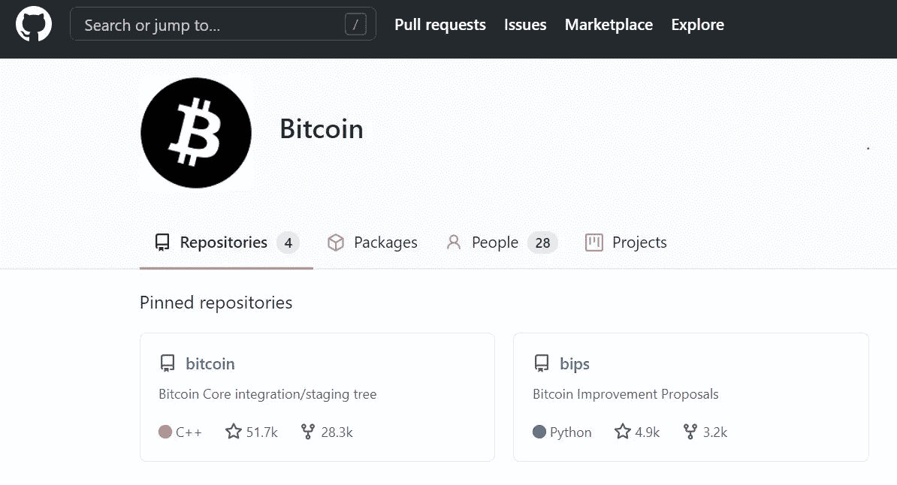
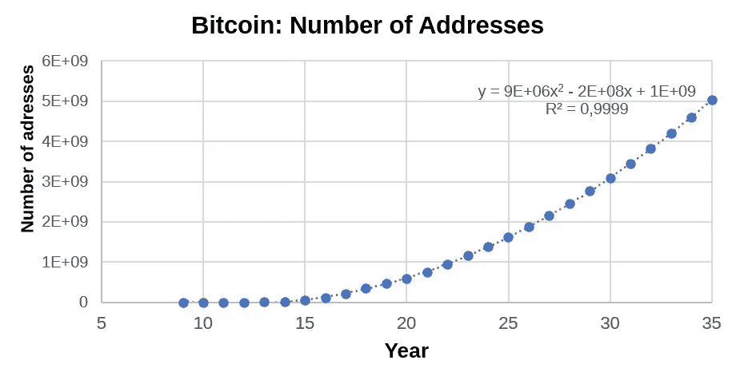
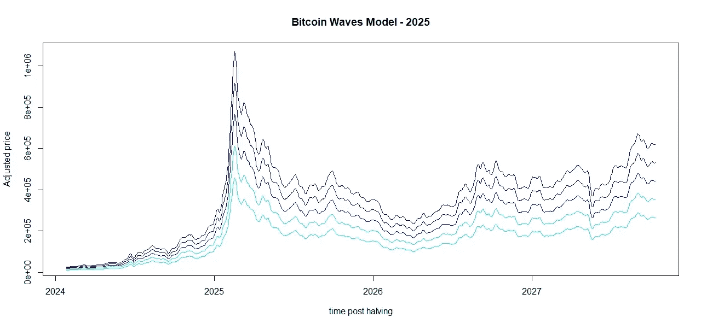
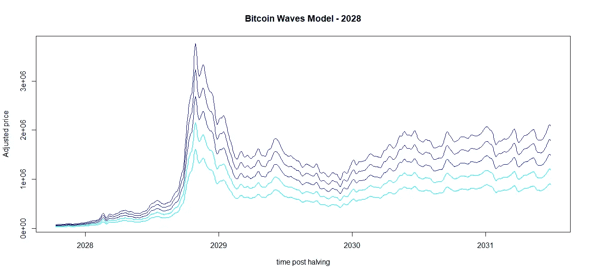
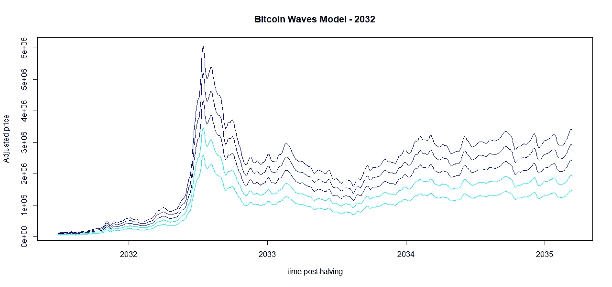

# 比特币:过去是什么，现在是什么，未来可能会是什么

> 原文：<https://medium.com/coinmonks/bitcoin-what-was-what-is-and-what-probably-will-be-8aba4d01eb7b?source=collection_archive---------2----------------------->

## **简介**

自 21 世纪初诞生以来[1]，加密货币已经发展成为一个成熟的创新市场，实际上包含了一个由加密硬币、稳定硬币、代币和其他具有独特机制和技术的数字金融资产组成的大家庭，引起了投资者、企业家、监管机构和公众的极大兴趣[2]。然而，新手如何在这个庞大的加密货币世界里区分严肃的项目和骗局呢？
为此，本频道将通过调查每种加密货币的过去、现在和未来，展示一个有趣的系列。本系列的目标是帮助初学者研究加密货币市场，如头寸保全，以及如何检测一个严肃的项目。
本文介绍了我们的大明星比特币，这是加密世界的第一个成功案例，比特币是一个很好的例子，因为随着许多开发人员从事比特币的工作，该社区已经呈指数级增长[3]。

## **比特币是什么？**

比特币是由一种名为比特币核心的开源软件实现的。软件存储在 Github [4]上。但是 Github 是什么呢？它是程序员存储他们的项目并与志同道合的人建立联系的社交网络。换句话说，这是一个开发者和极客的社交网络，在这里托管着严肃的项目。从 2014 年至今，开发者 Wladimir van der Laan 是目前比特币核心软件的维护者[5]。

## **比特币是什么？**

比特币，简单来说就是一种创新的数字货币。但是比特币核心软件的背后是什么？有 51，700 个“观星者”，观察程序的人，28，300 个分叉，存储库的副本，3，800 个观察者，监视所有活动的人，包括我，569 个要解决的问题，任务和错误，397 个拉请求，GitHub 上的协作核心，34 个版本和 28 个成员，伟大的家伙的管理员，包括天才范德兰。这是一个不可思议的充满活力的社区，扮演着项目目标的看门人角色(图 01)。

Figure 1\. Bitcoin community on Github.

截至目前，比特币市值为 1 万亿美元。CoinMarketCap 网站跟踪了 306 个加密货币现货交易所和 56 个顶级分散交易所[6]，该市场目前以 197%的复合年增长率(CAGR)增长，这是 10 年来每年的复合回报率。
根据 Buy Bitcoin Worldwide 的说法，我们是一个由大约 1 亿比特币所有者和大约 5300 万比特币交易者组成的社区，他们使用大约 2 亿个比特币钱包[7]。用户数量以每年约 40%的速度增长。

## **比特币可能会是什么？**

预测未来是一项艰难的工作，而且充满不确定性。例如，按照实际速度，我们很可能在未来十年内拥有超过 10 亿比特币。可以观察到(图 2)，2035 年钱包总数可能达到 50 亿，扩展了 Glassnode 的真实数据[8]。

Figure 2\. The number of Bitcoin wallets.

比特币价格的年增长率在每次减半后都在降低。在之前的一篇论文[9]中，我展示了先前比特币浪潮的线性组合可以帮助我们研究下一波浪潮，最终形成一个有趣的价格模型，称为比特币浪潮。这样，比特币 Waves 模型被应用到下一个减半期(图 3)，根据该模型预测，2024 年减半后价格可能达到 100 万美元以上。

Figure 3\. Bitcoin Waves Model — 2025

最后，在图 4 和图 5 中，显示了 2028 年和 2032 年关于可能价格(美元)的波动。我注意到，我计算出的 2032 年的具体增长率为 1.617，这立即表明它可能与黄金比例 1.618 相似。根据该模型，在 2032 年价格减半后，预计价格可能会超过 600 万美元。

Figure 4\. Bitcoin Waves Model — 2028

Figure 5\. Bitcoin Waves Model — 2032

**结论**

总之，比特币网络呈现了一个有趣的创造，一个强大的程序员社区，现在，比特币正在老化，并将成为所有加密货币的敬爱的祖父，可能是它们的记账单位。这不是财务建议。

如果您喜欢这些内容，请考虑以下建议:

BTC:BC 1 qljlmuwq 9 gyvn 7 uhvwwypsj 4x 8 hcetuzhw 9 quh 0

BNB:bnb 159am 7 huy 53mg 7 sygnklrtxkahkdk 2 qxzmnk 0 GW

BUSD:bnb 159am 7 huy 53mg 7 sygnklrtxkahkdk 2 qxzmnk 0 GW

**致谢**

作者感谢、Hal Finney、Nick Szabo、赵昌鹏、Sabrina Moraes、Fernando Ulrich、André Fauth、Criptomaníacos 和 Vela Trader。

**参考文献**

1.[https://bitcoin.org/bitcoin.pdf](https://bitcoin.org/bitcoin.pdf)

2.[加密货币:市场分析和前景| SpringerLink](https://link.springer.com/article/10.1007/s40812-019-00138-6)

3.[比特币——开源 P2P 货币](https://bitcoin.org/en/)

4.w[ww.github.com](http://www.github.com)

5.[拉安杰(范德拉安)(github.com)](https://github.com/laanwj)

6.[https://coinmarketcap.com/rankings/exchanges/](https://coinmarketcap.com/rankings/exchanges/)

7.[https://www . buybitcoinworld wide . com/how-many-bit coin-users/#:~:text = But %20 where %20 only % 20 ~ 20.5，比% 20 ~ 20.5% 2000 万% 20 所有者多% 20。](https://www.buybitcoinworldwide.com/how-many-bitcoin-users/#:~:text=But%20there%20are%20only%20~20.5,more%20than%20~20.5%20million%20owners)

8.www.studio.glassnode.com

9.[比特币浪潮:价格建模的线性组合| Edgar mora es | coin monks | 2021 年 3 月| Medium](/coinmonks/bitcoin-waves-a-linear-combination-for-price-modeling-2b89f72e552d)

> 加入 Coinmonks [Telegram group](https://t.me/joinchat/Trz8jaxd6xEsBI4p) 学习加密交易和投资

## 另外，阅读

*   最好的[密码交易机器人](/coinmonks/crypto-trading-bot-c2ffce8acb2a) | [网格交易](https://blog.coincodecap.com/grid-trading)
*   [加密复制交易平台](/coinmonks/top-10-crypto-copy-trading-platforms-for-beginners-d0c37c7d698c) | [如何在 WazirX 上购买比特币](/coinmonks/buy-bitcoin-on-wazirx-2d12b7989af1)
*   [CoinLoan 点评](/coinmonks/coinloan-review-18128b9badc4)|[Crypto.com 点评](/coinmonks/crypto-com-review-f143dca1f74c) | [火币保证金交易](/coinmonks/huobi-margin-trading-b3b06cdc1519)
*   [尤霍德勒 vs 考尼洛 vs 霍德诺特](/coinmonks/youhodler-vs-coinloan-vs-hodlnaut-b1050acde55a) | [Cryptohopper vs 哈斯博特](https://blog.coincodecap.com/cryptohopper-vs-haasbot)
*   [杠杆令牌](/coinmonks/leveraged-token-3f5257808b22) | [最佳密码交易所](/coinmonks/crypto-exchange-dd2f9d6f3769) | [Paxful 点评](/coinmonks/paxful-review-4daf2354ab70)
*   [加密套利](/coinmonks/crypto-arbitrage-guide-how-to-make-money-as-a-beginner-62bfe5c868f6)指南| [如何做空比特币](/coinmonks/how-to-short-bitcoin-568a2d0b4ae5)
*   [如何在印度购买比特币？](/coinmonks/buy-bitcoin-in-india-feb50ddfef94) | [WazirX 评论](/coinmonks/wazirx-review-5c811b074f5b) | [BitMEX 评论](https://blog.coincodecap.com/bitmex-review)
*   [印度比特币交易所](/coinmonks/bitcoin-exchange-in-india-7f1fe79715c9) | [比特币储蓄账户](/coinmonks/bitcoin-savings-account-e65b13f92451)
*   [币安费](/coinmonks/binance-fees-8588ec17965) | [Botcrypto 评论](/coinmonks/botcrypto-review-2021-build-your-own-trading-bot-coincodecap-6b8332d736c7) | [Hotbit 评论](/coinmonks/hotbit-review-cd5bec41dafb)
*   [我的密码副本交易经验](/coinmonks/my-experience-with-crypto-copy-trading-d6feb2ce3ac5) | [购买硬币评论](https://blog.coincodecap.com/buycoins-review)
*   [Bybit 融资融券交易](/coinmonks/bybit-margin-trading-e5071676244e) | [币安融资融券交易](/coinmonks/binance-margin-trading-c9eb5e9d2116) | [Overbit 审核](/coinmonks/overbit-review-9446ed4f2188)
*   [加密货币储蓄账户](/coinmonks/cryptocurrency-savings-accounts-be3bc0feffbf) | [YoBit 审查](/coinmonks/yobit-review-175464162c62) | [Bitbns 审查](/coinmonks/bitbns-review-38256a07e161)
*   [Botsfolio vs nap bots vs Mudrex](/coinmonks/botsfolio-vs-napbots-vs-mudrex-c81344970c02)|[gate . io 交流回顾](/coinmonks/gate-io-exchange-review-61bf87b7078f)
*   [最佳比特币保证金交易](/coinmonks/bitcoin-margin-trading-exchange-bcbfcbf7b8e3) | [萝莉点评](/coinmonks/lolli-review-e6ddc7895ad8) | [比特币保证金交易](https://blog.coincodecap.com/bityard-margin-trading)
*   [创造并出售你的第一个 NFT](https://blog.coincodecap.com/create-nft) | [本地比特币评论](/coinmonks/localbitcoins-review-6cc001c6ed56)
*   [加密保证金交易交易所](/coinmonks/crypto-margin-trading-exchanges-428b1f7ad108) | [赚取比特币](/coinmonks/earn-bitcoin-6e8bd3c592d9) | [Mudrex 投资](https://blog.coincodecap.com/mudrex-invest-review-the-best-way-to-invest-in-crypto)
*   [如何在印度购买以太坊？](https://blog.coincodecap.com/buy-ethereum-in-india) | [如何在币安购买比特币](https://blog.coincodecap.com/buy-bitcoin-binance)
*   [顶级付费加密货币和区块链课程](https://blog.coincodecap.com/blockchain-courses)
*   [MXC 交易所评论](/coinmonks/mxc-exchange-review-3af0ec1cba8c) | [皮欧尼克斯 vs 币安](https://blog.coincodecap.com/pionex-vs-binance)