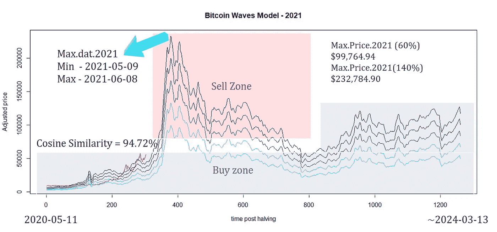
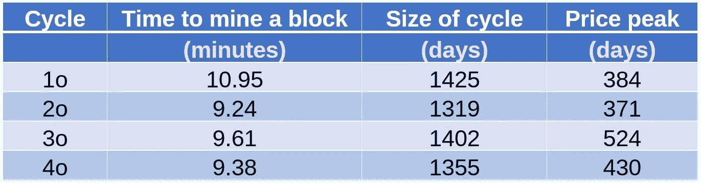
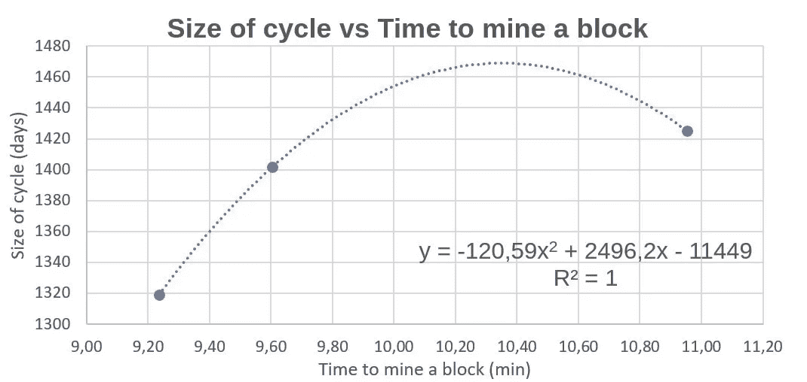

# 比特币:什么时候是月亮？

> 原文：<https://medium.com/coinmonks/bitcoin-when-moon-61234a22faae?source=collection_archive---------3----------------------->

## **简介**

众所周知，比特币为世界各地的各种应用引入了一种新的货币形式。很可能，这项技术将改变我们的未来。然而，比特币什么时候能到达月球？
在之前的一篇论文[1]中，我展示了先前比特币浪潮的线性组合可以帮助我们研究下一波浪潮，最终形成了一个基于比特币减半的有趣价格模型。*比特币浪潮*模型采用了被称为 B 计划的天才所开发的比特币稀缺理念[2]。到目前为止，*比特币浪潮*模型将余弦相似度从 94.72%(发布日期)提高到 95，70%。
人们发现，每天的比特币交易量和每分钟挖掘一个区块的平均时间可能预示着比特币季节的结束。我的结果表明山顶就在附近。

## **本周期结束由*比特币浪潮***

在本研究中，应用了一种线性组合的先验波，并使用动态时间扭曲来调整周期时间(图 1)。由于比特币作为 Nakamoto 计划的副产品日益稀缺[3]，其供应量不足以满足当前的需求，使得比特币成为一种相对有价值的货币。

Figure 1\. Bitcoin Waves Model — 2021

预计 2020 年 5 月之后比特币价格减半的最大日期将在 2021 年 5 月 9 日至 2021 年 6 月 8 日之间，差不多是减半后的 383 天。然而，这是动态时间扭曲的结果，但众所周知，在 210 k 个区块被开采后，比特币会减半，本文报道了我们如何利用这一信息找到牛市的终点。

## 这个周期的结束取决于每天的比特币交易量

使用 Excel (Microsoft Corp .)进行数据导入和处理程序。每日比特币交易量数据采集自 Blockchain [4]，2018-2021 年。
上一波比特币日均交易量为 47.5 万笔，这一波中，我发现日均交易量为 65 万笔，比上一波有所增加，标志着一个天数更少的新比特币周期。
将 475 k(最后一波)的值除以这个周期的平均值 650 k，结果是这个周期 73%的交易。这样，如果 2017 年的峰值发生在 524 天后，73%将在 2020 年后 383 天减半。该结果与*比特币浪潮*模型一致。

## 以分钟为单位挖掘一个区块的平均时间表示的周期结束

数据挖掘一个块的平均时间(分钟)是从 Bitcoinity 获取的[5]。综合数据(表 1)显示，挖掘一个区块的时间低于上一个周期，这意味着这轮牛市可能会更短。

Table 1\. Average time to mine a block in minutes of each bitcoin cycle.

在表 1 中可以观察到，这个周期显示开采一个区块的平均时间为 9.38 分钟，更快地发现价格峰值可能在 2020 年减半后的 430 天。这个结果与另外两个模型相差 9.4%。这个新周期的终点是用图 2 中的公式计算出来的。

Figure 2\. Size of cycle vs Time to mine a block.

## **结论**

在这里，我展示了三种不同的方法来寻找比特币周期的终点，它们是数学上辨别当天的优秀工具。从每天的比特币交易数量和挖掘一个区块的平均时间(以分钟为单位)模型来看，很明显，尽管两者都会影响周期的大小，但它们的结合促进了周期之间令人难以置信的区分信息。

如果您喜欢这些内容，请考虑以下建议:

BTC:BC 1 qljlmuwq 9 gyvn 7 uhvwwypsj 4x 8 hcetuzhw 9 quh 0

BNB:bnb 159am 7 huy 53mg 7 sygnklrtxkahkdk 2 qxzmnk 0 GW

BUSD:bnb 159am 7 huy 53mg 7 sygnklrtxkahkdk 2 qxzmnk 0 GW

## **致谢**

作者感谢、Hal Finney、Nick Szabo、赵昌鹏、Sabrina Moraes、Fernando Ulrich、André Fauth、Criptomaníacos 和 Vela Trader。

## **参考文献**

1.[比特币浪潮:价格建模的线性组合| Edgar mora es | coin monks | 2021 年 3 月| Medium](/coinmonks/bitcoin-waves-a-linear-combination-for-price-modeling-2b89f72e552d)

2.[用稀缺性模拟比特币价值|中等](/@100trillionUSD/modeling-bitcoins-value-with-scarcity-91fa0fc03e25#id_token=eyJhbGciOiJSUzI1NiIsImtpZCI6Ijg0NjJhNzFkYTRmNmQ2MTFmYzBmZWNmMGZjNGJhOWMzN2Q2NWU2Y2QiLCJ0eXAiOiJKV1QifQ.eyJpc3MiOiJodHRwczovL2FjY291bnRzLmdvb2dsZS5jb20iLCJuYmYiOjE2MTU2Mjk0NzQsImF1ZCI6IjIxNjI5NjAzNTgzNC1rMWs2cWUwNjBzMnRwMmEyamFtNGxqZGNtczAwc3R0Zy5hcHBzLmdvb2dsZXVzZXJjb250ZW50LmNvbSIsInN1YiI6IjEwODcwMDg4NjA1Mzk0MTQxMTM3MyIsImVtYWlsIjoiZWRnYXJtb3JhZXN1ZnJuQGdtYWlsLmNvbSIsImVtYWlsX3ZlcmlmaWVkIjp0cnVlLCJhenAiOiIyMTYyOTYwMzU4MzQtazFrNnFlMDYwczJ0cDJhMmphbTRsamRjbXMwMHN0dGcuYXBwcy5nb29nbGV1c2VyY29udGVudC5jb20iLCJuYW1lIjoiRWRnYXIgTW9yYWVzIiwicGljdHVyZSI6Imh0dHBzOi8vbGgzLmdvb2dsZXVzZXJjb250ZW50LmNvbS9hLS9BT2gxNEdoMWtGYmpfQzJkdWtTcklHNGxCVUlHSHp4MFZ4NmpKVTJlU29Wd2pBPXM5Ni1jIiwiZ2l2ZW5fbmFtZSI6IkVkZ2FyIiwiZmFtaWx5X25hbWUiOiJNb3JhZXMiLCJpYXQiOjE2MTU2Mjk3NzQsImV4cCI6MTYxNTYzMzM3NCwianRpIjoiY2UxNzAwNmRhNjFkMTFmMDFiZWY5ZTY5ZTJiMGFhOTVjNThiYWI0OSJ9.OBCVbe7jDUrKOVjRlSlI3oRfGOHyFUmHlCxypBR49gO23IMYa3vJ2ve7AGj9J4fG11dwqtHz9aquTuHrT_Qqe54RfnnBKOfIAW3P0TCITryQ4-5b5oKFe0k2_yRu9PCDK6plIVcM47ofchkkL4xKm4t9trGmlhxnZ4XY3j1UiCUWssobnWM9t-d0gmemcfZKuzbjrhcnB-tcVrQx4H1smOyJDXdTkWWmi092ChIs5x9pMhCc13EarMUyX-hfI6mPFhwFi1spCTRAtDIkV-KlgOwyvtlIzrC3S7IcQKD4HBoiFYqTYq10zvckY_bc6_fkd94mnlhTbDPg9YHIF4MazQ)

3.[https://bitcoin.org/bitcoin.pdf](https://bitcoin.org/bitcoin.pdf)

4.[https://www.blockchain.com/charts/n-payments](https://www.blockchain.com/charts/n-payments)

5.【https://data.bitcoinity.org/bitcoin/block_time/ 号

> 加入 Coinmonks [电报集团](https://t.me/joinchat/EPmjKpNYwRMsBI4p)，了解加密交易和投资

## 另外，阅读

*   [什么是融资融券交易](https://blog.coincodecap.com/margin-trading)
*   最好的[密码交易机器人](/coinmonks/crypto-trading-bot-c2ffce8acb2a) | [网格交易](https://blog.coincodecap.com/grid-trading)
*   [3 商业评论](/coinmonks/3commas-review-an-excellent-crypto-trading-bot-2020-1313a58bec92) | [Pionex 评论](/coinmonks/pionex-review-exchange-with-crypto-trading-bot-1e459d0191ea) | [Coinrule 评论](/coinmonks/coinrule-review-2021-a-beginner-friendly-crypto-trading-bot-daf0504848ba)
*   [AAX 交易所评论](/coinmonks/aax-exchange-review-2021-67c5ea09330c) | [德里比特评论](/coinmonks/deribit-review-options-fees-apis-and-testnet-2ca16c4bbdb2) | [FTX 交易所评论](/coinmonks/ftx-crypto-exchange-review-53664ac1198f)
*   [n ave 零点回顾](/coinmonks/ngrave-zero-review-c465cf8307fc) | [Phemex 回顾](/coinmonks/phemex-review-4cfba0b49e28) | [PrimeXBT 回顾](/coinmonks/primexbt-review-88e0815be858)
*   [Bybit Exchange 审查](/coinmonks/bybit-exchange-review-dbd570019b71) | [Bityard 审查](/coinmonks/bityard-review-7d104239be35) | [CoinSpot 审查](https://blog.coincodecap.com/coinspot-review)
*   [3 commas vs crypto hopper](/coinmonks/3commas-vs-pionex-vs-cryptohopper-best-crypto-bot-6a98d2baa203)|[赚取加密利息](/coinmonks/earn-crypto-interest-b10b810fdda3)
*   最好的比特币[硬件钱包](/coinmonks/the-best-cryptocurrency-hardware-wallets-of-2020-e28b1c124069?source=friends_link&sk=324dd9ff8556ab578d71e7ad7658ad7c) | [BitBox02 回顾](/coinmonks/bitbox02-review-your-swiss-bitcoin-hardware-wallet-c36c88fff29)
*   [莱杰 vs n ave](/coinmonks/ledger-vs-ngrave-zero-7e40f0c1d694)|[莱杰 nano s vs x](/coinmonks/ledger-nano-s-vs-x-battery-hardware-price-storage-59a6663fe3b0)
*   [密码本交易平台](/coinmonks/top-10-crypto-copy-trading-platforms-for-beginners-d0c37c7d698c)
*   [CoinLoan 评论](/coinmonks/coinloan-review-18128b9badc4) | [YouHodler 评论](/coinmonks/youhodler-4-easy-ways-to-make-money-98969b9689f2) | [BlockFi 评论](/coinmonks/blockfi-review-53096053c097)
*   最好的[加密税务软件](/coinmonks/best-crypto-tax-tool-for-my-money-72d4b430816b) | [硬币追踪评论](/coinmonks/cointracking-review-a-reliable-cryptocurrency-tax-software-5114e3eb5737)
*   最佳[加密借贷平台](/coinmonks/top-5-crypto-lending-platforms-in-2020-that-you-need-to-know-a1b675cec3fa) | [杠杆代币](/coinmonks/leveraged-token-3f5257808b22)
*   [block fi vs Celsius](/coinmonks/blockfi-vs-celsius-vs-hodlnaut-8a1cc8c26630)|[Hodlnaut 评论](/coinmonks/hodlnaut-review-best-way-to-hodl-is-to-earn-interest-on-your-bitcoin-6658a8c19edf)
*   [Bitsgap 审查](/coinmonks/bitsgap-review-a-crypto-trading-bot-that-makes-easy-money-a5d88a336df2) | [Quadency 审查](/coinmonks/quadency-review-a-crypto-trading-automation-platform-3068eaa374e1) | [Bitbns 审查](/coinmonks/bitbns-review-38256a07e161)
*   [埃利帕尔泰坦评论](/coinmonks/ellipal-titan-review-85e9071dd029) | [赛克斯斯通评论](/coinmonks/secux-stone-hardware-wallet-review-15-discount-coupon-2020-7577032faa6e)
*   [本地比特币审核](/coinmonks/localbitcoins-review-6cc001c6ed56) | [加密货币储蓄账户](https://blog.coincodecap.com/cryptocurrency-savings-accounts)
*   最佳[区块链分析](https://bitquery.io/blog/best-blockchain-analysis-tools-and-software)工具| [赚比特币](/coinmonks/earn-bitcoin-6e8bd3c592d9)
*   [加密套利](/coinmonks/crypto-arbitrage-guide-how-to-make-money-as-a-beginner-62bfe5c868f6)指南| [如何做空比特币](/coinmonks/how-to-short-bitcoin-568a2d0b4ae5)
*   最佳[加密制图工具](/coinmonks/what-are-the-best-charting-platforms-for-cryptocurrency-trading-85aade584d80) | [最佳加密交易所](/coinmonks/crypto-exchange-dd2f9d6f3769)
*   [如何在印度购买比特币？](/coinmonks/buy-bitcoin-in-india-feb50ddfef94) | [WazirX 审核](/coinmonks/wazirx-review-5c811b074f5b)
*   [印度比特币交易所](/coinmonks/bitcoin-exchange-in-india-7f1fe79715c9) | [比特币储蓄账户](/coinmonks/bitcoin-savings-account-e65b13f92451)
*   [CoinDCX 评论](/coinmonks/coindcx-review-8444db3621a2) | [加密保证金交易交易所](https://blog.coincodecap.com/crypto-margin-trading-exchanges)

> [直接在您的收件箱中获得最佳软件交易](/coinmonks/newsletters/coinmonks)

