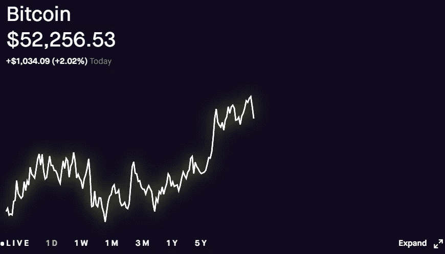

# 比特币:何时套现或崩盘

> 原文：<https://medium.com/coinmonks/bitcoin-when-to-cash-out-or-crash-out-23098caee11a?source=collection_archive---------1----------------------->

在我的文章[利用比特币减半周期赚钱](/coinmonks/bitcoin-halving-cycles-and-projections-b1c54dd3ed0b)中，我根据比特币减半周期中的历史价格走势分析了比特币的定价目标。我们正处于第三个比特币减半周期的中间，当我们差不多达到我的第一个 BTC 价格目标 50k 美元时，我们需要开始计划一个可能的退出或 HODLing 策略。