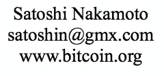
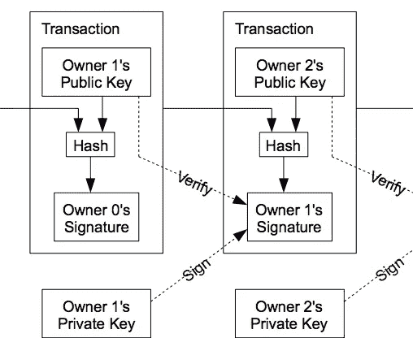
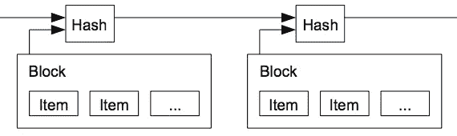

# 比特币白皮书解读(第 1/3 部分)

> 原文：<https://medium.com/coinmonks/bitcoin-white-paper-explained-part-1-4-16cba783146a?source=collection_archive---------2----------------------->

## 技术概述

2008 年不像是一个遥远的记忆吗？区块链周围的噪音可能会轻易地欺骗我们，要么故意逆潮流而动，要么盲目地投入(时间或金钱)到一个你必须从[许多](https://tokenmarket.net/blockchain/)不同选项*中做出选择的世界。如果你不了解它的所有特征，你怎么能做出明智的决定呢？你会把别人的陈述视为理所当然，很容易被这样或那样的方式欺骗。*

> 交易新手？尝试[加密交易机器人](/coinmonks/crypto-trading-bot-c2ffce8acb2a)或[复制交易](/coinmonks/top-10-crypto-copy-trading-platforms-for-beginners-d0c37c7d698c)

我先来详细解释一下 [**比特币白皮书**](https://bitcoin.org/bitcoin.pdf) 为同类白皮书之首。如果我们按时间顺序进行，你会更好地理解进一步的发展。在第 1 部分中，我们将讨论到 *4。原论文的工作证明*。



A word on the authors

中本聪的身份[未知](https://en.wikipedia.org/wiki/Satoshi_Nakamoto#Possible_identities)。他在 2008 年发表了论文，并在 2009 年通过 Sourceforge 交付了第[个客户端](https://github.com/bitcoin/bitcoin/tree/4405b78d6059e536c36974088a8ed4d9f0f29898)。2010 年，Satoshi 将开发工作交给了 [Gavin Andresen](https://en.wikipedia.org/wiki/Gavin_Andresen) ，在撰写本文时，比特币由 [500+](https://github.com/bitcoin/bitcoin/graphs/contributors) 贡献者维护。

# 1.介绍

实物货币允许在没有外部参与的情况下进行资金转移。以数字方式实现这一点需要一个中间人(即银行)，这意味着:

*   最低交易成本上升，因为银行无法避免调解纠纷
*   由于交易是可逆的，商家需要关于顾客的信息来建立信任

需要一种数字支付系统，其中通过激励、概率和计算来确保信任，使得没有银行干涉，并且还允许降低交易成本，同时使得撤销交易不切实际。买家可以通过常规的托管机制得到保护。

在接下来的部分中，我们将看到如何实现这一点。

> *提醒:有一个集中的仲裁者意味着它决定* [哪些交易通过](https://www.theguardian.com/money/2015/sep/12/big-cash-withdrawals-bank-barclays-denied-access)[冻结资金](https://www.theguardian.com/money/2018/feb/22/banks-de-risk-money-laundering-closed-accounts)或[他们的系统有多安全](https://www.theguardian.com/money/2016/nov/06/tesco-bank-blocks-some-customers-cards-suspicious-activity-detected)。

当诚实节点控制的 CPU 比任何一组合作的攻击节点都多时，系统是安全的。(详见[第 2/4 部分](/@sgerov/bitcoin-white-paper-explained-part-2-4-d79fbc5e2adf) )。

# 2.处理

首先，拥有一些比特币不像口袋里/银行账户里有一美元。余额是根据相互链接的交易计算的。如果你给你的兄弟寄钱，而你的邻居给他的姐妹寄钱，这两笔交易将是同一链条的一部分。你拥有多少是由给你送硬币而你没有使用的交易决定的。数字钱包只是把这些数字汇总起来，显示给你一个余额。

## 必需的知识

在理解事务如何工作之前，您需要了解一些事情。

**加密哈希函数**:你可以把*哈希函数*想象成一个黑盒，它接受一个字符串作为输入(比如“Hello Bob”)，返回一个固定大小的任意字符串(比如“98 b 0 F4 b 363 af 4 aceb 81 BC 42 FD 81117 e 1”)。对于可用于加密的散列函数，它必须具有某些属性:

*   相同的输入总是返回相同的输出
*   计算起来很快
*   不经过蛮力(试错)是无法对来自“你好鲍勃”的“98 b 0 F4 b 363 af 4 aceb 81 BC 42 FD 81117 e 1”进行逆向工程的
*   输入的一个小变化会使输出发生很大变化
*   两个输入产生相同的输出是不可行的

**非对称加密**:它将允许我们通过不安全的通道进行通信。一个典型的用例是，Bob 想给 Alice 发送一条只有她能阅读的消息。另一个用例是能够验证某个消息的发送者是谁。这就是我们感兴趣的*(Bob 真的发了那条消息吗？).*

比特币[目前使用](https://github.com/bitcoin/bitcoin/tree/master/src/secp256k1)[ECD sa](https://en.wikipedia.org/wiki/Elliptic_Curve_Digital_Signature_Algorithm)标准(你也必须了解 [DSA](https://en.wikipedia.org/wiki/Digital_Signature_Algorithm) 标准)，但我们可以将技术细节抽象为以下内容:

为每个实体(鲍勃、一台电脑、一个比特币地址……)生成一对*私有*和*公共*密钥，他们可以用这些密钥签署文件，就像你可以实际签署汽车租赁合同一样。Bob 可以使用他的私钥来签署包含“有史以来最好的汽车合同”的文档(为其生成签名),并且任何人都可以使用 Bob 的公钥来验证他(私钥的所有者)实际上签署了该文档。其他人不可能在没有 Bob 的私钥的情况下生成该签名，这导致 Bob 是作者。[如果您想了解 ECDSA 密钥/签名的外观，请点击此处](https://kjur.github.io/jsrsasign/sample/sample-ecdsa.html)。

我们已经提到了 Bob 和一个地址，但是这两者是如何联系在一起的呢？

**比特币地址**:这里的关键是一个比特币地址是由一个 ECDSA 公钥上的[几个哈希函数生成的。因为任何人都可以生成他们唯一的公钥/私钥对，所以他们也能够生成唯一的比特币地址。](https://en.bitcoin.it/w/index.php?title=Technical_background_of_version_1_Bitcoin_addresses)

现在我们已经对*散列、非对称加密*有了一个概念，并且知道 Bob 可以有多个*比特币地址*让我们看看在区块链内所有的东西是如何一起工作来形成交易的(交易被分组到块中，因此有了这样的措辞)。

## 链条

交易是比特币价值从一个或多个输入到一个或多个输出的转移。让我们先解释一下从纸上截取的图形，然后看一下输入和输出是什么样子。



这表示链中任意两个事务(简化为 1 个输入/ 1 个输出)的快照。Tx(交易)内方框的内容表示 Tx 是如何签名的:

假设我们是所有者 1(生成右边的事务)。我们使用我们向其发送比特币的人的公钥(“所有者 2 的公钥”)和之前的 Tx(来自左侧 Tx 的线)来产生我们正在签名的散列(通过“所有者 1 的私钥”)。

我们生成一个散列，因为我们通过 ECDSA 签名的东西越大，它就越慢，我们希望固定大小的字符串更快。

我们已经生成了一个 Tx，但是我们如何知道我们有权使用前一个 Tx 指向我们的比特币(图中未显示)？这就是为什么“所有者 0”在他的签名中包含了我们的公钥，就像我们对所有者 2 所做的一样。他已经签署了声明，我们有权花费一定的金额，我们可以通过 ECDSA 验证原始 Tx、其签名和“所有者 0 公钥”。这个图中的“验证”行最初让我很困惑(“为什么我要验证我刚刚签署的东西？”)但它只是为了证明，只有在最后一个事务生成后查看链，我们才能确定它的所有权。也就是说，“所有者 1 的签名”是有效的，并且已经从“所有者 1 的公钥”中得到验证，并且证明了所有权链。

因此，如果我们通过公钥发送比特币，你可能会想，我们为什么需要比特币地址。在公钥上添加地址给了我们额外的安全层:正如我们已经看到的，地址是公钥的散列，所以如果出于任何原因 ECDSA 被破坏(有人可以从公钥逆向工程出私钥并假装成你)并且我们没有花掉我们的比特币，我们的钱仍然是安全的，因为人们只会看到钱应该去的地址，而不是实际的公钥。只有当我们花费比特币并用我们的公钥进行交易时，我们才会受到威胁。这也是为什么对每笔交易使用不同的地址/公-私密钥是一种常见的最佳实践(钱包为我们做到了这一点)。

## 一个例子

让我们来解构一个真实的交易，看看它是什么样子的。为了能够做到这一点，我将转到 [blockexplorer](https://blockexplorer.com/) ，我将从此时的最后一个块[中挑选一个](https://blockexplorer.com/block/000000000000000000296f3c408b06f998477bb226f40fb7fe2a31dbb1272026)[事务](https://blockexplorer.com/tx/64317d1c1626ae040ba2cb48b66b8a514320e4415e7d00394bbaa5beff343a3c)(您也可以看到其内容[为 JSON 格式](https://blockexplorer.com/api/tx/64317d1c1626ae040ba2cb48b66b8a514320e4415e7d00394bbaa5beff343a3c))。我将继续使用 JSON 格式，但浏览器上显示的是相同的信息(下面逐个字段地解释):

```
{
   "txid":"64317d1c1626ae040ba2cb48b66b8a514320e4415e7d00394bbaa5beff343a3c",
   "vin":[
      {
         "txid":"672aeb1bc62b3941f2e9a530ff6d12e5e70c257632d536d5b0633e12b68a915d",
         "vout":1,
         "scriptSig":{
            "asm":"3044022066941da0cbe35013d5f92261bb3eeaef9f9729a62dafb1ef1f743cd0fed22f2a02202f3461bcad5c9a80af0f21033de2302563998ffac394d09c14791b285b661014[ALL] 030a13a4fe430d3bf0c1e3ed5ea31e6dad19b56e5c60322a60a283d1d430acddf8"
         },
         "addr":"1HKqcNrf3NPuz4s2MdoAzpYYfjYvbbsxZf",
         "value":0.0468234
      },
      {
         "txid":"d1dc8deb93ba5a0747c898859db99c03ff5a4f50686716d6c61d757dd5c63b27",
         "vout":0,
         "scriptSig":{
            "asm":"3044022069d043bcb1401169c8e9ce88c47ebf6b973abba5302efdb44df6801af9f1d79d02202ffad54fecb31edd63c805bb7a7553d77a20ebfce820e8ac198c1898e86ffcfc[ALL] 026ed1317c4a225c461b7dbbca89332f4e2f725fe823f05bd29d4c60da4d5dbd1d"
         },
         "addr":"1CMzyZjERPYvecNcn2GDxpHCLqPCwAst3c",
         "value":0.0016471
      }
   ],
   "vout":[
      {
         "value":"0.03847050",
         "n":0,
         "scriptPubKey":{
            "asm":"OP_DUP OP_HASH160 1d49a050b1e965f59301f304bc9914378044364e OP_EQUALVERIFY OP_CHECKSIG",
            "addresses":[
               "13froCnxWczJNiJXYLQQikWygvyMFXqVUJ"
            ],
            "type":"pubkeyhash"
         }
      },
      {
         "value":"0.00775226",
         "n":1,
         "scriptPubKey":{
            "asm":"OP_DUP OP_HASH160 f362e8796d04713dda1796b3c609d4b7cd325187 OP_EQUALVERIFY OP_CHECKSIG",
            "addresses":[
               "1PBugsUY1N3TvikrtDpQBBYuMBFoQWTHXi"
            ],
            "type":"pubkeyhash"
         }
      }
   ],
   "valueOut":0.04622276,
   "valueIn":0.0484705,
   "fees":0.00224774
}
```

首先，我们找到一个“txid ”,它是事务 id。它是基于事务本身内容的一个[事务哈希](https://github.com/bitcoin/bitcoin/blob/5961b23898ee7c0af2626c46d5d70e80136578d3/src/primitives/transaction.cpp#L65) ( [double sha-256](https://github.com/bitcoin/bitcoin/blob/5961b23898ee7c0af2626c46d5d70e80136578d3/src/hash.h#L21) )。然后我们发现两个集合:“vin”和“vout”。这些是提到的输入和输出。请记住，在输入中，我们指定了消费比特币的旧交易的输出。

来自“vin”的每个输入具有以下内容:

*   一个“txid”，是之前给我们发送比特币的交易的哈希。
*   “vout”，它表示我们从该事务中选取的输出
*   “scriptSig”，它是交易签名(如上所述)
*   一个“地址”，这是比特币被发送给谁(为了方便)
*   一个“值”，即发送了多少比特币

“vout”的每个输出都有一个:

*   “价值”,即我们发送的金额
*   “n”是输出的数量(进一步的事务将使用它，就像我们现在在“vin”中做的那样)
*   “scriptPubKey”包含我们要发送给谁(“地址”)和验证谁可以消费金额的脚本(“asm”)以及脚本类型(“pubkeyhash”)。[这个视频](https://youtu.be/f9nxuhLSyOg?t=11m42s)帮助我更好地理解了这个[类似于第四个脚本](https://en.wikipedia.org/wiki/Forth_(programming_language))的内容。

最后，我们有“值入”、“值出”和“费用”，这是比特币输入和输出值的汇总，以及处理交易的机器获得的奖励。

总之，我们有 0.0468234 + 0.0016471 = 0.0484705 个传入的比特币(来自地址*1 hkqcnrf 3 npuz 4 S2 mdoazpyyfyvbbsxzf*+*1 cmzyzjerpyvecn2 gdxphclqpcwst3c*)，我们从中发送 0.0384705 到*13 frocnxwczjnijxylqqq 我们发送的总金额为 0.04622276，少于原始金额，剩下 0.00224774 作为费用。*

如前所述，谁拥有每个地址是由私钥的所有者定义的，该私钥的公钥生成该地址。在这个特定的例子中，一个可能的场景是，人 A(拥有两个输入地址)向人 B(拥有第一个输出)发送 0.0384705。第二个输出属于人 A，也是他从操作中得到的变化。如果交易不包括第二个输出，它将作为费用消失。

## 双重支出

有人可能会添加两个消耗相同输出的事务，除非我们有一个有人检查的单链。如果这个链条是集中的，我们将不得不相信这个实体，不会产生重复支出，链条也不会被改变，这与普通银行目前的情况没有什么不同。

我们认为第一个交易是有效的，但是如果没有一个集中的实体，每个交易都必须公开宣布，我们需要参与者就每个交易到达的时间达成一致，他们必须生成一个新的交易。

# 3.时间戳服务器



时间戳通过使用一系列字符来确定事件发生的时间。在 UNIX 中，通常使用自 1970 年 1 月 1 日 UTC 时间以来的秒数作为时间戳，这使得 04/15/2018 @ 11:56am (UTC)看起来像 1523793381。

如果我们在事务/块的哈希生成中引入这个值，我们就可以确保数据在那个时刻存在。没有办法为不同时间戳生成具有相同数据的散列。这样，没有人可以恶意地假装事情以不同的顺序发生。因为每个散列依赖于前一个散列，所以我们通过每个新事务来加强这种关系。

为了以分散的方式做到这一点，我们必须引入工作证明，但我认为这篇文章暂时足够长了。[请检查第 2/4 部分](/@sgerov/bitcoin-white-paper-explained-part-2-4-d79fbc5e2adf)

如果有帮助，请鼓掌，并在[推特](https://twitter.com/sgerov) r @sgerov 上关注我！

> 加入 Coinmonks [电报频道](https://t.me/coincodecap)和 [Youtube 频道](https://www.youtube.com/c/coinmonks/videos)获取每日[加密新闻](http://coincodecap.com/)

## 另外，阅读

*   [复制交易](/coinmonks/top-10-crypto-copy-trading-platforms-for-beginners-d0c37c7d698c) | [加密税务软件](/coinmonks/crypto-tax-software-ed4b4810e338)
*   [网格交易](https://coincodecap.com/grid-trading) | [加密硬件钱包](/coinmonks/the-best-cryptocurrency-hardware-wallets-of-2020-e28b1c124069)
*   [密码电报信号](http://Top 4 Telegram Channels for Crypto Traders) | [密码交易机器人](/coinmonks/crypto-trading-bot-c2ffce8acb2a)
*   [Koinly 回顾](https://coincodecap.com/koinly-review) | [Binaryx 回顾](https://coincodecap.com/binaryx-review) | [Hodlnaut vs CakeDefi](https://coincodecap.com/hodlnaut-vs-cakedefi-vs-celsius)
*   [MoonXBT vs Bybit vs 币安](https://coincodecap.com/bybit-binance-moonxbt) | [硬件钱包](/coinmonks/hardware-wallets-dfa1211730c6)
*   [火币交易机器人](https://coincodecap.com/huobi-trading-bot) | [如何购买 ADA](https://coincodecap.com/buy-ada-cardano) | [Geco。一次审查](https://coincodecap.com/geco-one-review)
*   [币安 vs 比特邮票](https://coincodecap.com/binance-vs-bitstamp) | [比特熊猫 vs 比特币基地 vs Coinsbit](https://coincodecap.com/bitpanda-coinbase-coinsbit)
*   [如何购买 Ripple (XRP)](https://coincodecap.com/buy-ripple-india) | [非洲最好的加密交易所](https://coincodecap.com/crypto-exchange-africa)
*   [最佳加密交易所](/coinmonks/crypto-exchange-dd2f9d6f3769) | [印度最佳加密交易所](/coinmonks/bitcoin-exchange-in-india-7f1fe79715c9)
*   开发人员的最佳加密 API
*   最佳[密码借贷平台](/coinmonks/top-5-crypto-lending-platforms-in-2020-that-you-need-to-know-a1b675cec3fa)
*   [杠杆代币](/coinmonks/leveraged-token-3f5257808b22)终极指南