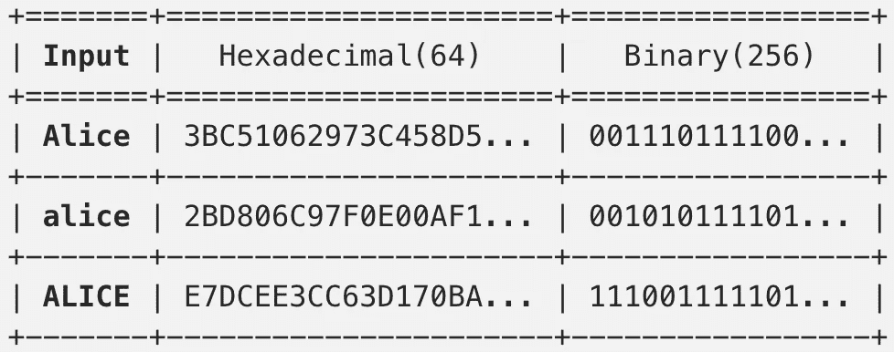
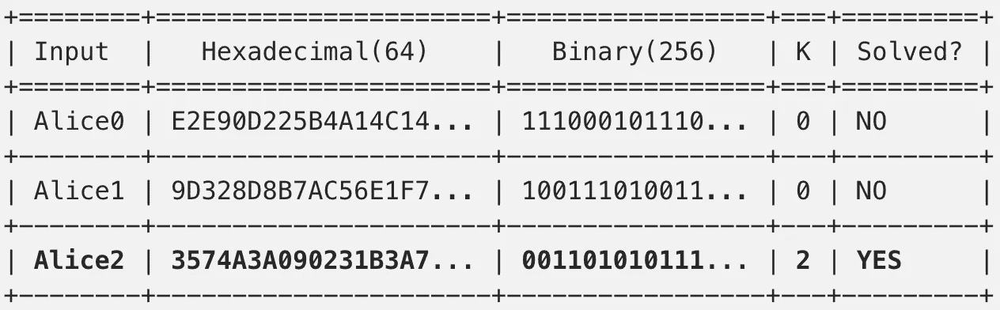

# 比特币白皮书解读(第 2/3 部分)

> 原文：<https://medium.com/coinmonks/bitcoin-white-paper-explained-part-2-4-d79fbc5e2adf?source=collection_archive---------1----------------------->

## 工作证明解释

这是[第一部分](/@sgerov/bitcoin-white-paper-explained-part-1-4-16cba783146a)的延续，在那里我分析了[最初的比特币论文](https://bitcoin.org/bitcoin.pdf)直到*工作证明(PoW)* 。让我们从那里开始。

文章指出，如果我们在对等的基础上实现时间戳服务器，我们需要工作证明。让我们先看看它是什么，然后我们再来讨论手头的问题。

> 交易新手？尝试[加密交易机器人](/coinmonks/crypto-trading-bot-c2ffce8acb2a)或[复制交易](/coinmonks/top-10-crypto-copy-trading-platforms-for-beginners-d0c37c7d698c)

# 4.工作证明

在[第 1 部分](/@sgerov/bitcoin-white-paper-explained-part-1-4-16cba783146a)中，我们看到阿沙-256 函数从某个数据输入中产生一个固定长度(256 位)的字符串(十六进制)。让我们来看看这样一个散列是如何查找一些输入的(“alice”、“ALICE”和“Alice”)。输出以十六进制和二进制表示(为简洁起见，这只是开头):

如您所见，输入发生微小变化时，输出会发生剧烈变化，但当输入不变时，输出会保持不变。

## 哈希什粉末

Hashcash 利用了 I/O 的这种不对称性来确保某个操作有相关的成本。

一个例子是减少垃圾邮件:在发送邮件之前，我给你一个需要解决的问题，这会消耗你一些计算能力(比如电力和金钱)。它将足够小，以至于发送一封电子邮件是便宜的，但足以避免垃圾邮件发送者发送许多。挑战会是什么？

假设您正在发送的电子邮件的内容是“爱丽丝”。从上表中我们知道应用于内容的阿沙-256 的输出从 3(二进制的 0011)开始。我可以给你的挑战是找到一个数字，当附加到内容(即“Alice24”)时，将产生一个二进制输出，在开始时有一定数量的 0。我为什么要这么做？嗯，只是数学而已。你可以把二进制输出想象成一系列的掷硬币(我们不知道从某个输入中得到什么输出，所以 0 和 1 的序列是随机的，就像掷硬币的机会一样)。从附加到爱丽丝身上的某个数字中得到一个 0 的几率有多大？嗯，50%(是抛一个硬币)。有两个连续的 0？25%.以此类推…我问你的 0 越多，挑战就越难。

所以我们假设 k 是我们要的 0 的个数。给定输入“Alice”和挑战 *k=2* :

我们通过 3 次计算散列找到了一个解决方案。每个人都可以只计算一次散列，并验证我们正确地解决了挑战。我们可以通过要求输出中出现更多的 0 来使挑战变得更加困难(k=20 平均需要 100 万次尝试)。

比特币如何利用这一点？

## 比特币力量

我们需要找到一种方法来激励分布式机器就形成区块链的块内的事务的当前状态和顺序达成共识(投票)。如果在生成每个块的过程中没有相关联的成本，那么任何人操纵它都是没有成本的(例如在垃圾邮件阻止示例中)，因此该系统根据定义将是可黑客攻击的。

通过应用 Hashcash PoW 的变体，我们可以实现这一点:

与我们在上一个例子中使用的“Alice”不同，比特币所做的是对块的头部应用哈希函数[(其中包括之前的块哈希、时间戳和随机数等)。随机数是我们必须增加的](https://github.com/bitcoin/bitcoin/blob/4741ca5dc8fd364352ebae3ba9bfb701f1847d26/src/primitives/block.h#L107)[数](https://github.com/bitcoin/bitcoin/blob/4741ca5dc8fd364352ebae3ba9bfb701f1847d26/src/primitives/block.h#L29)，直到我们满足我们正在解决的 0 挑战，就像在我们的例子中一样。一个直接的问题出现了:nonce 是一个由 32 位定义的数字(允许大约 40 亿次尝试)，对于一个拥有当前技术的矿工来说，这不是一个很容易解决的挑战吗？确实是！这就是为什么在每个块中都有一个 extraNonce(在 coinbase 事务中——检查第 6 节),每当计算出 40 亿个散列没有成功时，这个 extra nonce 就必须被挖掘器修改。对 extraNonce 的修改改变了 Merkle 树的根，因此我们可以再次从 0 开始计算散列。并重复。什么是 Merkle 树？这在第三部的[中有所涉及。现在，只需考虑事务的变化和报头散列的变化，因此我们可以通过 nonce 生成散列空间。](/coinmonks/bitcoin-white-paper-explained-part-3-3-c06c1791a31b)

这就是开采一个区块的方法。由于网络中有多个节点，因此它们必须通过协商做出决策。矿工所认为的事实是通过它所执行的 PoW 来验证的，而不是像 IP 地址这样的东西，IP 地址可能会被一个获得许多 IP 的单个实体所欺骗(记住 PoW 取决于 CPU 周期，这具有与之相关的成本)。

决策是通过最长的链条实现的:

两个节点(一个在阿姆斯特丹，一个在巴塞罗那)同时开采一个区块，因此存在竞争条件(称为分叉)。每个位置周围的节点将首先接收两个链中的一个，并立即在其上开始工作。靠近阿姆斯特丹的节点将继续在链 A 上工作(它们接收新数据块的速度更快)，而巴塞罗那的节点将在另一个链 b 上工作。两个链的最新数据块哈希将有所不同(由于不同的报头，事务可能不相同，顺序也不相同，或者时间戳略有不同)。一旦在链(即，A)上挖掘出另一个块，该节点将把它传播到整个网络，并且相信另一个链(B)是正确的链的节点将看到它们不再在迄今为止最长的链上(它们的最新块成为孤儿，因为它们在主链之外),因此将不得不开始在链 A 上工作。

如果大部分 CPU 由诚实的节点持有，他们的链将超过攻击者:改变过去的块并赶上[的概率按指数规律减少](/coinmonks/bitcoin-white-paper-explained-part-3-3-c06c1791a31b)每增加一个块，因为攻击者将不得不重做那个块的工作，在它之后和超过当前节点的所有块都工作。

PoW 挑战的难度会自动更新([通过软件](https://github.com/bitcoin/bitcoin/blob/5961b23898ee7c0af2626c46d5d70e80136578d3/src/pow.cpp#L49)——它是任何节点运行和验证的共识规则的一部分)，因此它会考虑到硬件速度的提高和财务利益的变化(交易奖励/费用)，从而保持足够的难度。难度取决于目标，即我们在生成哈希时试图找到的带有前导 0 的 256 位数。在比特币中，它由一个浮点数表示，以便在进行调整时更加灵活(因此我们可以调整到“2 个 0.5”，而在 Hashcash 中它是整数)。

每 10 分钟有一个块的期望平均挖掘速度(孤儿块/网络速度之间的良好平衡的估计)，其每 2016 个块自动调整[。按照这种速度，本应需要两周时间，如果需要更多时间，2016 年下一个区块的难度会降低，并重复这一过程。](https://github.com/bitcoin/bitcoin/blob/0a8b7b4b33c9d78574627fc606267e2d8955cd1c/src/chainparams.cpp#L89)

# 5.网络

为了正确理解 PoW，我们在第 4 节讨论的原始论文中描述了所有这些。网络表现如下:

*   新事务被广播到所有(不必是 100%)节点
*   每个节点将事务收集到一个块中
*   一旦找到足够多的事务，就会对它们进行验证
*   一旦有效，就对它们执行 PoW 以形成块
*   通过执行新块的幂，节点在该时刻已经接受了链

最长的链被认为是正确的，但其他分支被保留，以防它们变得更大(正如我们在第 4 节中看到的)

有一个名为 genesis block 的区块，它是区块链中的第一个区块，由中本聪在比特币核心中进行[硬编码。](https://github.com/bitcoin/bitcoin/blob/0a8b7b4b33c9d78574627fc606267e2d8955cd1c/src/chainparams.cpp#L38)

# 6.动机

每个挖掘的块都有一个名为 coinbase transaction 的第一个事务。它是对矿工尽自己的力量给予奖励的那个。这就是比特币最初投入流通的方式，每 21 万块(~ 4 年)的奖励金额[会减半。另一个激励因素是交易费，我们看到](https://github.com/bitcoin/bitcoin/blob/a07e8caa5d5000286604458e6887f57fec7fdcbb/src/validation.cpp#L1128)中的[是由未支出的交易投入定义的。当奖励减半时，将会有一个激励仅仅基于此的时刻。](/@sgerov/bitcoin-white-paper-explained-part-1-4-16cba783146a)

遵守规则可以确保获利，而不遵守规则很容易让攻击者陷入困境。即使有人得到的 CPU 比诚实节点多，他也会发现遵守规则比破坏漏洞系统更有利可图(他得到的硬币比任何人加起来都多)。

那么现在我们知道了什么是权力，我们真需要它吗？这是克服拜占庭失败的一种方式，这基本上意味着所有的参与者(节点)必须在同一件事情上达成一致(在特定时间点的区块链内容)。在没有电源的情况下，任何节点都可以操纵该链并假装其版本是正确的，但是由于有 CPU 限制，这样做的成本太高。

我们安全吗？嗯，从理论上讲，如果三大矿业供应商决定联手，他们可以随意改变区块链。事实是，博弈论告诉我们，这不会发生，因为遵守规则比质疑球洞系统更有利可图。

在[下一部分](/coinmonks/bitcoin-white-paper-explained-part-3-3-c06c1791a31b)中，我们将看到比特币实现的一些优化。

如果有帮助，请鼓掌，并在 Twitte 上关注我。

> 加入 Coinmonks [电报频道](https://t.me/coincodecap)和 [Youtube 频道](https://www.youtube.com/c/coinmonks/videos)获取每日[加密新闻](http://coincodecap.com/)

## 另外，阅读

*   [复制交易](/coinmonks/top-10-crypto-copy-trading-platforms-for-beginners-d0c37c7d698c) | [加密税务软件](/coinmonks/crypto-tax-software-ed4b4810e338)
*   [网格交易](https://coincodecap.com/grid-trading) | [加密硬件钱包](/coinmonks/the-best-cryptocurrency-hardware-wallets-of-2020-e28b1c124069)
*   [密码电报信号](http://Top 4 Telegram Channels for Crypto Traders) | [密码交易机器人](/coinmonks/crypto-trading-bot-c2ffce8acb2a)
*   [最佳加密交易所](/coinmonks/crypto-exchange-dd2f9d6f3769) | [印度最佳加密交易所](/coinmonks/bitcoin-exchange-in-india-7f1fe79715c9)
*   开发人员的最佳加密 API
*   最佳[密码借贷平台](/coinmonks/top-5-crypto-lending-platforms-in-2020-that-you-need-to-know-a1b675cec3fa)
*   杠杆代币的终极指南