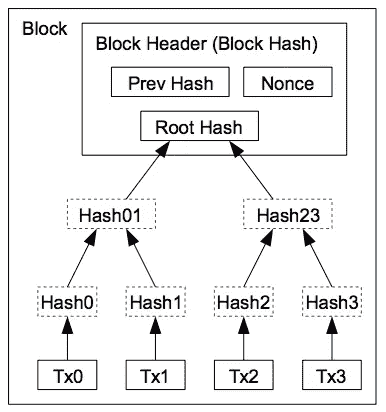
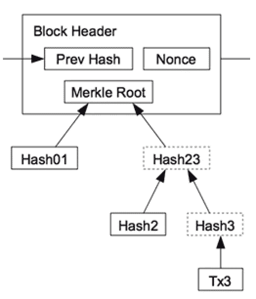
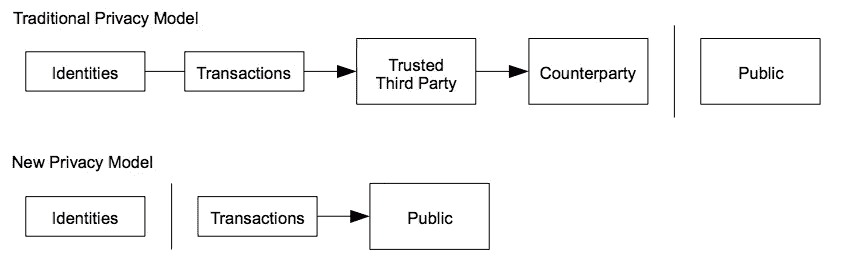
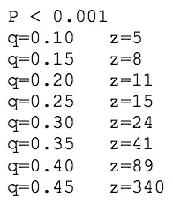

# 比特币白皮书解读(第 3/3 部分)

> 原文：<https://medium.com/coinmonks/bitcoin-white-paper-explained-part-3-3-c06c1791a31b?source=collection_archive---------1----------------------->

## 优化和结论

这是第二部分的延续，我们在第二部分[分析了](/coinmonks/bitcoin-white-paper-explained-part-2-4-d79fbc5e2adf)[最初的比特币论文](https://bitcoin.org/bitcoin.pdf)直到 *7。回收磁盘空间*。让我们从那里开始。

# 7.回收磁盘空间

每个[交易规模](https://github.com/bitcoin/bitcoin/blob/master/src/primitives/transaction.h#L264)根据输入/输出的数量而变化。计算交易规模的一个好的经验法则是:

```
n_inputs*180B + n_outputs*34B + 10B + (+-n_inputs)
```

根据 tradeblock.com 的数据，自 2014 年以来，平均交易量约为 520 字节。那段时间大约有 2.77 亿笔交易。排除块的大小，这意味着存储所有这些事务将占用大约 144 GB。实际上，它们占用大约 150GB。如果你想在你的智能手机里互动，那就需要很多！

没有事务的块头占用大约 80 字节。同一时期的块数约为 240，000，总共占用 19MB。这样的规模听起来更有竞争力。

> 我们如何在保持正确性的同时摆脱事务呢？



如果我们能够将所有事务( *Tx0* 到 *Tx3* )减少到单个散列(*根散列*)，我们将节省上述磁盘空间，而不会破坏块散列。

为此，我们必须能够将所有事务相互关联起来，这可以通过 Merkle 树有效地实现。

## Merkle 树

如果你熟悉二叉树，这个概念是微不足道的。叶节点(Hash0、Hash1、…)是应用于某些数据(在本例中为 Tx0、Tx1 等)的散列函数。上层节点(Hash01，Hash23)只是一个哈希函数，应用于它们各自的子哈希的串联。*根哈希*是最上层的哈希，包含在块头中，确保存在哪些事务。为什么我们不把所有的散列一个接一个地连接起来，从那个字符串中产生根散列呢？好吧，如果我们想验证一个事务是否是有许多事务的块的一部分，与获取所有散列相比，Merkle 树将允许我们以对数成本来做这件事。

我们能在没有交易副本的情况下核实/付款吗？

# 8.简化支付验证

假设我们有一个瘦客户机，它不能访问事务，只能访问块头，我们必须找到一种方法来验证特定的事务是有效的。



这样的节点可以获得当前最长的工作证明链(从几个粗节点)并请求事务应该在的 Merkle 树分支。

一旦节点知道该事务是链的一部分并且在它之后有块，他就可以断定它是有效的事务，因为它被其他厚节点接受。

只要我们询问诚实的节点，这个方案就能工作。如果不是这样，Satoshi 提出了一个警报系统，只要某个节点检测到无效块。

> 查看瘦客户端(bitcoinj)安全模型[此处](https://bitcoinj.github.io/security-model)

# 9.组合和分割值

正如第 1 部分中的[所述，一个事务不仅仅指 1 个输入— 1 个输出，还可能有更多。一个简单的例子是，鲍勃有 1 个比特币，给爱丽丝发了 0.5。该交易有一个 1 比特币的输入和两个各 0.5 比特币的输出(一个给 Alice，另一个给 Bob，否则他会把它作为交易费丢掉)。当一个事务依赖于许多事务并且这些事务依赖于其他事务时，我们不必担心遍历洞树，因为最新的事务输出是剩余硬币数量的集合。](/coinmonks/bitcoin-white-paper-explained-part-1-4-16cba783146a)

# 10.隐私



Privacy model in Bitcoin

传统银行通过限制对正在进行的交易和参与方的访问来实现隐私。正如我们提到的，比特币必须公开宣布每一笔交易，所以这种方案已经不可能了。

隐私可以通过保持公钥匿名和/或使用地址来实现。一个好的做法是为每笔交易使用一个新的密钥对/地址，这样就很难将硬币的移动与一个共同的所有者联系起来。然而，多重输入交易仍存在风险，因为你可能会认为硬币来自同一个来源，当透露一个地址时，你可能会推断出其他地址的所有者。

# 11.计算

如果我们假设攻击者可以获得比诚实节点更多的能量，他可以改变链。他不能以任何他想要的方式改变它，因为诚实的节点不会接受无效的事务/块(比如给他人汇钱或者凭空创造钱)。

唯一的选择是改变他最近交易的输出或者恢复它们(交易后的链越大，就需要越多的工作证明来生成[最长有效链](/coinmonks/bitcoin-white-paper-explained-part-2-4-d79fbc5e2adf))。

数字是多少？[结果背后的数学运算](https://math.stackexchange.com/questions/2356763/the-probability-behind-bitcoin)显示，确认的区块越多，攻击者追上的概率呈指数下降:



P =攻击者赶上的概率(0.1%)

q =攻击者找到下一个块的概率(10%，15%，…)

z =块确认的数量

这些数字告诉我们，攻击者拥有的 CPU 能力越多(q)，我们需要等待的确认就越多(5，8，…)才能知道攻击者赶上链的概率将是< 0.1%.

This sounds like the chance for an attack is pretty low given the constantly growing size of nodes within the network but remains a risk for newly created PoW based chains.

Check [比特币弱点](https://en.bitcoin.it/wiki/Weaknesses)如果你想对可能出现的问题有一个更全面的了解。

# 12.结论

该论文提出了一种依赖于不信任的电子交易系统。所有权通过数字签名来证明，同时通过基于 PoW 的 P2P 网络来减少重复花费。

所有规则和激励措施都在网络共识内实施。坏演员受到惩罚，而诚实的演员受到奖励。

比特币基于不信任，尽管大多数用户仍然依赖第三方服务，如 T2 比特币基地 T3。这是一个基于低效率的分布式网络，它限制了每秒可以通过的事务。[高昂的交易费用](https://bitinfocharts.com/comparison/bitcoin-transactionfees.html)减缓采用。BTC 面临许多限制。

尽管如此，它已经产生了 100 多个新的链，一整套新的用例、软件范例和挑战。当 TCP/IP 还在发展的时候，没有人会想到我们会有 4G 以上的视频会议。

如果这有帮助，请鼓掌，并在 [Twitte](https://twitter.com/sgerov) r @sgerov 上关注我！