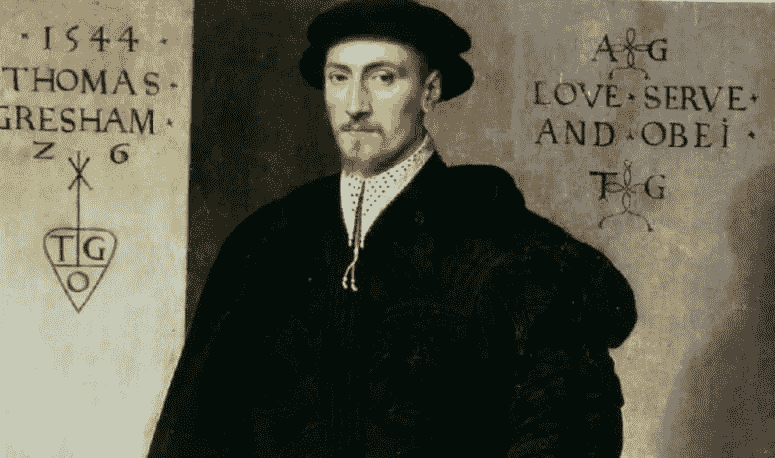

# 比特币不会成为交换媒介

> 原文：<https://medium.com/coinmonks/bitcoin-will-not-be-a-medium-of-exchange-30e01403896e?source=collection_archive---------2----------------------->

*比特币是“好”货币。“劣币”将它挤出流通，这太好了。*

比特币是数字黄金。这是加密货币的头号价值储存手段。但是除了价值储存之外，它对我们没有太大的作用。一些比特币支持者认为 HODL 是一个用例。更多的用例将会出现。有一种说法:首先是价值储存，然后是交换媒介。在这种情况下，比特币获得广泛采用还需要时间。一旦它达到临界质量，可能达到数十万亿美元，人们就会把它当作货币使用。这种叙述很方便，并被用来证明比特币不断上涨的价格。

没人知道比特币何时会达到临界量。我同意价值存储用例。但我不同意比特币会有其他用例。比特币目前价值超过 1000 亿美元。我们很少看到它在加密世界之外被用作货币的迹象。比特币是一种有价值的商品。它不会被用作交换媒介。

# 格雷欣法则:劣币驱逐良币

Thomas Gresham (image from wikipedia)

这一原则表明，更有价值的商品(良币)将逐渐从流通中消失。它将被一种价值较低的商品(劣币)所取代。例如，如果人们目前使用银币作为货币，政府决定改用铜币。政府规定两种硬币价值相同。在这种情况下，人们会紧握银币，使用铜币。他们会花劣币(铜币)，留着良币(银币)。

比特币的支持者吹捧它是好钱，是“最好”的钱。超比特币化将消除所有的劣币。把金钱贴上好坏的标签是一种误导。任何形式的货币只要在流通中都有一定的用途。法定货币模糊了好与坏的区别。这些坏货币之所以流通，是因为它们更容易流通。好的、可靠的和硬的货币更难流通。

我们应该把货币分为可取的(好的)货币和不太可取的(坏的)货币。在理想和不理想之间有一个范围。在这个光谱中，比特币是非常可取的，黄金是可取的，美元是可取的，欧元是其次，委内瑞拉玻利瓦尔是不可取的。格雷欣定律继续适用于光谱。不太合意的钱会赶走非常合意的钱。

# 比特币统治世界并不能减少价格波动

比特币需要达到统治世界的临界质量。这是比特币支持者经常抛出的未来结果。在未来，比特币价格将变得不那么波动。它将适合作为交换的媒介。这一论点源自比特币经济学的微观观点。如果比特币市值是几十万亿美元，几千亿的交易所不会影响它的价格。这一论点的缺陷在于，它假设比特币是微型和地方性的。比特币是无许可的，全球化的。每个人都可以访问它。

**比特币的供应量是固定的。但是它的需求是不可预测的。**人类容易犯错。我们可能会卷入战争，引发经济衰退。我们可能会实现生产率突破，并快速增长。未来不可预测。另一个因素是费用高。当比特币不再发放大宗奖励时，矿商将需要提高费用。当一项交易有很高的费用时，比特币所有者需要有实质性的收益来证明其高费用的合理性。否则，他/她会做得更好。比特币价格将继续波动。

**由于价格波动，比特币不会成为交易媒介。**

# “坏”钱总是为了阻止“好”比特币流通而存在

比特币是去中心化的货币。它的存在是因为我们很多人相信它有价值。地球上的每个人都不可能统一成一个单一的信仰。总会有其他种类的钱。这些种类的钱不会像比特币那样令人向往。因此，人们会将它们投入流通，并保留它们的比特币。

**比特币将成为价值储存手段。我们将使用其他“坏”钱作为货币。**

*Bitflate 是一种加密货币，年通胀率恒定在 7%。*

> [直接在您的收件箱中获得最佳软件交易](https://coincodecap.com/?utm_source=coinmonks)

