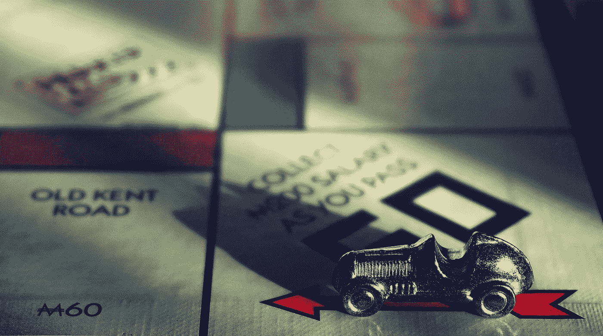

# 比特币不会像你想象的那么容易被打败

> 原文：<https://medium.com/coinmonks/bitcoin-will-not-bite-the-dust-as-easily-as-you-think-f7fa957fae5d?source=collection_archive---------6----------------------->

Is bitcoin like the Ford Model T?

最近在 Coindesk 上偶然看到一篇文章，题目是“[比特币仍将大败](https://www.coindesk.com/bitcoin-will-still-bite-the-dust)”。作者是凯文·多德，*杜伦大学商学院金融和经济学教授，2015 年论文《比特币将大败》的合著者*

作者提出了几个有趣但可能过于天真的观点来支持**关于比特币最终将跌至 0 美元**的观点，同时声称他还没有听到“*比特币社区*对这一观点提出任何明智的质疑。”相反，他声称“典型的反应是人身攻击”

比特币社区就像任何其他在线(甚至离线)社区一样——其成员质量从绝对天才到完全缺乏逻辑和体面不等。因此，我很难相信他的说法，即他只遇到骂人，但没有任何来自社区的明智的反驳。

不管怎样，既然他声称他的观点没有遇到任何逻辑上的挑战，我将在此以一种文明的、希望是明智的方式写下我个人对他观点的挑战。不过，我确实提前透露，与多德不同，我没有经济学博士学位。希望我的论点仍然算数！

# 大多数行业都是“自然垄断”

多德对比特币没落的第一个论点是，比特币采矿业具有“自然垄断”的特征，因此注定会成为一种垄断。这种垄断将剥夺比特币最重要的价值主张——去中心化，并因此摧毁它。

虽然我同意比特币挖矿可能是比特币生态系统中最脆弱的元素之一，但我不认为比特币挖矿行业的垄断像多德认为的那样黑白分明。

让我们首先使用一些其他真实世界的例子来进行比较——事实上，我们世界上的大多数行业都表现出“自然垄断”的特征。唯一的例外可能是那些涉及稀有艺术品、手工艺品以及通常为 UHNI 定制的产品和服务的行业。几乎所有涉及商品、原材料、消费品甚至数据的普通行业都受益于规模经济。但这很少导致一个行业被一个实体完全垄断。

许多因素都在自动调节任何行业的状态，例如自然市场周期、糟糕/良好的商业决策、政府的外部干预或不可抗力。最近有一段时间，人们声称比特币已死，因为比特大陆拥有比特币矿的大部分，但看看我们现在的情况——比特币照常营业，而据传比特大陆正在严重挣扎。

我们所知的采矿业目前是一个由供需驱动的自由市场，这与比特币价格直接相关。比特大陆的故事向我们表明，在比特币价格与商业决策、供应/生产、市场需求与外部或监管干预之间实现完美平衡绝非易事。类似的例子在石油和天然气、金属等其他行业也可以看到。，在这种情况下，需要工作证明并且规模经济非常重要。石油和金属价格波动，而不是直线上升，正如你在完全垄断的情况下所预期的那样，这是有原因的。

最重要的是，矿工的权力不是绝对的。尽管普遍(也是错误的)认为比特币由少数大型矿商控制，因此容易受到攻击，但它仍然有着无可挑剔的安全记录，并且攻击的[成本极其高昂(而且可能毫无结果)。比特币社区中有许多由合格人士撰写的文章，这些文章消除了关于矿工的神话，并解释了比特币生态系统中的权力平衡。比如这里的](https://www.crypto51.app/)，这里的，这里的。

之前已经多次明确指出，比特币的设计是为了让生态系统中的每个参与者都代表自己最大的贪婪利益行事，在这种情况下，系统的功能最好。Hashrate，采矿难度自动调整，价格都协调工作，以确保系统的连续，正常的功能。

# 比特币不仅仅是一种产品

多德的第二个论点相当无力。老实说，我本指望像他这样出身的人会有更透彻的分析和理解。

多德认为，多年来，比特币的加密货币市值主导地位一直在下降，并将导致其即将走向零。这种说法相当没有实际意义，因为当 BTC 以 100%的市值优势开始时，除了下跌，它不可能走得更远。

他认为，“根据 CoinMarketCap 的数据，截至 2013 年 4 月 28 日(他们提供数据的第一天)，比特币在加密货币市场中的份额已经下降到 94.29%，到今天已经下降到 52.29%，而没有注意到 2017 年之前几乎没有替代硬币存在的明显事实。

这就引出了我的下一个观点——“加密”市值是一个相当无用的指标。CoinMarketCap 上的“加密货币市值”囊括了所有自认为是“密码”的东西，实际上是所有东西。当你把抵制审查的超主权货币与闭路礼品卡或邻居发行的毫无意义的 ERC 20 代币归为一类时，我们就有了一个相当无用的衡量标准。

当现实是新的、几乎无用的“代币”不断被添加到组合中时，那么现有硬币的主导地位肯定会下降——这是简单的数学。然而，正如我们目前所看到的，一个健康的长期熊市正在让这些稀释剂摆脱困境，并将一些“市场主导地位”交还给 BTC。

“加密市值”指标代表了目前的投机兴趣，而不是投资美元价值或用户需求的准确反映。比特币在这一指标中的主导地位将继续上下波动，因为人们将钱投入小盘股，期望获得更大的回报，然后看着他们的大部分投机资金在健康的市场调整后消失。

现在让我来谈谈将比特币作为一种产品与福特 T 型车进行比较的问题——这种比较是荒谬的。

福特 T 型车是一种“封闭”的产品——它是一次性的消费品，不能持续升级或改进。更重要的是，我重复一遍，它是一种随着使用而贬值的消费品**(直到一个世纪后它成为古董)。人们买福特 T 型车是为了自己开车去上班，显示自己的地位，而不是作为一种投资，也不是为了收回财务责任。**

另一方面，比特币是一种不断开放发展和技术升级的协议和网络。不是实体消费品经不起时间的考验。然而，更重要的是，比特币是**，一种随着使用而增值的社会现象。人们购买比特币是作为一种投资，作为一种资产，或者作为个人财务控制的一种表达。哦，我有没有提到比特币不是一家公司生产的，也没有 CEO？**

比特币和福特 T 型车的区别对我来说一清二楚。我很惊讶多德先生会用这种比较来支持他的论点。

我希望这篇文章能送到多德先生手中，因为我想听听他的反驳。另外，我注意到多德在 2014 年末和 2019 年初比特币熊市最严重的时候写下了他的这两个观点。如果多德真的如此坚信自己对比特币价格将跌至 0 美元的观点，我很乐意看到他拿出第三件作品，大胆宣称自己对下一轮比特币牛市顶峰的预测。

*原载于 2019 年 1 月 14 日*[*【hopefreiheit.com】*](https://hopefreiheit.com/2019/01/14/bitcoin-will-not-bite-the-dust-as-easily-as-you-think/)*。如果你从这篇文章中发现了一些有价值的东西，请给我一些掌声！:-)*

> [直接在您的收件箱中获得最佳软件交易](https://coincodecap.com/?utm_source=coinmonks)

