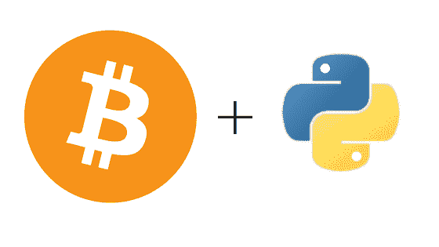

# 带 Python 的比特币

> 原文：<https://medium.com/coinmonks/bitcoin-with-python-6595588c2fcf?source=collection_archive---------0----------------------->

# 介绍

在本教程中，我们将使用 Python 来介绍比特币。我们将使用 Python 的 [*比特币*](https://pypi.python.org/pypi/bitcoin) 库，方便地称为比特币。



# 先决条件

要开始使用 Python 使用[比特币](https://blog.coincodecap.com/a-candid-explanation-of-bitcoin/)，我们需要，

*   可以运行 Python 编程环境的计算机
*   Python 或其他脚本语言的基础知识
*   从命令行程序运行命令和程序的能力

> 交易新手？尝试[加密交易机器人](/coinmonks/crypto-trading-bot-c2ffce8acb2a)或[复制交易](/coinmonks/top-10-crypto-copy-trading-platforms-for-beginners-d0c37c7d698c)

# 设置您的计算机

# 安装 Python

从[*http://www.python.org/*](http://www.python.org/)下载并安装 python，确保下载 Python 3.x，因为这是我们将在本教程中使用的。

# 安装比特币 python 库

安装完 python 后，打开命令行程序，执行以下命令安装比特币 Python 库

pip 安装比特币

# 你好，比特币——生成私钥

我们将从用 Python 写一个相当于比特币的“Hello World”开始。要编写 python，您可能需要一个支持 ASCII 格式编写的代码或文本编辑器。您不能使用写字板的 MS Word 进行此操作。你可以使用记事本，但是我们推荐使用免费的代码编辑器[*Atom Code Editor*](https://atom.io/)。

打开你最喜欢的编辑器，输入下面的代码。在这段代码中，我们首先导入比特币库。然后我们使用 ***random_key*** 函数生成一个私钥，然后我们在屏幕上显示这个私钥。

```
from bitcoin import *my_private_key = random_key()print(my_private_key)Save it as a .py file and then open your command line program and run the above program like this.python <program location and name>
```

这将打印出一个私钥。

# 生成公钥

接下来，我们生成一个公钥。我们通过将生成的私钥传递给***privatopub***函数来实现这一点

```
from bitcoin import *my_private_key = random_key()my_public_key = privtopub(my_private_key)print(my_public_key
```

# 创建一个比特币地址

在前面的程序中，我们生成了私钥和公钥。现在，我们将进入真正的比特币部分。在下面的代码中，我们通过将生成的公钥传递给 ***pubtoaddr*** 函数来生成一个比特币地址。

```
from bitcoin import *my_private_key = random_key()my_public_key = privtopub(my_private_key)my_bitcoin_address = pubtoaddr(my_public_key)print(addr)
```

# 创建多重签名地址

接下来，我们创建一个多重签名的比特币地址。多重签名地址是与多个私钥相关联的地址。因此，我们首先创建 3 个公钥和私钥。然后，我们通过将 3 个公钥传递给***MK _ multisig _ script***函数来创建一个多重签名。最后，将得到的多重签名传递给 ***scriptaddr*** 函数，以创建多重签名比特币地址。

```
from bitcoin import *my_private_key1 = random_key()print(‘Private Key 1: ‘ + my_private_key1)my_public_key1 = privtopub(my_private_key1)print(‘Public Key 1: ‘ + my_public_key1)my_private_key2 = random_key()print(‘Private Key 2: ‘ + my_private_key2)my_public_key2 = privtopub(my_private_key2)print(‘Public Key 2: ‘ + my_public_key2)my_private_key3 = random_key()print(‘Private Key 3: ‘ + my_private_key3)my_public_key3 = privtopub(my_private_key3)print(‘Public Key 3: ‘ + my_public_key3)my_multi_sig = mk_multisig_script(my_private_key1, my_private_key2, my_private_key3, 2,3)my_multi_address = scriptaddr(my_multi_sig)print(‘Multi-Address: ‘ + my_multi_address)
```

# 查看地址交易历史记录

我们还可以查看预先存在的比特币地址的交易历史。我们通过将有效的比特币地址传递给函数 ***历史*** 来实现这一点。

```
from bitcoin import *print(history(a_vaid_bitcoin_address))
```

如果没有地址，可以从 [*区块链*](https://blockchain.info) 查一个。

# 结论

在本教程中，我们用 python 介绍了比特币。我们看到了如何为比特币设置 python。我们看到了如何生成私钥、公钥和比特币地址。我们还看到了如何创建多签名比特币地址，以及如何查看比特币地址的交易历史。

> 加入 Coinmonks [电报频道](https://t.me/coincodecap)和 [Youtube 频道](https://www.youtube.com/c/coinmonks/videos)获取每日[加密新闻](http://coincodecap.com/)

## 另外，阅读

*   [复制交易](/coinmonks/top-10-crypto-copy-trading-platforms-for-beginners-d0c37c7d698c) | [加密税务软件](/coinmonks/crypto-tax-software-ed4b4810e338)
*   [网格交易](https://coincodecap.com/grid-trading) | [加密硬件钱包](/coinmonks/the-best-cryptocurrency-hardware-wallets-of-2020-e28b1c124069)
*   [密码电报信号](/coinmonks/top-3-telegram-channels-for-crypto-traders-in-2021-8385f4411ff4) | [密码交易机器人](/coinmonks/crypto-trading-bot-c2ffce8acb2a)
*   [最佳加密交易所](/coinmonks/crypto-exchange-dd2f9d6f3769) | [印度最佳加密交易所](/coinmonks/bitcoin-exchange-in-india-7f1fe79715c9)
*   [面向开发者的最佳加密 API](/coinmonks/best-crypto-apis-for-developers-5efe3a597a9f)
*   最佳[密码借贷平台](/coinmonks/top-5-crypto-lending-platforms-in-2020-that-you-need-to-know-a1b675cec3fa)
*   [杠杆代币终极指南](/coinmonks/leveraged-token-3f5257808b22)